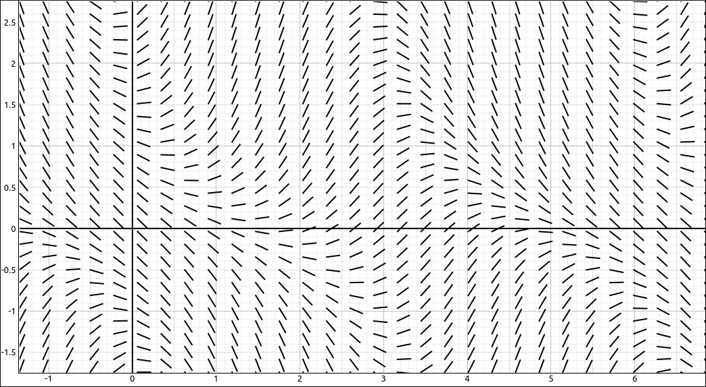
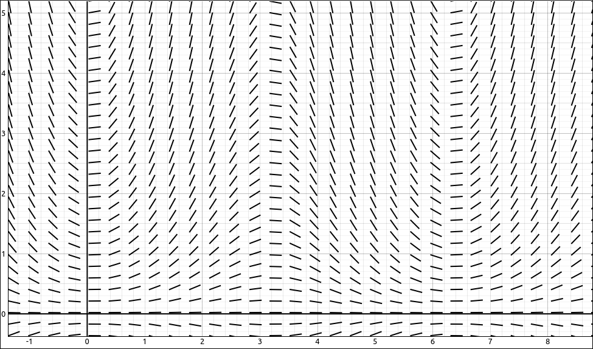
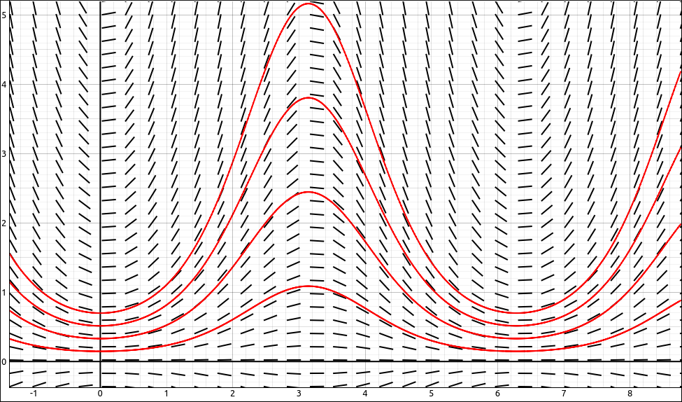
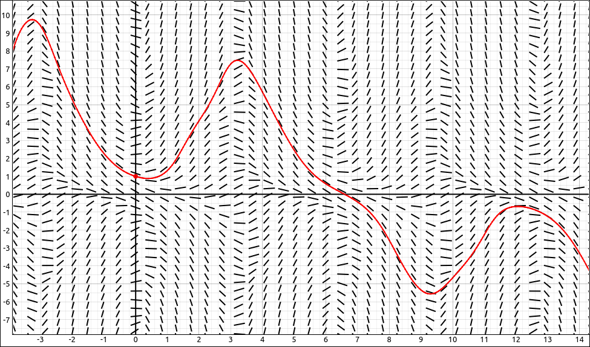
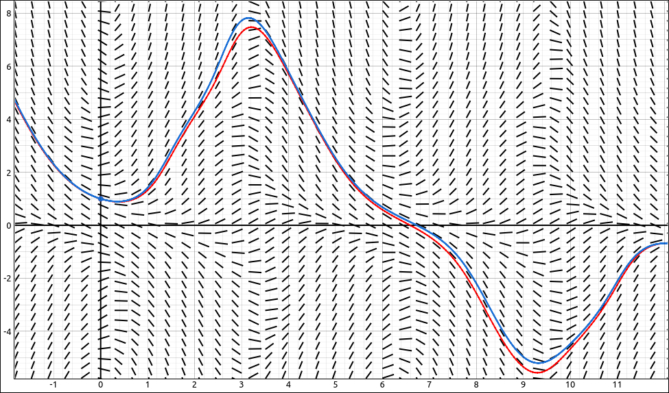
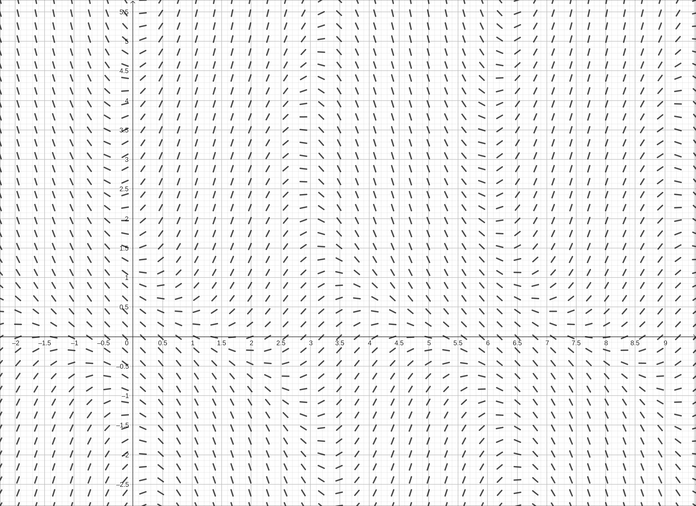
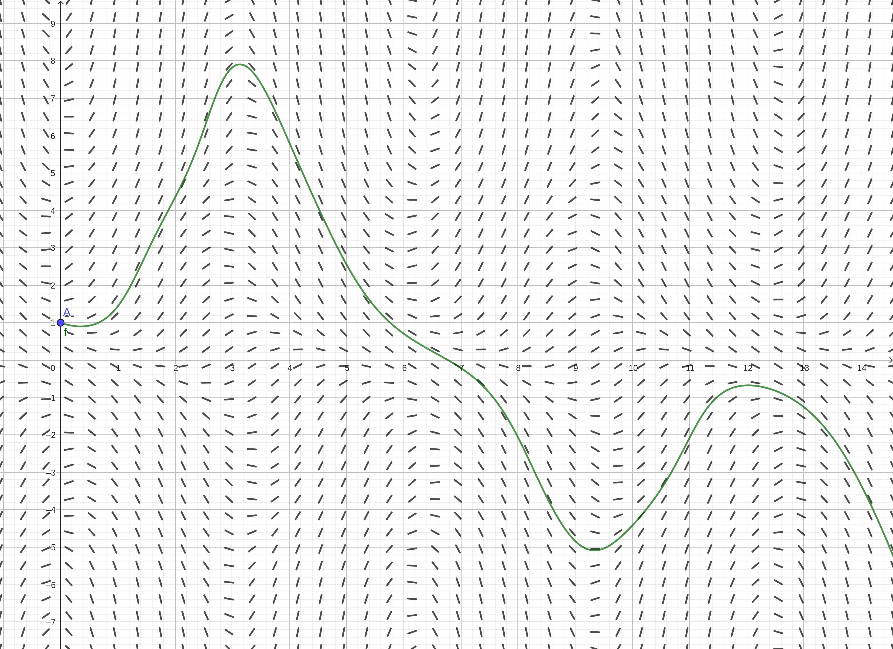
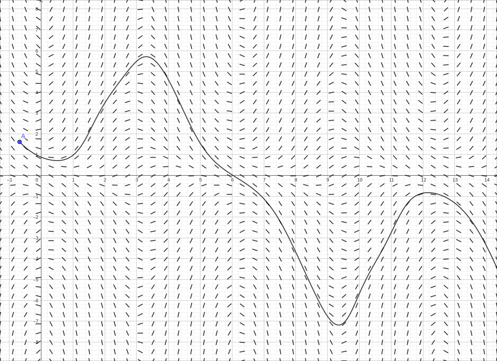
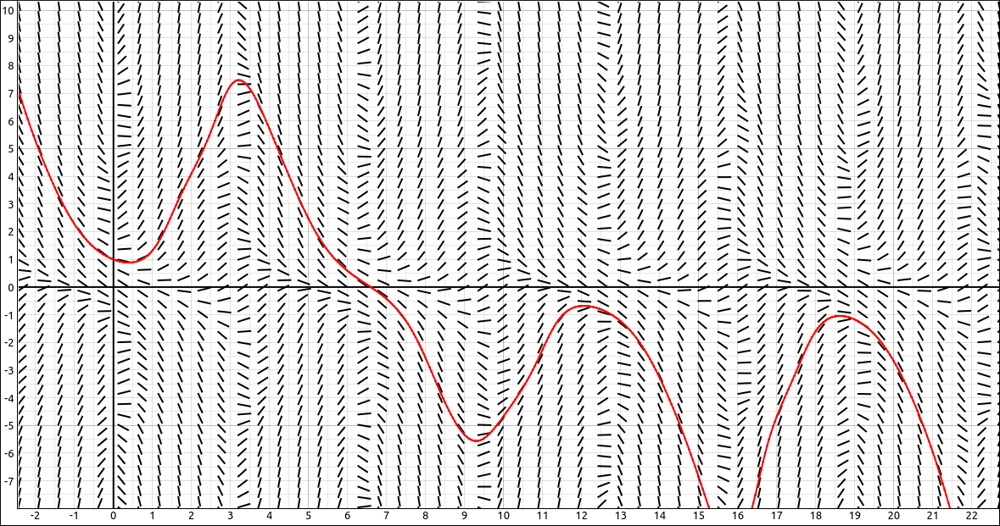
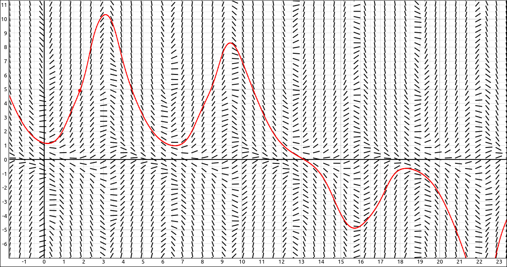

:index:`Direction Fields and Numerical Methods`
===============================================

Discussion & Definitions
------------------------

In the vast majority of cases it is impossible to find an explicit formula for a solution to a differential equation.  We can, however, take a graphical and numerical approach to analyse a differential equation to obtain information about the solution.  The graphical approach is with direction fields, also called slope fields, and the numerical approach is to build s solution curve using Euler's method.

Both of these methods are for (numerically) solving first-order differential equations of the form :math:`y' = f(x, y).`

Direction/Slope Fields
^^^^^^^^^^^^^^^^^^^^^^

.. admonition:: Definition: Direction Field

    A **direction field (slope field)** is a mathematical object used to graphically represent solutions to a first-order differential equation. At each point in a direction field, a line segment appears whose slope is equal to the slope of a solution to the differential equation passing through that point.

To crete a direction field we would choose a grid of :math:`(x, y)` points in the plane, at each point we substitute the values into the function :math:`f(x, y)` and evaluate.  This gives us a value for :math:`y'` at each of the grid points.  Now at each of the grid points we draw a short line that has the calculated slope :math:`y'.`  The result is a field of short line segments that represents the flow of the solution to the differential equation.

For example, if we have the differential equation

.. math::
    y' = y \sin{\left(x \right)} - \cos{\left(x + y \right)}

then :math:`f(x, y) = y \sin{\left(x \right)} - \cos{\left(x + y \right)}`, and a direction field for this function would look like the following,

    Direction Field for :math:`f(x, y) = y \sin{\left(x \right)} - \cos{\left(x + y \right)}`

To see how we use the graph to produce a solution curve we will use a simpler example.  Consider the differential equation, :math:`y' = y \sin{\left(x \right)}.` Graphing the direction field here gives us,

    Direction Field for :math:`y' = y \sin{\left(x \right)}`

We can solve this differential equation exactly anf the general solution is :math:`y = C_{1} e^{- \cos{\left(x \right)}}.` If we graph several of the curves in this family along with the direction field we see the following.

    Direction Field with Solution Curves

Note how at each point on the curve the slope of the tangent line matches the direction of the segment in the field, which was how we created the field in the first place.  We do this process in reverse.  Given a direction field we can select a starting point on the graph.  Then move a little ways along the line segment at that point, then move along the segment we land on, and again and again.  This gives us a rough curve that displays a solution to the differential equation.  For example, lets take the differential equation :math:`y' = y \sin{\left(x \right)} - \cos{\left(x + y \right)}` and we will use the starting point :math:`(0, 1).` Following the field from that point both forward and backward gives us the following curve.

    Direction Field with Solution Curve

Note that whe we started at the point :math:`(0, 1)` we actually turned this into an initial-value problem, solving the differential equation :math:`y' = y \sin{\left(x \right)} - \cos{\left(x + y \right)}` under the condition that :math:`y(0) = 1.`  Although we do not have an exact solution the plotted curve gives us a graphical solution to the initial-value problem.

Euler's Method
^^^^^^^^^^^^^^

Euler's Method is really just a numerical method that does the same thing we did with the last direction field example above.  Specifically,

.. admonition:: Theorem: Euler's Method

    Given the initial-value problem,

    .. math::
        y' = f(x, y) \qquad {\rm and } \qquad y(x_0) = y_0

    To approximate a solution to this problem using Euler's method, define

    .. math::
        x_n & = x_0 + nh \\
        y_n & = y_{n − 1} + h f (x_{n − 1}, y_{n − 1})

    Here :math:`h > 0` represents the step size and :math:`n` is an integer, starting with 1. The number of steps taken is counted by the variable :math:`n`.

This is really all we were doing with the direction field approach, the big difference is that we are quantifying the step size here and when using the direction field we just guessed on a good amount to move.

In the example we did above, solving the differential equation :math:`y' = y \sin{\left(x \right)} - \cos{\left(x + y \right)}` under the condition that :math:`y(0) = 1,` we used a step size of 0.05 and applied Euler's method to the differential equation, obtaining the graph.

    Direction Field with Solution Curve

One note about Euler's method, the smaller the step size the better approximation we will get to the curve.  On the other hand, we then need to go through more steps to draw the same portion of the curve and hence this takes more computations.  As an example, we plotted the Euler's method curve for the same initial-value problem above using a step size of 0.01, so the red line is a step of 0.05 and the blue line is a step of 0.01.  Note that the curves are close to each other but there are some differences in spots.  In general, the blue line would be the better approximation of the solution to the initial-value problem.

    Direction Field with Solution Curve with Smaller Step Size

Example: :math:`y' = y \sin{\left(x \right)} - \cos{\left(x + y \right)}`
-------------------------------------------------------------------------

In this example we will use direction fields and Euler's method to graphically and numerically solve the differential equation :math:`y' = y \sin{\left(x \right)} - \cos{\left(x + y \right)}` under the condition that :math:`y(0) = 1.`

GeoGebra
^^^^^^^^

Input the right hand side of the differential equation,

.. code-block:: console

    y sin(x) - cos(x+y)

We will assume that this came in as :math:`a(x, y)`. In a new cell input ``SlopeField(a)``.  Zoom in a little and pan to primarily the first quadrant and we get.

    Slope Field for :math:`y \sin(x) - \cos(x+y)`

Now to get the curve we will first put in the initial condition.  In a new cell, input ``(0, 1)``.  This will create a point *A* at :math:`(0, 1)`.  Now in a new cell, input, ``SolveODE(a,0,1,15,0.05)``.  This will use the expression from :math:`a(x, y)`, starting at :math:`(0, 1)`, going right until :math:`x = 15`, with steps of 0.05 each.  The resulting curve is below.

    Slope Field for :math:`y \sin(x) - \cos(x+y)` with Solution Curve

We can make this dynamic.  Keep the expression :math:`a(x, y)` and the slope field but delete all the other entries. Select the point tool and click on the graph to plot a single point, which should be *A*.  Now input ``SolveODE(a,x(A),y(A),15,0.05)`` in a new cell.  The ``x(A)`` will extract the *x* coordinate from the point *A* and ``y(A)`` will extract the *y* coordinate from the point *A*.  Now if you click and drag the point *A* around you will see the curve change with the movement of the point.

    Slope Field for :math:`y \sin(x) - \cos(x+y)` with Solution Curve

CLAE
^^^^

Input the right hand side of the differential equation,

.. code-block:: console

    y*sin(x) - cos(x+y)

Click and drag this over to the graph, it will come in as an implicit curve, change the type to Direction Field.  You can click and drag the expression again from the CAS or just duplicate the object in the graphics menu.  Change the type of the new object to Euler's Method Curve, and change the color to red. Go into the properties of the Euler's Method Curve and change the initial point to ``[0, 1]``.  You should get the image below, note we also increased the number of *x* and *y* divisions in the direction field to 50 each.

    Direction Field for :math:`y \sin(x) - \cos(x+y)` with Solution Curve

We can make this dynamic as well.  Go back into the properties of the Euler's Method Curve, change the initial point to ``[a, b`` and in the Include Points set this to Initial Point.  This will create sliders for *a* and *b* that will allow you to move the point around and see the curve change dynamically.

    Direction Field for :math:`y \sin(x) - \cos(x+y)` with Solution Curve

