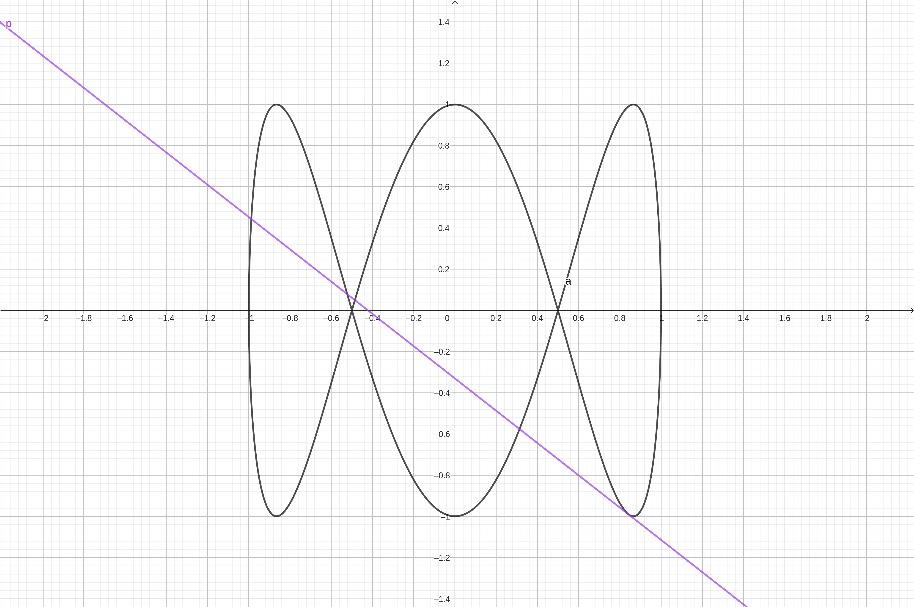
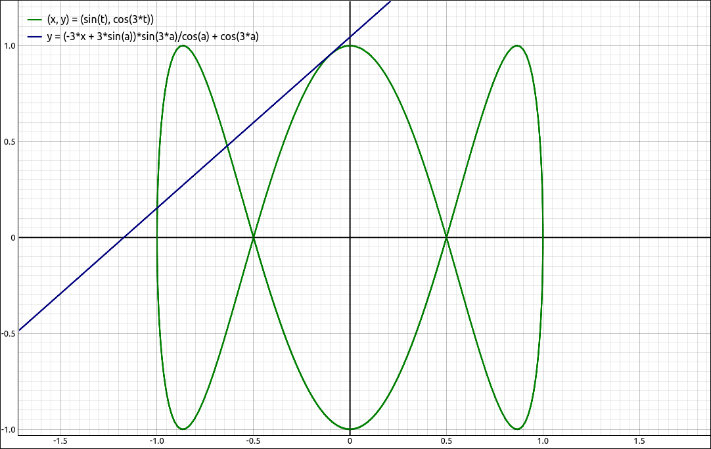
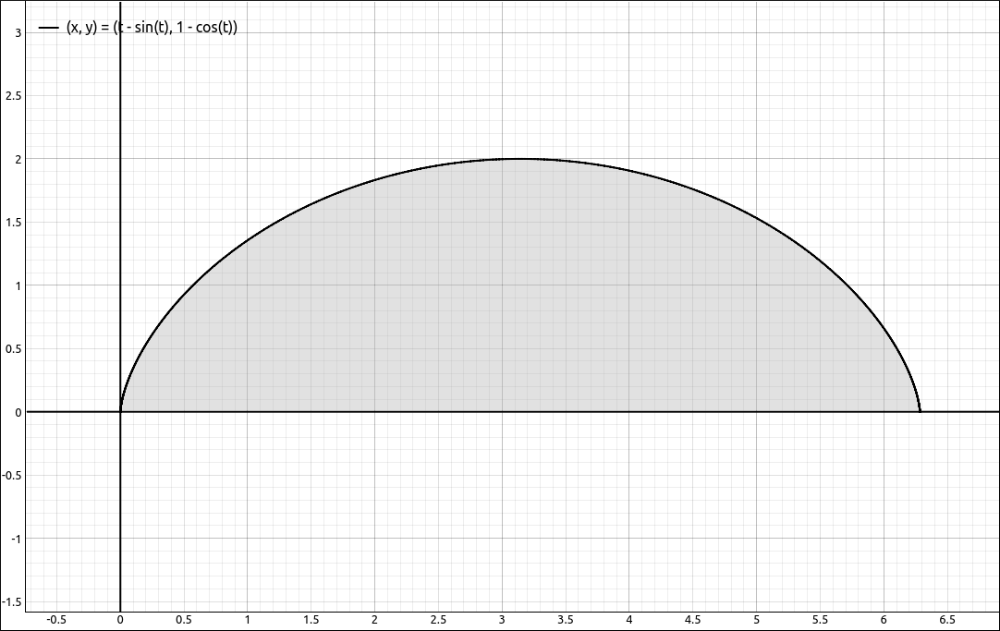
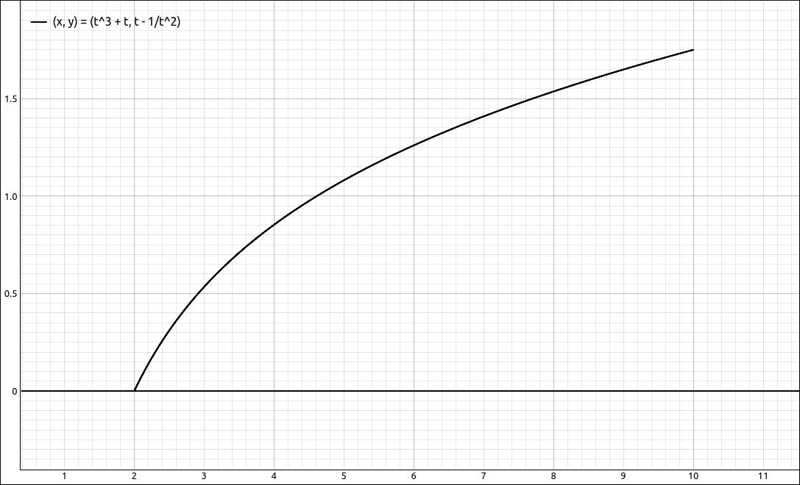

:index:`Calculus of Parametric Curves`
======================================

Derivatives of Parametric Equations
-----------------------------------

.. admonition:: Theorem: Derivative of Parametric Equations

    Given the plane curve defined by the parametric equations :math:`x = x(t)` and :math:`y = y(t).` If :math:`x'(t)` and :math:`y'(t)` both exist and :math:`x'(t) \neq 0,`  then

    .. math::
        \frac{dy}{dx} = \frac{dy/dt}{dx/dt} = \frac{y'(t)}{x'(t)}

Example: :math:`\left[ x(t) = \sin{\left(t \right)}, \  y(t) = \cos{\left(3 t \right)}\right]`
^^^^^^^^^^^^^^^^^^^^^^^^^^^^^^^^^^^^^^^^^^^^^^^^^^^^^^^^^^^^^^^^^^^^^^^^^^^^^^^^^^^^^^^^^^^^^^

GeoGebra
""""""""

Input the parametric equations, input the *x* and *y* expressions separately,

.. code-block:: console

    sin(x)

.. code-block:: console

    cos(3x)

Assuming that these came in as ``f(x)`` and ``g(x)`` respectively, we can form the derivative with

.. code-block:: console

    g'/f'

the result is,

.. math::
    - \frac{3 \sin{\left(3 t \right)}}{\cos{\left(t \right)}}

If you wanted to graph this in its parametric form you can input the following into a new cell,

.. code-block:: console

    (f(t), g(t))

An alternative is to use the parametric equation form, this is not as informative as the previous method but it is a possibility.  Input the parametric equations,

.. code-block:: console

    (sin(t),cos(3t))

We will assume that this comes in as ``a``.  In a new cell input ``a'``.  GoGebra suppresses what this really is and simply displays ``a'``.  It is really :math:`(x'(t), y'(t))`, as would be expected.  GeoGebra also graphs this which is not needed so you can hide the graph.  To find :math:`\frac{dy}{dx}` we can form the quotient ourselves.  Assuming the derivative came in as ``b``, input the following into a new cell.

.. code-block:: console

    (y(b)/(x(b))

This should come in as ``f(t)`` but unfortunately the expression is again suppressed.  At least we get a graph of the expression.

CLAE
""""

As with GeoGebra, there are two main approaches to this, separate *x* and *y* function inputs and a parametric version.  Input the parametric equations, input the *x* and *y* expressions separately,

.. code-block:: console

    sin(t)

.. code-block:: console

    cos(3*t)

Assuming that these came in as ``R1`` and ``R2`` respectively, take the derivative of each with ``Calculus > Derivative`` and assume that these came in as ``R3`` and ``R4`` respectively.  Now we can find the :math:`\frac{dy}{dx}` derivative using the quotient,

.. code-block:: console

    R4/R3

the result is,

.. math::
    - \frac{3 \sin{\left(3 t \right)}}{\cos{\left(t \right)}}

If you wanted to graph this in its parametric form you can input the following into a new cell,

.. code-block:: console

    [R1, R2]

Then click and drag the result to the graphics window.

An alternative is to use the parametric equation form.  Input the parametric equations,

.. code-block:: console

    [sin(t),cos(3*t)]

We will assume that this comes in as ``R1``.  Take the derivative with ``Calculus > Derivative``, the result is,

.. math::
    \left[ \cos{\left(t \right)}, \  - 3 \sin{\left(3 t \right)}\right]

which is clearly :math:`[x'(t), y'(t)]`.  Assuming this came in as ``R2``, we can form the ratio with

.. code-block:: console

    R2[1]/R2[0]

The result is,

.. math::
    - \frac{3 \sin{\left(3 t \right)}}{\cos{\left(t \right)}}

Remember that in CLAE when you are accessing elements of a list with the ``[]`` notation we begin counting at 0 and not 1.

Example: Finding a Tangent Line
^^^^^^^^^^^^^^^^^^^^^^^^^^^^^^^

When finding a tangent line to a parametric curve you go through the same steps as you would when finding a tangent line to a function.  Find the derivative at :math:`t = a`, find the point :math:`(x(a), y(a))` and then use point slope form :math:`y-y_0 = m(x - x_0)` to get the tangent line.

Both GeoGebra and CLAE have built-in facilities for finding a tangent line to a parametric curve.  These are mainly for convenience after you understand the process since they both supress the process.  We will take both approaches in each system.

We will find the general tangent line to the curve :math:`\left[ x(t) = \sin{\left(t \right)}, \  y(t) = \cos{\left(3 t \right)}\right]` and link it up to a slider so that we can animate the tangent line as it moves around the curve.

GeoGebra
""""""""

First we find :math:`dy/dx` as we did above. Input the parametric equations, input the *x* and *y* expressions separately,

.. code-block:: console

    sin(x)

.. code-block:: console

    cos(3x)

Assuming that these came in as ``f(x)`` and ``g(x)`` respectively, we can form the derivative with

.. code-block:: console

    g'/f'

the result is,

.. math::
    - \frac{3 \sin{\left(3 t \right)}}{\cos{\left(t \right)}}

We will assume this came in as ``h(t)``. We do want to graph this so input the following into a new cell,

.. code-block:: console

    (f(t), g(t))

At this point the only graph we want is the parametric curve, so you can hide the other curves.  To create the tangent line we use the point-slope form with,

.. code-block:: console

    h(c) (x-f(c))+g(c)

This will create a slider ``c`` and plot the tangent line at :math:`t = c.`  Move the slider to see the tangent line move around the curve.

    :math:`\left[ x(t) = \sin{\left(t \right)}, \  y(t) = \cos{\left(3 t \right)}\right]` with Tangent Line

Using the built-in tangent line we will take the parametric input approach, input,

.. code-block:: console

    (sin(x), cos(3x))

In a new cell input,

.. code-block:: console

    Tangent(a(c),a)

This will create a slider ``c`` and plot the tangent line at :math:`t = c.`  Move the slider to see the tangent line move around the curve.

CLAE
""""

First we find :math:`dy/dx` as we did above. Input the parametric equations,

.. code-block:: console

    [sin(t),cos(3*t)]

Take the derivative with ``Calculus > Derivative``,

.. math::
    \left[ \cos{\left(t \right)}, \  - 3 \sin{\left(3 t \right)}\right]

Form :math:`dy/dx` with

.. code-block:: console

    R2[1]/R2[0]

Evaluate the original parametric equations at :math:`t = a` with ``Algebra > Evaluate``.  The results are, respectively,

.. math::
    \left[ \sin{\left(a \right)}, \  \cos{\left(3 a \right)}\right]  \qquad {\rm and} \qquad - \frac{3 \sin{\left(3 a \right)}}{\cos{\left(a \right)}}

Assume these are ``R4`` and ``R5`` respectively, then input the point slope form of the tangent line with,

.. code-block:: console

    R5*(x-R4[0])+R4[1]

The result is,

.. math::
    \frac{\left(- 3 x + 3 \sin{\left(a \right)}\right) \sin{\left(3 a \right)}}{\cos{\left(a \right)}} + \cos{\left(3 a \right)}

Plot the parametric equations and this tangent line.  An ``a`` slider will be created, move it to view the movement of the tangent line around the curve.

    :math:`\left[ x(t) = \sin{\left(t \right)}, \  y(t) = \cos{\left(3 t \right)}\right]` with Tangent Line

Using the built-in tangent line, select the original parametric equation input.  Select ``Calculus > Tangent Line`` for the Point of Tangency input ``a`` and click OK.  Note that there are options for rectangular verses polar, we are in rectangular coordinates so we will leave that as is.  There are also options for the type of line output, we will keep the ``y = mx + b`` option.  You can learn more about the different output types in the CLAE User's Guide.  The result is,

.. math::
    \frac{\left(- 3 t + 3 \sin{\left(a \right)}\right) \sin{\left(3 a \right)}}{\cos{\left(a \right)}} + \cos{\left(3 a \right)}

The same as we get with the procedural method above.

Second-Order Derivatives
------------------------

To find the second derivative we use the following theorem.

.. admonition:: Theorem: Second-Order Derivative of Parametric Equations

    Given the plane curve defined by the parametric equations :math:`x = x(t)` and :math:`y = y(t).` If :math:`x'(t)`, :math:`y'(t)`, and :math:`\frac{d}{dt}\left( \frac{dy}{dx} \right)` all exist and :math:`x'(t) \neq 0,`  then

    .. math::
        \frac{d^2y}{dx^2} = \frac{d}{dx} \left( \frac{dy}{dx} \right) = \frac{\frac{d}{dt}\left( \frac{dy}{dx} \right)}{dx/dt}

Note that higher order derivatives are calculated in a similar manner.

Example: The Second Derivative of :math:`\left[ x(t) = \sin{\left(t \right)}, \  y(t) = \cos{\left(3 t \right)}\right]`
^^^^^^^^^^^^^^^^^^^^^^^^^^^^^^^^^^^^^^^^^^^^^^^^^^^^^^^^^^^^^^^^^^^^^^^^^^^^^^^^^^^^^^^^^^^^^^^^^^^^^^^^^^^^^^^^^^^^^^^

GeoGebra
""""""""

Input the parametric equations, input the *x* and *y* expressions separately,

.. code-block:: console

    sin(x)

.. code-block:: console

    cos(3x)

Assuming that these came in as ``f(x)`` and ``g(x)`` respectively, we can form the derivative with

.. code-block:: console

    g'/f'

the result is,

.. math::
    - \frac{3 \sin{\left(3 t \right)}}{\cos{\left(t \right)}}

We will assume this came in as ``h(t)``. Now get the second derivative with,

.. code-block:: console

    h'/f'

The result is,

.. math::
    \frac{- \frac{3 \sin{\left(t \right)} \sin{\left(3 t \right)}}{\cos^{2}{\left(t \right)}} - \frac{9 \cos{\left(3 t \right)}}{\cos{\left(t \right)}}}{\cos{\left(t \right)}}

CLAE
""""

Input the *x* and *y* expressions separately,

.. code-block:: console

    sin(t)

.. code-block:: console

    cos(3*t)

Assuming that these came in as ``R1`` and ``R2`` respectively, take the derivative of each with ``Calculus > Derivative`` and assume that these came in as ``R3`` and ``R4`` respectively.  Now we can find the :math:`\frac{dy}{dx}` derivative using the quotient,

.. code-block:: console

    R4/R3

the result is,

.. math::
    - \frac{3 \sin{\left(3 t \right)}}{\cos{\left(t \right)}}

Assume this came in as ``R5``, take its derivative,

.. math::
    - \frac{3 \sin{\left(t \right)} \sin{\left(3 t \right)}}{\cos^{2}{\left(t \right)}} - \frac{9 \cos{\left(3 t \right)}}{\cos{\left(t \right)}}

Assume this is ``R6``, finally form the second derivative with respect to *x* with,

.. code-block:: console

    R6/R3

The result is,

.. math::
    \frac{- \frac{3 \sin{\left(t \right)} \sin{\left(3 t \right)}}{\cos^{2}{\left(t \right)}} - \frac{9 \cos{\left(3 t \right)}}{\cos{\left(t \right)}}}{\cos{\left(t \right)}}

which simplifies to,

.. math::
    \frac{- 6 \cos{\left(2 t \right)} - 3 \cos{\left(4 t \right)}}{\cos^{3}{\left(t \right)}}

Integrals Involving Parametric Equations
----------------------------------------

.. admonition:: Theorem: Area Under a Parametric Curve

    Given the non-self-intersecting plane curve defined by the parametric equations :math:`x = x(t)` and :math:`y = y(t)` for :math:`a \leq t \leq b` and if :math:`x'(t)` exists. The area under this curve is given by,

    .. math::
        A = \int_a^b y(t) x'(t) \; dt

Example: Area under one revolution of the cycloid.
^^^^^^^^^^^^^^^^^^^^^^^^^^^^^^^^^^^^^^^^^^^^^^^^^^

In this example we will find the area under the cycloid curve in one revolution.  Specifically, the area under, :math:`\left[ t - \sin{\left(t \right)}, \  1 - \cos{\left(t \right)}\right]` on :math:`0 \leq t \leq 2\pi.`

    :math:`\left[ t - \sin{\left(t \right)}, \  1 - \cos{\left(t \right)}\right]` on :math:`0 \leq t \leq 2\pi` and the area under the curve.

GeoGebra
""""""""

Input the parametric equation as separate *x* and *y* expressions,

..  code-block::

    t - sin(t)

..  code-block::

    1 - cos(t)

Assuming this came in as ``f(t)`` and ``g(t)`` respectively in a new cell input,

..  code-block::

    g(t) f'(t)

Assuming this came in as ``h(t)`` find the integral with,

..  code-block::

    Integral(h,0,2 pi)

The result is, 9.42478.

CLAE
""""

Input the parametric equation as separate *x* and *y* expressions,

..  code-block::

    t - sin(t)

..  code-block::

    1 - cos(t)

Assuming this came in as ``R1`` and ``R2`` respectively, take the derivative of ``R1`` with ``Calculus > Derivative``.  Assume this is ``R3``.  Input,

..  code-block::

    R2*R3

Now take its definite integral, ``Calculus > Definite Integral``, bounds of ``0`` and ``2*pi``.  The result is, :math:`3 \pi.`

Arc Length of a Parametric Curve
--------------------------------

The arc length of a parametric curve is fairly easy to derive from the arc length of a curve studies in a previous section.

.. admonition:: Theorem: Arc Length of a Parametric Curve

    Given the plane curve defined by the parametric equations :math:`x = x(t)` and :math:`y = y(t)`  for :math:`a \leq t \leq b.`  If :math:`x'(t)` and :math:`y'(t)` both exist then the arc length of this curve is,

    .. math::
        L = \int_a^b \sqrt{(x'(t))^2 + (y'(t))^2 } \; dt

Example: Arc Length of :math:`\left[ x(t) = \sin{\left(t \right)}, \  y(t) = \cos{\left(3 t \right)}\right]`
^^^^^^^^^^^^^^^^^^^^^^^^^^^^^^^^^^^^^^^^^^^^^^^^^^^^^^^^^^^^^^^^^^^^^^^^^^^^^^^^^^^^^^^^^^^^^^^^^^^^^^^^^^^^

GeoGebra
""""""""

Input the parametric equations as separate *x* and *y* expressions.

.. code-block:: console

    sin(x)

.. code-block:: console

    cos(3x)

Assuming that these are ``f(x)`` abd ``g(x)`` respectively, input,

.. code-block:: console

    sqrt((f')^2+(g')^2)

Assuming this is ``h(x)``, finish the calculation with,

.. code-block:: console

    Integral(h,0,2 pi)

The result is, 13.06542.

CLAE
""""

Input the parametric equations as separate *x* and *y* expressions.

.. code-block:: console

    sin(x)

.. code-block:: console

    cos(3*x)

Assuming that these are ``R1`` abd ``R2`` respectively, find the derivatives of both of these with ``Calculus > Derivative``.  Assume the results are in ``R3`` abd ``R4`` respectively.  Input,

.. code-block:: console

    sqrt(R3^2+R4^2)

Take the definite integral of this from ``0`` to ``2*pi``.  The result is,

.. math::
    \int\limits_{0}^{2 \pi} \sqrt{9 \sin^{2}{\left(3 t \right)} + \cos^{2}{\left(t \right)}}\, dt

It is a difficult integral.  Select ``Algebra > Approximate`` and the result is, 13.06541751224204203.

Note that you would get the same result if you had done a definite integral approximation.

Surface Area Generated by a Parametric Curve
--------------------------------------------

If we take a parametric curve that is above the *x*-axis and rotate it about the *x*-axis we get the following formula for the surface area.  Note the similarity between this formula and the one for surface area of a revolved curve we looked at in a previous section.

.. admonition:: Theorem: Surface Area Generated by a Parametric Curve

    Given the plane curve defined by the parametric equations :math:`x = x(t)` and :math:`y = y(t)`  for :math:`a \leq t \leq b.`  If :math:`x'(t)` and :math:`y'(t)` both exist and :math:`y(t) \geq 0` for :math:`a \leq t \leq b.` Then the surface area generated by this curve is,

    .. math::
        S = 2 \pi \int_a^b y(t) \sqrt{(x'(t))^2 + (y'(t))^2 } \; dt

Example: :math:`\left[ t^{3} + t, \  t - \frac{1}{t^{2}}\right]` on :math:`1 \leq t \leq 2`
^^^^^^^^^^^^^^^^^^^^^^^^^^^^^^^^^^^^^^^^^^^^^^^^^^^^^^^^^^^^^^^^^^^^^^^^^^^^^^^^^^^^^^^^^^^

    :math:`\left[ t^{3} + t, \  t - \frac{1}{t^{2}}\right]` on :math:`1 \leq t \leq 2`

GeoGebra
""""""""

Input the parametric equations as separate *x* and *y* expressions.

.. code-block:: console

    x + x^3

.. code-block:: console

    x - 1/x^2

Assume these came in as ``f(x)`` and ``g(x)`` respectively. Now input the integrand,

.. code-block:: console

    2 pi g sqrt((f')^2+(g')^2)

Finally, integrate this from 1 to 2 and the result is, 59.10145.

CLAE
""""

Input the parametric equations as separate *x* and *y* expressions.

.. code-block:: console

    t + t^3

.. code-block:: console

    t - 1/t^2

Assume these came in as ``R1`` and ``R2`` respectively. Take the derivatives of both of these, assume these came in as ``R3`` and ``R4`` respectively. Now input the integrand,

.. code-block:: console

    2*pi * R2 * sqrt(R3^2+R4^2)

Tle result is,

.. math::
    2 \pi \left(t - \frac{1}{t^{2}}\right) \sqrt{\left(1 + \frac{2}{t^{3}}\right)^{2} + \left(3 t^{2} + 1\right)^{2}}

Finally, integrate this from 1 to 2. This is a difficult integral, if you try to find the exact solution with ``Calculus > Definite Integral`` you will end up with,

.. math::
    2 \pi \left(\int\limits_{1}^{2} \left(- \frac{\sqrt{9 t^{10} + 6 t^{8} + 2 t^{6} + 4 t^{3} + 4}}{t^{5}}\right)\, dt + \int\limits_{1}^{2} \frac{\sqrt{9 t^{10} + 6 t^{8} + 2 t^{6} + 4 t^{3} + 4}}{t^{2}}\, dt\right)

Approximating this expression gives, 59.101451767566146618.