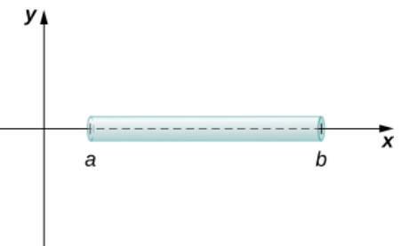
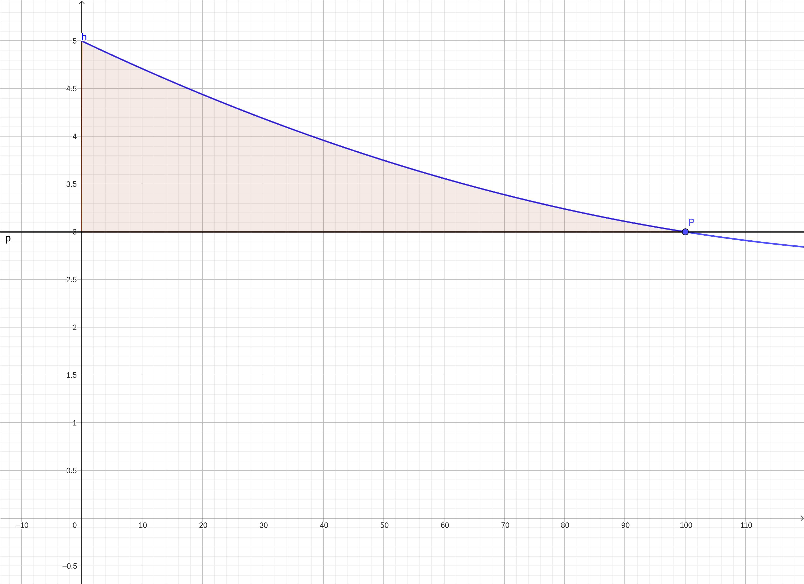
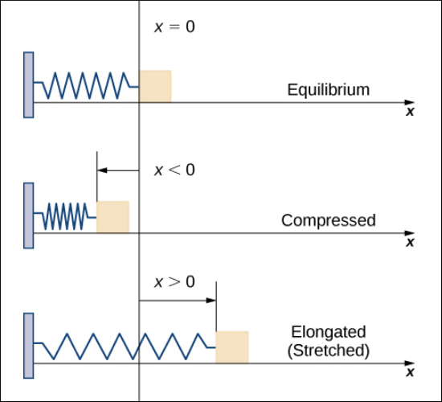
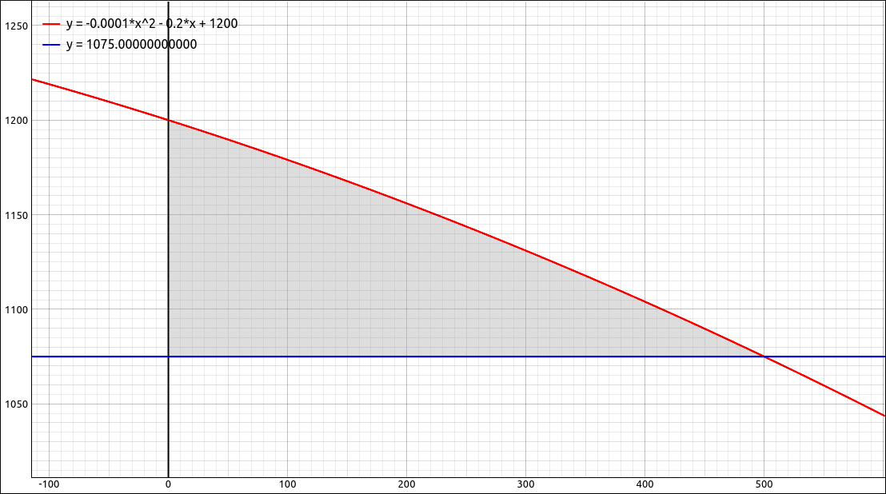

:index:`Physical and Economic Applications`
===========================================

Discussion & Definitions
------------------------

There are numerous applications of integration in the physical sciences, economics, social sciences, etc.  We will look at a few examples here, this is far from an exhaustive list.

As with most of the applications to Calculus, the majority of the work is done by hand in setting up the integrals.  The computer algebra systems tend to come in later to help evaluate the integrals either exactly or to come up with accurate approximations to the integral when exact solutions are not possible.

Mass and Density
^^^^^^^^^^^^^^^^

If a thin rod (considered as a one-dimensional object) has constant density :math:`\rho`, given in terms of mass per unit length, then the mass of the rod is just the product of the density and the length of the rod, specifically :math:`(b − a)\rho`.  When the density of the rod varies from point to point, we use a linear density function, :math:`\rho(x)`, to denote the density of the rod at any point, :math:`x.`

    Mass and Density Visualization

.. admonition:: Theorem: Mass–Density Formula of a One-Dimensional Object

    Given a thin rod oriented along the *x*-axis over the interval :math:`[a, b]`, let :math:`\rho(x)` denote a linear density function giving the density of the rod at a point :math:`x` in the interval. Then the mass of the rod is given by

    .. math::
        m = \int_a^b \rho(x) \; dx

Work
^^^^

When a constant force is applied to an object and the object is moving, we define the work done on that object to be the force times the distance the object moves under that force.  If the force is not constant but changes depending on the position of the object we can find a function :math:`F(x)` which is the force applied to the object at position :math:`x.`  In this case the work done on the object from :math:`x = a` to :math:`x = b` is,

.. admonition:: Theorem: Work

    If a variable force :math:`F(x)` moves an object in a positive direction along the *x*-axis from point :math:`a` to point :math:`b`, then the work done on the object is

    .. math::
        W = \int_a^b F(x) \; dx

Consumer Surplus
^^^^^^^^^^^^^^^^

A demand function :math:`p(x)` is the price that a company can charge in order to sell :math:`x` units of a commodity. In most cases, selling larger quantities requires lowering prices, so the demand function is generally a decreasing function.  The graph of this function is sometimes called a demand curve.

At a given price, some consumers who buy a good would be willing to pay more, but they save money by not having to pay the higher price. The difference between what a consumer is willing to pay and what the consumer actually pays for a good is called the consumer surplus.

Graphically we can look at the following exampl.  Say that the blue line in the graph below represents our demand curve.  If the company sets the price at $3,000 (*y*-axis is in the thousands) they estimate from the demand curve that they will sell 100 of these items.  The area that is above the line at 3000 and below the demand curve represents the consumer surplus.  It represents the amount of money saved by consumers in purchasing the commodity at price *P* and not at a higher price, as some would be willing to do.

    Consumer Surplus Visualization

.. admonition:: Theorem: Consumer Surplus

    If the demand function for a commodity is :math:`p(x)` and if :math:`X` is the number of items sold at price :math:`P`, then :math:`(X, P)` is on the demand curve and the consumer surplus at that price is,

    .. math::
        S = \int_0^X p(x) - P \; dx

Example: Mass and Density
-------------------------

Consider a thin rod oriented on the *x*-axis over the interval :math:`[1, 3]`. If the density of the rod is given by :math:`\rho(x) = 2x^2 + 3`, what is the mass of the rod?

From the discussion above,

.. math::
    m = \int_1^3 2x^2 + 3 \; dx

GeoGebra
^^^^^^^^

Input the function,

.. code-block:: console

    2x^2 + 3

then integrate from 1 to 3, ``Integral(f, 1, 3)`` to get, 23.33333.

CLAE
^^^^

Input the function,

.. code-block:: console

    2*x^2 + 3

then integrate from 1 to 3, ``Calculus > Definite Integral``, bounds are 1 and 3, to get, :math:`\frac{70}{3}` which approximates to 23.3333333333333.

Maxima
^^^^^^

Input the function,

.. code-block:: console

    kill(all);
    f(x):=2*x^2 + 3

then integrate from 1 to 3,

.. code-block:: console

    integrate(f(x), x, 1, 3)

The result is :math:`\frac{70}{3}` which approximates to 23.3333333333333.

Example: Work
-------------

According to **Hooke's law**, the force required to compress or stretch a spring from an equilibrium position is given by :math:`F(x) = kx`, for some constant :math:`k`. The value of k depends on the physical characteristics of the spring. The constant :math:`k` is called the *spring constant* and is always positive.

    Work Visualization

Suppose it takes a force of 10 N (in the negative direction) to compress a spring 0.2 m from the equilibrium position. How much work is done to stretch the spring 0.5 m from the equilibrium position?

First find the spring constant, :math:`k`. When :math:`x = -0.2`, we know :math:`F(x) = -10`, so

.. math::
    F(x) & = kx \\
    -10 & = k(-0.2) \\
    k & = 50 \\

which give us :math:`F(x) = 50x`. Then, to calculate work, we integrate the force function,

.. math::
    W = \int_0^{0.5} 50x \; dx = \left. 25x^2\right|_0^{0.5} = 6.25 J

We hardly need a computer algebra system to do such an easy integral, simply use the one you have been using to find the integral for a little more practice.

GeoGebra
^^^^^^^^

Follow the procedures in the first example to find the integral for this example.

CLAE
^^^^

Follow the procedures in the first example to find the integral for this example.

Maxima
^^^^^^

Follow the procedures in the first example to find the integral for this example.

Example: Consumer Surplus
-------------------------

Say that the demand for a product, in dollars, is :math:`p(x) = -0.0001 x^2 - 0.2 x + 1200`. Find the consumer surplus when the sales level is 500.

The price at a sales level is 500 is :math:`p(500) = 1075`.  So the consumer surplus is,

.. math::
    S = \int_0^X p(x) - P \; dx = \int_0^{500} -0.0001 x^2 - 0.2 x + 1200 - 1075 \; dx = 33333.3333333333

Hence $33,333.33.  The demand curve and the 1075 price line is graphed below, the shaded region represents the consumer surplus.

    Consumer Surplus Example

We hardly need a computer algebra system to do such an easy integral, simply use the one you have been using to find the integral for a little more practice.

GeoGebra
^^^^^^^^

Follow the procedures in the first example to find the integral for this example.

CLAE
^^^^

Follow the procedures in the first example to find the integral for this example.

Maxima
^^^^^^

Follow the procedures in the first example to find the integral for this example.
