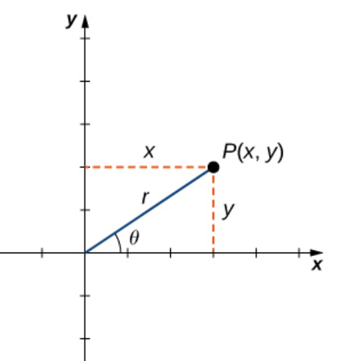
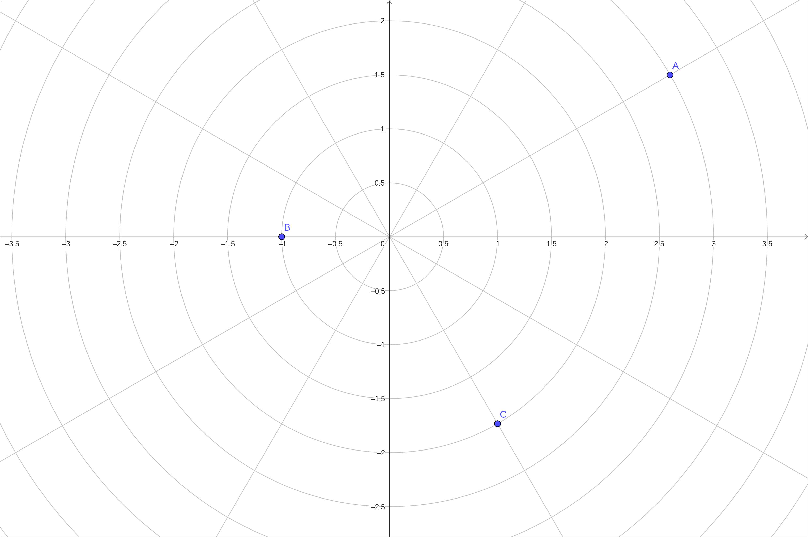
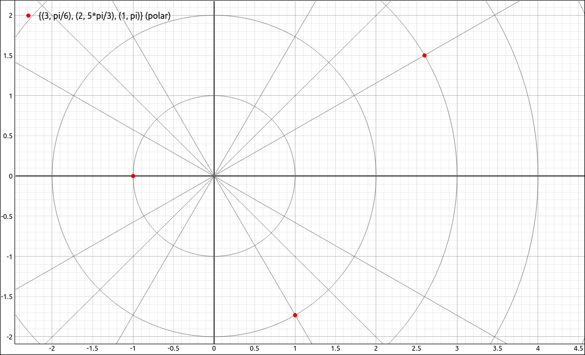
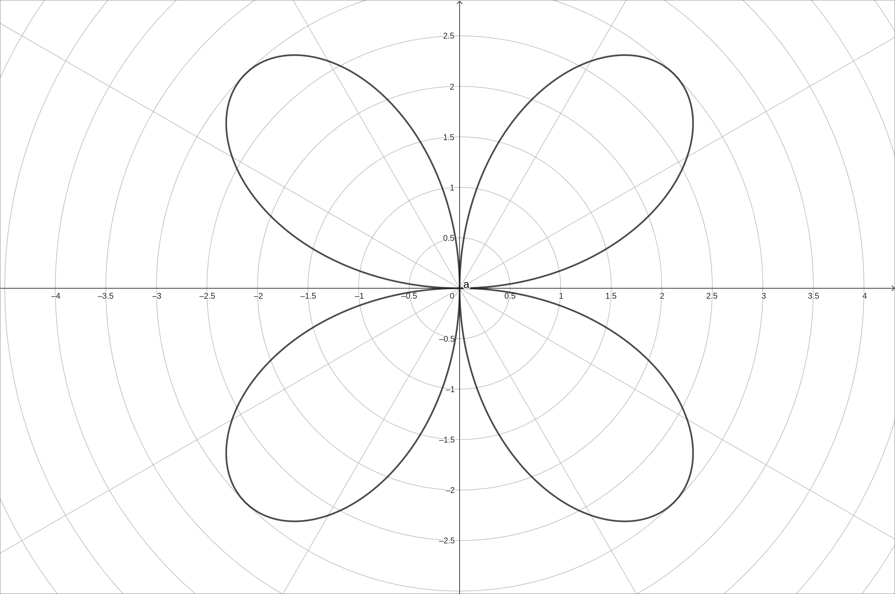
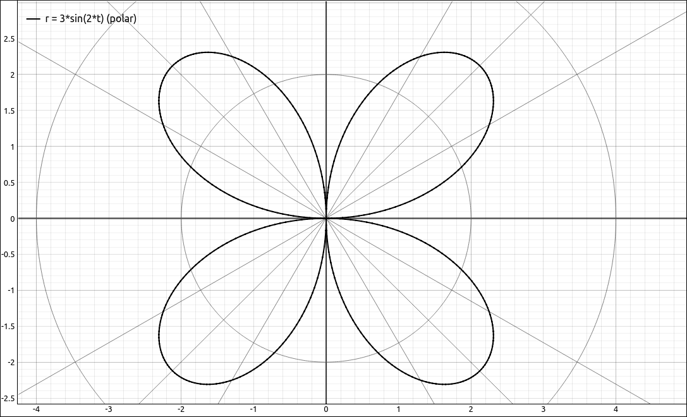

:index:`Polar Coordinates`
==========================

Discussion & Definitions
------------------------

Polar Coordinates are simply another way to represent points on the plane.  In rectangular coordinates we represent a point :math:`(x, y)` as moving down the *x*-axis by the amount *x* and then up the *y*-axis by the amount *y*.  In polar coordinates we represent the point as :math:`(r, \theta)` and interpret it as moving down the *x*-axis (also called the polar axis) by :math:`r` and rotating the point about the origin by the angle :math:`\theta`.  The image below shows the two coordinate systems of the same point.

    Polar Coordinate Definition

A little trigonometry gives us the following conversions between rectangular and polar coordinates.

.. admonition:: Theorem: Converting Points between Coordinate Systems

    Given a point :math:`P` in the plane with rectangular (Cartesian) coordinates :math:`(x, y)` and polar coordinates :math:`(r, \theta)`,  then,

    .. math::
        x = r \cos(\theta) \qquad {\rm and} \qquad y = r \sin(\theta)

    .. math::
        r^2 = x^2 + y^2  \qquad {\rm and} \qquad  \tan(\theta) = \frac{y}{x}

Along with points in the polar coordinate system we can also plot curves, as they are simply a set of points. To plot a polar function of the form :math:`r = f(\theta)` simply evaluate :math:`f` at all points :math:`\theta` in its domain and then plot the corresponding :math:`(r, \theta)` pairs.  If we are doing this by hand we would use enough :math:`\theta` values until we saw a pattern in the graph and then connect the points, just like in rectangular coordinates.  Since we are using technology we can let the machine plot hundreds to thousands of points for us.

.. note::

    One big difference between rectangular and polar coordinates is in uniqueness.  In rectangular coordinates if we have :math:`(a, b) = (c, d)` then :math:`a = c` and :math:`b = d`.  This is not the case with polar coordinates, note that, for any polar coordinate point, :math:`(r, \theta) = (r, \theta + 2 \pi  k).`

Example: Points in Polar Coordinates
------------------------------------

GeoGebra
^^^^^^^^

In GeoGebra, you can plot a point in polar coordinates by using a semicolon in place of a comma, specifically use the syntax ``(r; theta)``.  For example, input

.. code-block:: console

    (3; pi/6)

.. code-block:: console

    (1; pi)

.. code-block:: console

    (2; 5 pi/3)

Also, in the settings you can change the grid to a polar grid, in all you should see,

    Polar Coordinate Points Example

CLAE
^^^^

In CLAE there are a number of ways that you can input a set of polar coordinate points.  One method is to input the points as lists of lists into the CAS and then click and drag these over to the graph.  Input,

.. code-block:: console

    [[3, pi/6], [2, 5*pi/3], [1, pi]]

Click and drag this to the graph.  It should come in as a point set, if not, change its type to Point Set.  The point set will default to rectangular coordinates, click om the properties and change the coordinate system from rectangular to polar.

CLAE also has a polar grid, select ``View > Toggle Polar Grid`` from the 2-D Graphs menu or hit the corresponding toolbar button.  The grid may not look like concentric circles, this would be because the coordinate is not 1-1, select ``View > Set View Window to 1-1`` from the 2-D Graphs menu or hit the corresponding toolbar button.

    Polar Coordinate Points Example

Example: Polar Coordinate Curves
--------------------------------

In this example we will plot the polar curve :math:`r = 3 \sin(2\theta).`

GeoGebra
^^^^^^^^

Input,

.. code-block:: console

    (3 sin(2t); t)

The image should look like,

    :math:`r = 3 \sin(2\theta)`

CLAE
^^^^

Input,

.. code-block:: console

    3*sin(2*t)

Click and drag this to the graphics window.  It will come in as a rectangular coordinate function, change the type to Polar Function.  The image should look like,

    :math:`r = 3 \sin(2\theta)`

