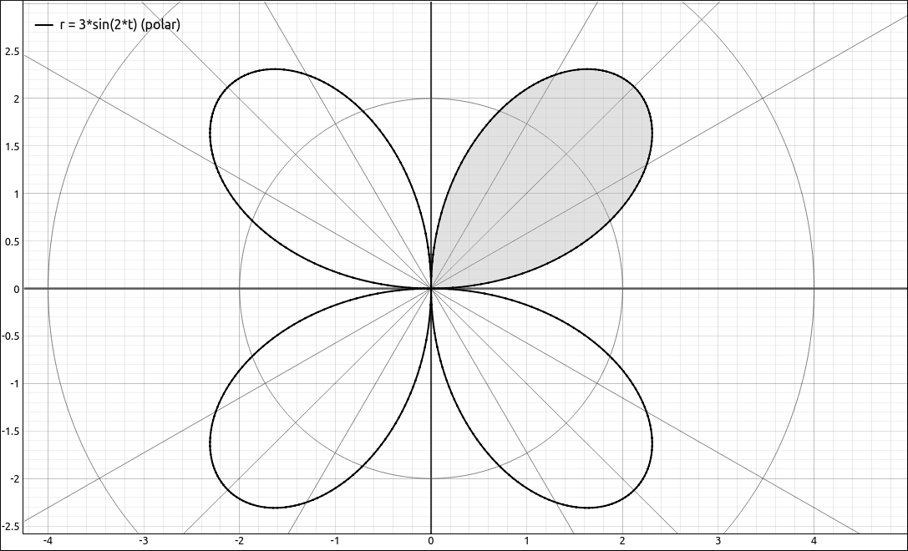

:index:`Area and Arc Length in Polar Coordinates`
=================================================

Discussion & Definitions
------------------------

We will not go through the derivations of either of these formulas, your textbook should have the derivations.

.. admonition:: Theorem: Area of a Region Bounded by a Polar Curve

    Suppose :math:`f` is continuous and nonnegative on the interval :math:`\alpha \leq \theta \leq \beta` with :math:`0 < \beta - \alpha \leq 2 \pi.` The area of the region bounded by the graph of :math:`r = f(\theta)` between the radial lines :math:`\theta = \alpha` and :math:`\theta = \beta` is

    .. math::
        A = \frac{1}{2} \int_\alpha^\beta \left( f(\theta) \right)^2 \; d\theta = \frac{1}{2} \int_\alpha^\beta r^2 \; d\theta

.. admonition:: Theorem: Arc Length of a Curve Defined by a Polar Function

    Let :math:`f` be a function whose derivative is continuous on the interval :math:`\alpha \leq \theta \leq \beta.` The length of the graph of :math:`r = f(\theta)` between  :math:`\theta = \alpha` and :math:`\theta = \beta` is

    .. math::
        L = \int_\alpha^\beta  \sqrt{\left( f(\theta) \right)^2 + \left( f'(\theta) \right)^2} \; d\theta = \int_\alpha^\beta  \sqrt{r^2 + \left( r' \right)^2} \; d\theta

Example: Area
-------------

In this example we will find the area of one petal of the rose defined by the equation :math:`r = 3 \sin(2\theta).`

    :math:`r = 3 \sin(2\theta)` with one petal shaded.

The bounds of :math:`\theta` for one petal would be the consecutive places where we hit the origin, that is, :math:`r = 0.` We can see that this is the interval :math:`[0, \pi/2]` with the help of a CAS but we can use the solver to verify this.  So the integral we want to find is,

.. math::
    A = \frac{1}{2} \int_0^{\pi/2} \left( 3 \sin(2\theta) \right)^2 \; d\theta

GeoGebra
^^^^^^^^

Input,

.. code-block:: console

    3 sin(2x)

Assume this is ``f``.  Form the integrand,

.. code-block:: console

    1/2 f^2

Assume this is ``g``.  Integrate,

.. code-block:: console

    Integral(g,0,pi/2)

the result is, 3.53429.

CLAE
^^^^

Input,

.. code-block:: console

    3*sin(2*x)

Assume this is ``R1``.  Form the integrand,

.. code-block:: console

    1/2*R1^2

Assume this is ``R2``.  Integrate with ``Calculus > Definite Integral``, bounds ``0`` and ``pi/2``, the result is, :math:`\frac{9 \pi}{8}.`

Example: Arc Length
-------------------

In this example we will find the arc length in one petal of the rose defined by the equation :math:`r = 3 \sin(2\theta).`

GeoGebra
^^^^^^^^

Input,

.. code-block:: console

    3 sin(2x)

Assume this is ``f``.  Form the integrand,

.. code-block:: console

    sqrt(f^2+(f')^(2))

Assume this is ``g``.  Integrate,

.. code-block:: console

    Integral(g,0,pi/2)

the result is, 7.26634.

CLAE
^^^^

Input,

.. code-block:: console

    3*sin(2*x)

Assume this is ``R1``.  Take the derivative of ``R1`` with ``Calculus > Derivative``, assume the result is in ``R2``.  Form the integrand,

.. code-block:: console

    sqrt(R1^2+R2^2)

the result is,

.. math::
    \sqrt{9 \sin^{2}{\left(2 t \right)} + 36 \cos^{2}{\left(2 t \right)}}

Integrate with ``Calculus > Definite Integral``, bounds ``0`` and ``pi/2``, the result is,

.. math::
    3 \int\limits_{0}^{\frac{\pi}{2}} \sqrt{\sin^{2}{\left(2 t \right)} + 4 \cos^{2}{\left(2 t \right)}}\, dt

This is another difficult integral, as most arc length integrals are.  Select ``Algebra > Approximate`` and we get the result, 7.2663361654107571488.

