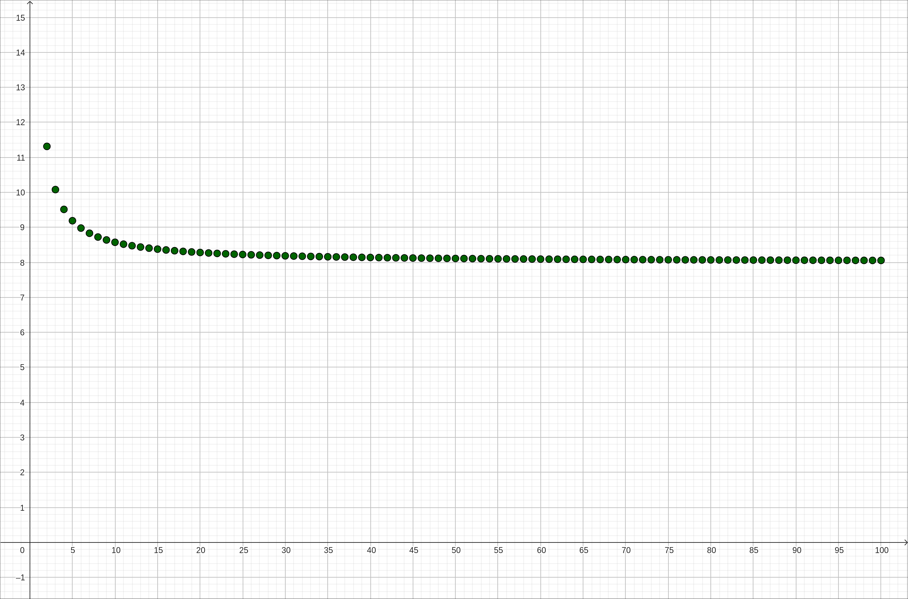
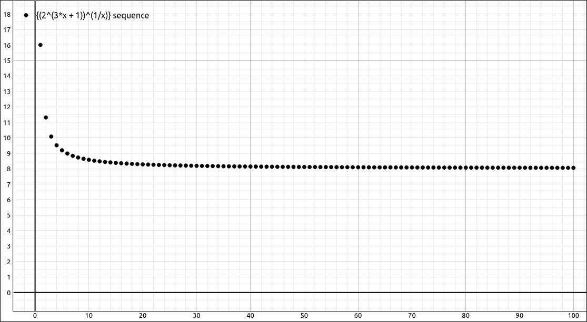
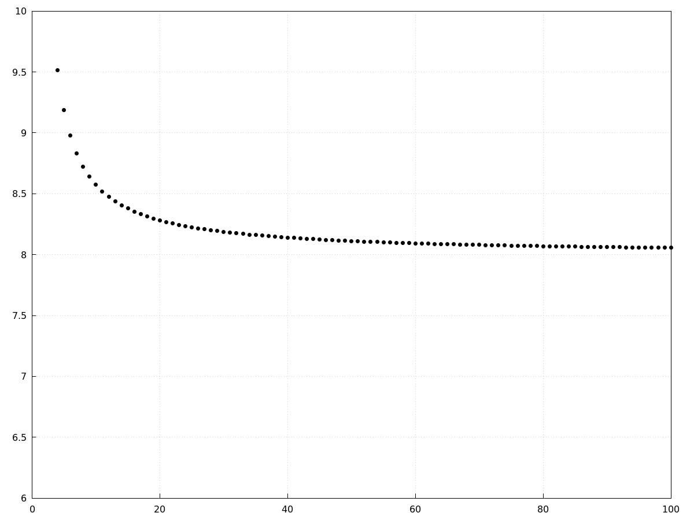

:index:`Sequences`
==================

Discussion & Definitions
------------------------

.. admonition:: Definition: Infinite Sequence

    An **infinite sequence** :math:`\{a_n\}` is an ordered list of numbers of the form

    .. math::
        a_1, a_2, \ldots , a_n, \ldots.

    *n* is called the **index** variable of the sequence. Each number :math:`a_n` is a **term** of the sequence.

In some cases we can find an explicit formula for each term in the sequence, :math:`a_n = f(n)`, in this case we would write, :math:`\left\{f(n)\right\}_{n=1}^\infty` or just :math:`\left\{f(n)\right\}` if the starting index of the sequence was understood.  In addition, the starting point of a sequence is irrelevant, it can start at any value but is usually 1 or a positive integer.

In some cases a sequence is defined by a formula that uses previous entries from the sequence itself, in this case a sequences is defined by a **recurrence relation**. The classical example here is the Fibonacci sequence,

.. math::
    a_n = a_{n-1} + a_{n-2} \qquad {\rm with} \quad a_0 = 1  \quad {\rm and} \quad a_1 = 1

With infinite sequences we frequently wish to know if the sequence converges to a number or not, the limit of a sequence is similar to the infinite limit of a function.  The limit definition below is an intuitive definition, these is a precise definition but we will not give it here.

.. admonition:: Definition: Limit of a Sequence

    Given a sequence :math:`\{a_n\}`, if the terms :math:`a_n` become arbitrarily close to a finite number :math:`L` as :math:`n` becomes sufficiently large, we say :math:`\{a_n\}` is a convergent sequence and :math:`L` is the limit of the sequence. In this case, we write

    .. math::
        \lim_{n \to \infty} a_n = L

    If a sequence :math:`\{a_n\}` is not convergent, we say it is a divergent sequence.

One consequence of the sequence definition being so close to the function definition is that if we have a function that coincides with the sequence and the function converges then so does the sequence.

.. admonition:: Theorem: Limit of a Sequence Defined by a Function

    For a sequence :math:`\{a_n\}` such that :math:`a_n = f(n)` for all :math:`n \geq 1`. If there exists a real number :math:`L` such that

    .. math::
        \lim_{x \to \infty} f(x) = L

    then :math:`\{a_n\}` converges and

    .. math::
        \lim_{n \to \infty} a_n = L

One thing to note about the above theorem is that it is possible for sequence to converge but the function ot to have an infinite limit.  A classic example is the sequence :math:`\{ \cos(2 \pi n) \}`.  The limit :math:`\displaystyle \lim_{x \to \infty} \cos(2 \pi x)` does not exist but the sequence :math:`\{ \cos(2 \pi n) \} = \{ 1, 1, 1, \ldots \}` converges to 1.  The above theorem is how most computer algebra systems calculate the limit of a sequence.  Most require you to input a function that defines the nth term and then the CAS takes the limit at infinity of the function.  Some other computer algebra systems will distinguish between a limit at infinity and the limit of a sequence, this is usually better since it can assume that *n* is an integer and hence catch situations like the example above.

There are limit laws for sequences just as there are limit laws for function limits, and as expected, they are very similar.

.. admonition:: Theorem: Limit Laws for Sequences

    Given two convergent sequences :math:`\{a_n\}` and :math:`\{b_n\}` with :math:`\lim_{n \to \infty} a_n = A` and :math:`\lim_{n \to \infty} b_n = B`, and any real number :math:`c`, then

    1. :math:`\displaystyle \lim_{n \to \infty} c = c`
    2. :math:`\displaystyle \lim_{n \to \infty} ca_n = c \lim_{n \to \infty} a_n = cA`
    3. :math:`\displaystyle \lim_{n \to \infty} (a_n \pm b_n) = \lim_{n \to \infty} a_n \pm \lim_{n \to \infty} b_n = A \pm B`
    4. :math:`\displaystyle \lim_{n \to \infty} (a_n \cdot b_n) = \left(\lim_{n \to \infty} a_n \right) \cdot \left( \lim_{n \to \infty} b_n \right) = A \cdot B`
    5. :math:`\displaystyle \lim_{n \to \infty} \frac{a_n}{b_n} = \frac{\displaystyle \lim_{n \to \infty} a_n}{\displaystyle \lim_{n \to \infty} b_n} = \frac{A}{B}`, as long as :math:`B \neq 0` and each :math:`b_n \neq 0`.

In addition,

.. admonition:: Theorem: Continuous Functions Defined on Convergent Sequences

    If a sequence :math:`{a_n}` converges to :math:`L` and a function :math:`f(x)` is continuous at :math:`L` then the sequence :math:`{f(a_n)}` converges to :math:`f(L)`.

One thing to note about the above theorem is that the function may not be defined for the first finite number of :math:`a_n` terms.  Since :math:`f(x)` is continuous at :math:`L`, it will be defined for all terms from sme point on, we simply use that as our starting point for the :math:`{f(a_n)}` sequence.

There is also a sequence counterpart for the Squeeze Theorem.

.. admonition:: Theorem: Squeeze Theorem for Sequences

    If we have three sequences :math:`\{a_n\}`, :math:`\{b_n\}`, and :math:`\{c_n\}` with :math:`\displaystyle \lim_{n \to \infty} a_n = \lim_{n \to \infty} c_n = L` and from some point, :math:`N`, on :math:`a_n \leq b_n \leq c_n` for all :math:`n \geq N`, then :math:`\{b_n\}` converges with :math:`\displaystyle \lim_{n \to \infty} b_n = L.`

The final definitions and theorems are mainly for theoretical purposes but do come in handy from time to time.

.. admonition:: Definition: Bounded Sequences

    - A sequence :math:`\{a_n\}` is bounded above if there exists a real number *M* such that :math:`a_n \leq M` for all positive integers *n*.

    - A sequence :math:`\{a_n\}` is bounded below if there exists a real number *M* such that :math:`a_n \geq M` for all positive integers *n*.

    - A sequence :math:`\{a_n\}` is a bounded sequence if it is bounded above and bounded below.  If the sequence is not bounded, it is called an unbounded sequence.

.. admonition:: Theorem: Bounded Convergent Sequences are Bounded

    If the sequence :math:`\{a_n\}` converges, then it is bounded.

.. admonition:: Definition: Increasing, Decreasing and Monotone Sequences

    - A sequence :math:`\{a_n\}` is increasing if :math:`a_n \leq a_{n + 1}` for all :math:`n \geq N.`
    - A sequence :math:`\{a_n\}` is decreasing if :math:`a_n \geq a_{n + 1}` for all :math:`n \geq N.`
    - A sequence :math:`\{a_n\}` is a monotone sequence it is increasing or decreasing.

Note that some textbooks use a strict inequality, that is, :math:`a_n < a_{n + 1}` instead of :math:`a_n \leq a_{n + 1}`, similarly for decreasing sequences.  For those that use the definition we have above, they call the strict inequality *strictly increasing* and *strictly decreasing* respectively.

.. admonition:: Theorem: Monotone Convergence Theorem

    If :math:`\{a_n\}` is a bounded monotone sequence then it converges.

In the examples we will be concentrating on visualizing and computing limits of sequences.

Example: :math:`\left\{ \left(2^{3 n + 1}\right)^{\frac{1}{n}} \right\}`
------------------------------------------------------------------------

GeoGebra
^^^^^^^^

In GeoGebra, we need to define a sequence of *x* values, define the nth term function (with independent variable *x*), apply the function to the sequence for the *y* values and create points out of the two sequences.

Input the nth term function (in terms of *x*),

.. code-block:: console

    (2^(3 x+1))^(1/x)

Create a sequence of *x* values with ``Sequence(1, 100)``, this should come in as a list ``l1``. In a new cell input ``f(l1)``, this will create a list ``l2`` of corresponding *y* values.  Finally input ``(l1, l2)`` and this will create a set of 100 points representing the sequence.

    :math:`\left\{ \left(2^{3 n + 1}\right)^{\frac{1}{n}} \right\}`

To calculate the limit of the sequence just take the limit of the function ``f(x)`` as *x* approaches infinity,

.. code-block:: console

    Limit(f,infinity)

The result should be 8.

CLAE
^^^^

Input the nth term function using *x* as the index.

.. code-block:: console

    (2^(3*x+1))^(1/x)

Note that the CAS does not care when the variable is, the only reason we are using *x* here is because we will be graphing the sequence.  If all we wanted to do was find the limit we could have used *n* or any other variable for the index.

Click and drag this over to the graph and change the type to sequence/series.

    :math:`\left\{ \left(2^{3 n + 1}\right)^{\frac{1}{n}} \right\}`

To calculate the limit of the sequence just select the nth tern function and select ``Calculus > Sequence Limit``, a dialog will appear allowing the selection of the variable and properties.  The variable is *x* and you can leave the variable properties alone.  The sequence limit option automatically assumes that the index variable is a positive integer.  Note that you do not want to use the ``Calculus > Limit`` option for sequences.  The sequence limit option uses different techniques and can report the sequence limit where the limit option may fail.

Maxima
^^^^^^

You can graph a sequence in Maxima like we did in GeoGebra and CLAE above but it is a little cumbersome, we will do it here.

First input the nth term function,

.. code-block:: console

    kill(all);
    f(n):=(2^(3*n+1))^(1/n);

Now define the set of points,

.. code-block:: console

    POINTS:makelist([n,f(n)],n,1,100)$

The $ at the end is to supress the lengthy output.  Now plot it with,

.. code-block:: console

    wxdraw2d(
    grid=true,
    xrange=[0,100],
    yrange=[6,10],
    color=black,
    point_type=7,
    points(POINTS)
    );

    :math:`\left\{ \left(2^{3 n + 1}\right)^{\frac{1}{n}} \right\}`

Finding the limit of the sequence is the same as finding the infinite limit,

.. code-block:: console

    limit(f(n),n,inf);

The result is 8.
