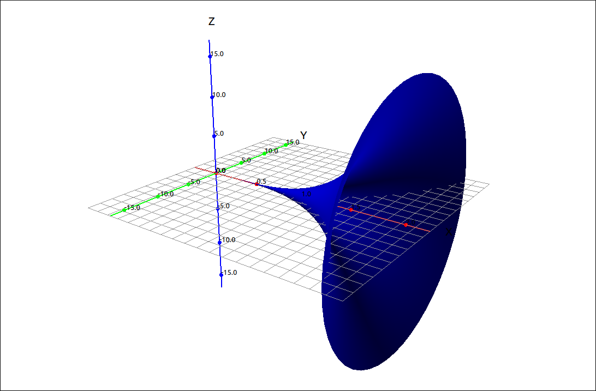
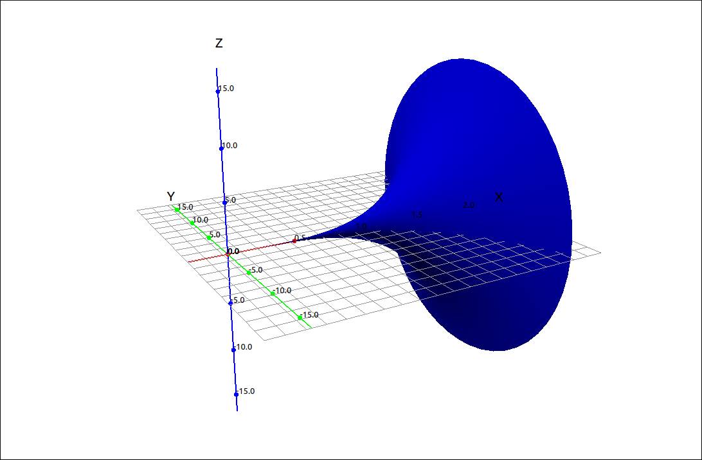
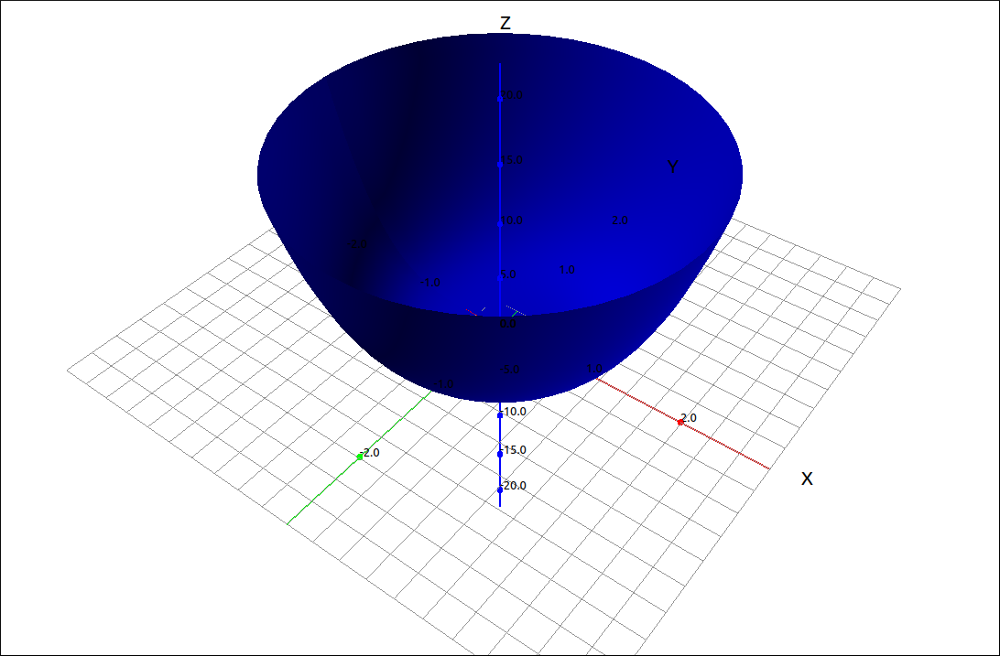
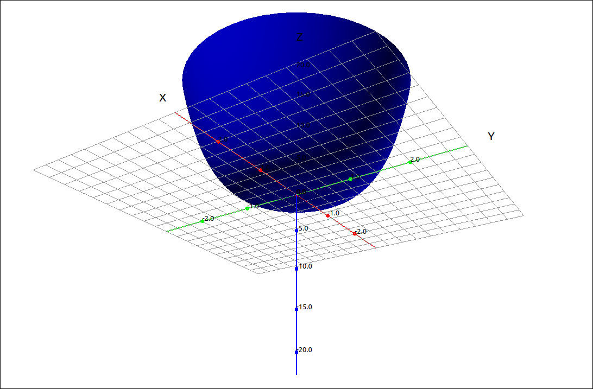

:index:`Surface Area`
=====================

Discussion & Definitions
------------------------

.. admonition:: Theorem: Surface Area of a Surface of Revolution about the *x*-Axis

    Let :math:`f(x)` be a nonnegative smooth function over the interval :math:`[a, b]`. Then, the surface area of the surface of revolution formed by revolving the graph of :math:`f(x)` around the *x*-axis is given by

    .. math::
        S = \int_a^b 2\pi f(x) \sqrt{1 + (f'(x))^2} \; dx

Note that the arc length integrand is a part of the formula so we can incorporate the work we did in the last section to simplify the formula. Replacing :math:`\sqrt{1 + (f'(x))^2} \; dx` with :math:`ds` and :math:`f(x)` with :math:`y` we get,

.. math::
    S = \int_a^b 2\pi y \; ds

If :math:`\frac{dx}{dy}` is easier to calculate we can use the :math:`dy` formulation in this equation as well.  The only thing you need to be careful with is that the bounds of integration need to match the variable of integration.  That is, if we use

.. math::
    S = \int_a^b 2\pi y \sqrt{1 + \left(\frac{dy}{dx}\right)^2} \; dx

then the bounds must be in terms of *x*, and if we use

.. math::
    S = \int_a^b 2\pi y \sqrt{1 + \left(\frac{dx}{dy}\right)^2} \; dy

then the bounds must be in terms of *y*.

As with arc length this formula is symmetric in *x* and *y* so if we rotate the curve around the *y*-axis we use the formula

.. math::
    S = \int_a^b 2\pi x \; ds

again where :math:`ds` can be either formulation.  Summarizing all of this,

.. admonition:: Theorem: Surface Area of a Surface of Revolution

    If we revolve a curve about the *x*-axis then the surface area of the surface is

    .. math::
        S = \int_a^b 2\pi y \; ds

    and if we revolve the curve about the *y*-axis then the surface area of the surface is

    .. math::
        S = \int_a^b 2\pi x \; ds

    where we can use either formulation for :math:`ds`

    .. math::
        ds = \sqrt{1 + \left(\frac{dy}{dx}\right)^2} \; dx = \sqrt{1 + \left(\frac{dx}{dy}\right)^2} \; dy

    The only thing you need to be careful with is that the bounds of integration need to match the variable of integration.

Example: :math:`f(x) = x^4` on :math:`[0, 2]` about the *x*-Axis
----------------------------------------------------------------

GeoGebra
^^^^^^^^

Input the function,

.. code-block:: console

    x^4

Assume this came in as *f*.  Now input the surface area integrand,

.. code-block:: console

    2 pi f(x) sqrt(1+(f'(x))^2)

Assume this came in as *g*.  Finally find the integral for *x* from 0 to 2,

.. code-block:: console

    Integral(g, 0, 2)

The result is 805.71791.

CLAE
^^^^

Input the function,

.. code-block:: console

    x^4

Assume this came in as R1.  Take its derivative with ``Calculus > Derivative``, the result is :math:`4x^3`. Assume this came in as R2. Now input the surface area integrand,

.. code-block:: console

    2*pi*R1*sqrt(1+R2^2)

The result is,

.. math::
    2 \pi x^{4} \sqrt{16 x^{6} + 1}

Finally find the integral for *x* from 0 to 2.  The result here is a bit frightening,

.. math::
    \frac{32 \pi \Gamma\left(\frac{5}{6}\right) {{}_{2}F_{1}\left(\begin{matrix} - \frac{1}{2}, \frac{5}{6} \\ \frac{11}{6} \end{matrix}\middle| {1024 e^{i \pi}} \right)}}{3 \Gamma\left(\frac{11}{6}\right)}

The meaning of this is far beyond the scope of introductory Calculus, we will not worry about it.  If we approximate this expression we get, 805.717911799325.

Note that if we had done the integral with Course Techniques turned on we would have gotten just,

.. math::
    2 \pi \int\limits_{0}^{2} x^{4} \sqrt{16 x^{6} + 1}\, dx

which also approximates to 805.717911799325.  As does using the definite integral approximation option.  A couple images of the surface are below.

    :math:`f(x) = x^4` on :math:`[0, 2]` about the *x*-Axis

    :math:`f(x) = x^4` on :math:`[0, 2]` about the *x*-Axis

Maxima
^^^^^^

Input the function,

.. code-block:: console

    kill(all);
    f(x):=x^4

Take its derivative with

.. code-block:: console

    df:diff(f(x),x)

Then integrate,

.. code-block:: console

    integrate(2*%pi*f(x)*sqrt(1+df^2),x,0,2);

The result is,

.. math::
    2 {\pi}  \int_{0}^{2}{\left. {{x}^{4}} \sqrt{16 {{x}^{6}}+1}dx\right.}\mbox{}

Changing to an approximation,

.. code-block:: console

    romberg(2*%pi*f(x)*sqrt(1+df^2),x,0,2);

gives us, 805.7179662890758.

Example: :math:`f(x) = x^4` on :math:`[0, 2]` about the *y*-Axis
----------------------------------------------------------------

GeoGebra
^^^^^^^^

Input the function,

.. code-block:: console

    x^4

Assume this came in as *f*.  Now input the surface area integrand, we will use the the :math:`dy/dx` version,

.. code-block:: console

    2 pi x sqrt(1+(f'(x))^2)

Assume this came in as *g*.  Finally find the integral for *x* from 0 to 2,

.. code-block:: console

    Integral(g, 0, 2)

The result is 162.55465.

If we try to do this with the :math:`dx/dy` version.  In this case, :math:`x = \sqrt[4]{y}` and then :math:`dx/dy = \frac{1}{4 y^{\frac{3}{4}}}`.  Since GeoGebra is a bit picky with te variable names we will convert all the *y*'s to *x*'s, just keep in mind that these are *y* values.

Input the function,

.. code-block:: console

    x^(1/4)

Assume this came in as *f*.  Now input the surface area integrand, we will use the the :math:`dx/dy` version,

.. code-block:: console

    2 pi f(x) sqrt(1+(f'(x))^2)

Assume this came in as *g*.  Finally find the integral for *x* from 0 to 2,

.. code-block:: console

    Integral(g, 0, 16)

The result is ?.  So for some reason GeoGebra does not approximate this integral, this is possibly due to the fact that this is an improper integral of discontinuous type which GeoGebra does not always calculate. If we use the RectangleSum command the approximations are close to what we get with the other CAS systems.

CLAE
^^^^

Input the function,

.. code-block:: console

    x^4

Assume this came in as R1.  Take its derivative with ``Calculus > Derivative``, the result is :math:`4x^3`. Assume this came in as R2. Now input the surface area integrand,

.. code-block:: console

    2*pi*x*sqrt(1+R2^2)

The result is,

.. math::
    2 \pi x \sqrt{16 x^{6} + 1}

Finally find the integral for *x* from 0 to 2.  The result here is again a bit frightening,

.. math::
    \frac{4 \pi \Gamma\left(\frac{1}{3}\right) {{}_{2}F_{1}\left(\begin{matrix} - \frac{1}{2}, \frac{1}{3} \\ \frac{4}{3} \end{matrix}\middle| {1024 e^{i \pi}} \right)}}{3 \Gamma\left(\frac{4}{3}\right)}

If we approximate this expression we get, 162.554649444176.

Note that if we had done the integral with Course Techniques turned on we would have gotten just,

.. math::
    2 \pi \int\limits_{0}^{2} x \sqrt{16 x^{6} + 1}\, dx

which also approximates to 162.554649444176.  As does using the definite integral approximation option.  A couple images of the surface are below.

    :math:`f(x) = x^4` on :math:`[0, 2]` about the *y*-Axis

    :math:`f(x) = x^4` on :math:`[0, 2]` about the *y*-Axis

We can do this with the :math:`dx/dy` version.  In this case, :math:`x = \sqrt[4]{y}` and then :math:`dx/dy = \frac{1}{4 y^{\frac{3}{4}}}`.

Input the function,

.. code-block:: console

    y^(1/4)

Assume this came in as R1.  Find the derivative and assume this cam in as R2. Now input the surface area integrand, we will use the the :math:`dx/dy` version,

.. code-block:: console

    2*pi*R1*sqrt(1+R2^2)

The result is,

.. math::
    2 \pi \sqrt[4]{y} \sqrt{1 + \frac{1}{16 y^{\frac{3}{2}}}}

Finally find the integral for *y* from 0 to 16, we get,

.. math::
    - \frac{128 \pi \Gamma\left(- \frac{5}{6}\right) {{}_{2}F_{1}\left(\begin{matrix} - \frac{5}{6}, - \frac{1}{2} \\ \frac{1}{6} \end{matrix}\middle| {- \frac{1}{1024}} \right)}}{3 \Gamma\left(\frac{1}{6}\right)}

which approximates to, 160.456858474756.  If we turn on the Course Techniques we get,

.. math::
    \frac{\pi \int\limits_{0}^{16} \frac{\sqrt{16 y^{\frac{3}{2}} + 1}}{\sqrt{y}}\, dy}{2}

which approximates to, 162.554649444176.  Why the two approximations are closer, as we would expect, I do not have a good explanation for.

Maxima
^^^^^^

Input the function,

.. code-block:: console

    kill(all);
    f(x):=x^4

Take its derivative with

.. code-block:: console

    df:diff(f(x),x)

Then integrate,

.. code-block:: console

    integrate(2*%pi*x*sqrt(1+df^2),x,0,2);

The result is,

.. math::
    2 {\pi}  \int_{0}^{2}{\left. x \sqrt{16 {{x}^{6}}+1}dx\right.}\mbox{}

Changing to an approximation,

.. code-block:: console

    romberg(2*%pi*x*sqrt(1+df^2),x,0,2);

gives us, 162.5546472603261.

We can do this with the :math:`dx/dy` version.  In this case, :math:`x = \sqrt[4]{y}` and then :math:`dx/dy = \frac{1}{4 y^{\frac{3}{4}}}`.

Input the function,

.. code-block:: console

    kill(all);
    f(y):=y^(1/4);

Find the derivative

.. code-block:: console

    df:diff(f(y),y);

Now input the surface area integrand, we will use the the :math:`dx/dy` version, and integrate,

.. code-block:: console

    integrate(2*%pi*f(y)*sqrt(1+df^2),y,0,16);

The result is,

.. math::
    2 {\pi}  \int_{0}^{16}{\left. \sqrt{\frac{1}{16 {{y}^{\frac{3}{2}}}}+1} {{y}^{\frac{1}{4}}}dy\right.}\mbox{}

If we try to approximate this with ``romberg``,

.. code-block:: console

    romberg(2*%pi*f(y)*sqrt(1+df^2),y,0,16);

it will not do it.  Iw we use the other method, ``quad_qags``,

.. code-block:: console

    quad_qags(2*%pi*f(y)*sqrt(1+df^2),y,0,16);

it returns

.. math::
    \left[ 162.5546494441757\operatorname{,}3.32852891915536 \cdot {{10}^{-8}}\operatorname{,}357\operatorname{,}0\right] \mbox{}

which gives us the approximation of 162.5546494441757 with an error of at most :math:`3.32852891915536 \cdot {{10}^{-8}}`.

