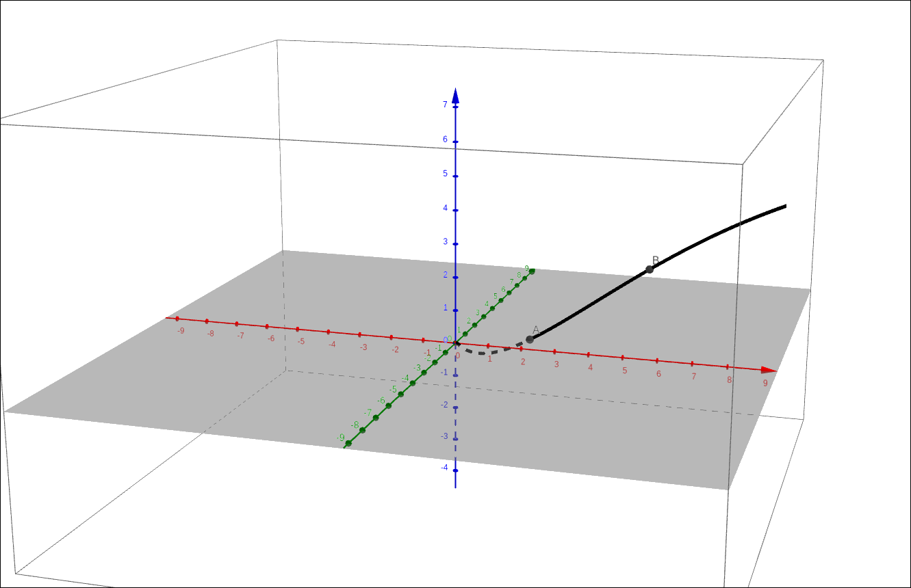
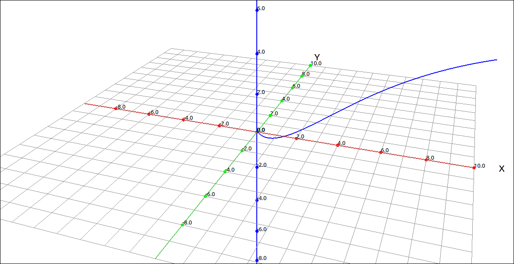
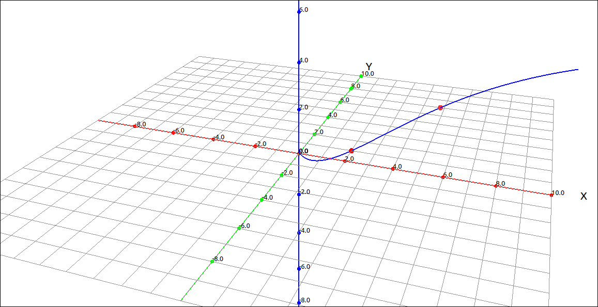
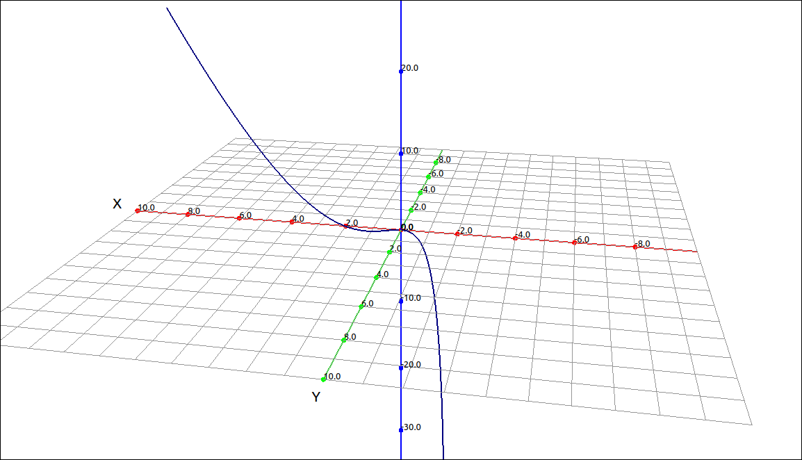
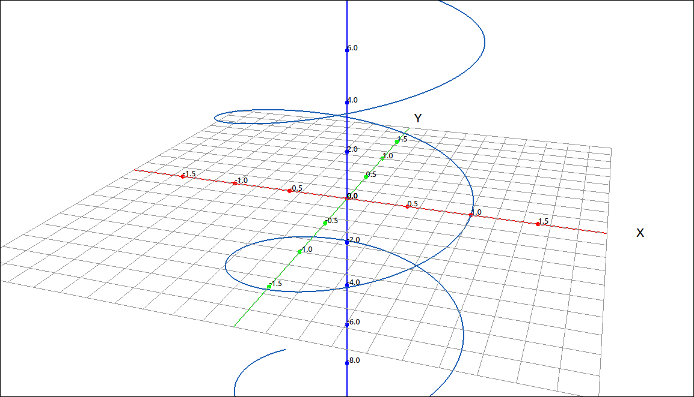
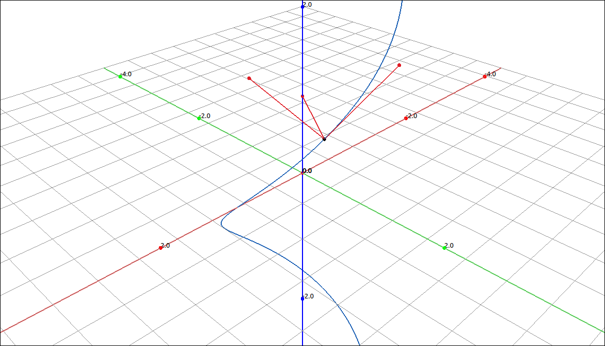
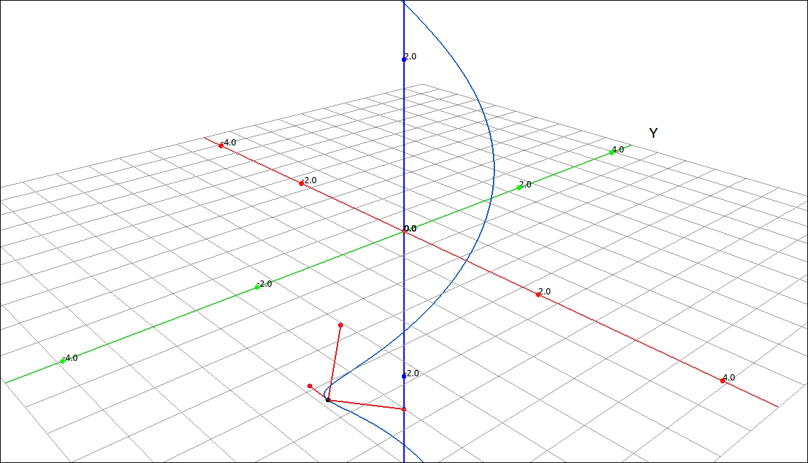
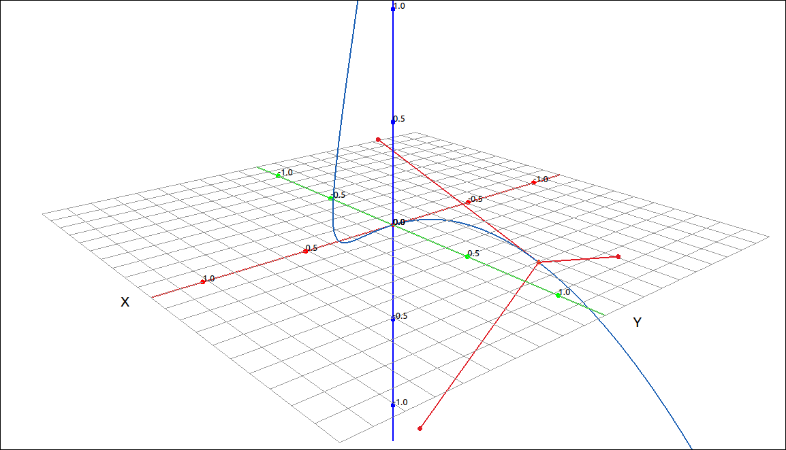
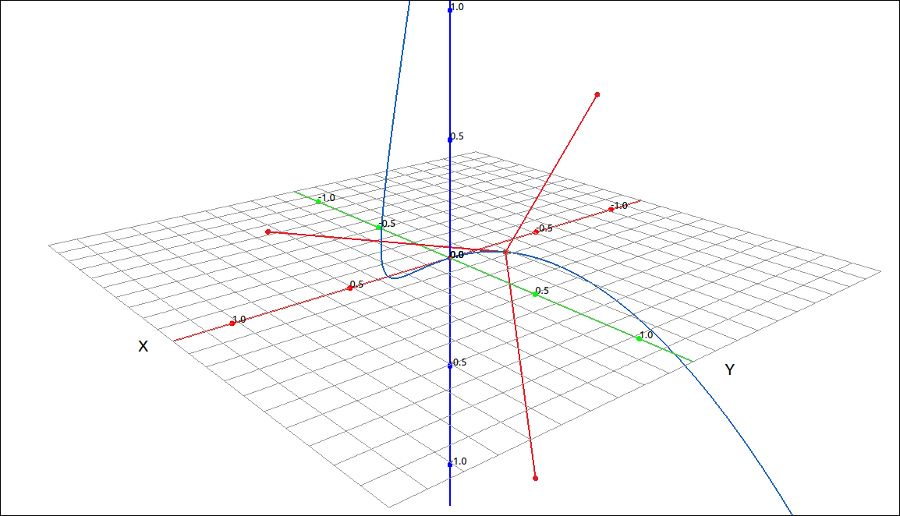
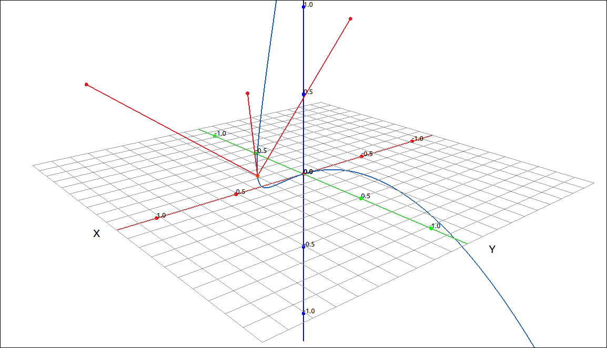

:index:`Arc Length and Curvature`
=================================

Arc Length
----------

The arc-length of curve is simply the distance traveled along the curve between two values of the parameter. The formula for finding arc-length is similar to that of arc-length of a function in the plane.

.. admonition:: Theorem: Arc-Length Formulas

    If :math:`\mathbf{r}(t) = (f(t), g(t))` is a plane curve then the arc-length of this curve from :math:`t = a` to :math:`t = b` is

    .. math::
        s= \int_a^b \sqrt{(f'(t))^2 + (g'(t))^2} \; dt = \int_a^b |\mathbf{r}'(t)|  \; dt

    Similarly, if :math:`\mathbf{r}(t) = (f(t), g(t), h(t))` is a space curve then the arc-length of this curve from :math:`t = a` to :math:`t = b` is

    .. math::
        s= \int_a^b \sqrt{(f'(t))^2 + (g'(t))^2 + (h'(t))^2} \; dt = \int_a^b |\mathbf{r}'(t)|  \; dt

Example: :math:`\left( 2 e^{t}, \  e^{t} \cos{\left(t \right)}, \  e^{t} \sin{\left(t \right)}\right)`
^^^^^^^^^^^^^^^^^^^^^^^^^^^^^^^^^^^^^^^^^^^^^^^^^^^^^^^^^^^^^^^^^^^^^^^^^^^^^^^^^^^^^^^^^^^^^^^^^^^^^^

In this example we will find the arc-length of the curve :math:`\left( 2 e^{t}, \  e^{t} \cos{\left(t \right)}, \  e^{t} \sin{\left(t \right)}\right)` for :math:`0 \leq t \leq 1.`

GeoGebra
""""""""

GeoGebra has the arc-length calculation built into its commands.  As we have seen before, it is difficult to follow the calculations given in the definition through in GeoGebra.  Nonetheless, we can still do the computations.  Input the curve into GeoGebra with,

.. code-block:: console

    (2 exp(t), exp(t) cos(t), exp(t) sin(t))

The image of the curve is below.  We will assume that the name of the curve was ``a``.

    :math:`\left( 2 e^{t}, \  e^{t} \cos{\left(t \right)}, \  e^{t} \sin{\left(t \right)}\right)`

We will not plot points where :math:`t = 0` and :math:`t = 1`.  Input ``a(0`` and then ``a(1)``.  The two points are now plotted on the curve.

    :math:`\left( 2 e^{t}, \  e^{t} \cos{\left(t \right)}, \  e^{t} \sin{\left(t \right)}\right)`

To find the arc-length we can use the Length function.

.. code-block:: console

    Length(a,0,1)

The result is 4.20891.

CLAE
""""

CLAE does not have the arc-length built into its menu system but it is easy to follow the calculations through with the tools it has.  First input the curve either as a list or a vector.  In general the vector form is more functional so we will use that here.

.. code-block:: console

    [2*exp(t), exp(t)*cos(t), exp(t)*sin(t)]

the result is ``R1``,

.. math::
    \left[\begin{array}{c}2 e^{t}\\e^{t} \cos{\left(t \right)}\\e^{t} \sin{\left(t \right)}\end{array}\right]

Graphing this gives,

    :math:`\left( 2 e^{t}, \  e^{t} \cos{\left(t \right)}, \  e^{t} \sin{\left(t \right)}\right)`

We will now plot the two endpoints for the arc.  Select the curve, select ``Algebra > Evaluate`` and input 0 for the expression, the result is,

.. math::
    \left[\begin{array}{c}2\\1\\0\end{array}\right]

Do the same for 1 to get,

.. math::
    \left[\begin{array}{c}2 e\\e \cos{\left(1 \right)}\\e \sin{\left(1 \right)}\end{array}\right]

Plotting these two points gives the image,

    :math:`\left( 2 e^{t}, \  e^{t} \cos{\left(t \right)}, \  e^{t} \sin{\left(t \right)}\right)`

Now to do the arc-length calculation, select the curve ``R1``, then select ``Calculus > Derivative`` keep the variable as *t* and order 1, the result is :math:`\mathbf{r}'(t)`,

.. math::
    \left[\begin{array}{c}2 e^{t}\\- e^{t} \sin{\left(t \right)} + e^{t} \cos{\left(t \right)}\\e^{t} \sin{\left(t \right)} + e^{t} \cos{\left(t \right)}\end{array}\right]

Now take its length by ``Vector > Length``, the result is :math:`|\mathbf{r}'(t)|`,

.. math::
    \sqrt{\left(- e^{t} \sin{\left(t \right)} + e^{t} \cos{\left(t \right)}\right)^{2} + \left(e^{t} \sin{\left(t \right)} + e^{t} \cos{\left(t \right)}\right)^{2} + 4 e^{2 t}}

This can obviously be simplified, select ``Algebra > Simplify``, the result is,

.. math::
    \sqrt{6} \sqrt{e^{2 t}}

This too can be simplified, we can assume that we are working with real numbers, select ``Algebra > Simplify Assuming Real Variables``, the result is,

.. math::
    \sqrt{6} e^{t}

Now all that is left is to integrate, select ``Calculus > Definite Integral``, keep the variable as *t* and input the bounds as 0 and 1, the result is,

.. math::
    - \sqrt{6} + \sqrt{6} e \approx 4.2089137140211556657

.. note::

    In the above example we chose a curve that made the final integral simple to calculate.  One can imagine, given the arc-length formula, that is it is easy to be left with a difficult integral at the end.  As an example, consider the twisted cubic on the range :math:`0 \leq t \leq 1.`  The integral we would need to evaluate is,

    .. math::
        \int\limits_{0}^{1} \sqrt{9 t^{4} + 4 t^{2} + 1}\, dt

    We will not be able to find this value exactly so we should use a numeric approximation to the integral, and get, 1.8630229825122513944.

Arc-Length Parameterization
---------------------------

A curve can have many different parameterizations.  For example, the helix,

.. math::
    \left[\begin{array}{c}\cos{\left(t \right)}\\\sin{\left(t \right)}\\t\end{array}\right]

could also be written as,

.. math::
    \left[\begin{array}{c}\cos{\left(2 t \right)}\\\sin{\left(2 t \right)}\\2 t\end{array}\right]

or

.. math::
    \left[\begin{array}{c}\cos{\left(\sqrt[3]{t} \right)}\\\sin{\left(\sqrt[3]{t} \right)}\\\sqrt[3]{t}\end{array}\right]

Of course for the different parameterizations the bounds on the parameter may change to map out the same section of the curve but the final set of points defining the curve are the same.

One way to "normalize" a parameterization is to parameterize the curve by its arc-length.  The first step on doing this is to define the arc-length function.  This simply replaces the upper bound of the arc-length calculation by a variable.

.. admonition:: Definition: Arc-Length Function

    Let :math:`\mathbf{r}(t)` describe a smooth curve for :math:`t \geq a.` Then the arc-length function is given by

    .. math::
        s(t) = \int_a^t  |\mathbf{r}'(u)|  \; du

    Note that this implies that,

    .. math::
        \frac{ds}{dt} = s'(t) = \frac{d}{dt} \int_a^t  |\mathbf{r}'(u)|  \; du = |\mathbf{r}'(t)|

To find an arc-length parameterization we simply find the arc-length function and then solve it for *t* in terms of *s*.  Finally we substitute this solution in for the parameter *t* in the original parameterization.  This process can be difficult for two reasons.  First, as we saw above, finding the integral for arc-length can be lengthy (or possibly impossible) and second, solving this integral for *s* can be equally complex (if possible).

Example: Finding an Arc-Length Parameterization
^^^^^^^^^^^^^^^^^^^^^^^^^^^^^^^^^^^^^^^^^^^^^^^

We will use a fairly tame example here.  We will find the arc-length parameterization of the helix.  This is an example that can easily be done by hand but we will use the technology to show how the process can be used for more complex situations.

CLAE
""""

Input the helix curve,

.. math::
    \left[\begin{array}{c}\cos{\left(t \right)}\\\sin{\left(t \right)}\\t\end{array}\right]

.. code-block:: console

    [cos(t), sin(t), t]

Now take its derivative with ``Calculus > Derivative``, variable *t* and order 1.  The result is,

.. math::
    \left[\begin{array}{c}- \sin{\left(t \right)}\\\cos{\left(t \right)}\\1\end{array}\right]

Now select, ``Vector > Length``, the result is,

.. math::
    \sqrt{\sin^{2}{\left(t \right)} + \cos^{2}{\left(t \right)} + 1}

Simplify with ``Algebra > Simplify``,

.. math::
    \sqrt{2}

The rest of the process is trivial but we will continue. Integrate this with ``Calculus > Definite Integral``, use the variable ``u``, lower bound of 0 and upper bound of *t*, the result is,

.. math::
    \sqrt{2} t

We will assume that the above integral is in ``R5``. To solve this for *s* we first include *s* by inputting ``R5-s``,

.. math::
    - s + \sqrt{2} t

Then we use ``Algebra > Solve`` and solve for *t*, giving,

.. math::
    \left[ \frac{\sqrt{2} s}{2}\right]

Note that the solution is in a list, select ``Edit > Extract from List > Extract All List Entries`` to get

.. math::
    \frac{\sqrt{2} s}{2}

We will assume that this is ``R8``.  Now substitute this into the original curve by selecting the curve, then select ``Algebra > Evaluate``, leave the variable as *t* and for the expression input ``R8``, the result is,

.. math::
    \left[\begin{array}{c}\cos{\left(\frac{\sqrt{2} s}{2} \right)}\\\sin{\left(\frac{\sqrt{2} s}{2} \right)}\\\frac{\sqrt{2} s}{2}\end{array}\right]

This is our arc-length parameterization of the helix.  Note that if we find the arc-length of this curve from *a* to *b* we get the following.  The derivative is,

.. math::
    \left[\begin{array}{c}- \frac{\sqrt{2} \sin{\left(\frac{\sqrt{2} s}{2} \right)}}{2}\\\frac{\sqrt{2} \cos{\left(\frac{\sqrt{2} s}{2} \right)}}{2}\\\frac{\sqrt{2}}{2}\end{array}\right]

its length is 1, so

.. math::
    s= \int_a^b |\mathbf{r}'(t)|  \; dt = \int_a^b 1  \; dt = b - a

Hence the arc-length corresponds directly with the change in the parameter value.

Curvature
---------

The concept of curvature provides a way to measure how sharply a smooth curve turns. The more it turns the larger the curvature.  As an obvious example, a circle has constant curvature. The smaller the radius of the circle, the greater the curvature.  We define the curvature as the rate of change of the unit tangent vector with respect to the arc-length.  So a larger curvature would mean that the tangent vector changes a lot over a small section of the curve, hence the curve is turning a lot in that region.

.. admonition:: Definition: Curvature

    Let *C* be a smooth curve given by :math:`\mathbf{r}(t)`, where *s* is the arc-length parameter. The curvature :math:`\kappa` at *s* is

    .. math::
        \kappa = \left| \frac{d \mathbf{T}}{ds}  \right| = |\mathbf{T}'(s)|

This definition works well theoretically and follows our intuitive notion of curving but it can be difficult to apply.  The problem is that we need to reparameterize the unit tangent vector in terms of arc-length, and we know that this could be difficult.  We will not prove these here, but we can reformulate the curvature calculation without using the arc-length parameterization of the curve.  Instead, any parameterization will suffice.

.. admonition:: Theorem: Alternative Formulas for Curvature

    - If *C* is a smooth curve given by :math:`\mathbf{r}(t)`, then the curvature :math:`\kappa` of *C* at *t* is given by

    .. math::
        \kappa = \frac{|\mathbf{T}'(t)|}{|\mathbf{r}'(t)|}

    - If *C* is a three-dimensional curve given by :math:`\mathbf{r}(t)`, then the curvature :math:`\kappa` can be given by the formula

    .. math::
        \kappa = \frac{|\mathbf{r}'(t) \times \mathbf{r}''(t)|}{|\mathbf{r}'(t)|^3}

    - If *C* is the graph of a function :math:`y = f(x)` and both :math:`f'(x)` and :math:`f''(x)` exist, then the curvature :math:`\kappa` at the point :math:`(x, y)` is given by

    .. math::
        \kappa = \frac{|f''(x)|}{\left( 1 + (f'(x)^2) \right)^{3/2} }

Example: Curvature of the Twisted Cubic
^^^^^^^^^^^^^^^^^^^^^^^^^^^^^^^^^^^^^^^

As we have seen above, finding the curvature of the twisted cubic is very difficult to do by definition but using the alternative formulas we can do the calculations.  This would still be difficult to do by hand but with the aid of a CAS we can complete the calculations fairly easily.

CLAE
""""

Input the twisted cubic,

.. math::
    \left[\begin{array}{c}t\\t^{2}\\t^{3}\end{array}\right]

    Twisted Cubic

We will use the first alternative formula, although we could also use the second one here.  Find the unit tangent vector with ``Calculus > Space Curves > Unit Tangent``, the result is,

.. math::
    \left[\begin{array}{c}\frac{1}{\sqrt{9 t^{4} + 4 t^{2} + 1}}\\\frac{2 t}{\sqrt{9 t^{4} + 4 t^{2} + 1}}\\\frac{3 t^{2}}{\sqrt{9 t^{4} + 4 t^{2} + 1}}\end{array}\right]

Find its derivative, ``Calculus > Derivative``, the result is,

.. math::
    \left[\begin{array}{c}\frac{- 18 t^{3} - 4 t}{\left(9 t^{4} + 4 t^{2} + 1\right)^{\frac{3}{2}}}\\\frac{2 t \left(- 18 t^{3} - 4 t\right)}{\left(9 t^{4} + 4 t^{2} + 1\right)^{\frac{3}{2}}} + \frac{2}{\sqrt{9 t^{4} + 4 t^{2} + 1}}\\\frac{3 t^{2} \left(- 18 t^{3} - 4 t\right)}{\left(9 t^{4} + 4 t^{2} + 1\right)^{\frac{3}{2}}} + \frac{6 t}{\sqrt{9 t^{4} + 4 t^{2} + 1}}\end{array}\right]

and then find its length, ``Vector > Length``, the result is,

.. math::
    \sqrt{\frac{\left(- 18 t^{3} - 4 t\right)^{2}}{\left(9 t^{4} + 4 t^{2} + 1\right)^{3}} + \left(\frac{2 t \left(- 18 t^{3} - 4 t\right)}{\left(9 t^{4} + 4 t^{2} + 1\right)^{\frac{3}{2}}} + \frac{2}{\sqrt{9 t^{4} + 4 t^{2} + 1}}\right)^{2} + \left(\frac{3 t^{2} \left(- 18 t^{3} - 4 t\right)}{\left(9 t^{4} + 4 t^{2} + 1\right)^{\frac{3}{2}}} + \frac{6 t}{\sqrt{9 t^{4} + 4 t^{2} + 1}}\right)^{2}}

The above result is the numerator to our curvature formula.  Now select the original curve and take its derivative, the result is,

.. math::
    \left[\begin{array}{c}1\\2 t\\3 t^{2}\end{array}\right]

find its length,

.. math::
    \sqrt{9 t^{4} + 4 t^{2} + 1}

This is the denominator of our formula, divide the two to get the curvature,

.. math::
    \frac{\sqrt{\frac{\left(- 18 t^{3} - 4 t\right)^{2}}{\left(9 t^{4} + 4 t^{2} + 1\right)^{3}} + \left(\frac{2 t \left(- 18 t^{3} - 4 t\right)}{\left(9 t^{4} + 4 t^{2} + 1\right)^{\frac{3}{2}}} + \frac{2}{\sqrt{9 t^{4} + 4 t^{2} + 1}}\right)^{2} + \left(\frac{3 t^{2} \left(- 18 t^{3} - 4 t\right)}{\left(9 t^{4} + 4 t^{2} + 1\right)^{\frac{3}{2}}} + \frac{6 t}{\sqrt{9 t^{4} + 4 t^{2} + 1}}\right)^{2}}}{\sqrt{9 t^{4} + 4 t^{2} + 1}}

Evaluating this at 0 gives a curvature of 2 at the origin.  Evaluating this at 1 gives, :math:`\frac{\sqrt{266}}{98} \approx 0.16642353500306214772` and evaluating this at 5 gives, :math:`\frac{\sqrt{33502826}}{16393538} \approx 0.00035307586290792282323`.  From the evaluations it appears that the curvature is decreasing as *t* increases, that is, the curve is becoming closer to a straight line.  This corresponds directly to the graph.

Note that the curvature calculation is built into CLAE, simply select ``Calculus > Space Curves > Curvature`` and you will get the same result.

The Tangent, Normal, and Binormal Vectors
-----------------------------------------

We have already seen the unit tangent vector, there are two other vectors to a curve that are important in describing curves as well as motion in space, they are the unit normal vector and the unit binormal vector.

.. admonition:: Definition: Unit Tangent, Normal, and Binormal Vectors

    Let :math:`\mathbf{r}(t)` represent a smooth curve in three-dimensions. Then the unit tangent vector is,

    .. math::
        \mathbf{T}(t) = \frac{\mathbf{r}'(t)}{|\mathbf{r}'(t)|}

    the unit normal vector is,

    .. math::
        \mathbf{N}(t) = \frac{\mathbf{T}'(t)}{|\mathbf{T}'(t)|}

    and the unit binormal vector is,

    .. math::
        \mathbf{B}(t) = \mathbf{T}(t) \times \mathbf{N}(t)

Note that the unit tangent and the unit normal vectors can be calculated for plane curves as well but the binormal vector can only be calculated for space curves.  It can be shown that these three vectors are orthogonal (perpendicular) to each other.  These three vectors form a frame of reference in three-dimensional space called the TNB frame, also called the Frenet frame of reference.  The TNB frame is used extensively in applications from aviation to computer games.

In general, finding these vectors can involve a lot of calculation and algebra.  We can use the definitions with our CAS to complete the calculations but these are also built into CLAE so we will use the short-cut.

Example: TNB for the Helix
^^^^^^^^^^^^^^^^^^^^^^^^^^

CLAE
""""

Input the helix,

.. math::
    \left[\begin{array}{c}\cos{\left(t \right)}\\\sin{\left(t \right)}\\t\end{array}\right]

    Helix

Select ``Calculus > Space Curves > TNB``, the result is all three vectors in a list, the tangent is first followed by the normal and finally the binormal.

.. math::
    \left[ \left[\begin{array}{c}- \frac{\sin{\left(t \right)}}{\sqrt{\sin^{2}{\left(t \right)} + \cos^{2}{\left(t \right)} + 1}}\\\frac{\cos{\left(t \right)}}{\sqrt{\sin^{2}{\left(t \right)} + \cos^{2}{\left(t \right)} + 1}}\\\frac{1}{\sqrt{\sin^{2}{\left(t \right)} + \cos^{2}{\left(t \right)} + 1}}\end{array}\right], \  \left[\begin{array}{c}- \frac{\cos{\left(t \right)}}{\sqrt{\frac{\sin^{2}{\left(t \right)}}{\sin^{2}{\left(t \right)} + \cos^{2}{\left(t \right)} + 1} + \frac{\cos^{2}{\left(t \right)}}{\sin^{2}{\left(t \right)} + \cos^{2}{\left(t \right)} + 1}} \sqrt{\sin^{2}{\left(t \right)} + \cos^{2}{\left(t \right)} + 1}}\\- \frac{\sin{\left(t \right)}}{\sqrt{\frac{\sin^{2}{\left(t \right)}}{\sin^{2}{\left(t \right)} + \cos^{2}{\left(t \right)} + 1} + \frac{\cos^{2}{\left(t \right)}}{\sin^{2}{\left(t \right)} + \cos^{2}{\left(t \right)} + 1}} \sqrt{\sin^{2}{\left(t \right)} + \cos^{2}{\left(t \right)} + 1}}\\0\end{array}\right], \  \left[\begin{array}{c}\frac{\sin{\left(t \right)}}{\sqrt{\frac{\sin^{2}{\left(t \right)}}{\sin^{2}{\left(t \right)} + \cos^{2}{\left(t \right)} + 1} + \frac{\cos^{2}{\left(t \right)}}{\sin^{2}{\left(t \right)} + \cos^{2}{\left(t \right)} + 1}} \left(\sin^{2}{\left(t \right)} + \cos^{2}{\left(t \right)} + 1\right)}\\- \frac{\cos{\left(t \right)}}{\sqrt{\frac{\sin^{2}{\left(t \right)}}{\sin^{2}{\left(t \right)} + \cos^{2}{\left(t \right)} + 1} + \frac{\cos^{2}{\left(t \right)}}{\sin^{2}{\left(t \right)} + \cos^{2}{\left(t \right)} + 1}} \left(\sin^{2}{\left(t \right)} + \cos^{2}{\left(t \right)} + 1\right)}\\\frac{\sin^{2}{\left(t \right)}}{\sqrt{\frac{\sin^{2}{\left(t \right)}}{\sin^{2}{\left(t \right)} + \cos^{2}{\left(t \right)} + 1} + \frac{\cos^{2}{\left(t \right)}}{\sin^{2}{\left(t \right)} + \cos^{2}{\left(t \right)} + 1}} \left(\sin^{2}{\left(t \right)} + \cos^{2}{\left(t \right)} + 1\right)} + \frac{\cos^{2}{\left(t \right)}}{\sqrt{\frac{\sin^{2}{\left(t \right)}}{\sin^{2}{\left(t \right)} + \cos^{2}{\left(t \right)} + 1} + \frac{\cos^{2}{\left(t \right)}}{\sin^{2}{\left(t \right)} + \cos^{2}{\left(t \right)} + 1}} \left(\sin^{2}{\left(t \right)} + \cos^{2}{\left(t \right)} + 1\right)}\end{array}\right]\right]

This can be simplified, select ``Algebra > Simplify`` the result is,

.. math::
    \left[ \left[\begin{array}{c}- \frac{\sqrt{2} \sin{\left(t \right)}}{2}\\\frac{\sqrt{2} \cos{\left(t \right)}}{2}\\\frac{\sqrt{2}}{2}\end{array}\right], \  \left[\begin{array}{c}- \cos{\left(t \right)}\\- \sin{\left(t \right)}\\0\end{array}\right], \  \left[\begin{array}{c}\frac{\sqrt{2} \sin{\left(t \right)}}{2}\\- \frac{\sqrt{2} \cos{\left(t \right)}}{2}\\\frac{\sqrt{2}}{2}\end{array}\right]\right]

To graph these we will first substitute *a* for *t*, select ``Algebra > Evaluate``, keep the variable as *t* and input *a* for the expression.  The result is,

.. math::
    \left[ \left[\begin{array}{c}- \frac{\sqrt{2} \sin{\left(a \right)}}{2}\\\frac{\sqrt{2} \cos{\left(a \right)}}{2}\\\frac{\sqrt{2}}{2}\end{array}\right], \  \left[\begin{array}{c}- \cos{\left(a \right)}\\- \sin{\left(a \right)}\\0\end{array}\right], \  \left[\begin{array}{c}\frac{\sqrt{2} \sin{\left(a \right)}}{2}\\- \frac{\sqrt{2} \cos{\left(a \right)}}{2}\\\frac{\sqrt{2}}{2}\end{array}\right]\right]

Do the same with the original expression, to get,

.. math::
    \left[\begin{array}{c}\cos{\left(a \right)}\\\sin{\left(a \right)}\\a\end{array}\right]

We will assume this last expression is ``R5``.  CLick and drag the TNB list and the previous result to the 3D graphics window.  Change the TNB from a point set to a vector set.  Go into the properties of the TNB vector set and set the initial point to ``R5``.  Click the 1-1 button to make sure that the aspect ratio is 1-1.  You should see something like the following,

    Helix with TNB

You can change the *a* slider to see how the TNB frame changes as the point moves along the curve.

    Helix with TNB

Example: TNB for the Twisted Cubic
^^^^^^^^^^^^^^^^^^^^^^^^^^^^^^^^^^

CLAE
""""

We will use the same methods as in the last example on the twisted cubic.  Input the twisted cubic,

.. math::
    \left[\begin{array}{c}t\\t^{2}\\t^{3}\end{array}\right]

    Twisted Cubic

Find (and simplify) the TNB frame vectors,

.. math::
    \left[ \left[\begin{array}{c}\frac{1}{\sqrt{9 t^{4} + 4 t^{2} + 1}}\\\frac{2 t}{\sqrt{9 t^{4} + 4 t^{2} + 1}}\\\frac{3 t^{2}}{\sqrt{9 t^{4} + 4 t^{2} + 1}}\end{array}\right], \  \left[\begin{array}{c}\frac{t \left(- 9 t^{2} - 2\right)}{\sqrt{\frac{81 t^{8} + 117 t^{6} + 54 t^{4} + 13 t^{2} + 1}{729 t^{12} + 972 t^{10} + 675 t^{8} + 280 t^{6} + 75 t^{4} + 12 t^{2} + 1}} \left(9 t^{4} + 4 t^{2} + 1\right)^{\frac{3}{2}}}\\\frac{1 - 9 t^{4}}{\sqrt{\frac{81 t^{8} + 117 t^{6} + 54 t^{4} + 13 t^{2} + 1}{729 t^{12} + 972 t^{10} + 675 t^{8} + 280 t^{6} + 75 t^{4} + 12 t^{2} + 1}} \left(9 t^{4} + 4 t^{2} + 1\right)^{\frac{3}{2}}}\\\frac{3 t \left(2 t^{2} + 1\right)}{\sqrt{\frac{81 t^{8} + 117 t^{6} + 54 t^{4} + 13 t^{2} + 1}{729 t^{12} + 972 t^{10} + 675 t^{8} + 280 t^{6} + 75 t^{4} + 12 t^{2} + 1}} \left(9 t^{4} + 4 t^{2} + 1\right)^{\frac{3}{2}}}\end{array}\right], \  \left[\begin{array}{c}\frac{3 t^{2}}{\sqrt{\frac{81 t^{8} + 117 t^{6} + 54 t^{4} + 13 t^{2} + 1}{729 t^{12} + 972 t^{10} + 675 t^{8} + 280 t^{6} + 75 t^{4} + 12 t^{2} + 1}} \left(9 t^{4} + 4 t^{2} + 1\right)}\\\frac{3 t \sqrt{\frac{81 t^{8} + 117 t^{6} + 54 t^{4} + 13 t^{2} + 1}{729 t^{12} + 972 t^{10} + 675 t^{8} + 280 t^{6} + 75 t^{4} + 12 t^{2} + 1}} \left(- 9 t^{4} - 4 t^{2} - 1\right)}{9 t^{4} + 9 t^{2} + 1}\\\frac{\sqrt{\frac{81 t^{8} + 117 t^{6} + 54 t^{4} + 13 t^{2} + 1}{729 t^{12} + 972 t^{10} + 675 t^{8} + 280 t^{6} + 75 t^{4} + 12 t^{2} + 1}} \left(9 t^{4} + 4 t^{2} + 1\right)}{9 t^{4} + 9 t^{2} + 1}\end{array}\right]\right]

Substitute *a* for *t* both in the curve and the TNB frame, plot these and change the initial point of the TNB vector set to the point. Change the *a* slider to see how the TNB changes over the curve, you may want to zoom in a bit and decrease the slider range for a better image.

    Twisted Cubic with TNB

    Twisted Cubic with TNB

    Twisted Cubic with TNB

