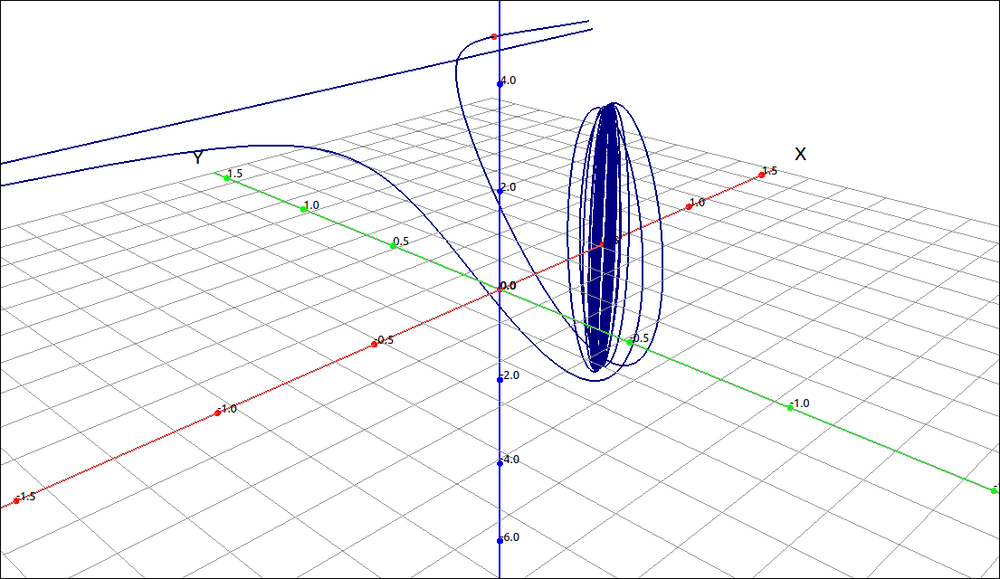
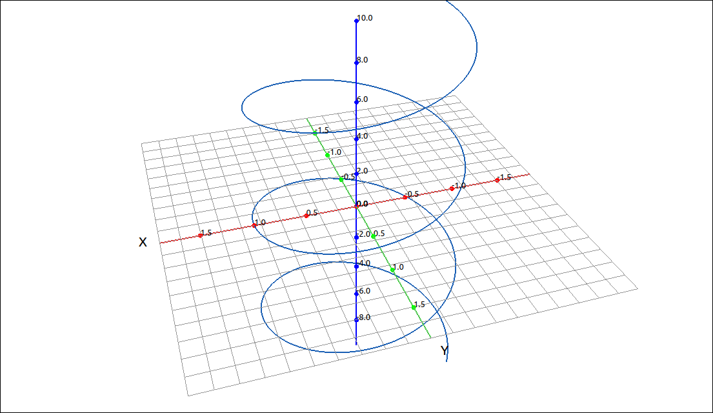
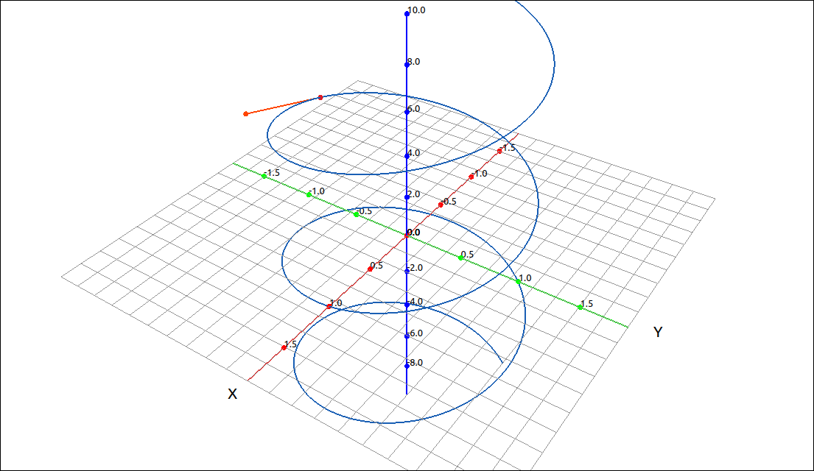

:index:`Calculus of Vector-Valued Functions`
============================================

In this section we extend the concepts of differentiation and integration to vector-valued functions.  These definitions essentially turn out to be componentwise differentiation and integration of the component functions that make up the vector-valued function.  This does add a few new properties to differentiation.

Limits
------

The definition of the limit is simply componentwise limits, as long as the limit of each component exists.

.. admonition:: Definition: Limit of a Vector-Valued Function

    The limit of a vector-valued function is simply the limits of the component functions, if they exist.  Specifically, if,

    .. math::
        \mathbf{r}(t) = (f(t), g(t))

    then

    .. math::
        \lim_{t \to a} \mathbf{r}(t) = \left( \lim_{t \to a} f(t), \lim_{t \to a} g(t) \right)

    provided that both :math:`\lim_{t \to a} f(t)` and :math:`\lim_{t \to a} g(t)` exist.

    Similarly, if,

    .. math::
        \mathbf{r}(t) = (f(t), g(t), h(t))

    then

    .. math::
        \lim_{t \to a} \mathbf{r}(t) = \left( \lim_{t \to a} f(t), \lim_{t \to a} g(t), \lim_{t \to a} h(t) \right)

    provided that all of :math:`\lim_{t \to a} f(t)`, :math:`\lim_{t \to a} g(t)`, and :math:`\lim_{t \to a} h(t)` exist.

    Note that the above is still true if the limits are one-sided or if *a* is :math:`\pm\infty.`

Example
^^^^^^^

CLAE
""""

In this example we will look at the space curve,

.. math::
    \left( \frac{t + 1}{2 t + 1}, \  \frac{\sin{\left(t \right)}}{t}, \  3 \cos{\left(t \right)}\right)

Input this into CLAE in either the CAS or using the vector input dialog.

.. code-block:: console

    [(t + 1)/(2*t + 1), sin(t)/t, 3*cos(t)]

Click and drag this over to the 3D graphics window.

    :math:`\left[ \frac{t + 1}{2 t + 1}, \  \frac{\sin{\left(t \right)}}{t}, \  3 \cos{\left(t \right)}\right]`

Note that we increased the range to :math:`[-100, 100]` as well as the number of points plotted.  Also note that the straight line that looks parallel to the *x*-axis is an asymptote from the first component of the vector-valued function.  We will now take the limit of this function as :math:`t \to 0.`  Select this function and then select ``Calculus > Limit``, set the limit point to 0 and keep the other settings as they are, the result is :math:`\left[ 1, \  1, \  3\right].`  This point is plotted in red in the above image.

Note that if we try to evaluate the function at 0 with ``Algebra > Evaluate`` we get :math:`\left[ 1, \  \text{NaN}, \  3\right].`  The first and third component exist at 0 but the second does not, hence the vector-valued function does not exist at :math:`t =0.`  So theoretically, there is a hole in the graph where the red point is.

Continuity
----------

.. admonition:: Definition: Continuity of a Vector-Valued Function

    The vector-valued function :math:`\mathbf{r}(t)` is continuous at :math:`t = a` if the following three conditions hold,

    1. :math:`\mathbf{r}(a)` exists.
    2. :math:`\displaystyle \lim_{t \to a} \mathbf{r}(t)` exists.
    3. :math:`\displaystyle \lim_{t \to a} \mathbf{r}(t) = \mathbf{r}(a)`.

    Note that we can also define one-sided continuity in a similar manner.

Example
^^^^^^^

CLAE
""""

We will revisit the example we did above,

.. math::
    \left( \frac{t + 1}{2 t + 1}, \  \frac{\sin{\left(t \right)}}{t}, \  3 \cos{\left(t \right)}\right)

Input this into CLAE in either the CAS or using the vector input dialog.

.. code-block:: console

    [(t + 1)/(2*t + 1), sin(t)/t, 3*cos(t)]

Click and drag this over to the 3D graphics window.

    :math:`\left[ \frac{t + 1}{2 t + 1}, \  \frac{\sin{\left(t \right)}}{t}, \  3 \cos{\left(t \right)}\right]`

As we saw above, if we try to evaluate the function at :math:`t =0` we get :math:`\left[ 1, \  \text{NaN}, \  3\right].`  So this function is not continuous at :math:`t =0` since the first criterion fails.  We get a similar result at :math:`t = -1/2`, :math:`\left[ \tilde{\infty}, \  2 \sin{\left(\frac{1}{2} \right)}, \  3 \cos{\left(\frac{1}{2} \right)}\right]`, again discontinuous.  If we try :math:`t =1` we get

1. :math:`\displaystyle \mathbf{r}(1) = \left[ \frac{2}{3}, \  \sin{\left(1 \right)}, \  3 \cos{\left(1 \right)}\right]`
2. :math:`\displaystyle \lim_{t \to 1} \mathbf{r}(t) = \left[ \frac{2}{3}, \  \sin{\left(1 \right)}, \  3 \cos{\left(1 \right)}\right]`
3. :math:`\displaystyle \lim_{t \to 1} \mathbf{r}(t) = \mathbf{r}(1)` is true from the above calculations.

So our function is continuous at :math:`t =1.`

Derivatives
-----------

.. admonition:: Definition: The Derivative of a Vector-Valued Function

    The derivative of a vector-valued function :math:`\mathbf{r}(t)` is

    .. math::
        \mathbf{r}'(t) = \lim_{h \to 0} \frac{\mathbf{r}(t+h) - \mathbf{r}(t)}{h}

    as long as this limit exists.

If we look at the above definition, noting that the algebra and limits are all componentwise operations we see that the derivative of a vector-valued function is simply the derivative of the component functions.

.. admonition:: Theorem: Differentiation of Vector-Valued Functions

    - If :math:`\mathbf{r}(t) = (f(t), g(t))` then :math:`\mathbf{r}'(t) = \left( f'(t), g'(t) \right)`.
    - If :math:`\mathbf{r}(t) = (f(t), g(t), h(t))` then :math:`\mathbf{r}'(t) = \left( f'(t), g'(t), h'(t) \right).`

Many of the rules for calculating derivatives of real-valued functions can be applied to calculating the derivatives of vector- valued functions as well. The derivative of a real-valued function can be interpreted as the slope of a tangent line or the instantaneous rate of change of the function. The derivative of a vector-valued function is also an instantaneous rate of change.  For example, if a function represents the position of an object at a given point in time, the derivative represents its velocity at that same point in time. Here the slope of a tangent line is replaced by the tangent vector, hence a magnitude and a direction.

Example
^^^^^^^

CLAE
""""

We will revisit the example we did above,

.. math::
    \left( \frac{t + 1}{2 t + 1}, \  \frac{\sin{\left(t \right)}}{t}, \  3 \cos{\left(t \right)}\right)

Input this into CLAE in either the CAS or using the vector input dialog.

.. code-block:: console

    [(t + 1)/(2*t + 1), sin(t)/t, 3*cos(t)]

Click and drag this over to the 3D graphics window.

    :math:`\left[ \frac{t + 1}{2 t + 1}, \  \frac{\sin{\left(t \right)}}{t}, \  3 \cos{\left(t \right)}\right]`

Select the function and then select ``Calculus > Derivative``, keep the default settings and click OK.  The result is

.. math::
    \left[ \frac{- 2 t - 2}{\left(2 t + 1\right)^{2}} + \frac{1}{2 t + 1}, \  \frac{\cos{\left(t \right)}}{t} - \frac{\sin{\left(t \right)}}{t^{2}}, \  - 3 \sin{\left(t \right)}\right]

Derivative Properties
---------------------

Several of the derivative properties are the same as for real-valued functions, due to the componentwise nature of the calculations. Note that we get what appears to be three product rules.

.. admonition:: Theorem: Derivative Properties of Vector-Valued Functions

    1. :math:`\displaystyle \frac{d}{dt} (c \mathbf{r}(t)) = c \mathbf{r}'(t)`
    2. :math:`\displaystyle \frac{d}{dt} (\mathbf{r}(t) \pm \mathbf{u}(t)) = \mathbf{r}'(t) \pm \mathbf{u}'(t)`
    3. :math:`\displaystyle \frac{d}{dt} (f(t) \mathbf{r}(t)) = f(t) \mathbf{r}'(t) + f'(t)\mathbf{r}'(t)`
    4. :math:`\displaystyle \frac{d}{dt} (\mathbf{r}(t) \cdot \mathbf{u}(t)) = \mathbf{r}'(t) \cdot \mathbf{u}(t) + \mathbf{r}(t) \cdot \mathbf{u}'(t)`
    5. :math:`\displaystyle \frac{d}{dt} (\mathbf{r}(t) \times \mathbf{u}(t)) = \mathbf{r}'(t) \times \mathbf{u}(t) + \mathbf{r}(t) \times \mathbf{u}'(t)`
    6. :math:`\displaystyle \frac{d}{dt} (\mathbf{r}(f(t))) = \mathbf{r}'(f(t)) f'(t)`

Tangent Vectors and Unit Tangent Vectors
----------------------------------------

The three-dimensional counterpart to the tangent line and its slope is the tangent vector.

.. admonition:: Definition: Tangent Vectors

    The vector :math:`\mathbf{r}'(a)` is a tangent vector of the vector-valued function :math:`\mathbf{r}(t)` at :math:`t =a`.  If :math:`\mathbf{r}'(a) \neq \mathbf{0}` then the vector,

    .. math::
        \mathbf{T}(a) = \frac{\mathbf{r}'(a)}{|\mathbf{r}'(a)|}

    is the unit tangent vector to :math:`\mathbf{r}(t)` at :math:`t =a`.  In general, if :math:`\mathbf{r}'(t) \neq \mathbf{0}` then the vector,

    .. math::
        \mathbf{T}(t) = \frac{\mathbf{r}'(t)}{|\mathbf{r}'(t)|}

    is the unit tangent vector to :math:`\mathbf{r}(t).`

Example: Visualizing the Tangent Vector
^^^^^^^^^^^^^^^^^^^^^^^^^^^^^^^^^^^^^^^

CLAE
""""

For this example we will look at the Helix.

.. math::
    \left[\begin{array}{c}\cos{\left(t \right)}\\\sin{\left(t \right)}\\t\end{array}\right]

For what we are doing here having vectors in (column vector) form is easier to work with.  In general, this form works best for most calculations in this software.  Select the vector input tool with either ``Edit > Input Vector`` or its corresponding toolbar button.  Then input the following into the dialog box and click OK.

.. code-block:: console

    [cos(t), sin(t), t]

We will assume this is ``R1``. Click and drag it over to the 3D graphics window.

    Helix

We will calculate and graph the unit tangent vector to the curve, in fact we will link it to a slider so it can be viewed dynamically.  We will now calculate,

.. math::
    \mathbf{T}(t) = \frac{\mathbf{r}'(t)}{|\mathbf{r}'(t)|}

Select the function and take its derivative with ``Calculus > Derivative``, leave the default settings, the result is,

.. math::
    \left[\begin{array}{c}- \sin{\left(t \right)}\\\cos{\left(t \right)}\\1\end{array}\right]

We will assume that this is ``R2``.  Now we will find its length, select it and then select ``Vector > Length``, the result is,

.. math::
    \sqrt{\sin^{2}{\left(t \right)} + \cos^{2}{\left(t \right)} + 1}

we will assume that this is ``R3``.  It can obviously be simplified, select ``Algebra > Simplify`` and the result is ``R4`` which should be :math:`\sqrt{2}`.  Now we finish the calculation buy inputting ``R2/R4`` into the CAS, getting ``R5`` of

.. math::
    \left[\begin{array}{c}- \frac{\sqrt{2} \sin{\left(t \right)}}{2}\\\frac{\sqrt{2} \cos{\left(t \right)}}{2}\\\frac{\sqrt{2}}{2}\end{array}\right]

Note that once we had the derivative vector we could have just normalized it with ``Vector > Normalize``.  In addition, CLAE has an option for finding the unit tangent vector to a vector-valued function under ``Calculus > Space Curves > Unit Tangent``.

Now we will add this to the graph.  Select the space curve ``R1``, then select ``Algebra > Evaluate``, keep the variable as *t* and input the expression ``a``.  The result is, ``R6``,

.. math::
    \left[\begin{array}{c}\cos{\left(a \right)}\\\sin{\left(a \right)}\\a\end{array}\right]

Click and drag this over to the 3D graphics window and it will come in as a point on the curve and put an *a* slider in the graphics manager.  If you move the slider you should see the point moving along the curve.  Now select the unit tangent vector ``R5`` and do the same thing, select ``Algebra > Evaluate``, keep the variable as *t* and input the expression ``a``.  The result is, ``R7``,

.. math::
    \left[\begin{array}{c}- \frac{\sqrt{2} \sin{\left(a \right)}}{2}\\\frac{\sqrt{2} \cos{\left(a \right)}}{2}\\\frac{\sqrt{2}}{2}\end{array}\right]

Click and drag this over to the 3D graphics window.  This will come in as a point, change its type to  vector set. This is now a vector that starts at the origin, we want to start it at the point on the curve, select the properties of this last vector, the initial point should look like ``[0, 0, 0]``, delete this and input ``R6``, and click OK.  The unit tangent vector now starts at the point on the curve. Change the *a* slider to view the unit tangent as the point moves along the curve.

    Helix with Unit Tangent Vector

Integrals
---------

.. admonition:: Definition: Integrals of Vector-Valued Functions

    - If :math:`\mathbf{r}(t) = (f(t), g(t))` then :math:`\displaystyle \int \mathbf{r}(t) \; dt = \left( \int f(t) \; dt, \int g(t) \; dt \right)`.
    - If :math:`\mathbf{r}(t) = (f(t), g(t), h(t))` then :math:`\displaystyle \int \mathbf{r}(t) \; dt = \left( \int f(t) \; dt, \int g(t) \; dt, \int h(t) \; dt \right)`.

    The same is true for definite integrals,

    - If :math:`\mathbf{r}(t) = (f(t), g(t))` then :math:`\displaystyle \int_a^b \mathbf{r}(t) \; dt = \left( \int_a^b f(t) \; dt, \int_a^b g(t) \; dt \right)`.
    - If :math:`\mathbf{r}(t) = (f(t), g(t), h(t))` then :math:`\displaystyle \int_a^b \mathbf{r}(t) \; dt = \left( \int_a^b f(t) \; dt, \int_a^b g(t) \; dt, \int_a^b h(t) \; dt \right)`.

Example: :math:`\int \left( \tan{\left(t \right)}, \  \sin^{2}{\left(t \right)}, \  t^{2}\right) \; dt`
^^^^^^^^^^^^^^^^^^^^^^^^^^^^^^^^^^^^^^^^^^^^^^^^^^^^^^^^^^^^^^^^^^^^^^^^^^^^^^^^^^^^^^^^^^^^^^^^^^^^^^^

CLAE
""""

Input the expression in either the CAS or with the vector input.

.. math::
    \left( \tan{\left(t \right)}, \  \sin^{2}{\left(t \right)}, \  t^{2}\right)

.. code-block:: console

    [tan(t), sin(t)^2, t^2]

We will start with an indefinite integral, select ``Calculus > Indefinite Integral``, the result is,

.. math::
    \left[ - \ln{\left(\cos{\left(t \right)} \right)}, \  \frac{t}{2} - \frac{\sin{\left(2 t \right)}}{4}, \  \frac{t^{3}}{3}\right]

Next we will calculate,

.. math::
    \int_0^{\pi/4} \left( \tan{\left(t \right)}, \  \sin^{2}{\left(t \right)}, \  t^{2}\right) \; dt

Select ``Calculus > Definite Integral``, input ``0`` for the lower bound and ``pi/4`` for the upper bound, the result is,

.. math::
    \left[ - \ln{\left(\frac{\sqrt{2}}{2} \right)}, \  - \frac{1}{4} + \frac{\pi}{8}, \  \frac{\pi^{3}}{192}\right]

