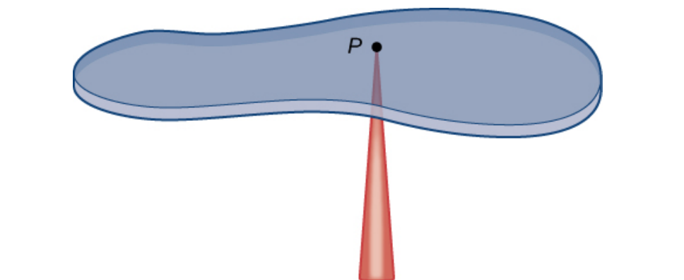
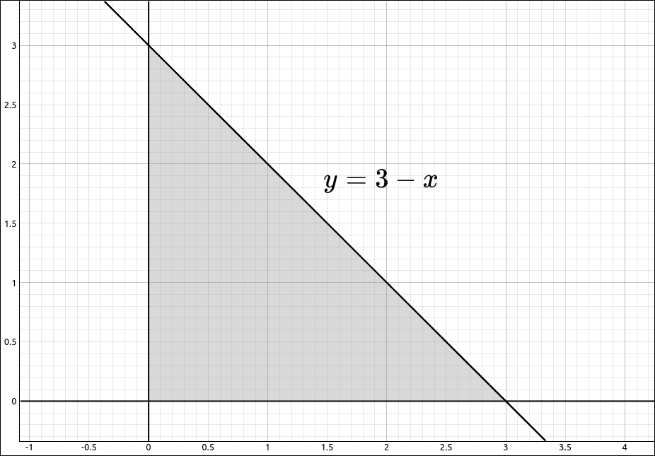

:index:`Centers of Mass and Moments of Inertia`
===============================================

Center of Mass in Two Dimensions
--------------------------------

Given a sheet of some material, such as metal or plastic, called a lamina, the center of mass of that sheet is the point *P* where the sheet balances, as in the picture below.

    Center of Mass

We usually place the lamina on the *xy*-plane to give the points coordinates.  When we do, the point *P* is given the coordinates :math:`(\bar{x}, \bar{y})` where,

.. math::
    \bar{x} = \frac{M_y}{m} \qquad  \bar{y} = \frac{M_x}{m}

In these equations, :math:`m` is the mass of the lamina, :math:`M_x` and :math:`M_y` are the moments of the lamina about the *x*-axis and *y*-axis respectively.  In their calculation we need a density function :math:`\rho(x, y)` for the lamina.  That is, :math:`\rho(x, y)` is the density of the lamina at the point :math:`(x, y).`

.. admonition:: Definition: Center of Mass in Two Dimensions

    If *R* is the region that represents a lamina in two dimensions and :math:`\rho(x, y)` is the density function for the lamina. Then,

    .. math::
        m & = \iint_R  \rho(x, y) \; dA \\
        M_x & = \iint_R  y \rho(x, y) \; dA \\
        M_y & = \iint_R  x \rho(x, y) \; dA \\
        \bar{x} & = \frac{M_y}{m} = \frac{\iint_R  x \rho(x, y) \; dA}{\iint_R  \rho(x, y) \; dA} \\
        \bar{y} & = \frac{M_x}{m} = \frac{\iint_R  y \rho(x, y) \; dA}{\iint_R  \rho(x, y) \; dA} \\

Note that if the object has uniform density, the center of mass is the geometric center of the object, which is called the centroid.

Example: Center of Mass
^^^^^^^^^^^^^^^^^^^^^^^

In this example we will find the center of mass of the triangle lamina with vertices :math:`(0, 0), (0, 3), (3, 0)` and density function, :math:`\rho(x, y) = xy.`

    Lamina

So our integrals are,

.. math::
    m & = \iint_R  xy \; dA = \int_0^3 \int_0^{3-x} xy \; dy \; dx \\
    M_x & = \iint_R  xy^2 \; dA  = \int_0^3 \int_0^{3-x} xy^2 \; dy \; dx \\
    M_y & = \iint_R  x^2y \; dA  = \int_0^3 \int_0^{3-x} x^2y \; dy \; dx \\

CLAE
""""

These integrals are easy to do by hand but we will do them using the double integral option,

.. math::
    m & = \iint_R  xy \; dA = \int_0^3 \int_0^{3-x} xy \; dy \; dx = \frac{27}{8} \\
    M_x & = \iint_R  xy^2 \; dA  = \int_0^3 \int_0^{3-x} xy^2 \; dy \; dx = \frac{81}{20} \\
    M_y & = \iint_R  x^2y \; dA  = \int_0^3 \int_0^{3-x} x^2y \; dy \; dx  = \frac{81}{20} \\

So,

.. math::
    \bar{x} & = \frac{M_y}{m} = \frac{6}{5} \\
    \bar{y} & = \frac{M_x}{m} = \frac{6}{5} \\

Moments of Inertia
------------------

For moments of inertia we define the moment of inertia about the *x*-axis, :math:`I_x`,  the moment of inertia about the *y*-axis, :math:`I_y`, and the moment of inertia about the origin, :math:`I_0.`

.. admonition:: Definition: Moments of Inertia

    If *R* is the region that represents a lamina in two dimensions and :math:`\rho(x, y)` is the density function for the lamina. Then,

    .. math::
        I_x & = \iint_R  y^2 \rho(x, y) \; dA \\
        I_y & = \iint_R  x^2 \rho(x, y) \; dA \\
        I_0 & = I_x + I_y = \iint_R  (x^2 + y^2) \rho(x, y) \; dA \\

Example: Moments of Inertia
^^^^^^^^^^^^^^^^^^^^^^^^^^^

In this example we will find the three moments of inertia of the triangle lamina with vertices :math:`(0, 0), (0, 3), (3, 0)` and density function, :math:`\rho(x, y) = xy.`

    Lamina

So our integrals are,

.. math::
    I_x & = \iint_R  y^2 \rho(x, y) \; dA = \int_0^3 \int_0^{3-x} xy^3 \; dy \; dx \\
    I_y & = \iint_R  x^2 \rho(x, y) \; dA  = \int_0^3 \int_0^{3-x} x^3y \; dy \; dx  \\

CLAE
""""

These integrals are easy to do by hand but we will do them using the double integral option,

.. math::
    I_x & = \iint_R  y^2 \rho(x, y) \; dA = \int_0^3 \int_0^{3-x} xy^3 \; dy \; dx = \frac{243}{40} \\
    I_y & = \iint_R  x^2 \rho(x, y) \; dA  = \int_0^3 \int_0^{3-x} x^3y \; dy \; dx = \frac{243}{40} \\
    I_0 & = I_x + I_y = \frac{243}{20}

Center of Mass and Moments of Inertia in Three Dimensions
---------------------------------------------------------

These concepts can easily be extended to three dimensions.  The moments and moments of inertia are now with respect to coordinate planes.  The center of mass is :math:`(\bar{x}, \bar{y}, \bar{z}).`

.. admonition:: Definition: Center of Mass and Moments of Inertia in Three Dimensions

    If *R* is the region in three dimensions and :math:`\rho(x, y, z)` is the density function for the region. Then,

    .. math::
        m & = \iiint_R  \rho(x, y, z) \; dV \\
        M_{xy} & = \iiint_R  z \rho(x, y, z) \; dV \\
        M_{xz} & = \iiint_R  y \rho(x, y, z) \; dV \\
        M_{yz} & = \iiint_R  x \rho(x, y, z) \; dV \\
        \bar{x} & = \frac{M_{yz}}{m} = \frac{\iiint_R  x \rho(x, y, z) \; dV}{\iiint_R  \rho(x, y, z) \; dV} \\
        \bar{y} & = \frac{M_{xz}}{m} = \frac{\iiint_R  y \rho(x, y, z) \; dV}{\iiint_R  \rho(x, y, z) \; dV} \\
        \bar{z} & = \frac{M_{xy}}{m} = \frac{\iiint_R  z \rho(x, y, z) \; dV}{\iiint_R  \rho(x, y, z) \; dV} \\
        I_x & = \iiint_R  (y^2 + z^2) \rho(x, y, z) \; dV \\
        I_y & = \iiint_R  (x^2 + z^2) \rho(x, y, z) \; dV \\
        I_z & = \iiint_R  (x^2 + y^2) \rho(x, y, z) \; dV \\
