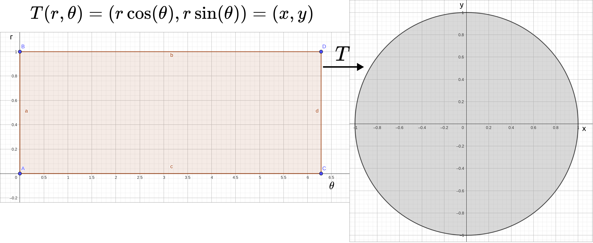
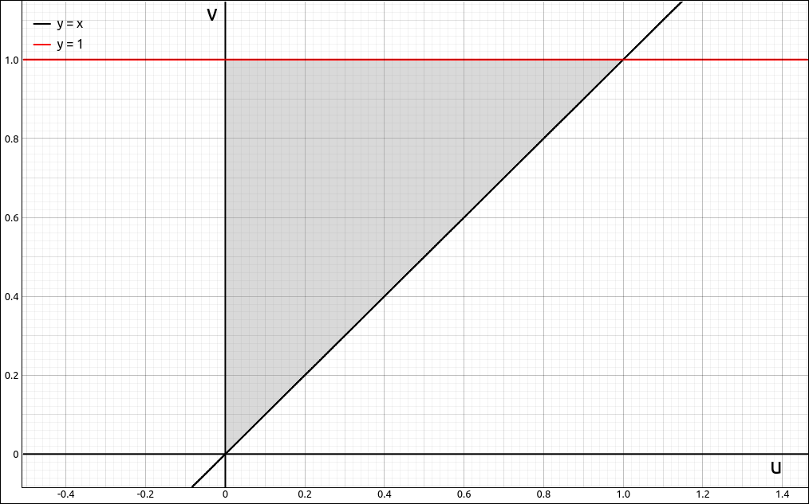
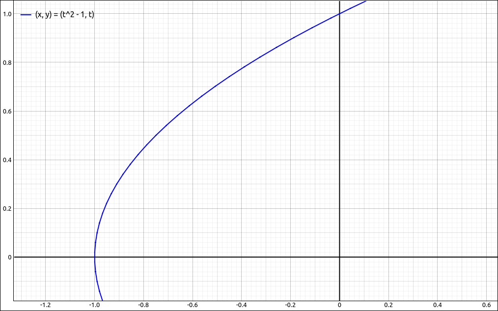
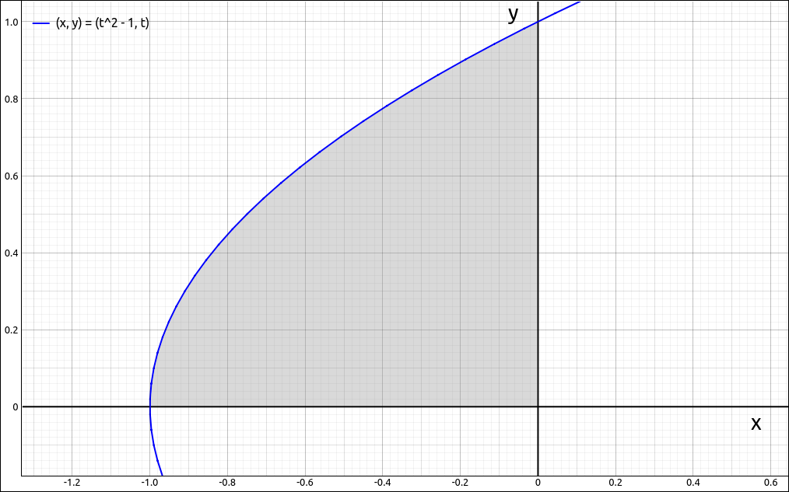

:index:`Change of Variables in Multiple Integrals`
==================================================

When we converted a double integral to polar coordinates or a triple integral to cylindrical or spherical coordinates we found that :math:`dA` or :math:`dV` was altered since we were no longer integrating over a rectangle :math:`dx \; dy` or rectangular solid :math:`dx \; dy \; dz.` Although we have solutions to this for polar, cylindrical, and spherical coordinate systems, how can we make this change of coordinates in general?

Transformations
---------------

When we converted double integrals to polar coordinates we used the formulas,

.. math::
    x = r \cos(\theta) \qquad y = r \sin(\theta)

to make change our *x* and *y* coordinates to *r* and :math:`\theta` coordinates.  These equations set up a transformation *T* that changed the *r*:math:`\theta` coordinates into *xy* coordinates.

.. math::
    T(r, \theta) = (r \cos(\theta), r \sin(\theta)) = (x, y)

So if we started with a rectangle in *r*:math:`\theta` coordinates :math:`S = \{ (r, \theta) \; | \; 0 \leq r \leq 2\pi, 0 \leq \theta \leq 2\pi \}`, this transformation sent those values to :math:`(r \cos(\theta), r \sin(\theta)) = (x, y)` which mapped out the unit circle :math:`R = \{ x^2 + y^2 \leq 1 \}`.

.. math::
    \iint_R f(x, y) \; dA = \iint_S f(r \cos(\theta), r \sin(\theta)) \; r \; dr \; d\theta

    The Transformation *T*

You probably noticed that ths is a bit backwards from how we use it for the double integral.  When we covert the double from rectangular coordinates to polar coordinates we are converting :math:`(x, y)` to :math:`(r, \theta)` and not the other way around, the direction of *T*.

Now we will generalize the above concept.

.. admonition:: Definition: Planar Transformation

    A planar transformation *T* is a function that transforms a region *S* in one plane (the *uv*-plane) into a region *R* in another plane (the *xy*-plane) by a change of variables. Both *S* and *R* are subsets of :math:`\mathbb{R}^2`.

    .. math::
        T(u, v) = (g(u, v), h(u, v)) = (x, y)

    That is,

    .. math::
        x & = g(u, v) = x(u, v) \\
        y & = h(u, v) = y(u, v) \\

.. admonition:: Definition: One-To-One Transformation

    A planar transformation :math:`T : S \to R` defined as :math:`T(u, v) = (x, y)` is said to be be a one-to-one transformation if no two points map to the same image point.

If a planar transformation is one-to-one then there is an inverse transformation, :math:`T^{-1} : R \to S.`

Example: Planar Transformation
^^^^^^^^^^^^^^^^^^^^^^^^^^^^^^

CLAE
""""

Consider the transformation :math:`T(u, v) = (u^2-v^2, uv) = (x, y)`, and the region *S* in the *uv*-plane that is bounded by the triangle with vertices :math:`(0, 0), (0, 1), (1, 1).` The region is pictured below.

    The Region *S* in the *uv*-Plane

We will find the region *R* that *T* maps *S* to.  First we will consider the boundary line at :math:`v = 1`.  If we substitute :math:`v = 1` into the transformation we get,

.. math::
    T(u, 1) = (u^2-1, u) = (x, y)

To view this, input

.. code-block:: console

    [t^2-1, t]

Click and drag this to the 2D graphics window and we see,

    First Transformed Line

Next we transform the boundary line of the *v*-axis, :math:`u = 0.`  If we substitute :math:`u = 0` into the transformation we get,

.. math::
    T(0, v) = (-v^2, 0) = (x, y)

This is simply the negative *x*-axis.

Next we transform the boundary line of :math:`u = v.`  If we substitute :math:`u = v` into the transformation we get,

.. math::
    T(v, v) = (0, v^2) = (x, y)

This is simply the positive *y*-axis. So the region *R* is,

    Transformed Region

Change of Variables for Double Integrals
----------------------------------------

Now lets move on to how we would use these transformations to convert double integrals.  We will be skipping many of the details here ans just summarize the results, your textbook should provide the details here.  For our transformations :math:`T(u, v) = (g(u, v), h(u, v)) = (x, y)` we will be assuming that the *u* and *v* partial derivatives of both *g* and *h* exist and are continuous, (this is called a :math:`C^1` transformation).

.. admonition:: Definition: Jacobian

    The Jacobian of the transformation :math:`T(u, v) = (g(u, v), h(u, v)) = (x, y)` is

    .. math::
        \frac{\partial(x, y)}{\partial(u, v)} = \left| \begin{array}{cc}  \frac{\partial x}{\partial u} & \frac{\partial x}{\partial v} \\ \frac{\partial y}{\partial u} & \frac{\partial y}{\partial v} \end{array} \right| = \frac{\partial x}{\partial u}  \frac{\partial y}{\partial v}  - \frac{\partial x}{\partial v} \frac{\partial y}{\partial u}

Again, we are skipping over the details here but it turns out that if we apply a transformation *T* to a double integral then,

.. math::
    dA = \left| \frac{\partial(x, y)}{\partial(u, v)} \right| \; du \; dv

Note that this is the absolute value of the Jacobian.

.. admonition:: Theorem:  Change of Variables in a Double Integral

    Suppose that *T* is a one-to-one :math:`C^1` transformation with nonzero Jacobian, then,

    .. math::
        \iint_R f(x, y) \; dA = \iint_S f(x(u, v), y(u, v)) \; \left| \frac{\partial(x, y)}{\partial(u, v)} \right| \; du \; dv

One thing to note is that although the above theorem states that *T* is one-to-one, we do not need this on the boundary of *S*.

Example: Jacobian for Polar Coordinates
^^^^^^^^^^^^^^^^^^^^^^^^^^^^^^^^^^^^^^^

CLAE
""""

Input the transformation for Polar Coordinates,

.. code-block:: console

    [r*cos(t), r*sin(t)]

Select ``Calculus > Multiple Integrals > Jacobian``, the variable list should be ``[r, t]`` which can be left as is.  The result is,

.. math::
    r \sin^{2}{\left(t \right)} + r \cos^{2}{\left(t \right)}

and if we simplify this we get the expected :math:`r.`

Example: Jacobian for :math:`T(u, v) = (u^2-v^2, uv) = (x, y)`
^^^^^^^^^^^^^^^^^^^^^^^^^^^^^^^^^^^^^^^^^^^^^^^^^^^^^^^^^^^^^^

CLAE
""""

Input the transformation,

.. code-block:: console

    [u^2-v^2, u*v]

Select ``Calculus > Multiple Integrals > Jacobian``, the variable list should be ``[u, v]`` which can be left as is.  The result is,

.. math::
    2 u^{2} + 2 v^{2}

.. note::

    The order of the variables in finding the Jacobian makes a difference (at least a little).  If the order of the variables in finding the Jacobian is interchanged then the result is negative the result of the un-interchanged variables.  This is simply a property of determinants, if two rows or columns are interchanged then the determinant gets a factor of :math:`-1.`

Example: Change of Variables for Double Integrals
^^^^^^^^^^^^^^^^^^^^^^^^^^^^^^^^^^^^^^^^^^^^^^^^^

CLAE
""""

In this example we will find the integral,

.. math::
    \iint_R x^2+y^2 \; dA

where *R* is the region,

    Region *R*

This region is both a Type I and Type II region.  We do not need to do a change of variable here but we will for the exercise.  We can evaluate this integral by,

.. math::
    \int_{-1}^{0} \int_{0}^{\sqrt{x+1}} x^2+y^2 \; dy \; dx

Input the function,

.. code-block:: console

    x^2+y^2

Select ``Calculus > Multiple Integrals > Double Integral``, first variable is *y* with bounds ``0`` and ``sqrt(x+1)``, the second variable is *x* with bounds ``-1`` and ``0``.  The result is :math:`2/7.`

We will now do the same integral using the transformation :math:`T(u, v) = (u^2-v^2, uv) = (x, y)` which transforms the region *R* to the following region *S*.

    Region *S*

Input the transformation,

.. code-block:: console

    [u^2-v^2, u*v]

Select ``Calculus > Multiple Integrals > Jacobian``, the variable list should be ``[u, v]`` which can be left as is.  The result is,

.. math::
    2 u^{2} + 2 v^{2}

Select the function, then select ``Algebra > Evaluate``, the variables should be ``[x, y]`` which should not be edited.  For the expressions either input ``[u^2-v^2, u*v]`` or input the designation for this expression.  The result should be,

.. math::
    u^{2} v^{2} + \left(u^{2} - v^{2}\right)^{2}

Now multiply this by the Jacobian, the result should be,

.. math::
    \left(2 u^{2} + 2 v^{2}\right) \left(u^{2} v^{2} + \left(u^{2} - v^{2}\right)^{2}\right)

Note that the Jacobian of this transformation is obviously positive so we do not need to take its absolute value.  In general, we would input ``R3*abs(R4)`` if ``R3`` was our integrand and ``R4`` was our Jacobian.

So,

.. math::
    \iint_R f(x, y) \; dA & = \iint_S f(x(u, v), y(u, v)) \; \left| \frac{\partial(x, y)}{\partial(u, v)} \right| \; du \; dv \\
    & = \iint_S \left(2 u^{2} + 2 v^{2}\right) \left(u^{2} v^{2} + \left(u^{2} - v^{2}\right)^{2}\right) \; du \; dv \\

At this point we need to be a little careful on how we construct the iterated integral out of this double integral. Note that in the transformation of the regions the line :math:`v = 1` transforms to the parabola and the line :math:`v = u` transforms to the *y*-axis.  If we did the original integral as a Type II region we would take the *y*-axis as the upper bound and the parabola as the lower bound.  This is the opposite of evaluating the region *S* as a Type I region.  To compensate, we will interchange the *v* bounds to match the order of the original region.  Hence,

.. math::
    \iint_R f(x, y) \; dA & = \iint_S f(x(u, v), y(u, v)) \; \left| \frac{\partial(x, y)}{\partial(u, v)} \right| \; du \; dv \\
    & = \iint_S \left(2 u^{2} + 2 v^{2}\right) \left(u^{2} v^{2} + \left(u^{2} - v^{2}\right)^{2}\right) \; du \; dv \\
    & = \int_{0}^{1} \int_{u}^{1} \left(2 u^{2} + 2 v^{2}\right) \left(u^{2} v^{2} + \left(u^{2} - v^{2}\right)^{2}\right) \; dv \; du = 2/7 \\

To do the integral, select the integrand expression, then select ``Calculus > Multiple Integrals > Double Integral``, first variable is *v* with bounds ``u`` and ``1``, the second variable is *u* with bounds ``0`` and ``1``.  The result is :math:`2/7.`

Change of Variables for Triple Integrals
----------------------------------------

Changing the variables for triple integrals is the same as for double integrals.

.. admonition:: Definition: Jacobian

    The Jacobian of the transformation :math:`T(u, v, w) = (g(u, v), h(u, v), k(u, v)) = (x, y, z)` is

    .. math::
        \frac{\partial(x, y, z)}{\partial(u, v, w)} = \left| \begin{array}{ccc}  \frac{\partial x}{\partial u} & \frac{\partial x}{\partial v} & \frac{\partial x}{\partial w} \\ \frac{\partial y}{\partial u} & \frac{\partial y}{\partial v} & \frac{\partial y}{\partial w} \\  \frac{\partial z}{\partial u} & \frac{\partial z}{\partial v} & \frac{\partial z}{\partial w} \end{array} \right|

.. admonition:: Theorem:  Change of Variables in a Triple Integral

    Suppose that *T* is a one-to-one :math:`C^1` transformation with nonzero Jacobian, then,

    .. math::
        \iiint_R f(x, y, z) \; dA = \iiint_S f(x(u, v, w), y(u, v, w), z(u, v, w)) \; \left| \frac{\partial(x, y, z)}{\partial(u, v, w)} \right| \; du \; dv \; dw

Example: Spherical Coordinates
^^^^^^^^^^^^^^^^^^^^^^^^^^^^^^

CLAE
""""

Input the transformation for spherical coordinates,

.. code-block:: console

    [r*sin(p)*cos(t),r*sin(p)*sin(t),r*cos(p)]

Select this then select ``Calculus > Multiple Integrals > Jacobian``, the variable list should be ``[p, r, t]`` which is not the standard order we would normally use.  Change this to ``[r, t, p]``.  The result is,

.. math::
    - r^{2} \sin^{3}{\left(p \right)} \sin^{2}{\left(t \right)} - r^{2} \sin^{3}{\left(p \right)} \cos^{2}{\left(t \right)} - r^{2} \sin{\left(p \right)} \sin^{2}{\left(t \right)} \cos^{2}{\left(p \right)} - r^{2} \sin{\left(p \right)} \cos^{2}{\left(p \right)} \cos^{2}{\left(t \right)}

which simplifies to

.. math::

    - r^{2} \sin{\left(p \right)}

Since :math:`0 \leq \varphi \leq \pi` we have :math:`\sin{\left(\varphi \right)} \geq 0.`  Thus

.. math::
    \left| \frac{\partial(x, y, z)}{\partial(u, v, w)} \right| = r^{2} \sin{\left(p \right)} = \rho^{2} \sin{\left(\varphi \right)}

as we saw in the conversion to spherical coordinate section.

.. note::

    As with double integral conversions, altering the order of the variables interchanges columns of the Jacobian matrix and hence could introduce a :math:`-1` factor into the result.  Since in the conversion of the triple integral we are taking the absolute value of the Jacobian the final result is the same.

.. note::

    You can also get the Jacobian for a transformation by selecting  ``Calculus > Multiple Integrals > Jacobian Matrix``.  For the spherical coordinate example the Jacobian matrix is,

    .. math::
        \left[\begin{array}{ccc}\sin{\left(p \right)} \cos{\left(t \right)} & - r \sin{\left(p \right)} \sin{\left(t \right)} & r \cos{\left(p \right)} \cos{\left(t \right)}\\\sin{\left(p \right)} \sin{\left(t \right)} & r \sin{\left(p \right)} \cos{\left(t \right)} & r \sin{\left(t \right)} \cos{\left(p \right)}\\\cos{\left(p \right)} & 0 & - r \sin{\left(p \right)}\end{array}\right]

    You can then take its determinant with ``Matrix > Determinant`` and you will get the same result as with the Jacobian option.
