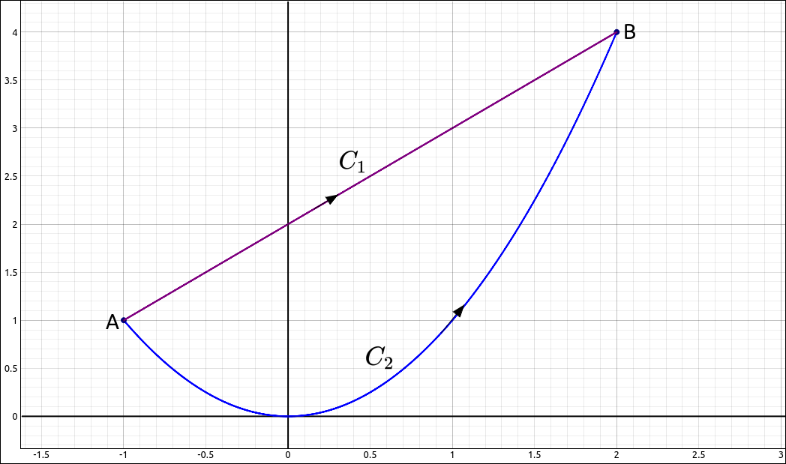

:index:`Conservative Vector Fields`
===================================

Curves and Regions
------------------

To understand the definitions and conditions of the theorems in ths section we need to define some terms concerning curves and regions.

.. admonition:: Definition: Simple and Closed Curves

    A closed curve :math:`C = \mathbf{r}(t)` for :math:`a \leq t \leq b` is where the parameterization traverses the curve only one time and :math:`\mathbf{r}(a) = \mathbf{r}(b)`, in other words, the endpoints match.  A simple curve is one that does not cross itself.

    .. figure:: Images/VecCalc/ConsVecFields001.png
        :alt: Simple and Closed Curves

        Simple and Closed Curves

.. admonition:: Definition: Connected and Simply Connected Regions

    A region *D* is a connected region if, for any two points :math:`P_1` and :math:`P_2`, there is a path from :math:`P_1` to :math:`P_2`  contained entirely inside *D*. A region *D* is a simply connected region if *D* is connected and for any simple closed curve *C* that lies inside *D*, and curve *C* can be shrunk continuously to a point while staying entirely inside *D*. In two dimensions, a region is simply connected if it is connected and has no holes.

    .. figure:: Images/VecCalc/ConsVecFields002.png
        :alt: Connected and Simply Connected Regions

        Connected and Simply Connected Regions

:index:`The Fundamental Theorem for Line Integrals`
---------------------------------------------------

.. admonition:: Theorem: The Fundamental Theorem for Line Integrals

    Let :math:`C = \mathbf{r}(t)` for :math:`a \leq t \leq b` be a piecewise smooth curve, and let :math:`f` be a function in two or three dimension with continuous first partial derivatives on *C*.  Then,

    .. math::
        \int_C \nabla f \cdot d\mathbf{r} = f(\mathbf{r}(b)) - f(\mathbf{r}(a))

Another way to say this is,

.. admonition:: Theorem: The Fundamental Theorem for Line Integrals

    Let :math:`C = \mathbf{r}(t)` for :math:`a \leq t \leq b` be a piecewise smooth curve, and let :math:`\mathbf{F}` be a conservative vector field with potential function :math:`f`, then,

    .. math::
        \int_C \mathbf{F} \cdot d\mathbf{r} = \int_C \nabla f \cdot d\mathbf{r} = f(\mathbf{r}(b)) - f(\mathbf{r}(a))

One direct consequence of the Fundamental Theorem for Line Integrals is that if we have a conservative vector field then the integral of any closed curve is 0.

.. admonition:: Theorem: Integrals of Closed Curves

    Let :math:`C` be a piecewise smooth closed curve, and let :math:`\mathbf{F}` be a conservative vector field, then,

    .. math::
        \int_C \mathbf{F} \cdot d\mathbf{r} = 0

Let's take this a little further. Say we have two smooth curves between the same two points, that is, same initial point and the same ending point, as in the image below.

    Two Paths between the Same Points

We know from the Fundamental Theorem for Line Integrals that if we integrated a conservative vector field along either of these we would get the same result, :math:`f(B) - f(A).`  So with a conservative vector field it does not matter what path we take between two points we will get the same value.  This is called path independence.

.. admonition:: Definition: Path Independence

    If :math:`\mathbf{F}` is a vector field with domain *D* then :math:`\mathbf{F}` is independent of path (or path independent) if

    .. math::
        \int_{C_1} \mathbf{F} \cdot d\mathbf{r} = \int_{C_2} \mathbf{F} \cdot d\mathbf{r}

    for any paths :math:`C_1` and :math:`C_2` in *D* with the same initial and terminal points.

Our discussion above gives us the following theorem,

.. admonition:: Theorem: Path Independence of Conservative Fields

    If :math:`\mathbf{F}` is a conservative vector field, then :math:`\mathbf{F}` is path independent.

There is a converse to this theorem if the domain of the vector field is "nice".

.. admonition:: Theorem:  The Path Independence Test for Conservative Fields

    If :math:`\mathbf{F}` is a continuous vector field that is independent of path and the domain *D* of :math:`\mathbf{F}` is open and connected, then :math:`\mathbf{F}` is conservative.

Finding a Potential Function
----------------------------

Conservative vector fields are very important in applications and even if we know that we have a conservative vector field we need its potential function to use the The Fundamental Theorem for Line Integrals.  So given a conservative vector field how do we find its potential function?

The basic method is to set the gradiant of an unknown function :math:`f` equal to the vector field and then using integration and partial differentiation build the function.  If we get stuck along the way then it is possible that there is not a potential function to the field and hence the field is not conservative.  We will go through an example to see how this process works.

Consider the vector field

.. math::
    \mathbf{F}(x, y, z) = \left( 2 x y, \  x^{2} + 2 y z^{3}, \  3 y^{2} z^{2} + 2 z\right)

If this is conservative, then there is a potential function :math:`f` then we have

.. math::
    \nabla f = (f_x, f_y, f_z) = \left( 2 x y, \  x^{2} + 2 y z^{3}, \  3 y^{2} z^{2} + 2 z\right)

so we get three equations,

.. math::
    f_x &= 2 x y \\
    f_y &=  x^{2} + 2 y z^{3} \\
    f_z &= 3 y^{2} z^{2} + 2 z \\

If we start with the first equation and integrate both sides with respect to *x* we get,

.. math::
    f(x, y, z) =  x^2 y + g(y, z)

Note that we usually get a constant of integration but here any function in just *y* and *z* will derive (with respect to *x*) to 0, hence our constant is some function of *y* and *z*. If we now take the partial of this with respect to *y* we get,

.. math::
    f_y(x, y, z) =  x^2 + g_y(y, z)

but from the gradiant we know that :math:`f_y =  x^{2} + 2 y z^{3}.` So

.. math::
    f_y(x, y, z) =  x^2 + g_y(y, z) = x^{2} + 2 y z^{3}

and hence

.. math::
    g_y(y, z) = 2 y z^{3}

Now we continue the same process with *g*.  Integrating both sides with respect to *y* gives us,

.. math::
    g(y, z) = y^2 z^{3} + h(z)

Again, a constant here would be any function of *z*.  Thus,

.. math::
    f(x, y, z) =  x^2 y + y^2 z^{3} + h(z)

Taking this derivative with respect to *z* gives us,

.. math::
    f_z(x, y, z) =  3y^2 z^{2} + h'(z) = 3 y^{2} z^{2} + 2 z

so

.. math::
    h'(z) = 2 z

and thus,

.. math::
    h(z) = z^2 + C

Therefore, the family of potential functions is,

.. math::
    f(x, y, z) =  x^2 y + y^2 z^{3} + z^2 + C

If we were calculating a line integral through this vector field then we could use any member of this family to do the computation.  For example, :math:`f(x, y, z) =  x^2 y + y^2 z^{3} + z^2.`

We could have used CLAE or Maxima to help with the integration or partial differentiation but the example above was chosen to be able to be done easily by hand.  If the computations were more difficult we could have resorted to the CAS software.

Example: :math:`\mathbf{F}(x, y, z) = \left( 2 x y, \  x^{2} + 2 y z^{3}, \  3 y^{2} z^{2} + 2 z\right)`
^^^^^^^^^^^^^^^^^^^^^^^^^^^^^^^^^^^^^^^^^^^^^^^^^^^^^^^^^^^^^^^^^^^^^^^^^^^^^^^^^^^^^^^^^^^^^^^^^^^^^^^^

Let

.. math::
    \mathbf{F}(x, y, z) = \left( 2 x y, \  x^{2} + 2 y z^{3}, \  3 y^{2} z^{2} + 2 z\right)

find

.. math::
    \int_{C} \mathbf{F} \cdot d\mathbf{r}

where *C* is any curve from :math:`(1, 2, 3)` to :math:`(5, -4, 13).`

CLAE
""""

Normally we would need to find the potential function of this field which would follow the process above, with or without the CAS.  Since we already have the potential function we will use the CAS to do the substitutions and final difference. Input,

.. code-block:: console

    x^2*y + y^2*z^3 + z^2

Also input the two points,

.. code-block:: console

    [1, 2, 3]

.. code-block:: console

    [5, -4, 13]

Select the function then select ``Algebra > Evaluate``, use the point ``[5, -4, 13]`` for the expressions, or the point's CAS designation ``R3``, the result is 35221.  Now do the same with ``[1, 2, 3]`` anf the result is, 119.  Finally take the difference, 35102.

Testing a Vector Field
----------------------

A couple sections ago we saw the The Cross-Partial Property of Conservative Vector Fields which gave us a way to determine if a vector field was not conservative. One might ask the same question here as we did with independence of path.  Is there a converse to this theorem that allows us to determine if a vector field is conservative?  The answer is similar to the independence of path case.

.. admonition:: Theorem:  The Cross-Partial Test for Conservative Fields in Two Variables

    If :math:`\mathbf{F} = (P, Q)` is a vector field on an open, simply connected region *D*, and if :math:`P_y = Q_x`, then  :math:`\mathbf{F}` is conservative.

.. admonition:: Theorem:  The Cross-Partial Test for Conservative Fields in Three Variables

    If :math:`\mathbf{F} = (P, Q, R)` is a vector field on an open, simply connected region *D*, and if :math:`P_y = Q_x`, :math:`P_z = R_x`, and :math:`Q_z = R_y`, then  :math:`\mathbf{F}` is conservative.

Example: :math:`\mathbf{F}(x, y, z) = \left( 2 x y, \  x^{2} + 2 y z^{3}, \  3 y^{2} z^{2} + 2 z\right)`
^^^^^^^^^^^^^^^^^^^^^^^^^^^^^^^^^^^^^^^^^^^^^^^^^^^^^^^^^^^^^^^^^^^^^^^^^^^^^^^^^^^^^^^^^^^^^^^^^^^^^^^^

We have already proven that the vector field,

.. math::
    \mathbf{F}(x, y, z) = \left( 2 x y, \  x^{2} + 2 y z^{3}, \  3 y^{2} z^{2} + 2 z\right)

is conservative by finding a potential function for the field.  Here we will use the Cross-Partial Test for Conservative Fields test to verify the same conclusion.

CLAE
""""

Input the three coordinate functions,

.. code-block:: console

    2*x*y

.. code-block:: console

    x^2 + 2*y*z^3

.. code-block:: console

    3*y^2*z^2 + 2*z

Use the derivative option in the Calculus menu to take the partial derivatives, we find that,

.. math::
    P_y & = Q_x = 2x \\
    P_z & = R_x = 0 \\
    Q_z & = R_y = 6yz^2

Hence the vector field is conservative.
