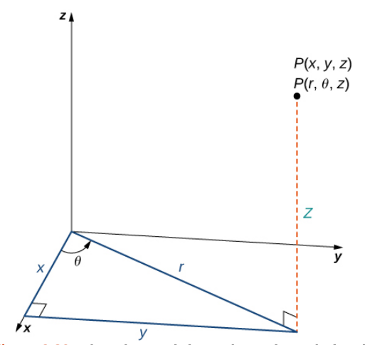
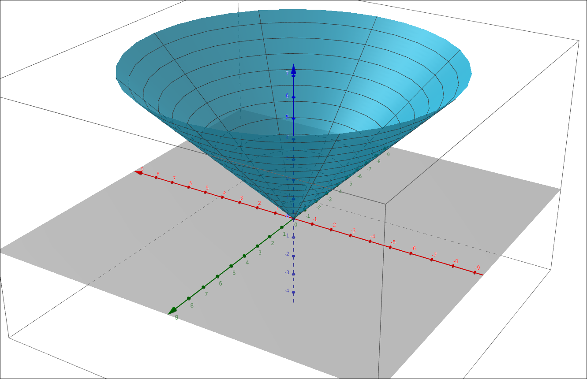
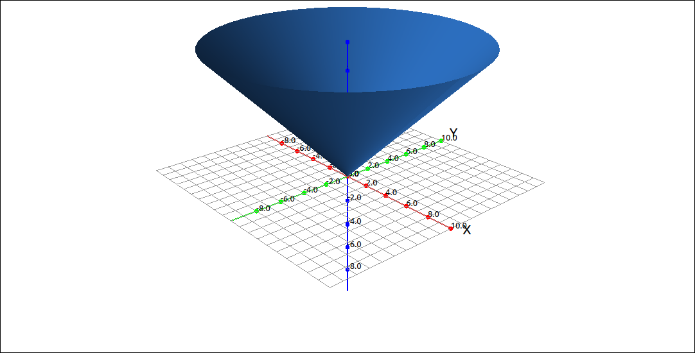

:index:`Cylindrical Coordinates`
================================

Discussion & Definitions
------------------------

Cylindrical and spherical coordinates are simply another way to represent points in three dimensions, similar to the way we used polar coordinates to represent points in two dimensions.  These coordinate systems have many applications in mathematics and physics as well as other areas, such as. computer graphics.  In these tutorials, the main use will be to convert multiple integrals from a difficult computation to a much easier computation that gives the same result.

Cylindrical coordinates are when we write one of the three coordinate planes in polar coordinates (usually the *xy*-plane) and we let the third coordinate stay linear.  We will discuss the case where the *xy*-plane is converted to polar coordinates and the *z*-axis stays linear, the other two cases are similar.

.. admonition:: Definition: Cylindrical Coordinates

    In the cylindrical coordinate system, a point *P* in space is represented by the ordered triple :math:`(r, \theta, z)`, where

    - :math:`(r, \theta)` are the polar coordinates of the point's projection in the *xy*-plane.
    - *z* is the usual *z*-coordinate in the Cartesian coordinate system

    Cylindrical Coordinates

Conversion between Cartesian coordinates and cylindrical coordinates is fairly straightforward since it is just converting Cartesian coordinates to polar coordinates for two variables and leaving the third variable alone.

.. admonition:: Theorem: Conversion between Cylindrical and Cartesian Coordinates

    Given a point *P* whose rectangular coordinates are :math:`(x, y, z)` and cylindrical coordinates are :math:`(r, \theta, z)` then the conversion between the two is as follows.

    .. math::
        x & = r \cos(\theta) \\
        y & = r \sin(\theta) \\
        z & = z

    and

    .. math::
        r^2 & = x^2 + y^2 \\
        \tan(\theta) & = \frac{y}{x} \\
        z & = z

Example: The Surface :math:`z = r`
----------------------------------

If we graph the surface :math:`z = r` in cylindrical coordinates we get a cone.  Thinking about fixing :math:`\theta` and looking at :math:`z = r` we would get a line at 45 degrees in the upper half space.  Then letting :math:`0 \leq \theta \leq 2\pi` we would trace out a cone.

GeoGebra
^^^^^^^^

You can plot cylindrical coordinate expressions in GeoGebra, you first convert the expression to parametric equations in Cartesian coordinates and then use the ``Surface`` command.  So to plot :math:`z = r` we create the parametric equations for the surface, :math:`(r \cos(t),r \sin(t),r)` using *r* and *t* as parameters and then put this into the surface command.

.. code-block::

    Surface(r cos(t),r sin(t),r,r,0,10,t,0,2 π)

    :math:`z = r` in Cylindrical Coordinates

CLAE
^^^^

Input the expression, ``r`` into the CAS.  Click and drag this over to the 3D graphics window.  The graph type should automatically select cylindrical coordinates, if not, change the type to cylindrical coordinates.

    :math:`z = r` in Cylindrical Coordinates

.. note::

    In CLAE, a cylindrical coordinate expression assumes by default that *z* is the linear variable.  You can change this by going into the properties of the cylindrical coordinate expression and selecting a different linear direction.

