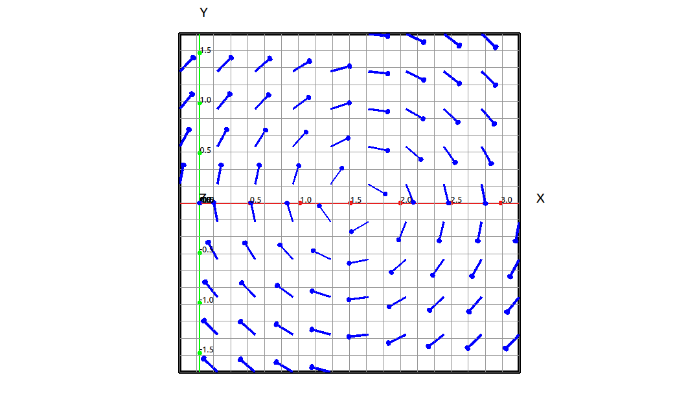
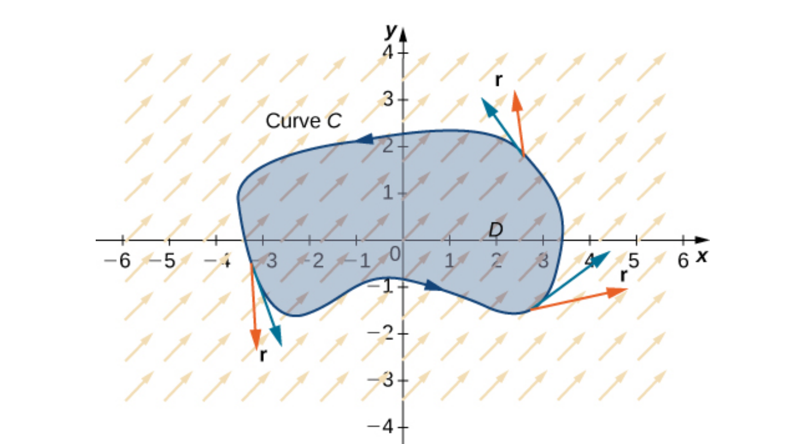
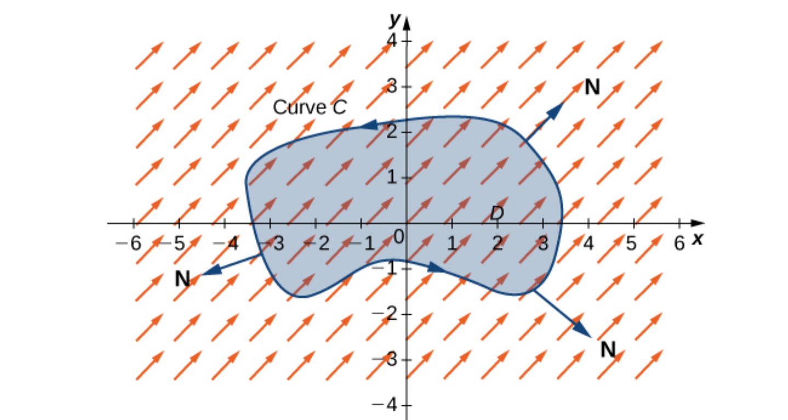

:index:`Divergence and Curl`
============================

Divergence and curl are two very important operations we can do on a vector field that measure certain properties of the vector field, tendency for the field to repel or attract at a point and the tendency for the field to rotate around a point.  Curl and divergence have applications to many areas of physics and engineering, fluid mechanics, electromagnetism, and elasticity theory, to name a few.

Curl
----

.. admonition:: Definition: Curl

    Let :math:`\mathbf{F} = (P, Q, R)` be a vector field in :math:`\mathbb{R}^3`, then the curl of :math:`\mathbf{F}` is

    .. math::
        {\rm curl}(\mathbf{F}) = \left( \frac{\partial R}{\partial y} - \frac{\partial Q}{\partial z} \right) \mathbf{i} + \left( \frac{\partial P}{\partial z} - \frac{\partial R}{\partial x} \right) \mathbf{j} + \left( \frac{\partial Q}{\partial x} - \frac{\partial P}{\partial y} \right) \mathbf{k}

.. note::

    The curl is easier to remember if we look at it as follows.  Define :math:`\nabla` ("del") as the operator,

    .. math::
        \nabla = \left( \frac{\partial}{\partial x}, \frac{\partial}{\partial y}, \frac{\partial}{\partial z} \right)

    Then we can write the gradiant as,

    .. math::
        \nabla f = \left( \frac{\partial}{\partial x}, \frac{\partial}{\partial y}, \frac{\partial}{\partial z} \right) f = \left( \frac{\partial f}{\partial x}, \frac{\partial f}{\partial y}, \frac{\partial f}{\partial z} \right)

    In addition, we can write the curl as the cross product of del and the field,

    .. math::
        {\rm curl}(\mathbf{F}) = \nabla \times \mathbf{F} = \left|  \begin{array}{ccc} \mathbf{i} & \mathbf{j} & \mathbf{k} \\ \frac{\partial}{\partial x} & \frac{\partial}{\partial y} & \frac{\partial}{\partial z} \\
        P & Q & R \end{array} \right|

    Note that this is not really a cross product since :math:`\nabla` is an operator and not a vector.  Nonetheless, if we relax the details here it does make for an easier way to generate the curl formula.

Example: Curl Calculation and Visualization
^^^^^^^^^^^^^^^^^^^^^^^^^^^^^^^^^^^^^^^^^^^

In this example we will be looking at the vector field,

.. math::
    \mathbf{F} = (\sin{\left(y \right)}, \  \cos{\left(x \right)}, \  0)

CLAE
""""

Input the field vector,

.. code-block:: console

    [sin(y),cos(x),0]

Select ``Calculus > Vector Calculus > Curl`` a dialog box will appear asking for the variable list to use.  It will be populated with ``[x, y]`` automatically but not ``z`` since it does not appear as a variable in the vector.  Edit the variable list to ``[x, y, z]``.  The result is,

.. math::
    \left[\begin{array}{c}0\\0\\- \sin{\left(x \right)} - \cos{\left(y \right)}\end{array}\right]

Since this is not the zero vector we know that the vector field has some rotational properties.  If we view this field from above and zoom in a bit we can see the rotational properties of the field.

    Rotational Field

.. admonition:: Theorem: Curl of a Conservative Vector Field

    If :math:`f` is a function of three variables with continuous second partials then

    .. math::
        {\rm curl}(\nabla f) = \mathbf{0}

    Hence if :math:`\mathbf{F}` is a conservative vector field then

    .. math::
        {\rm curl}(\mathbf{F}) = \mathbf{0}

Example: :math:`f(x, y, z) = \sin{\left(x \right)} \cos{\left(y + z \right)}`
^^^^^^^^^^^^^^^^^^^^^^^^^^^^^^^^^^^^^^^^^^^^^^^^^^^^^^^^^^^^^^^^^^^^^^^^^^^^^

In this example we will calculate :math:`{\rm curl}(\nabla f)` for the function, :math:`f(x, y, z) = \sin{\left(x \right)} \cos{\left(y + z \right)}.`

CLAE
""""

Input the function,

.. code-block:: console

    sin(x)*cos(y + z)

Select ``Calculus > Vector Calculus > Gradiant`` a dialog box will appear asking for the variable list to use.  It will be populated with ``[x, y,z]`` automatically, click OK.  The result is,

.. math::
    \left[\begin{array}{c}\cos{\left(x \right)} \cos{\left(y + z \right)}\\- \sin{\left(x \right)} \sin{\left(y + z \right)}\\- \sin{\left(x \right)} \sin{\left(y + z \right)}\end{array}\right]

Now select ``Calculus > Vector Calculus > Curl`` a dialog box will appear asking for the variable list to use.  It will be populated with ``[x, y, z]`` automatically, click OK.   The result is,

.. math::
    \left[\begin{array}{c}0\\0\\0\end{array}\right]

as expected.

There is a converse to the above theorem, with the right conditions.

.. admonition:: Theorem: Conservative Vector Field Test

    If :math:`\mathbf{F}` is a vector field on a simply connected domain in :math:`\mathbb{R}^3` whose component functions have continuous partial derivatives and :math:`{\rm curl}(\mathbf{F}) = \mathbf{0}`, then :math:`\mathbf{F}` is a conservative vector field.

The curl of a vector field at a point is a measure of the field's rotation around that point.  If the curl is zero at that point then the field is not rotating at all around that point and we say that the field is irrotational at that point.

Example
^^^^^^^

In this example we will be looking at the vector field,

.. math::
    \mathbf{F} = (\sin{\left(y \right)}, \  \cos{\left(x \right)}, \  0)

We calculated the curl of this field above and got,

.. math::
    \left[\begin{array}{c}0\\0\\- \sin{\left(x \right)} - \cos{\left(y \right)}\end{array}\right]

Since this is not the zero vector we know that the field is not conservative.

Divergence
----------

.. admonition:: Definition: Divergence

    Let :math:`\mathbf{F} = (P, Q, R)` be a vector field in :math:`\mathbb{R}^3`, then the divergence of :math:`\mathbf{F}` is

    .. math::
        {\rm div}(\mathbf{F}) = \frac{\partial P}{\partial x} + \frac{\partial Q}{\partial y} + \frac{\partial R}{\partial z}

    Using our del operator we can think of this as,

    .. math::
        {\rm div}(\mathbf{F}) = \nabla \cdot \mathbf{F}

.. admonition:: Theorem: Div of the Curl

    Let :math:`\mathbf{F}` be a vector field in :math:`\mathbb{R}^3`, then

    .. math::
        {\rm div}({\rm curl}(\mathbf{F})) = 0

Just as the curl is a measure of the rotation of the field the divergence is a measure of flow of the field from a point.  That is, the divergence at a point represents the net rate of change of the field flowing from the point. If the divergence is 0 at a point then the field is not flowing from that point and we say that the field is incompressible at that point.

Example: :math:`\left( \sin{\left(x \right)}, \  \cos{\left(y \right)}, \  \sin{\left(x + z \right)}\right)`
^^^^^^^^^^^^^^^^^^^^^^^^^^^^^^^^^^^^^^^^^^^^^^^^^^^^^^^^^^^^^^^^^^^^^^^^^^^^^^^^^^^^^^^^^^^^^^^^^^^^^^^^^^^^

CLAE
""""

Input the field vector,

.. code-block:: console

    [sin(x),cos(y),sin(x + z)]

Select ``Calculus > Vector Calculus > Divergence`` a dialog box will appear asking for the variable list to use.  It will be populated with ``[x, y,z]`` automatically, click OK.  The result is,

.. math::
    - \sin{\left(y \right)} + \cos{\left(x \right)} + \cos{\left(x + z \right)}

If we evaluate this at the origin we get 2, so there is a net rate of change of 2 of this field out of the origin.  If we evaluate this at :math:`(1, 2, 3)` we get,

.. math::
    - \sin{\left(2 \right)} + \cos{\left(4 \right)} + \cos{\left(1 \right)} \approx -1.0226387418211538926

so there is net rate of change of :math:`-1.0226387418211538926` the field at the point :math:`(1, 2, 3).`

Divergence and Curl in Two Variables
------------------------------------

In the above definitions we assumed that the vector field :math:`\mathbf{F}` was in three dimensions, we can define both the divergence and the curl for vector fields in two dimensions.

.. admonition:: Definition: Divergence and Curl in Two Variables

    Let :math:`\mathbf{F} = (P, Q)` be a vector field in :math:`\mathbb{R}^2`, then the divergence of :math:`\mathbf{F}` is

    .. math::
        {\rm div}(\mathbf{F}) = \frac{\partial P}{\partial x} + \frac{\partial Q}{\partial y}

    and the curl of :math:`\mathbf{F}` is

    .. math::
        {\rm curl}(\mathbf{F}) = \nabla \times \mathbf{F} = \left|  \begin{array}{ccc} \mathbf{i} & \mathbf{j} & \mathbf{k} \\ \frac{\partial}{\partial x} & \frac{\partial}{\partial y} & \frac{\partial}{\partial z} \\
        P & Q & 0 \end{array} \right| = \left( \frac{\partial Q}{\partial x} - \frac{\partial P}{\partial y} \right) \mathbf{k}

Vector Forms of Green's Theorem
-------------------------------

Note that, if :math:`\mathbf{F} = (P, Q)` be a vector field in :math:`\mathbb{R}^2`, then

.. math::
    {\rm curl}(\mathbf{F}) = \left( \frac{\partial Q}{\partial x} - \frac{\partial P}{\partial y} \right) \mathbf{k}

so

.. math::
    {\rm curl}(\mathbf{F}) \cdot \mathbf{k} = \left( \frac{\partial Q}{\partial x} - \frac{\partial P}{\partial y} \right) \mathbf{k} \cdot \mathbf{k} = \frac{\partial Q}{\partial x} - \frac{\partial P}{\partial y}

.. admonition:: Theorem:  Tangential Form of Green's Theorem

    If *C* is a positively oriented, piecewise-smooth, simple closed curve and *D* is the region bounded by the curve *C*. If :math:`\mathbf{F} = (P, Q)` where *P* and *Q* have continuous partial derivatives on an open region containing *D*, then

    .. math::
        \oint_C \mathbf{F} \cdot d\mathbf{r} = \oint_C \mathbf{F} \cdot \mathbf{T} \; ds  =  \iint_D \left( \frac{\partial Q}{\partial x} - \frac{\partial P}{\partial y} \right) \; dA  = \iint_D {\rm curl}(\mathbf{F}) \cdot \mathbf{k} \; dA

We can envision the :math:`\displaystyle \oint_C \mathbf{F} \cdot \mathbf{T} \; ds` portion of this calculation as the dot product of the unit tangent with the field as we traverse the curve.  We can illustrate this in the following graph.

    Tangential Form of Green's Theorem

The other vector form of Green's Theorem is when we do the same thing with the unit normal vector, :math:`\displaystyle \oint_C \mathbf{F} \cdot \mathbf{N} \; ds.`

    Normal (Flux) Form of Green's Theorem

This is fairly easy to derive, let :math:`\mathbf{r}(t) = x(t) \mathbf{i} + y(t) \mathbf{j}`, with :math:`a \leq t \leq t,` then

.. math::
    \mathbf{T}(t) = \frac{x'(t)}{|\mathbf{r}'(t)|} \mathbf{i} + \frac{y'(t)}{|\mathbf{r}'(t)|} \mathbf{j}

If we think about this and our simple rise over run definition for the slope, and the perpendicular vector has the negative reciprocal slope then we can write,

.. math::
    \mathbf{N}(t) = \frac{y'(t)}{|\mathbf{r}'(t)|} \mathbf{i} - \frac{x'(t)}{|\mathbf{r}'(t)|} \mathbf{j}

Then

.. math::
    \oint_C \mathbf{F} \cdot \mathbf{N} \; ds & = \int_a^b \left( \mathbf{F} \cdot \mathbf{N} \right)(t) |\mathbf{r}'(t)| \; dt \\
    & = \int_a^b \left( \frac{P y'(t)}{|\mathbf{r}'(t)|} - \frac{Q x'(t)}{|\mathbf{r}'(t)|}  \right) |\mathbf{r}'(t)| \; dt \\
    & = \int_a^b P y'(t) \; dt - Q x'(t) \; dt \\
    & = \int_C P \; dy - Q \; dx \\
    & = \iint_D \left( \frac{\partial P}{\partial x} + \frac{\partial Q}{\partial y} \right) \; dA  = \iint_D {\rm div}(\mathbf{F}) \; dA

.. admonition:: Theorem:  Normal (Flux) Form of Green's Theorem

    If *C* is a positively oriented, piecewise-smooth, simple closed curve and *D* is the region bounded by the curve *C*. If :math:`\mathbf{F} = (P, Q)` where *P* and *Q* have continuous partial derivatives on an open region containing *D*, then

    .. math::
        \oint_C \mathbf{F} \cdot \mathbf{N} \; ds = \iint_D \left( \frac{\partial P}{\partial x} + \frac{\partial Q}{\partial y} \right) \; dA  = \iint_D {\rm div}(\mathbf{F}) \; dA

Laplace Operator
----------------

We know that the curl of a gradiant is zero.

.. math::
    {\rm curl}(\nabla f) = \mathbf{0}

One question is what is the divergence of a gradiant.

.. math::
    {\rm div}(\nabla f) = \mathbf{0}

So if :math:`f` is a function of two variables then

.. math::
    {\rm div}(\nabla f) = \nabla \cdot (\nabla f) = \frac{\partial^2 f}{\partial x^2} + \frac{\partial^2 f}{\partial y^2}

and if :math:`f` is a function of three variables then

.. math::
    {\rm div}(\nabla f) = \nabla \cdot (\nabla f) = \frac{\partial^2 f}{\partial x^2} + \frac{\partial^2 f}{\partial y^2} + \frac{\partial^2 f}{\partial x^2}

This operation is used extensively in mathematics so we have an abbreviation for the operator.

.. math::
    {\rm div}(\nabla f) = \nabla \cdot (\nabla f) = \nabla^2 f

this is called the Laplace operator do to its relation to Laplace's equation.  Laplace's equation is simply :math:`\nabla^2 f = 0.`  Any function that satisfies Laplace's equation is said to be harmonic, these have many applications in physics, engineering, and differential equations.

