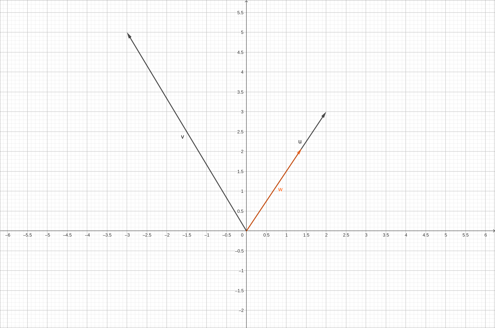
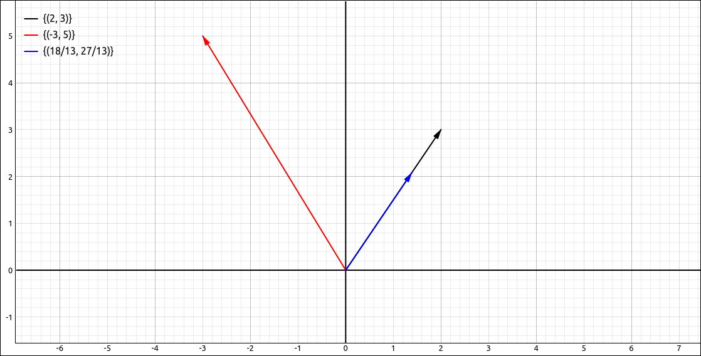
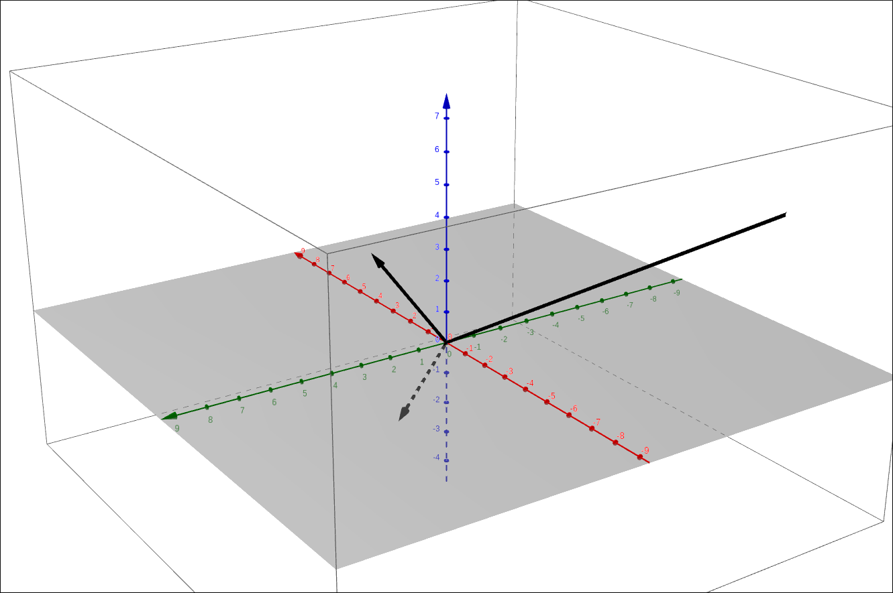
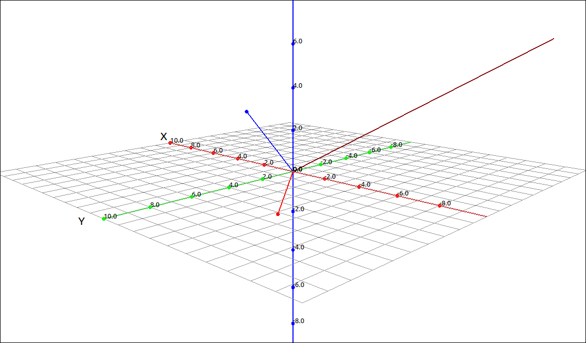
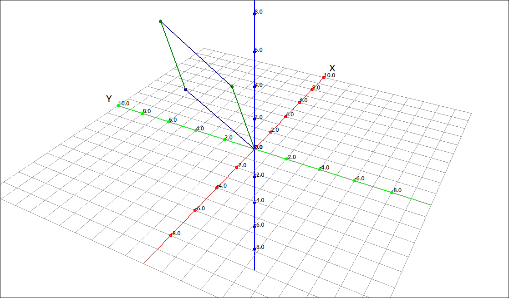

:index:`Dot Product and Cross Product`
======================================

One operation that you probably noticed that was missing in the last section was multiplication.  There are two types of products we can define on vectors.  One is called the dot product (or the scalar product or inner product) of two vectors and the other is called the cross product (or vector product).  The dot product takes two vectors and returns a scalar value and the cross product takes two three-dimensional vector and produces a third three dimensional vector.  The dot product can be defined in any dimension while the cross product is defined for three-dimensional vectors.

Dot Product
-----------

.. admonition:: Definition: Dot Product of Two Vectors

    The **dot product**, also called the **scalar product** or **inner product**, is the sum of the products of the corresponding components of the two vectors.  The two vectors must be the same dimension for this operation to be defined. Specifically, if :math:`\mathbf{a} = (a_1, a_2)` and :math:`\mathbf{b} = (b_1, b_2)` then

    .. math::
        \mathbf{a} \cdot \mathbf{b} = a_1 b_1 + a_2 b_2

    Similarly in three-dimensions, if :math:`\mathbf{a} = (a_1, a_2, a_3)` and :math:`\mathbf{b} = (b_1, b_2, b_3)` then

    .. math::
        \mathbf{a} \cdot \mathbf{b} = a_1 b_1 + a_2 b_2 + a_3 b_3

    Note that the result of this computation is a number (scalar) and hence the alternative name for the operation.  Also note that this can be extended in the obvious way to higher dimensions but most of our work will be in two and three dimensions.

Example: Dot Product Calculations
^^^^^^^^^^^^^^^^^^^^^^^^^^^^^^^^^

GeoGebra
""""""""

Calculating the dot product in GeoGebra is fairly simple.  Say we input two vectors *u* and *v* as

.. math::
    \left[\begin{array}{c}2\\3\end{array}\right] \qquad {\rm and } \qquad \left[\begin{array}{c}-3\\5\end{array}\right]

to calculate the dot product either input ``u v`` (note a space between them) or ``u*v`` and the result is 9.

CLAE
""""

Calculating the dot product in CLAE is fairly simple.  Say we input two vectors ``R1`` and ``R2`` as

.. math::
    \left[\begin{array}{c}2\\3\end{array}\right] \qquad {\rm and } \qquad \left[\begin{array}{c}-3\\5\end{array}\right]

to calculate the dot product select ``R1`` then select ``Vector > Dot Product``, a dialog will appear asking for the second vector, select ``R2`` from the list and click OK, the result will be 9.

.. admonition:: Theorem: Properties of the Dot Product

    1. :math:`\mathbf{a} \cdot \mathbf{a} = |\mathbf{a}|^2`
    2. :math:`\mathbf{a} \cdot (\mathbf{b} + \mathbf{c}) = \mathbf{a} \cdot \mathbf{b} + \mathbf{a} \cdot \mathbf{c}`
    3. :math:`\mathbf{a} \cdot \mathbf{b} = \mathbf{b} \cdot \mathbf{a}`
    4. :math:`(c \mathbf{a}) \cdot \mathbf{b} = c(\mathbf{a} \cdot \mathbf{b}) = \mathbf{a} \cdot (c \mathbf{b})`
    5. :math:`\mathbf{0} \cdot \mathbf{a} = 0`
    6. :math:`\mathbf{a} \cdot \mathbf{b} = |\mathbf{a}| |\mathbf{b}| \cos(\theta)` where :math:`\theta` is tha angle between the two vectors.
    7. :math:`\displaystyle \theta = \cos^{-1}\left(\frac{\mathbf{a} \cdot \mathbf{b}}{|\mathbf{a}| |\mathbf{b}|}\right)` where :math:`\theta` is tha angle between the two vectors.
    8. The two vectors :math:`\mathbf{a}` and :math:`\mathbf{b}` are perpendicular (orthogonal) to each other if and only if :math:`\mathbf{a} \cdot \mathbf{b} = 0`.

Most of these are fairly obvious to prove, the angle calculation drops out of the law of cosines.  We will do an example of this.

Example: Angle Between two Vectors
^^^^^^^^^^^^^^^^^^^^^^^^^^^^^^^^^^

GeoGebra
""""""""

Say we have the same two vectors as we used above,

.. math::
    \left[\begin{array}{c}2\\3\end{array}\right] \qquad {\rm and } \qquad \left[\begin{array}{c}-3\\5\end{array}\right]

to calculate the angle between the two vectors input ``Angle(u, v)`` and the result will be 64.65382, note that this is in degrees.

CLAE
""""

Calculating the angle between two vectors in CLAE is fairly simple.  Say we input two vectors ``R1`` and ``R2`` as

.. math::
    \left[\begin{array}{c}2\\3\end{array}\right] \qquad {\rm and } \qquad \left[\begin{array}{c}-3\\5\end{array}\right]

to calculate the angle between them select ``R1`` then select ``Vector > Angle``, a dialog will appear asking for the second vector, select ``R2`` from the list and click OK, the result will be,

.. math::
    \operatorname{acos}{\left(\frac{9 \sqrt{442}}{442} \right)}

which approximates to 1.1284221038181517067, note that this is in radians.

.. admonition:: Theorem: Vector Projections

    Given two vectors vectors :math:`\mathbf{a}` and :math:`\mathbf{b}` the projection of the vector :math:`\mathbf{b}` onto the vector :math:`\mathbf{a}` is

    .. math::
        {\rm proj}_{\mathbf{a}} \mathbf{b} = \left( \frac{\mathbf{a} \cdot \mathbf{b}}{|\mathbf{a}|} \right) \frac{\mathbf{a}}{|\mathbf{a}|} =\frac{\mathbf{a} \cdot \mathbf{b}}{|\mathbf{a}|^2} \mathbf{a}

    Note that the length of this vector is :math:`\displaystyle \frac{\mathbf{a} \cdot \mathbf{b}}{|\mathbf{a}|}` since it is the multiple of a unit vector, we call this value the component of :math:`\mathbf{b}` on :math:`\mathbf{a}`.

    .. math::
        {\rm comp}_{\mathbf{a}} \mathbf{b} = \frac{\mathbf{a} \cdot \mathbf{b}}{|\mathbf{a}|}

Example: Projections
^^^^^^^^^^^^^^^^^^^^

GeoGebra
""""""""

To do a vector projection in GeoGebra we simply use the above formula.  Say we have the same two vectors as we used above,

.. math::
    \left[\begin{array}{c}2\\3\end{array}\right] \qquad {\rm and } \qquad \left[\begin{array}{c}-3\\5\end{array}\right]

.. code-block:: console

    (u v)/|u|^2 u

The result is

.. math::
    \left[\begin{array}{c}1.38462\\2.07692\end{array}\right]

    Vector Projection Example

CLAE
""""

In CLAE we can go through the formula in a few steps but we can also use a menu option to do the calculation.  Say we input two vectors ``R1`` and ``R2`` as

.. math::
    \left[\begin{array}{c}2\\3\end{array}\right] \qquad {\rm and } \qquad \left[\begin{array}{c}-3\\5\end{array}\right]

to calculate the projection select ``R2`` then select ``Vector > Projections > Projection``, a dialog will appear asking for the vector to project onto, select ``R1`` from the list and click OK, the result will be,

.. math::
    \left[\begin{array}{c}\frac{18}{13}\\\frac{27}{13}\end{array}\right]

which approximates to,

.. math::
    \left[\begin{array}{c}1.3846153846153846154\\2.0769230769230769231\end{array}\right]

Graphing the original vectors along with the projection gives us the following image. Make sure that you are in 1-1 mode or the projection will not "look" correct.

    Vector Projection Example

Cross Product
-------------

The second product is called the cross product, or vector product, of two vectors.  Here we only look at two vectors that are in three-dimensions.

.. admonition:: Definition: Cross Product of Two Vectors

    The **cross product**, also called the **vector product** is defined as follows, if :math:`\mathbf{a} = (a_1, a_2, a_3)` and :math:`\mathbf{b} = (b_1, b_2, b_3)` then

    .. math::
        \mathbf{a} \times \mathbf{b} = (a_2 b_3 - a_3 b_2, a_3 b_1 - a_1 b_3, a_1 b_2 - a_2 b_1)

    Note that the result of this computation is a vector and hence the alternative name for the operation.

We do not need to memorize this formula, the calculation can be done using a determinant calculation.  The determinant is a calculation that is usually studied in a linear algebra course.  We do not need to discuss the determinant in general, we simply need to know the calculation for size 2 and 3 matrices.  For a :math:`2 \times 2` matrix the determinant is defined and calculated as,

.. math::
    \left|\begin{array}{cc}a & b\\c & d\end{array}\right| = a d - b c

For a :math:`3 \times 3` matrix the determinant is defined and calculated (recursively) as,

.. math::
    \left|\begin{array}{ccc}a_{1} & a_{2} & a_{3}\\b_{1} & b_{2} & b_{3}\\c_{1} & c_{2} & c_{3}\end{array}\right| = a_1 \left|\begin{array}{cc}b_2 & b_3\\c_2 & c_3\end{array}\right| - a_2 \left|\begin{array}{cc}b_1 & b_3\\c_1 & c_3\end{array}\right| + a_3 \left|\begin{array}{cc}b_1 & b_2\\c_1 & c_2\end{array}\right|

With this definition we can calculate the cross product as,

.. math::
    \mathbf{a} \times \mathbf{b} = \left|\begin{array}{ccc} \mathbf{i} & \mathbf{j} & \mathbf{k}  \\ a_{1} & a_{2} & a_{3}\\b_{1} & b_{2} & b_{3}\end{array}\right|

We will look at properties of the cross product shortly, but one well used property is that the cross product vector is perpendicular (orthogonal) to each of the two vectors used for the cross product.

Example: Cross Product
^^^^^^^^^^^^^^^^^^^^^^

GeoGebra
""""""""

Input the vectors,

.. math::
    \left[\begin{array}{c}1\\2\\3\end{array}\right] \qquad {\rm and } \qquad \left[\begin{array}{c}-2\\3\\-1\end{array}\right]

Assuming these came in as *u* and *v* respectively, we can take the cross product of these with the command, ``Cross(u, v)``, the result will be

.. math::
    \left[\begin{array}{c}-11\\-5\\7\end{array}\right]

If we switch to 3D perspective we see the image,

    Vector Cross Product Example

CLAE
""""

Input the vectors,

.. math::
    \left[\begin{array}{c}1\\2\\3\end{array}\right] \qquad {\rm and } \qquad \left[\begin{array}{c}-2\\3\\-1\end{array}\right]

Assuming these came in as ``R1`` and ``R2`` respectively, we can take the cross product by selecting ``R1`` then selecting ``Vector > Cross Product``, then selecting ``R2`` in the dialog that appears and finally clicking OK, the result will be

.. math::
    \left[\begin{array}{c}-11\\-5\\7\end{array}\right]

Graphing these three vectors produces,

    Vector Cross Product Example

.. admonition:: Definition: Properties of the Cross Product

    1. :math:`\mathbf{a} \times \mathbf{b}` is a vector that is orthogonal to both :math:`\mathbf{a}` and :math:`\mathbf{b}.`
    2. :math:`|\mathbf{a} \times \mathbf{b}| = |\mathbf{a}| |\mathbf{b}| \sin(\theta)` where :math:`\theta` is the angle between :math:`\mathbf{a}` and :math:`\mathbf{b}.`
    3. :math:`\mathbf{a} \times \mathbf{b} = \mathbf{0}` if and only if :math:`\mathbf{a}` and :math:`\mathbf{b}` are parallel.
    4. :math:`\mathbf{a} \times \mathbf{b} = - \mathbf{b} \times \mathbf{a}`
    5. :math:`\mathbf{a} \times (\mathbf{b} + \mathbf{c}) = \mathbf{a} \times \mathbf{b} + \mathbf{a} \times \mathbf{c}`
    6. :math:`(\mathbf{a} + \mathbf{b}) \times \mathbf{c} = \mathbf{a} \times \mathbf{c} + \mathbf{b} \times \mathbf{c}`
    7. :math:`\mathbf{a} \cdot (\mathbf{b} \times \mathbf{c}) = (\mathbf{a} \times \mathbf{b}) \cdot \mathbf{c}`
    8. :math:`\mathbf{a} \times (\mathbf{b} \times \mathbf{c}) = (\mathbf{a} \cdot \mathbf{c}) \mathbf{b} - (\mathbf{a} \cdot \mathbf{b}) \mathbf{c}`
    9. :math:`(c\mathbf{a}) \times \mathbf{b} = c(\mathbf{a} \times \mathbf{b}) = \mathbf{a} \times (c \mathbf{b})`

Parallelograms and Parallelepipeds
^^^^^^^^^^^^^^^^^^^^^^^^^^^^^^^^^^

There are numerous applications of the cross product, many center around the fact that the cross product creates a vector orthogonal to both crossed vectors.  For example, this is used to create normal vectors to a surface which are needed for lighting calculations in computer graphics which is the primary operation to produce three-dimensional looking images on a two-dimensional computer screen. In addition, we can use cross products to calculate areas and volumes of parallelograms and parallelepipeds.

.. admonition:: Theorem: Parallelogram Area and Parallelepiped Volume

    The length of the cross product :math:`\mathbf{a} \times \mathbf{b}` is equal to the area of the parallelogram determined by :math:`\mathbf{a}` and :math:`\mathbf{b}`.

    .. math::
        A = |\mathbf{a} \times \mathbf{b}|

    The volume of the parallelepiped determined by the vectors :math:`\mathbf{a}`, :math:`\mathbf{b}` and :math:`\mathbf{c}`. is the magnitude of their scalar triple product,

    .. math::
        V = |\mathbf{a} \cdot (\mathbf{b} \times \mathbf{c})|

One consequence of the above theorem is that if the scalar triple product :math:`\mathbf{a} \cdot (\mathbf{b} \times \mathbf{c}) = 0` then the vectors :math:`\mathbf{a}`, :math:`\mathbf{b}` and :math:`\mathbf{c}` are coplanar.

Example: Parallelogram Area
^^^^^^^^^^^^^^^^^^^^^^^^^^^

If we take the vectors,

.. math::
    \left[\begin{array}{c}1\\2\\3\end{array}\right] \qquad {\rm and } \qquad \left[\begin{array}{c}-2\\3\\4\end{array}\right]

and we form the parallelogram from them we get,

    Parallelogram Example

The area of this parallelogram is the length of the cross product,

.. math::
    \left[\begin{array}{c}1\\2\\3\end{array}\right] \times \left[\begin{array}{c}-2\\3\\4\end{array}\right] = \left[\begin{array}{c}-1\\-10\\7\end{array}\right]

and

.. math::
    \left|\left[\begin{array}{c}-1\\-10\\7\end{array}\right]\right| = 5 \sqrt{6} \approx 12.247448713915890491

.. note::

    You may be wondering if we can divide two vectors, or if there are multiple ways to divide two vectors, that is calculating

    .. math::
        \frac{\mathbf{u}}{\mathbf{v}}

    If we think about what it means to divide two numbers :math:`\frac{2}{3} = 2 \cdot 3^{-1}.` For vectors this would mean,

    .. math::
        \frac{\mathbf{u}}{\mathbf{v}} = \mathbf{u} \cdot \mathbf{v}^{-1}

    or

    .. math::
        \frac{\mathbf{u}}{\mathbf{v}} = \mathbf{u} \times \mathbf{v}^{-1}

    So of we can define the division of two vectors we would first need to define what the inverse of a vector is, in a way that is consistent with our other definitions.  If we can define an inverse of a vector then

    .. math::
        \mathbf{v} \cdot \mathbf{v}^{-1} = \mathbf{1}

    or

    .. math::
        \mathbf{v} \times \mathbf{v}^{-1} = \mathbf{1}

    where :math:`\mathbf{1}` is a multiplicative identity vector, just like :math:`3 \cdot 3^{-1} = 1`.  So what is the multiplicative identity vector :math:`\mathbf{1}`?  This would need be a single vector such that

    .. math::
        \mathbf{v} \cdot \mathbf{1} = \mathbf{v}

    or

    .. math::
        \mathbf{v} \times \mathbf{1} = \mathbf{v}

    for all vectors :math:`\mathbf{v}`.  This is clearly not going to work for the dot product since the dot product is a scalar and not a vector, so the above equation makes no sense.  For the cross product, this is saying that :math:`\mathbf{v}` is orthogonal to :math:`\mathbf{v}` which is absurd if :math:`\mathbf{v} \neq \mathbf{0}.` So we cannot define a multiplicative identity, hence we cannot define vector inverses, and consequently we cannot define vector division.
