:index:`Double Integrals over General Regions`
==============================================

In this section we are generalizing the region we are integrating over from a rectangle to any region in the plane.

General Regions
---------------

First we define some terminology and categorize types of regions.  Different textbooks may use different terminology for these but most break it down into Type I and Type II regions.

.. admonition:: Definition: Type I Region

    A Type I Region is one that lies between two vertical lines and the graphs of two continuous functions :math:`g_1(x)` and :math:`g_2(x)`.

Some examples of Type I Regions are below.

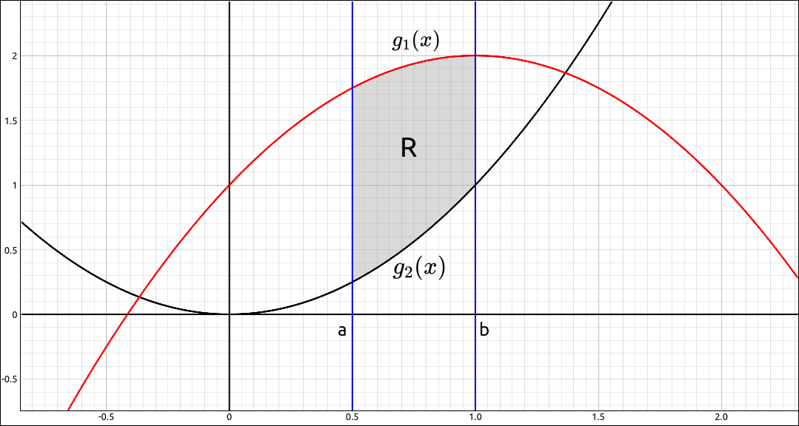

    Type I Region

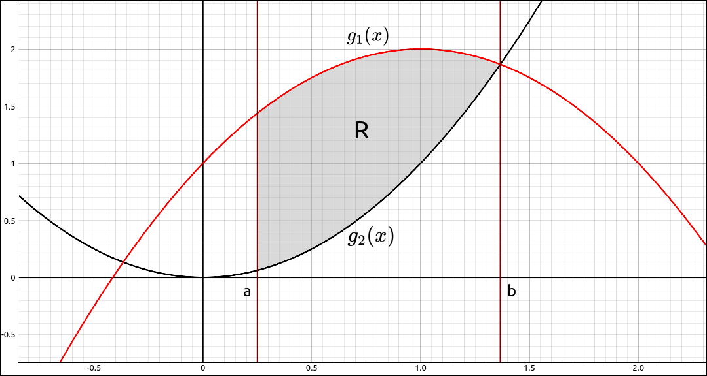

    Type I Region

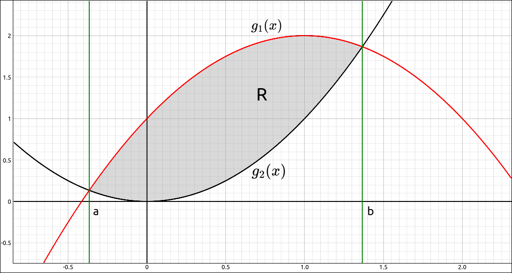

    Type I Region

.. admonition:: Definition: Type II Region

    A Type II Region is one that lies between two horizontal lines and the graphs of two continuous functions :math:`h_1(y)` and :math:`h_2(y)`.

Some examples of Type II Regions are below.

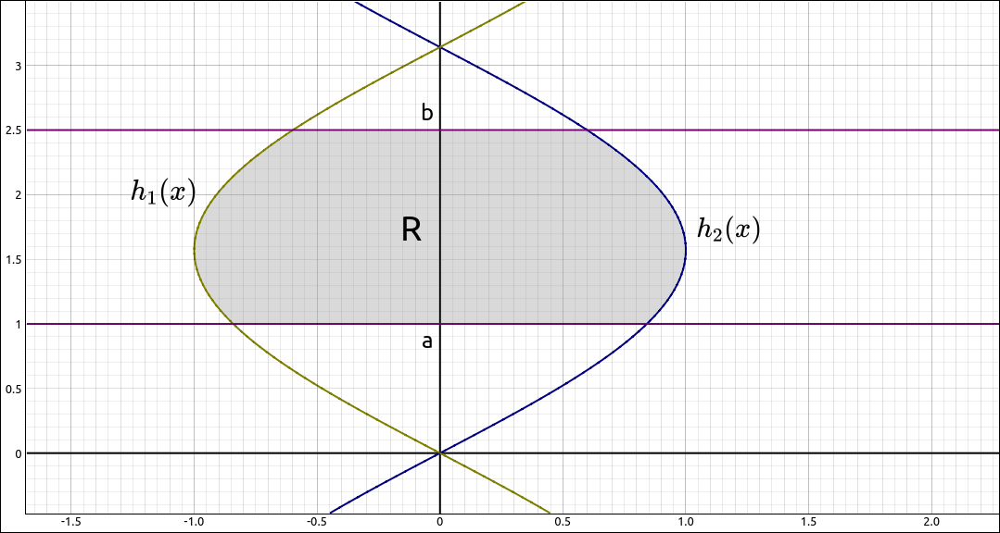

    Type II Region

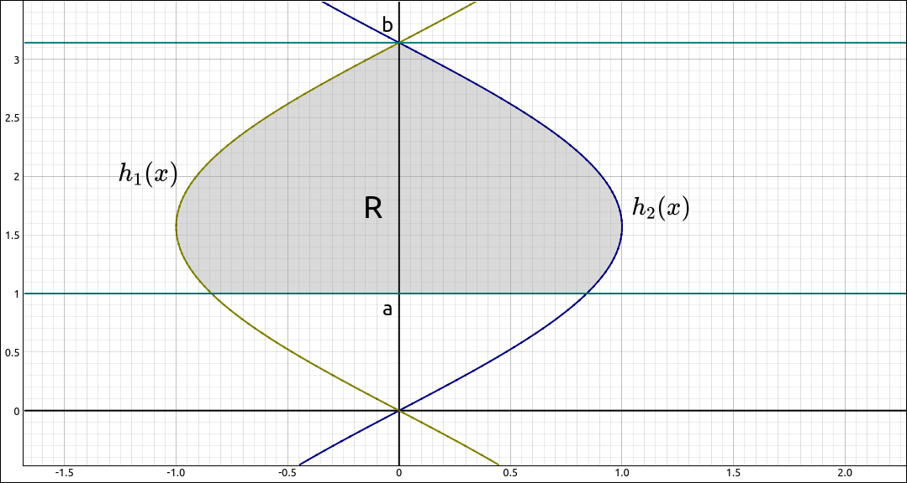

    Type II Region

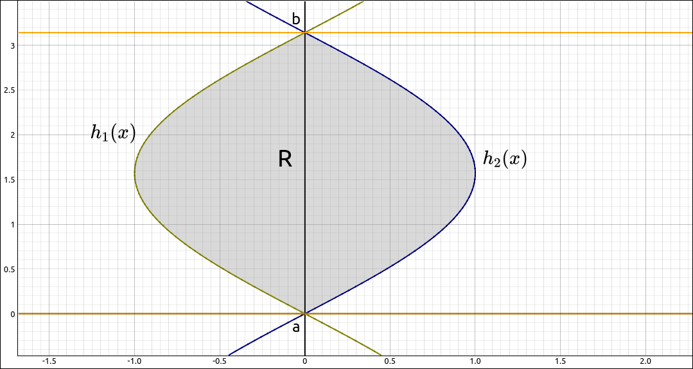

    Type II Region

.. note::

    Some regions can be both Type I and Type II.  For example,

    .. figure:: Images/MultInt/Type12001.png
        :alt: Type I and Type II Region

        Type I and Type II Region

Calculating Double Integrals over General Regions
-------------------------------------------------

To calculate the integral of a function over a Type I or Type II region we can use iterated integrals as we did with rectangular regions.

.. admonition:: Theorem: Integrating Over a Type I Region

    Let *R* be a Type I Region that lies between two vertical lines and the graphs of two continuous functions :math:`g_1(x)` and :math:`g_2(x)`. Then the integral of a function :math:`f(x, y)` that is continuous on *R* is,

    .. math::
        \iint_R f(x, y) \; dA = \int_a^b \int_{g_1(x)}^{g_2(x)} f(x, y) \; dy \; dx

Example: :math:`f(x, y) = x^{2} e^{x y}`
^^^^^^^^^^^^^^^^^^^^^^^^^^^^^^^^^^^^^^^^

In this example we will integrate the function :math:`f(x, y) = x^{2} e^{x y}` over the region bounded by :math:`x = 0`, :math:`y = 1`, and  :math:`y = x/2.`  The region is pictured below,

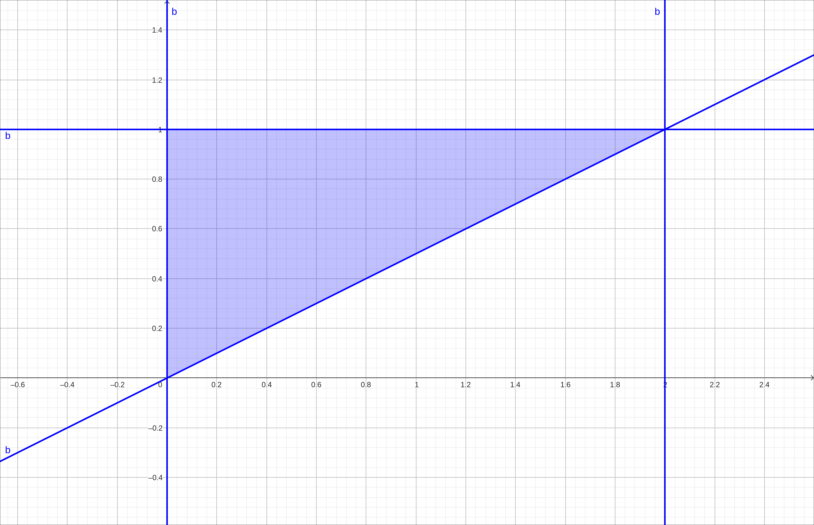

    Region

GeoGebra
""""""""

As before we cannot calculate the integral but we can get a nice image of what volume we are calculating.  Input the function,

.. code-block:: console

    x^2 exp(x y)

Also input the region,

.. code-block:: console

    (x/2 <= y <= 1) && (0 <= x <= 2)

Finally input ``a, b`` to do the restriction, hide the original surface and zoom in a bit,

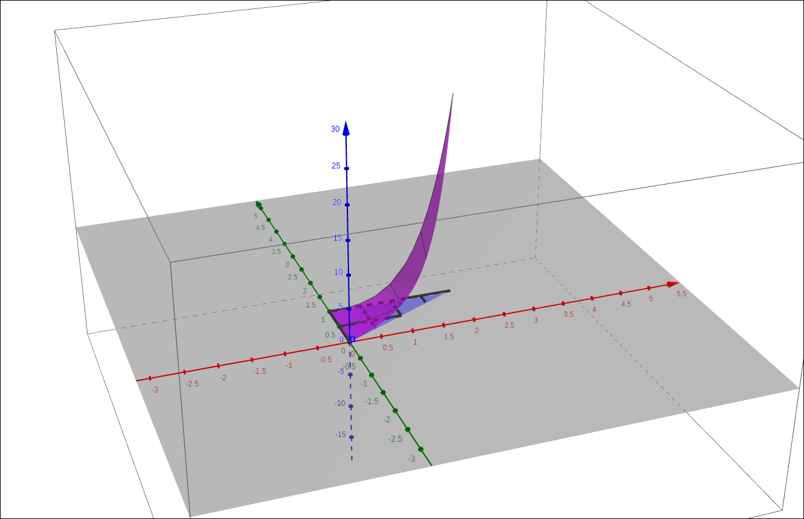

    :math:`f(x, y) = x^{2} e^{x y}` on *R*

CLAE
""""

In CLAE we will not get as nice of an image as with GeoGebra but we can still visualize the volume.  Input the function,

.. code-block:: console

    x^2*exp(x*y)

Also input the bounding functions, ``0``, ``1``, and ``x/2``.  CLick and drag all of these to the 3D Graphics window.  They will all come in as functions, change ``0``, ``1``, and ``x/2`` to function sheets, they should convert to :math:`y = f(x)` types.  For 0, go into the properties and change the independent variable to *y* and dependent variable to *x*.  We get the following image, rotate the camera around to get a feel for the volume we are finding.

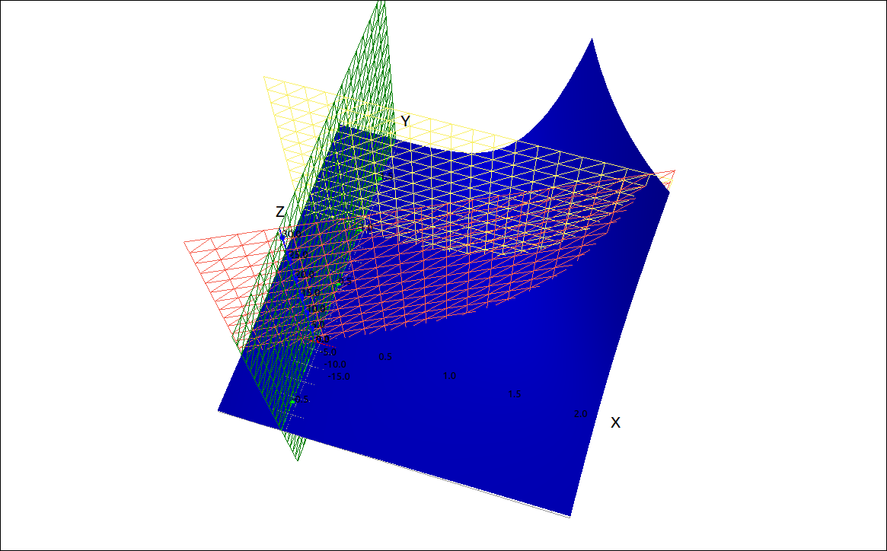

    :math:`f(x, y) = x^{2} e^{x y}` on *R*

This is a Type I region with :math:`g_1(x) = x/2`, :math:`g_2(x) = 1`, :math:`a = 0`, and :math:`b = 2.`  Hence we get the integral,

.. math::
    \iint_R x^{2} e^{x y} \; dA = \int_0^2 \int_{x/2}^{1} x^{2} e^{x y} \; dy \; dx

To calculate this in CLAE, select the function, select ``Calculus > Multiple Integrals > Double Integral``.  For the first variable input *y*, lower bound is ``x/2`` and upper bound is ``1``.  For the second variable input *x*, lower bound ``0`` and upper bound ``2``.  The result is 2.

Maxima
""""""

This is a Type I region with :math:`g_1(x) = x/2`, :math:`g_2(x) = 1`, :math:`a = 0`, and :math:`b = 2.`  Hence we get the integral,

.. math::
    \iint_R x^{2} e^{x y} \; dA = \int_0^2 \int_{x/2}^{1} x^{2} e^{x y} \; dy \; dx

To calculate this in Maxima, input the following command,

.. code-block:: console

    integrate(integrate(x**2*exp(x*y), y, x/2, 1), x, 0, 2);

The result is 2.

.. admonition:: Theorem: Integrating Over a Type II Region

    Let *R* be a Type II Region that lies between two horizontal lines and the graphs of two continuous functions :math:`h_1(y)` and :math:`h_2(y)`.  Then the integral of a function :math:`f(x, y)` that is continuous on *R* is,

    .. math::
        \iint_R f(x, y) \; dA = \int_a^b \int_{h_1(y)}^{h_2(y)} f(x, y) \; dx \; dy

Example: :math:`f(x, y) = 3x^2 + y^2`
^^^^^^^^^^^^^^^^^^^^^^^^^^^^^^^^^^^^^

In this example we will integrate the function :math:`f(x, y) = 3x^2 + y^2` over the region bounded by the curves :math:`x = y+3` and :math:`x = y^2 - 3.`  The region is pictured below,

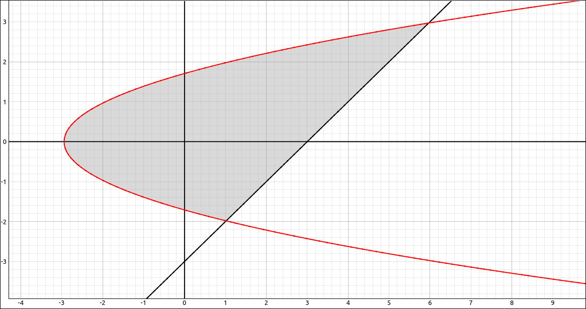

    Region

GeoGebra
""""""""

As before we cannot calculate the integral but we can get a nice image of what volume we are calculating.  Input the function,

.. code-block:: console

    3x^2 + y^2

Also input the two curves defining the region,

.. code-block:: console

    x = y^2 - 3

and

.. code-block:: console

    x = y+3

go into the 2D graphics window, select the toolbar option to find intersection points, select the two equations and the result will be the points :math:`(1, -2)` and :math:`(6, 3).` This tells us that the range for *y* is :math:`[-2, 3].`

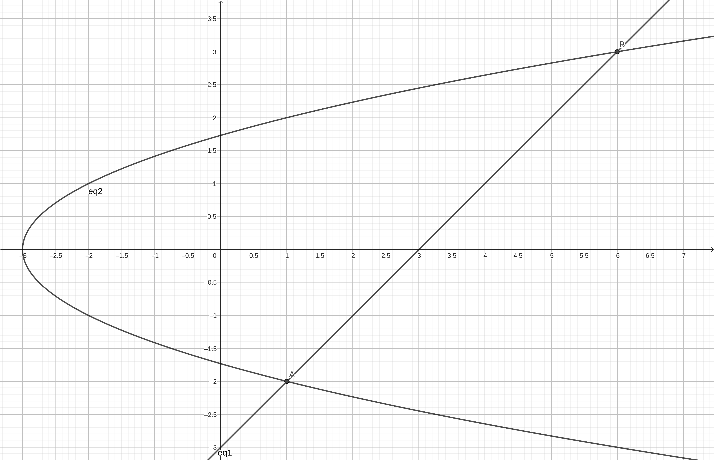

    *y* Bounds

So we can input the region with,

.. code-block:: console

    (-2 <= y <= 3) && (y^2-3 <= x <= y+3)

Finally input ``a, b`` to do the restriction, hide the original surface and zoom out a bit,

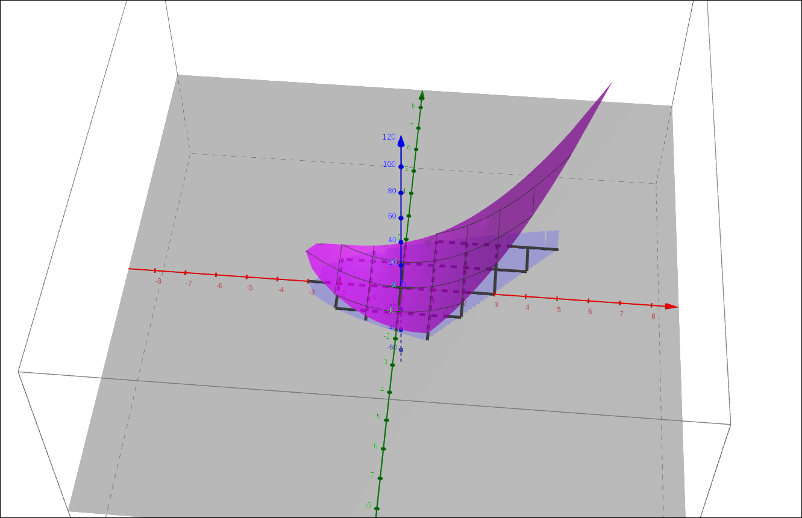

    :math:`f(x, y) = 3x^2 + y^2` on *R*

CLAE
""""

Input the function and the bounding curves,

.. code-block:: console

    3*x^2 + y^2

.. code-block:: console

    y^2 - 3

and

.. code-block:: console

    y+3

CLick and drag all of these to the 3D Graphics window.  They will all come in as functions, change `the bounding curves to function sheets, they should convert to :math:`x = f(y)` types. Making the bounding sheets graph the grid instead of the surface, we get the following image, rotate the camera around to get a feel for the volume we are finding.

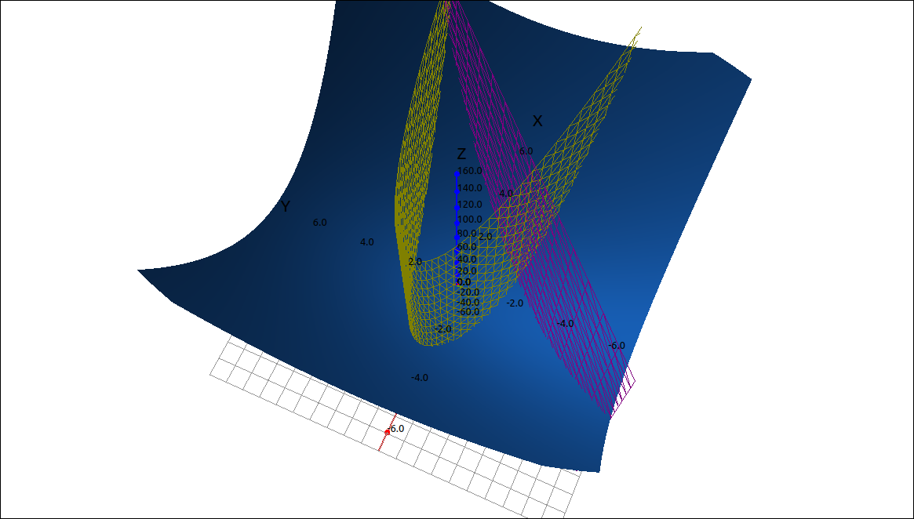

    :math:`f(x, y) = 3x^2 + y^2` on *R*

This is a Type II region with :math:`h_1(x) = y^2-3`, :math:`h_2(x) = y+3`, :math:`a = -2`, and :math:`b = 3.`  Hence we get the integral,

.. math::
    \iint_R 3x^2 + y^2 \; dA = \int_{-2}^3 \int_{y^2-3}^{y+3} 3x^2 + y^2 \; dx \; dy

To calculate this in CLAE, select the function, select ``Calculus > Multiple Integrals > Double Integral``.  For the first variable input *x*, lower bound is ``y^2-3`` and upper bound is ``y+3``.  For the second variable input *y*, lower bound ``-2`` and upper bound ``3``.  The result is :math:`\frac{2375}{7}.`

Maxima
""""""

This is a Type II region with :math:`h_1(x) = y^2-3`, :math:`h_2(x) = y+3`, :math:`a = -2`, and :math:`b = 3.`  Hence we get the integral,

.. math::
    \iint_R 3x^2 + y^2 \; dA = \int_{-2}^3 \int_{y^2-3}^{y+3} 3x^2 + y^2 \; dx \; dy

To calculate this in Maxima, input the following command,

.. code-block:: console

    integrate(integrate(3*x**2 + y**2, x, y**2 - 3, y + 3), y, -2, 3);

The result is :math:`\frac{2375}{7}.`

Using Multiple Regions
----------------------

Recall from the previous section.  If :math:`R = S \cup T` and :math:`S \cap T = \emptyset` except for overlap on the boundaries, then

.. math::
    \iint_{R} f(x, y) \; dA = \iint_{S} f(x, y) \; dA + \iint_{T} f(x, y) \; dA

So if we are integrating over a region like the following.

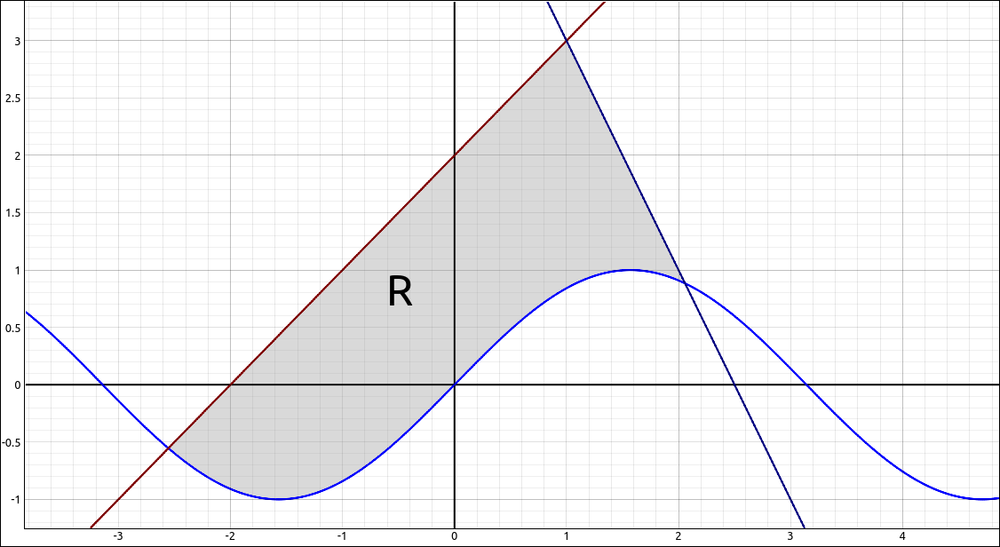

    Multiple Region

This is neither a Type I nor a Type II region, but using the above property we can split this integral up into two segments that are both Type I.  We would then integrate each separately and add the results.

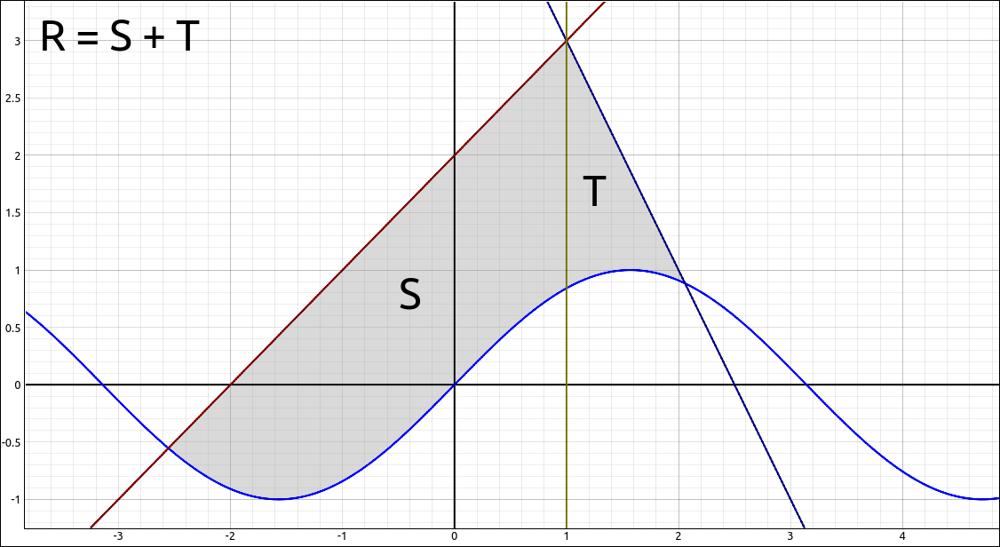

    Multiple Region

Changing the Order of Integration
---------------------------------

We mentioned above that some regions are both Type I and Type II.  In this case you can choose which order you set the iterated integrals up. By Fubini's theorem we will get the same result either way.  The big difference is in the integration order.  In one order the integral can be easy and in the other very hard.  So if you have an integral that is difficult to do then possibly reversing the order may make the calculations easier to do.

Example: :math:`\int_0^1 \int_x^1 \sin(y^2) \; dy \; dx`
^^^^^^^^^^^^^^^^^^^^^^^^^^^^^^^^^^^^^^^^^^^^^^^^^^^^^^^^

The goal here is to find,

.. math::
    \int_0^1 \int_x^1 \sin(y^2) \; dy \; dx

For this integral the region is the following,

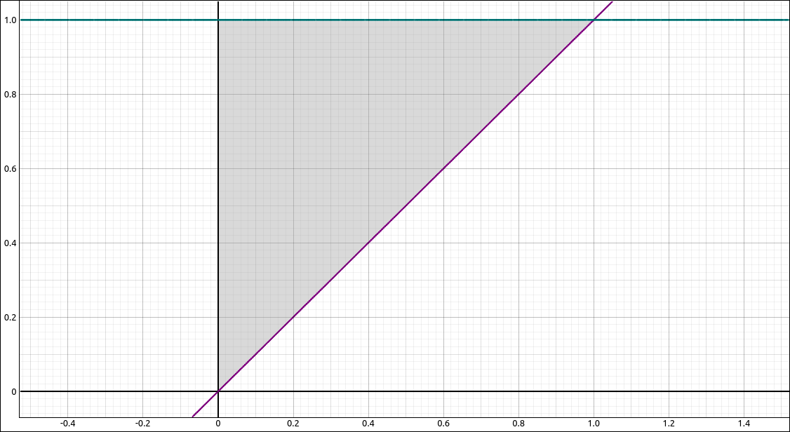

    Region

and it is set up as a Type I region.  If we revise this to a Type II integral we get,

.. math::
    \int_0^1 \int_0^y \sin(y^2) \; dx \; dy

If you do both of these by hand you will see that the second is easier.  We will attack these with the machine.

CLAE
""""

Doing this integral,

.. math::
    \int_0^1 \int_x^1 \sin(y^2) \; dy \; dx

The result is,

.. math::
    - \frac{3 \sqrt{2} \sqrt{\pi} \left(\frac{3 \sqrt{2} \cos{\left(1 \right)} \Gamma\left(\frac{3}{4}\right)}{8 \sqrt{\pi} \Gamma\left(\frac{7}{4}\right)} + \frac{3 S\left(\frac{\sqrt{2}}{\sqrt{\pi}}\right) \Gamma\left(\frac{3}{4}\right)}{4 \Gamma\left(\frac{7}{4}\right)}\right) \Gamma\left(\frac{3}{4}\right)}{8 \Gamma\left(\frac{7}{4}\right)} + \frac{3 \sqrt{2} \sqrt{\pi} S\left(\frac{\sqrt{2}}{\sqrt{\pi}}\right) \Gamma\left(\frac{3}{4}\right)}{8 \Gamma\left(\frac{7}{4}\right)} + \frac{9 \Gamma^{2}\left(\frac{3}{4}\right)}{32 \Gamma^{2}\left(\frac{7}{4}\right)}

which approximates to 0.2298488470659301413. Doing this integral,

.. math::
    \int_0^1 \int_0^y \sin(y^2) \; dx \; dy

The result is,

.. math::
    \frac{1}{2} - \frac{\cos{\left(1 \right)}}{2}

which also approximates to 0.2298488470659301413.

Maxima
""""""

For the integral,

.. math::
    \int_0^1 \int_x^1 \sin(y^2) \; dy \; dx

the command is,

.. code-block:: console

    integrate(integrate(sin(y**2), y, x, 1), x, 0, 1);

The result is,

.. math::
    -\operatorname{(}{{\% e}^{-\% i}} \operatorname{(}\sqrt{-\% i} \left( \% i \left( {{\left( -1\right) }^{\frac{1}{4}}} \sqrt{2} {{\% e}^{2 \% i}}-{{\left( -1\right) }^{\frac{1}{4}}} \sqrt{2} {{\% e}^{\% i}}\right) +{{\left( -1\right) }^{\frac{1}{4}}} \sqrt{2} {{\% e}^{2 \% i}}-{{\left( -1\right) }^{\frac{1}{4}}} \sqrt{2} {{\% e}^{\% i}}\right) +2 {{\left( -1\right) }^{\frac{1}{4}}} {{\% e}^{2 \% i}}+\left( \sqrt{2}-\sqrt{2} {{\% e}^{\% i}}\right)  \% i +\left( -\sqrt{2}-4 {{\left( -1\right) }^{\frac{1}{4}}}\right)  {{\% e}^{\% i}}+\sqrt{2}+2 {{\left( -1\right) }^{\frac{1}{4}}}\operatorname{)}\operatorname{)}/\left( 16 {{\left( -1\right) }^{\frac{1}{4}}}\right) \mbox{}

For the integral,

.. math::
    \int_0^1 \int_0^y \sin(y^2) \; dx \; dy

the command is,

.. code-block:: console

    integrate(integrate(sin(y**2), x, 0, y), y, 0, 1);

and the result is,

.. math::
    \frac{1}{2} - \frac{\cos{\left(1 \right)}}{2}

