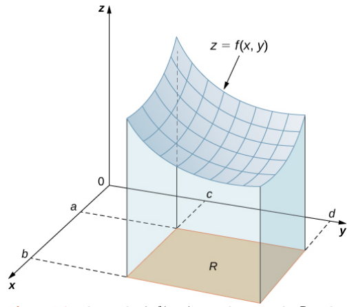
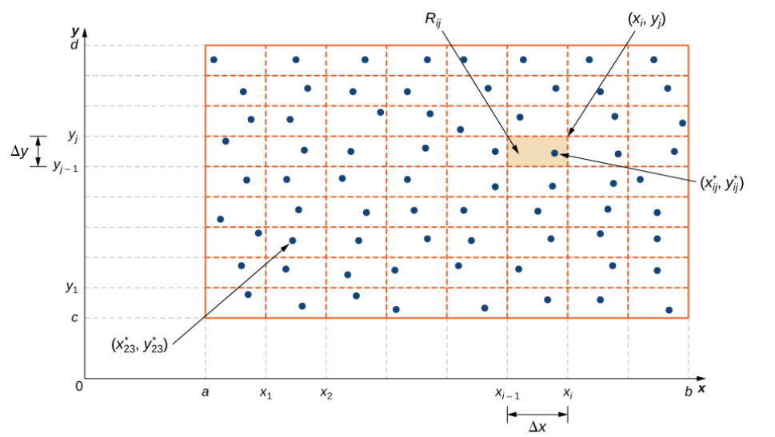
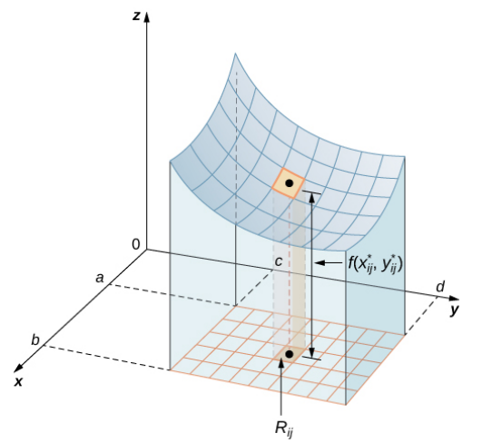
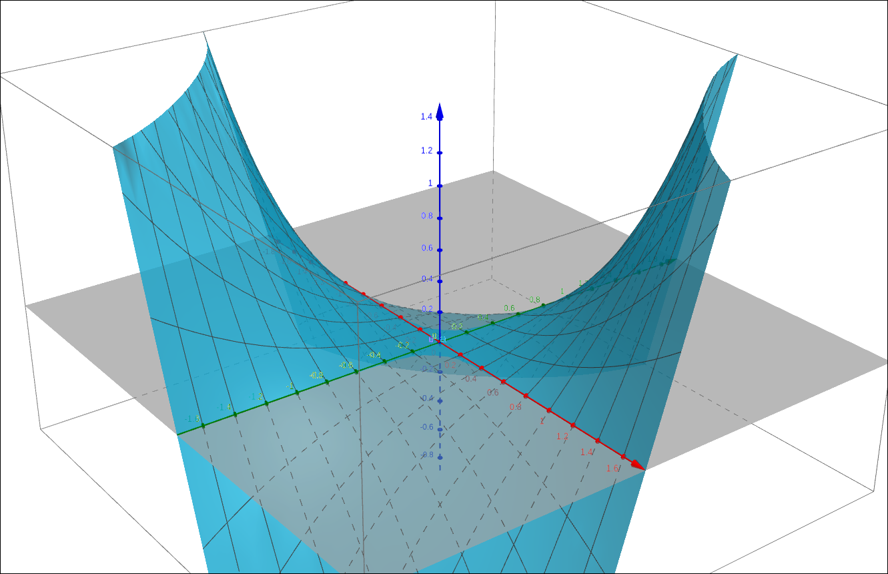
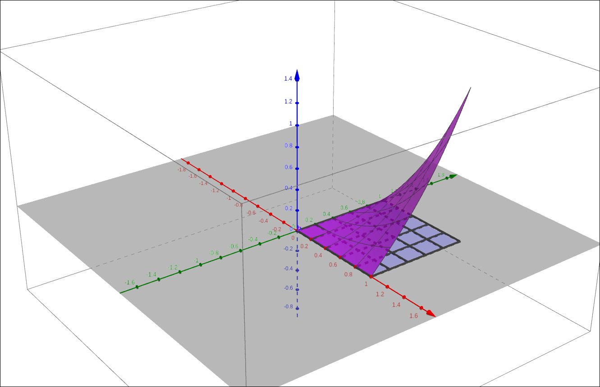
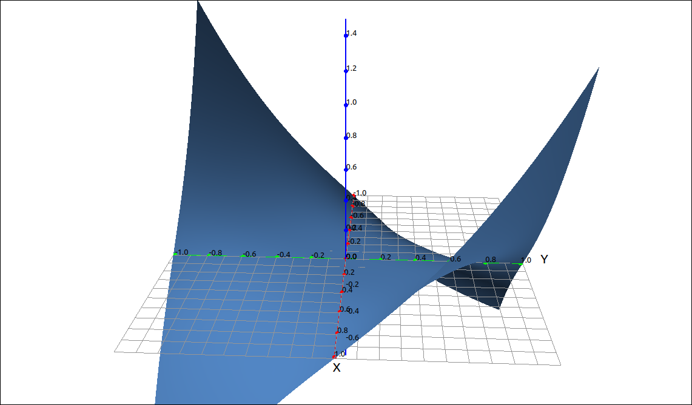

:index:`Double Integrals over Rectangular Regions`
==================================================

Discussion & Definitions
------------------------

Double integrals are constructed in a similar manner as we did with single integrals. When we defined the integral we started by considering the area under a curve over some interval.  We took the interval, subdivided it into *n* subintervals, took a sample point in each subinterval, used the sample point to create an approximating rectangle, add up all the approximating rectangle areas to get a Riemann sum, and finally take the limit of the Riemann sum as *n* went to infinity and we had the integral.

Double integrals are formed in the same manner. We start with wanting the volume under a surface and over a rectangular region :math:`R = [a, b] \times [c, d]` as in the figure below.

    Volume Under a Surface

Take the region *R* and divide the *x* range into *m* subintervals and the *y* range into *n* subintervals.

    Region Subdivision

This gives us :math:`mn` subrectangles that make up the region *R*.  In addition, :math:`\Delta x = \frac{b-a}{m}`, :math:`\Delta y = \frac{d-c}{n}`, and :math:`\Delta A = \Delta x \Delta y.`  In each rectangle choose a sample point :math:`(x_{ij}^*, y_{ij}^*).`

    Approximating Volume

Now construct an approximating rectangular solid :math:`R_{ij} = f(x_{ij}^*, y_{ij}^*) \Delta A.` Then we can approximate the volume under the surface as the double Riemann sum,

.. math::
    V \approx \sum_{i = 1}^m \sum_{j = 1}^n R_{ij} = \sum_{i = 1}^m \sum_{j = 1}^n f(x_{ij}^*, y_{ij}^*) \Delta A

Finally, take the limit, if it exists,

.. math::
    V = \lim_{m, n \to \infty} \sum_{i = 1}^m \sum_{j = 1}^n f(x_{ij}^*, y_{ij}^*) \Delta A

.. admonition:: Definition: Double Integral over a Rectangular Region

    The double integral of :math:`f(x, y)` over a rectangular region *R* is,

    .. math::
        \iint_{R} f(x, y) \; dA = \lim_{m, n \to \infty} \sum_{i = 1}^m \sum_{j = 1}^n f(x_{ij}^*, y_{ij}^*) \Delta A

    If this limit exists.

As with single integrals, this represents a net volume, that is, the volume under the surface and above the region minus the volume below the region.

Calculating Double Integrals
----------------------------

As with single integrals, using the definition is cumbersome to calculate.  We can formulate the calculations as an iterated integral, that is, a single integral inside another single integral.

.. admonition:: Theorem: Fubini’s Theorem

    Given a function :math:`f(x, y)` that is continuous over a region :math:`R = [a, b] \times [c, d]`, then,

    .. math::
        \iint_{R} f(x, y) \; dA = \iint_{R} f(x, y) \; dx \; dy = \int_a^b \int_c^d f(x, y) \; dy \; dx = \int_c^d \int_a^b f(x, y) \; dx \; dy

.. note::

    Note that in the notation above the iterated integral really means,

    .. math::
        \int_a^b \int_c^d f(x, y) \; dy \; dx = \int_a^b \left( \int_c^d f(x, y) \; dy \right) \; dx

    In other words, we calculate the inside integral and then we integrate the result in the outer integral.

Fubini’s Theorem tells us that we can calculate the double integral by either taking the integral with respect to *x* first and then *y* or the other way around.  When doing these integrals by hand it can make a difference which order we use.  The results will be the same but it is possible that reversing the order may make the integrals easier to do.  Even when using the computer to do the integration one order may produce a better result than another.

Example: :math:`f(x, y) = x y \sqrt{x^{2} + y^{2}}` over :math:`R = [0, 1] \times [0, 1]`
^^^^^^^^^^^^^^^^^^^^^^^^^^^^^^^^^^^^^^^^^^^^^^^^^^^^^^^^^^^^^^^^^^^^^^^^^^^^^^^^^^^^^^^^^

GeoGebra
""""""""

GeoGebra will not do multiple integrals but we cn still use it to visualize the volume we are calculating.  Input the function,

.. code-block:: console

    x y sqrt(x^2 + y^2)

The graph should look like the following, note that we did scale the axes.

    :math:`f(x, y) = x y \sqrt{x^{2} + y^{2}}`

Now input the region,

.. code-block:: console

    (0 <= x <= 1) && (0 <= y <= 1)

Also input ``a, b`` to get the portion of the surface restricted to the region.  The result should look like,

    :math:`f(x, y) = x y \sqrt{x^{2} + y^{2}}` on *R*

CLAE
""""

In CLAE, input the function and click and drag it over to the 3D graphics window.

.. code-block:: console

    x*y*sqrt(x^2 + y^2)

    :math:`f(x, y) = x y \sqrt{x^{2} + y^{2}}`

Note that we did scale the axes.  To find the double integral we select the function, then select ``Calculus > Multiple Integrals > Double Integral``, in the dialog box input ``x`` for the first variable, then ``0`` and ``1`` for the bounds, then input ``y`` for the second variable and ``0`` and ``1`` for its bounds.  Click OK and the result should be,

.. math::
    - \frac{2}{15} + \frac{4 \sqrt{2}}{15}

Maxima
""""""

In Maxima we can find the double integral by using two integrate command together,

.. code-block:: console

    integrate(integrate(x*y*sqrt(x^2 + y^2), x, 0, 1), y, 0, 1);

Maxima will ask you if *y* is positive or negative, not sure why it does since we gave the range for *y* but nonetheless input positive (or just p) and the result is,

.. math::
    \frac{{{2}^{\frac{5}{2}}}-1}{15}-\frac{1}{15}

Double Integral Properties
--------------------------

The double integral has similar properties to the single integral.

.. admonition:: Theorem: Double Integral Properties

    Assume that the functions :math:`f(x, y)` and :math:`g(x, y)` are integrable over the rectangular region :math:`R` and that :math:`S` and :math:`T` are subregions of :math:`R`, then,

    1. The function :math:`f(x, y) + g(x, y)` is integrable, and

    .. math::
        \iint_{R} f(x, y) + g(x, y) \; dA = \iint_{R} f(x, y) \; dA + \iint_{R} g(x, y) \; dA

    2. For a constant *c*, the function :math:`cf(x, y)` is integrable, and

    .. math::
        \iint_{R} c f(x, y) \; dA = c \iint_{R} f(x, y) \; dA

    3. If :math:`R = S \cup T` and :math:`S \cap T = \emptyset` except for overlap on the boundaries, then

    .. math::
        \iint_{R} f(x, y) \; dA = \iint_{S} f(x, y) \; dA + \iint_{T} f(x, y) \; dA

    4. If :math:`f(x, y) \geq g(x, y)` for all points in *R*, then

    .. math::
        \iint_{R} f(x, y) \; dA \geq \iint_{R} g(x, y) \; dA

    5. If :math:`m \leq f(x, y) \leq M`, then

    .. math::
        m A(R) \leq  \iint_{R} f(x, y) \; dA \leq M A(R)

    6. If :math:`f(x, y) = g(x) h(y)`, then

    .. math::
        \iint_{R} f(x, y) \; dA = \left( \int_a^b g(x) \; dx \right) \left( \int_c^d h(y) \; dy \right)

