:index:`Functions of Several Variables`
=======================================

Functions of Two Variables
--------------------------

.. admonition:: Definition: Functions of Two Variables

    A function of two variables :math:`z = f(x, y)` maps each ordered pair :math:`(x, y)` in a subset *D* of the real plane :math:`\mathbb{R}^2` to a unique real number *z*. The set *D* is called the domain of the function. The range of the function is the set of all real numbers *z* that has at least one ordered pair :math:`(x, y) \in D` such that :math:`f(x, y) = z`.

Example: :math:`z = \sin(x) + \cos(y)`
^^^^^^^^^^^^^^^^^^^^^^^^^^^^^^^^^^^^^^

GeoGebra
""""""""

Input the function,

.. code-block:: console

    sin(x) + cos(y)

The plot looks like the following, this is commonly called the egg carton function.  We will discuss graphing methods later, just think of it as all the points :math:`(x, y, z)` with *x* and *y* any real numbers and :math:`z = \sin(x) + \cos(y).`

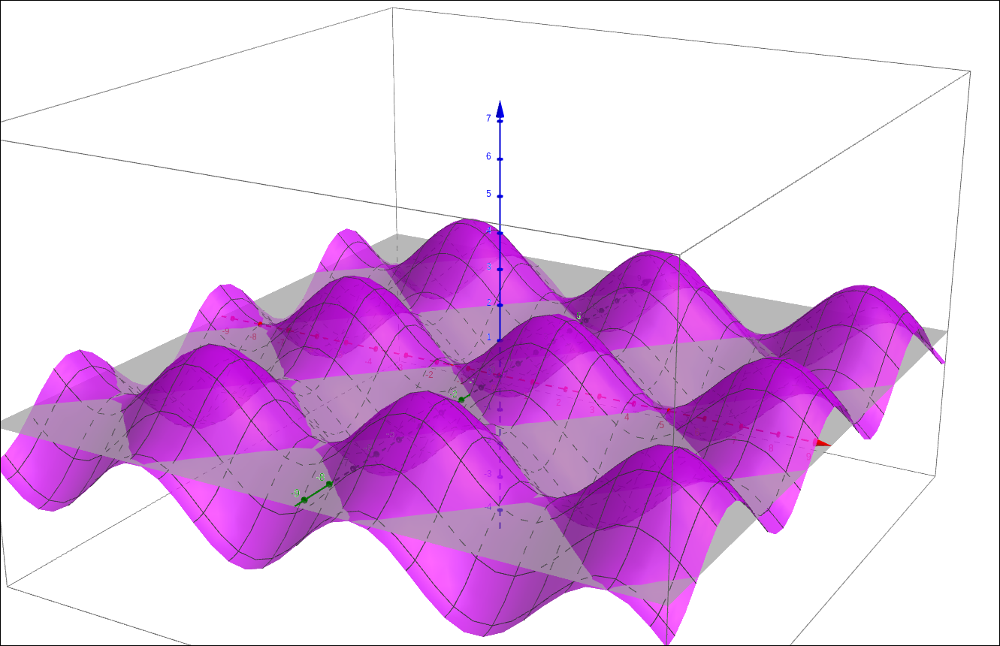

    :math:`z = \sin(x) + \cos(y)`

The domain of this function is all of :math:`\mathbb{R}^2` since any values of *x* and *y* result in a real number for *z*.

CLAE
""""

Input the function,

.. code-block:: console

    sin(x) + cos(y)

Click and drag this over to the 3D graphics window and we will see the following, this is commonly called the egg carton function.  We will discuss graphing methods later, just think of it as all the points :math:`(x, y, z)` with *x* and *y* any real numbers and :math:`z = \sin(x) + \cos(y).`

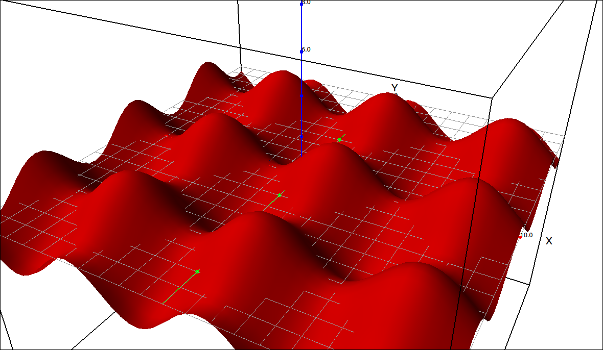

    :math:`z = \sin(x) + \cos(y)`

The domain of this function is all of :math:`\mathbb{R}^2` since any values of *x* and *y* result in a real number for *z*.

Example: :math:`z = \sqrt{9 - x^2-y^2}`
^^^^^^^^^^^^^^^^^^^^^^^^^^^^^^^^^^^^^^^

GeoGebra
""""""""

Input the function,

.. code-block:: console

    sqrt(-x^2-y^2+9)

The plot looks like the following. It is the top half of a sphere.

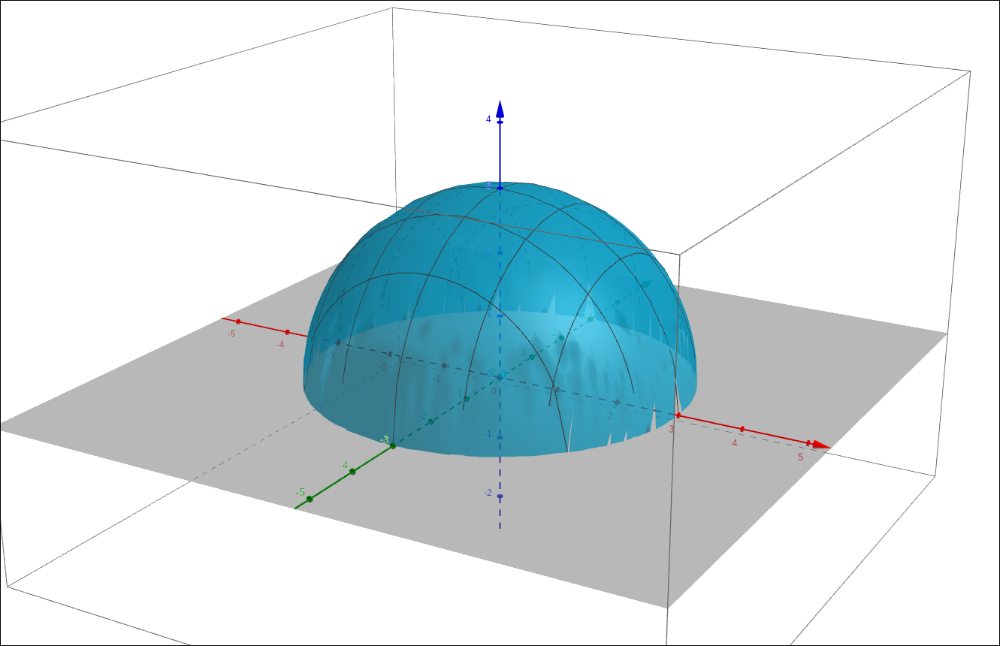

    :math:`z = \sqrt{9 - x^2-y^2}`

GeoGebra does an excellent job at graphing surfaces, even close to the domain edges where it can get choppy, even when using adaptive methods. To find the domain graphically, we can move the camera up to the top of the *z* axis and see what the plot covers.

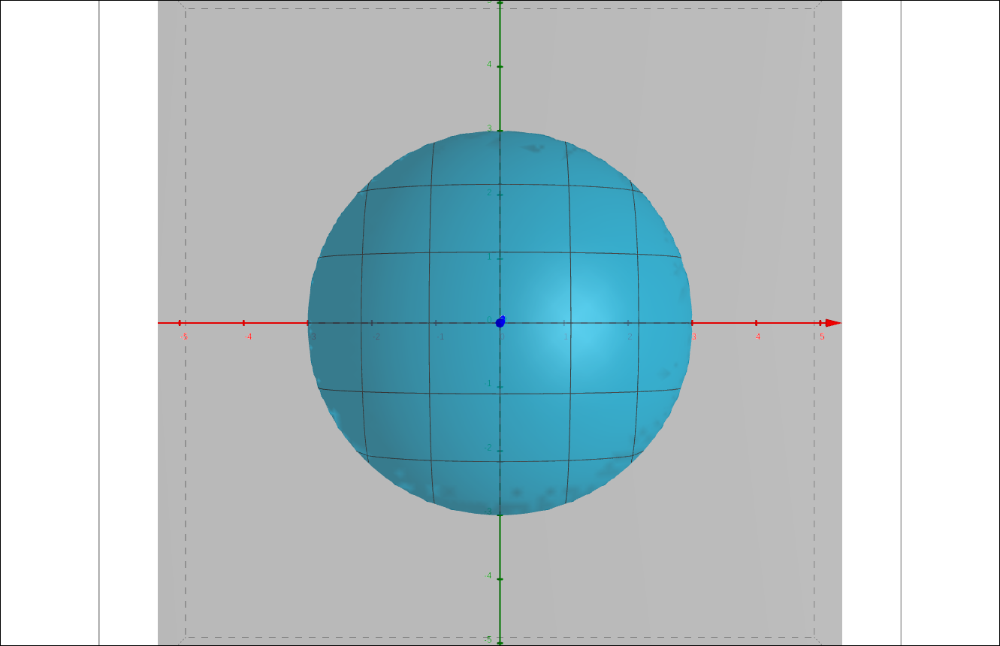

    :math:`z = \sqrt{9 - x^2-y^2}`

So it appears that the domain of this function is the circle (really the disk) centered at the origin and radius 3.

If we take an algebraic approach we know that to return a real number we must have :math:`9 - x^2-y^2 \geq 0` which is the same as :math:`x^2+y^2 \leq 9.`  Which is the disk orf radius 3 centered st the origin.

Another thing that GeoGebra does very well is graphing regions, such as domain.  If we input the above inequality,

.. code-block:: console

    x^2+y^2 <= 9

and we hide the surface, we get,

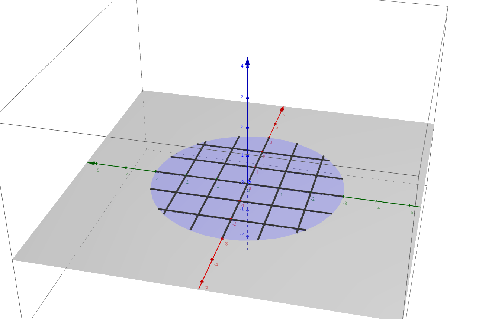

    Domain of :math:`z = \sqrt{9 - x^2-y^2}`

and if we switch back to 2D perspective we get,

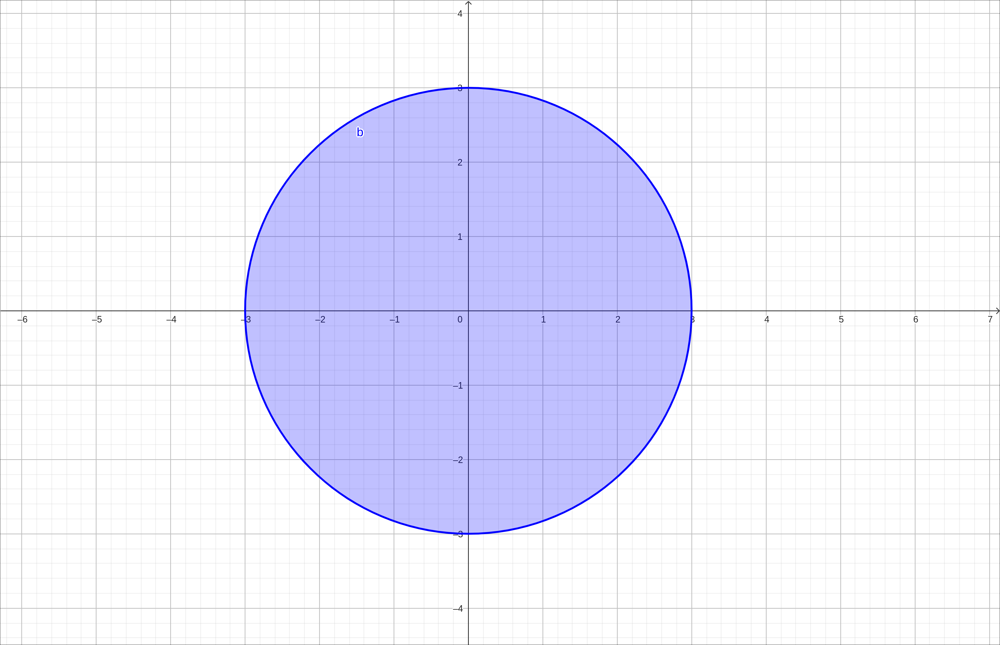

    Domain of :math:`z = \sqrt{9 - x^2-y^2}`

CLAE
""""

Input the function,

.. code-block:: console

    sqrt(-x^2-y^2+9)

The plot looks like the following. It is the top half of a sphere.

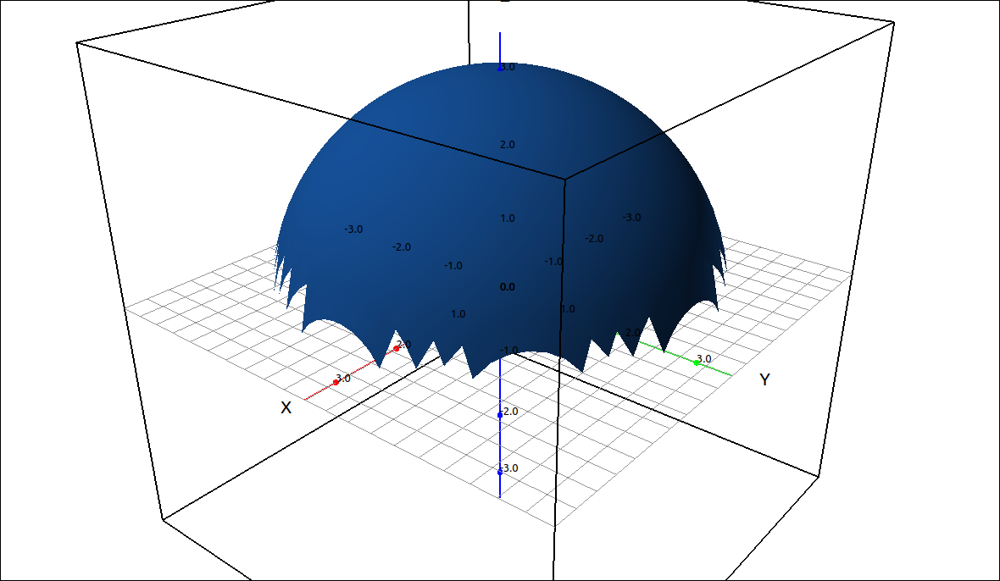

    :math:`z = \sqrt{9 - x^2-y^2}`

Note that it is very jagged around the edges, this is common for many software packages that do not use adaptive methods, in order to speed up graphical throughput.  To find the domain graphically, we can move the camera up to the top of the *z* axis and see what the plot covers.

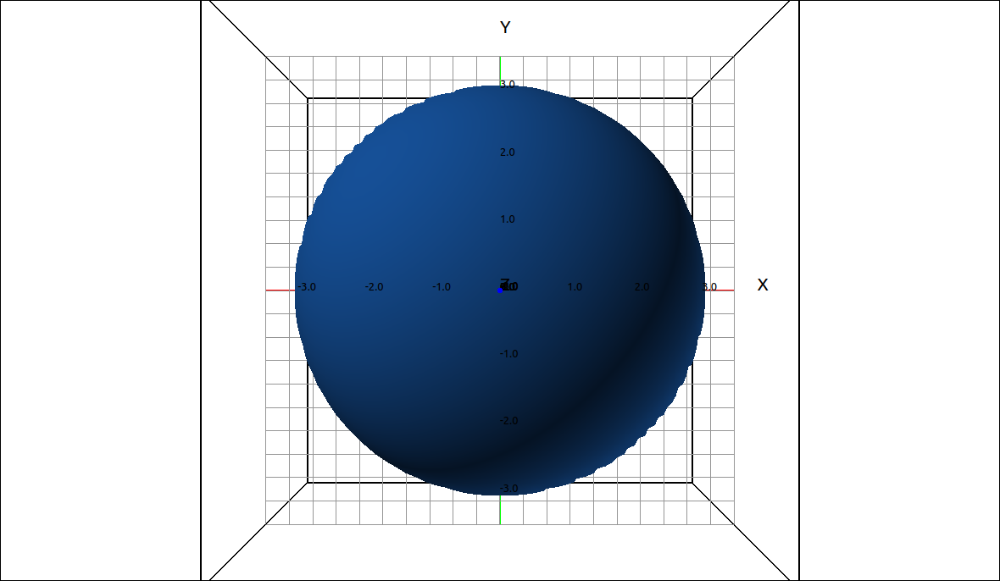

    :math:`z = \sqrt{9 - x^2-y^2}`

It appears that the domain of this function is the circle (really the disk) centered at the origin and radius 3.

If we take an algebraic approach we know that to return a real number we must have :math:`9 - x^2-y^2 \geq 0` which is the same as :math:`x^2+y^2 \leq 9.`  Which is the disk orf radius 3 centered st the origin.

Graphing Functions of Two Variables
-----------------------------------

One advantage to using CAS or graphing software is that you do not need to go through all of the tedious calculation to get an image of a curve or surface.  On the other hand, just as with functions in one variable, knowing relationships between the graph and the calculus (and other indicators) give us a better understanding of the function.  We will examine the relationships between functions and calculus in later sections, for now we will look at traces.

Traces
^^^^^^

.. admonition:: Definition: Vertical Trace

    Consider a function :math:`z = f(x, y)` with domain :math:`D \subseteq \mathbb{R}^2.` A **vertical trace** of the function can be either the set of points :math:`z = f(a, y)` for some constant *a* or :math:`z = f(x, b)` for some constant *b*.

Another way to think about a trace is as the intersection of a surface and a vertical plane.

Example: Traces of :math:`z = \sin(x) + \cos(y)`
^^^^^^^^^^^^^^^^^^^^^^^^^^^^^^^^^^^^^^^^^^^^^^^^

GeoGebra
""""""""

Input the function,

.. code-block:: console

    sin(x) + cos(y)

The plot looks like the following.

    :math:`z = \sin(x) + \cos(y)`

To visualize traces of this function we will insert a vertical plane.  Input ``x = d``, note we can use any other letter in place of ``d`` as long as it has not been used as the name of something.  The image is now the following and there is a slider for *d* in the workspace.

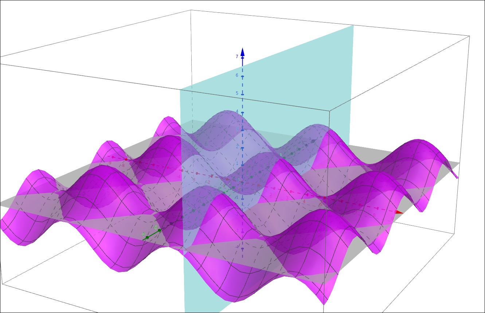

    :math:`z = \sin(x) + \cos(y)`

The trace is the intersection of these two surfaces.  You can move the *d* slider to see how the trace changes as the plane moves.  We can also get a graph of this line of intersection by selecting the intersect tool in the toolbar, then click on the plane, then click on the surface.  The result is,

    :math:`z = \sin(x) + \cos(y)`

CLAE
""""

Input the function,

.. code-block:: console

    sin(x) + cos(y)

Click and drag this to the 3D graphics window to get the graph.

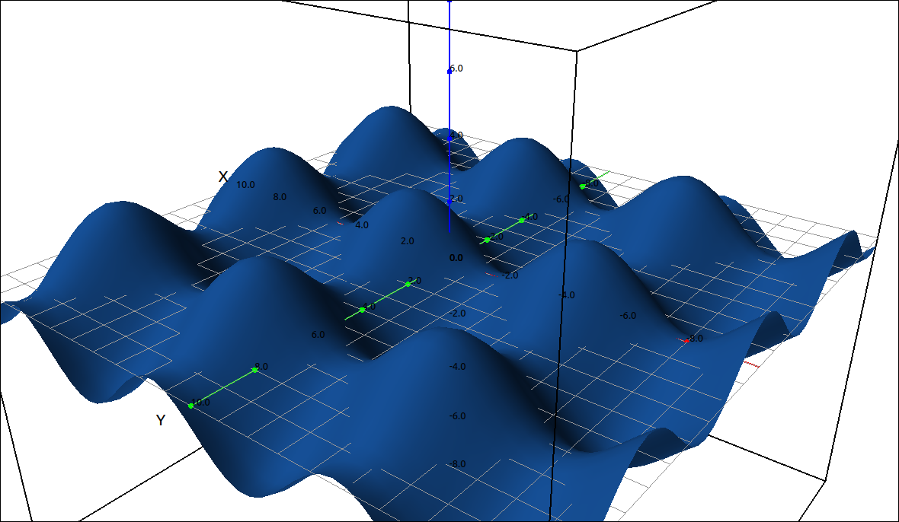

    :math:`z = \sin(x) + \cos(y)`

Now input ``a`` into the CAS, click and drag it to the 3D graphics window, change its type to Function Sheet, go into the properties and change the independent variable to *y* and the dependent variable to *x*.  this will give you the following graph,

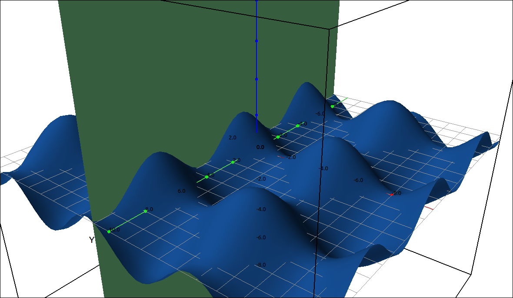

    :math:`z = \sin(x) + \cos(y)`

In this case it would be easier to simply put the plane in via the 3D menu system.  To do that, instead of what we did above you would, select ``Insert > Function Sheet`` from the graph menu, set the function to ``a``, the independent variable to ``y`` and the dependent variable to ``x``.

Move the *a* slider to see how the intersection changes as the vertical plane changes.  Since CLAE does not plot surfaces in a semi-transparent mode you can change the surface to plot a grid to see,

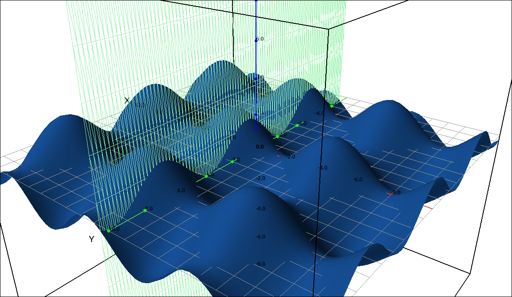

    :math:`z = \sin(x) + \cos(y)`

If you want the actual space curve for the intersection there are a number of ways to do this.  One possibility is to select the surface in the CAS, then ``Algebra > Evaluate``, the dialog will have the variables populated as ``[x, y]``, leave these as is, for the expressions input ``[a, t]`` and click OK.  We will assume that this result is in ``R2``, now select to input a vector and input ``[a, t, R2]`` into the dialog, this gives you the parametric equations for the space curve,

.. math::
    \left[\begin{array}{c}a\\t\\\sin{\left(a \right)} + \cos{\left(t \right)}\end{array}\right]

Click and drag this over to the 3D graphics window.

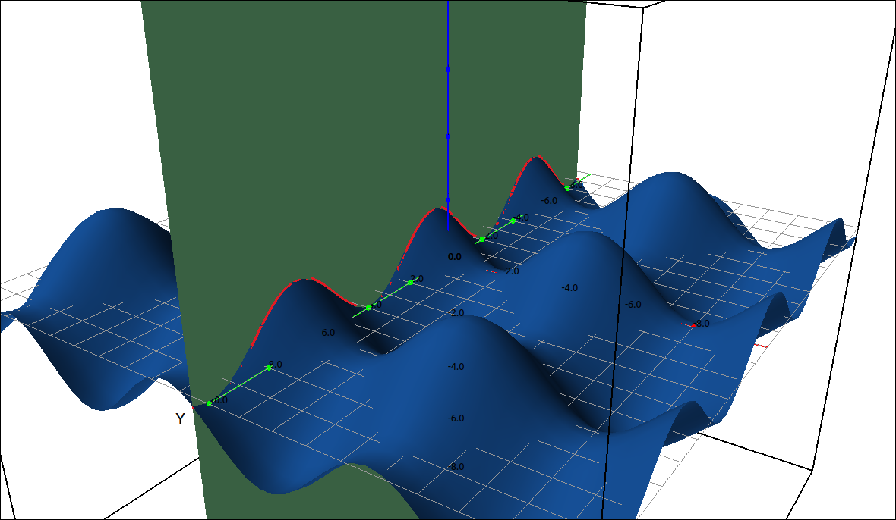

    :math:`z = \sin(x) + \cos(y)`

The line might be partially obscured by the surfaces. To better see the curve you can either change one or more surfaces to plotting a grid or you can hide one or more of the surfaces.

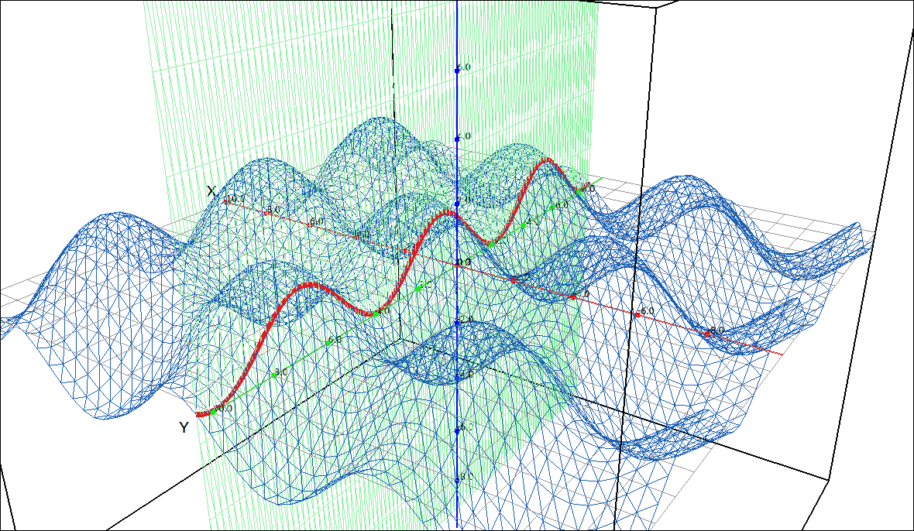

    :math:`z = \sin(x) + \cos(y)`

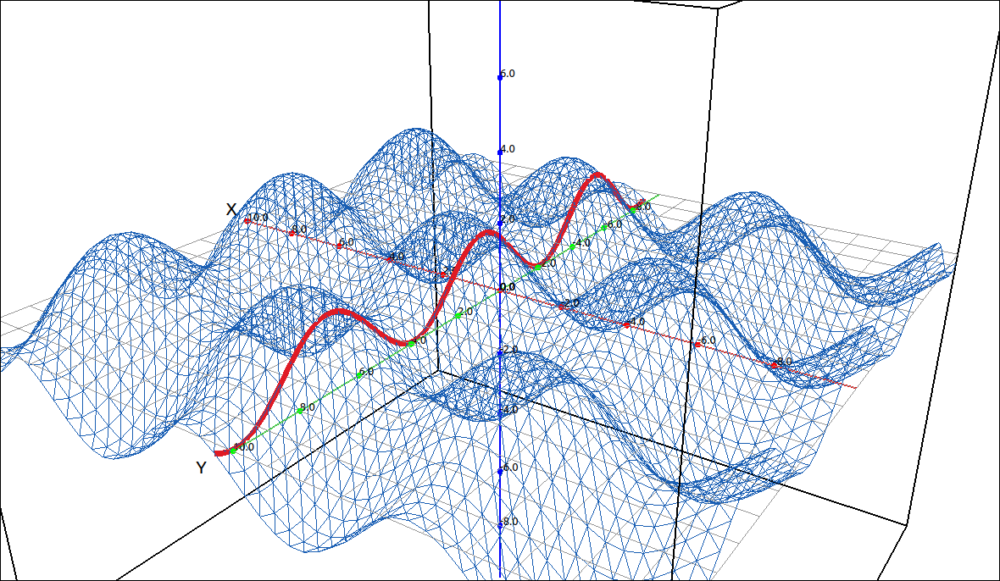

    :math:`z = \sin(x) + \cos(y)`

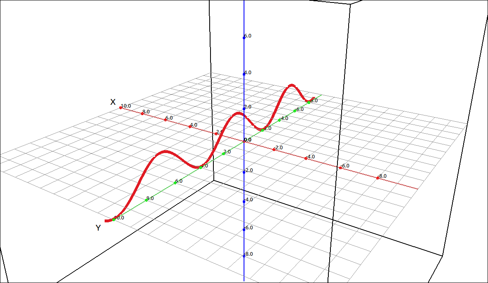

    :math:`z = \sin(x) + \cos(y)`

.. note::

    By setting *y* to a constant and keeping *x* as the variable we can view the traces in the other direction.

Level Curves and Contour Maps
-----------------------------

Another way we can visualize a function of two variables is as a topographic map in the plane.  That is, we draw curves in the plane at various heights.  Each line in this map is a level curve, that is, all points where the function is at some specified height (or *z* value).  The set of these level curves taken together is called a contour map.  Specifically,

.. admonition:: Definition: Level Curve

    Given a function :math:`f(x, y)` and a number *c* in the range of *f*, a level curve of the function is the set of all points satisfying the equation :math:`f(x, y) = c.`

Example: :math:`z = - x y e^{- x^{2} - y^{2}}`
^^^^^^^^^^^^^^^^^^^^^^^^^^^^^^^^^^^^^^^^^^^^^^

In this example we will graph a level curve and then a contour map of the function :math:`z = - x y e^{- x^{2} - y^{2}}.`

CLAE
""""

First input the function into the CAS,

.. code-block:: console

    -x*y*exp(-x^2 - y^2)

Click and drag this over to the 3D graphics window, it will look like a plane but at the origin there are a few humps.  Zoom in on this and scale the *z* axis until the surface looks like the following.  In the 3D graphics window the scaling options are under the Mouse Mode menu.  Once the scaling is done you should change the mode back to Camera Rotation and Zoom, there is a toolbar button for this to make that quick.

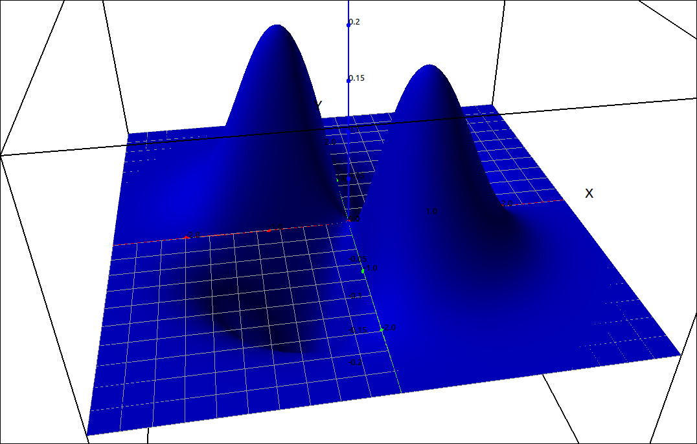

    :math:`z = - x y e^{- x^{2} - y^{2}}`

Note that the range of this function is approximately :math:`-0.18` to 0.18.  You may have noted from the definition of a level curve that all points satisfying the equation :math:`f(x, y) = c.` is simply an implicitly defined curve.  These were covered in the Differential Calculus part of these tutorials.  Recall that in CLAE we first make the implicit relation one with 0, that is, :math:`f(x, y) - c= 0` and then we graph this using the Implicit Relationship graphing type.

We will start with graphing the expression :math:`- x y e^{- x^{2} - y^{2}} = 0.1.` Assuming that the function is in ``R1``, input ``R1 - 0.1`` into the CAS.  Click and drag it to the 2D graphics window, you should see something like te following.

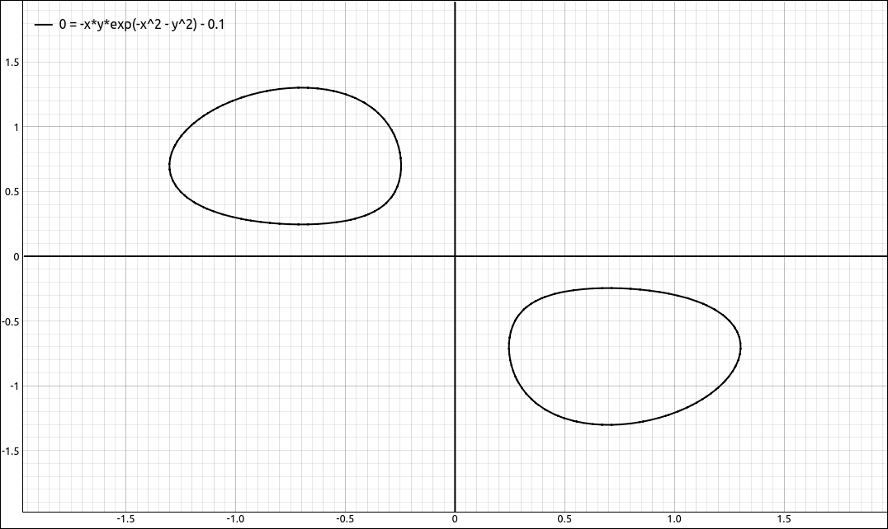

    :math:`0.1 = - x y e^{- x^{2} - y^{2}}`

If we go back to the 3D window and plot the function 0.1 we see,

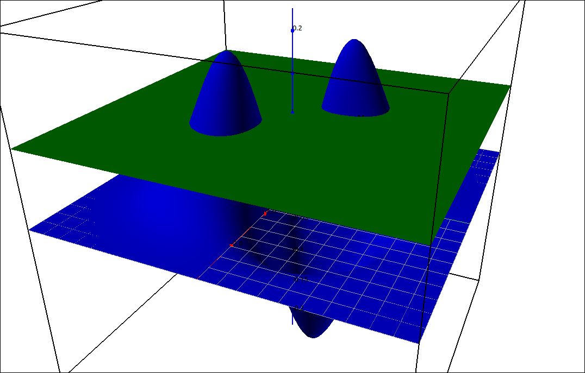

    :math:`z = - x y e^{- x^{2} - y^{2}}` and :math:`z = 0.1`

Note that the intersection of the surface and the plane is what is plotted in the level curve.  We can also make the graphing of the level curve dynamic. Clear the 2D graphics window, input ``R1 - a`` into the CAS, and plot this as an implicit relationship.  Change the *a* slider properties to go from :math:`-0.2` to 0.2.  Move the slider to see the changes in the level curves.

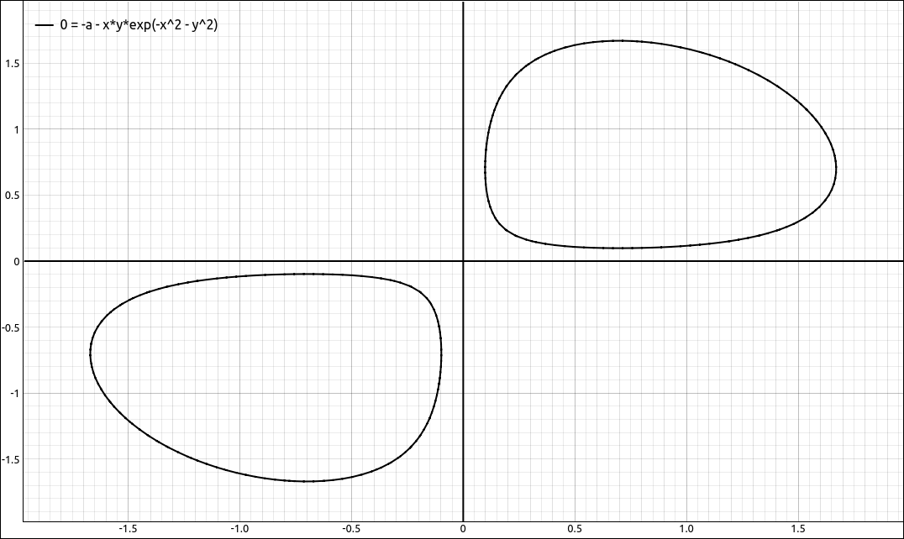

    :math:`a = - x y e^{- x^{2} - y^{2}}`

Now we will create a contour map of this function.  Clear the 2D graphics window and click and drag the original expression ``R1`` to the graph.  Change its type to Contour Map.  The image will not look very impressive since the default contour list is ``[-5, -4, -3, -2, -1, 0, 1, 2, 3, 4, 5]``.  Go into the properties and input the following as the list of contours.  The program will create a level curve to the function at each of the levels in this list.

.. code-block:: console

    [-0.1, -0.075, -0.05, -0.04, -0.03, -0.02, -0.01, -0.01, 0.0, 0.01, 0.01, 0.02, 0.03, 0.04, 0.05, 0.075, 0.1]

The image should be something like,

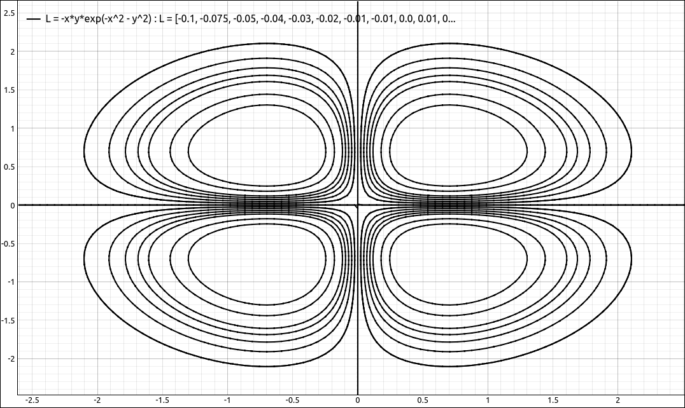

    Contour map of :math:`z = - x y e^{- x^{2} - y^{2}}`

Another thing you can do that is even more informative is graph the contour map along with the dynamic level curve we did above.  Then changing the slider will illustrate the heights of the contours.

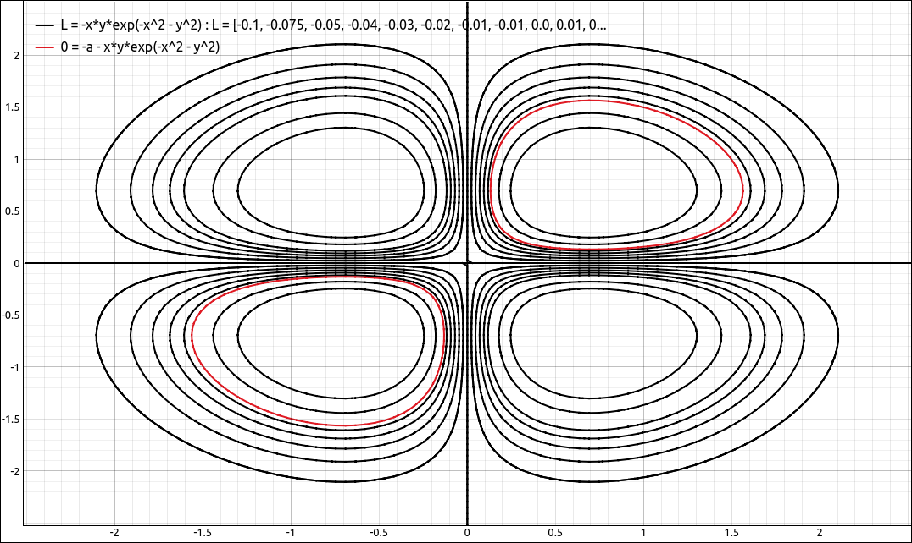

    Contour map of :math:`z = - x y e^{- x^{2} - y^{2}}`

Another option you have is to view a continuous color contour map using the 3D graph.  Go back to the 3D graph and hide the plane we plotted at 0.1.  Go into the properties of the surface and change the surface shading to Shade by Surface Height.

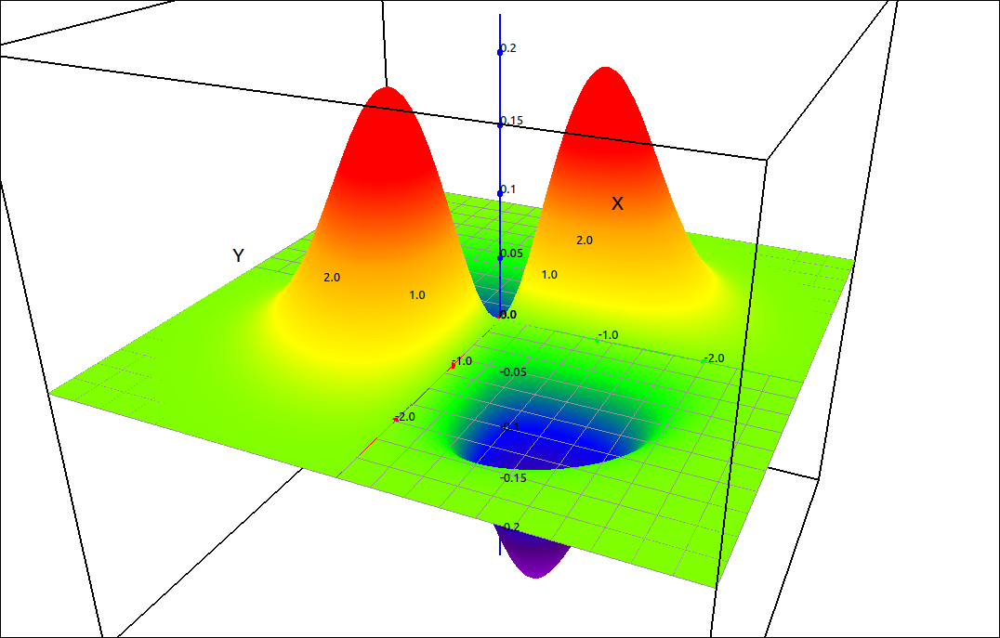

    :math:`z = - x y e^{- x^{2} - y^{2}}`

Now move the camera up to the top of the *z*-axis and change the viewing to Orthogonal Mode. You will see the following, which is a color contour map, the colors are ROYGBIV from top to bottom.

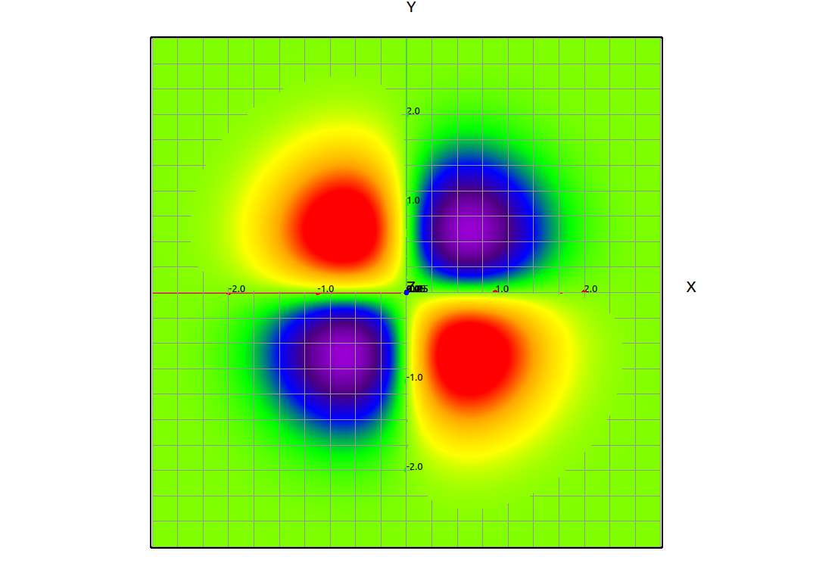

    :math:`z = - x y e^{- x^{2} - y^{2}}`

Example: :math:`z = - \frac{3 y}{x^{2} + y^{2} + 1}`
^^^^^^^^^^^^^^^^^^^^^^^^^^^^^^^^^^^^^^^^^^^^^^^^^^^^

CLAE
""""

We will follow the same procedures as we did in the last example to examine the level curves and contour maps of  :math:`z = - \frac{3 y}{x^{2} + y^{2} + 1}.`

Input the function,

.. code-block:: console

    -3*y/(x^2 + y^2 + 1)

Graph it in the 3D graphics plotter.  Note that this also requires zooming and the range of the function is approximately :math:`-1.5` to :math:`1.5.`

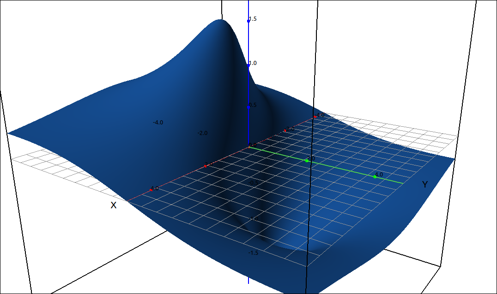

    :math:`z = - \frac{3 y}{x^{2} + y^{2} + 1}`

Here we will skip to the dynamic level curve plot.  Assuming that the function is in ``R1``, input ``R1-a`` into the CAS and plot the expression in the 2D graphics window.  Change the range of the *a* slider to  :math:`-1.5` to :math:`1.5.`  Move the slider to see the change in the level curve.

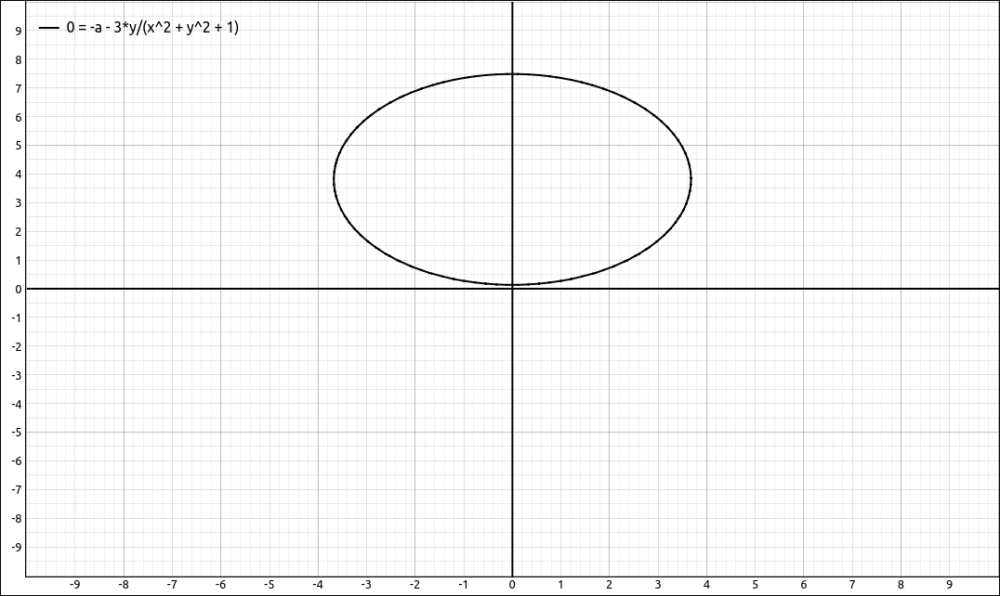

    :math:`a = - \frac{3 y}{x^{2} + y^{2} + 1}`

Now we move onto the contour map. Clear the plot, click and drag the original function to the graphics window, change the type to Contour Map and use the following contour list,

.. code-block:: console

    [-1.5, -1.35, -1.2, -1.05, -0.9, -0.75, -0.6, -0.45, -0.3, -0.15, 0, 0.15, 0.3, 0.45, 0.6, 0.75, 0.9, 1.05, 1.2, 1.35, 1.5]

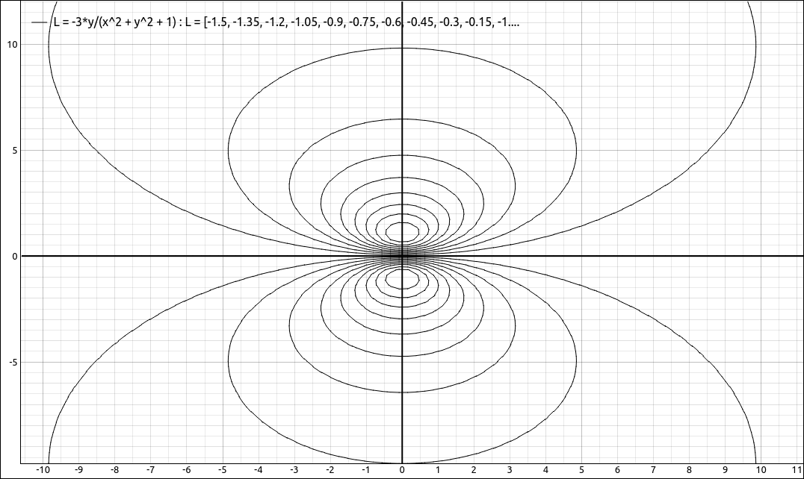

    Contour Map of :math:`z = - \frac{3 y}{x^{2} + y^{2} + 1}`

Note that CLAE has an option under the Edit menu that allows the user to create a sequence of evenly-spaced values.  This would some in handy for creating contour level lists.  Using the 3D graph with height shading gives us the following color contour map.

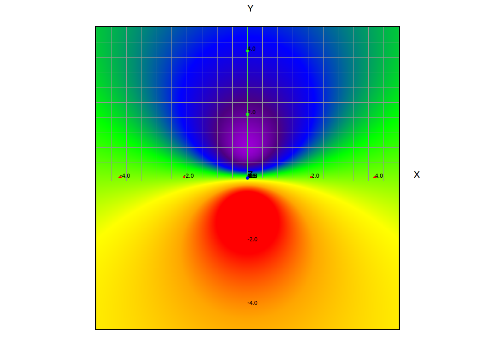

    Color Contour Map of :math:`z = - \frac{3 y}{x^{2} + y^{2} + 1}`

Functions of More Than Two Variables and Level Surfaces
-------------------------------------------------------

In practice, we can have functions in three or more variables.  For example, say we are modeling a financial transaction that includes 5 stock options and cash.  In this situation we could be working with a model function with 6 variables.  You can still apply Calculus to these functions, it just takes more sophisticated techniques to do the derivations.  We will examine functions of three variables here and leave the higher ones to more advanced courses.

An example of a function in three variables is

.. math::
    w = f(x, y, z) = x^2y-3xyz +\cos(y/x) + e^{x^2-y^2}

Unfortunately it takes four dimensions to visualize this function, so we have a problem here.  There are some ways we can visualize this function.  One way is to graph slices of the function.  That is, if we fix one of the variables as a constant, :math:`w = f(x, y, a)` and then graph this in three dimensions we can get a feel for the change along one of the axes.  We can also animate *a* for a better understanding.

Example: :math:`w = x^{2} y - 3 x y z`
^^^^^^^^^^^^^^^^^^^^^^^^^^^^^^^^^^^^^^

We will use the slicing technique to examine the function, :math:`w = x^{2} y - 3 x y z.`

CLAE
""""

Input the expression,

.. code-block:: console

    x^2*y - 3*x*y*z

Now we will replace *z* with a dynamic constant *a*.  Select ``Algebra > Evaluate`` edit the variables box to just ``z`` and input ``a`` for the expression.  Graph this,

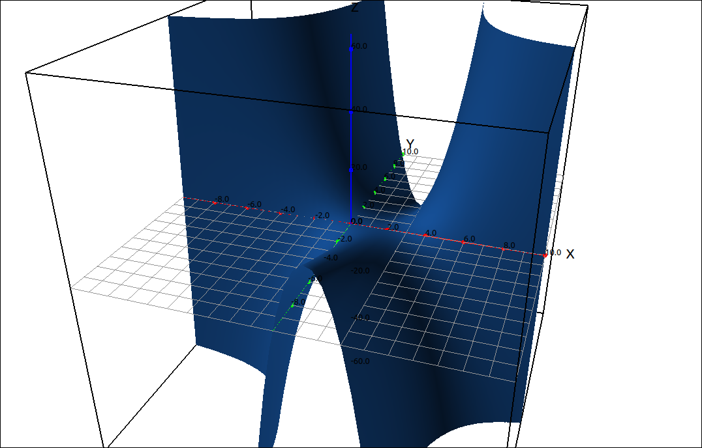

    :math:`w = x^{2} y - 3 x y a`

Change or animate the *a* slider to view the surface changes,

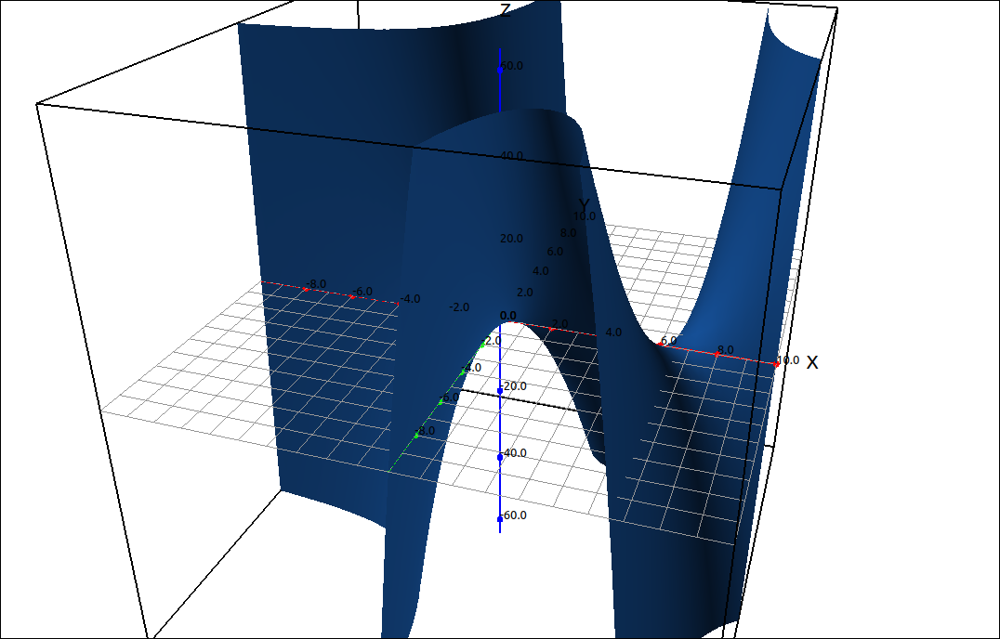

    :math:`w = x^{2} y - 3 x y a`

Putting these slices together to form a four-dimensional mental image of the "surface" probably will not happen, even in the most simple of cases but it still gives you some indication of the transition as one variable changes.  Note that if we wanted to do this with either *x* or *y* we will need to change the remaining two variables fo *x* and *y*.  If we leave *z* in the expression CLAE will think of this as an implicitly defined expression.

Another way to visualize these functions is with level surfaces.  This is when we fix *w* and graph the expression implicitly.  That is, fix a value *a* and then graph the implicit expression :math:`a = f(x, y, z).`

.. admonition:: Definition: Level Surface

    Given a function :math:`f(x, y, z)` and a number *c* in the range of *f*, a level surface is the set of points satisfying the equation :math:`f(x, y, z) = c.`

Example: :math:`w = \sin{\left(x + y \right)} + \sin{\left(y - z \right)} - \cos{\left(x - z \right)}`
^^^^^^^^^^^^^^^^^^^^^^^^^^^^^^^^^^^^^^^^^^^^^^^^^^^^^^^^^^^^^^^^^^^^^^^^^^^^^^^^^^^^^^^^^^^^^^^^^^^^^^

We will use level surfaces to examine the function, :math:`w = \sin{\left(x + y \right)} + \sin{\left(y - z \right)} - \cos{\left(x - z \right)}.`

CLAE
""""

Input the expression,

.. code-block:: console

    sin(x + y) + sin(y - z) - cos(x - z)

then subtract *a* from the expression and graph it in the 3D graphics window.  It is clear that the range of this function must be within :math:`[-3, 3].`  Change the *a* slider range to :math:`[-3, 3]` and then move the slider or animate the slider to see the level surfaces of the function.  The response will probably be a bit sluggish since plotting 3D implicit relationships is very computationally intensive.

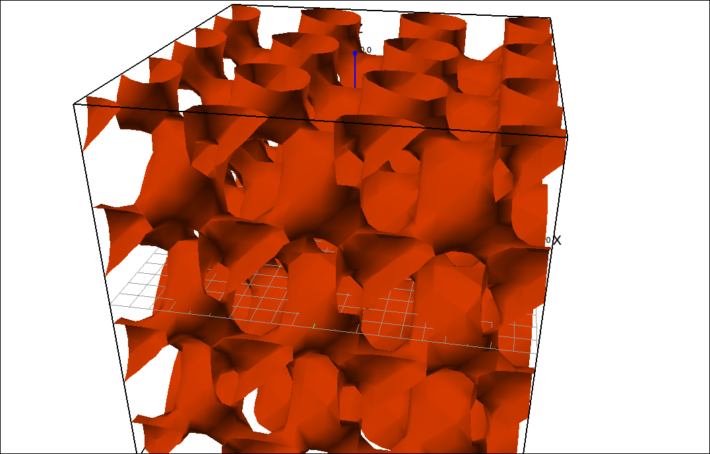

    :math:`a = \sin{\left(x + y \right)} + \sin{\left(y - z \right)} - \cos{\left(x - z \right)}`
