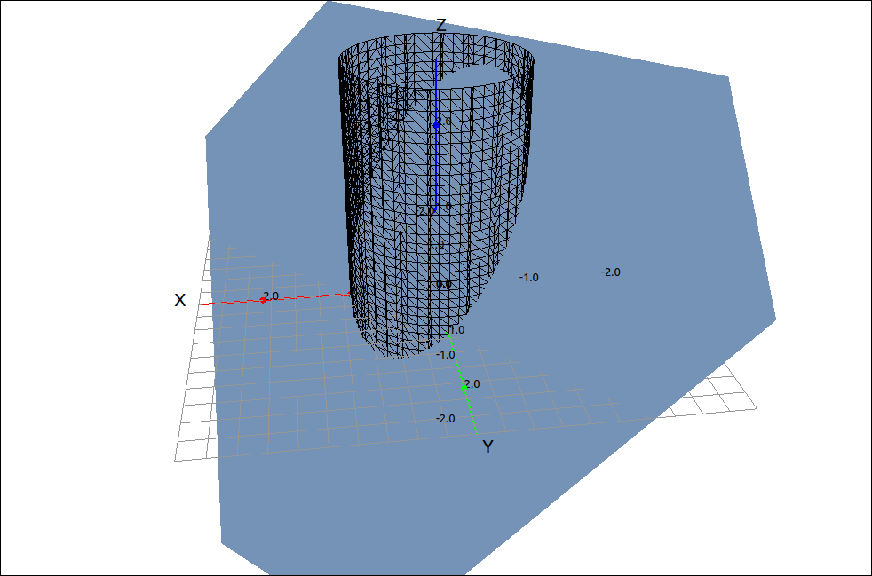

:index:`Lagrange Multipliers`
=============================

Method of Lagrange Multipliers: One Constraint
----------------------------------------------

We will not go through the theory of the Lagrange Multiplier method, this should be in your textbook.  Here we will state the method and go over a few examples.  We will start with the two-variable case and then do the three variable case, they are the same.  In general this method finds the maximum and minimum values of a surface :math:`f(x, y)` subject to the constraint of :math:`g(x, y) = k,` that is, the points of the surface that are on the line given implicitly as :math:`g(x, y) = k.`

.. admonition:: Theorem: Lagrange Multipliers with One Constraint

    To find the maximum and minimum values of :math:`f(x, y)` subject to the constraint :math:`g(x, y) = k` (if they exist),

    1. Find all values of :math:`x, y, {\rm and } \lambda` such that

    .. math::
        \nabla f(x, y) = \lambda \nabla g(x, y)  \qquad {\rm and } \qquad g(x, y) = k

    2. Evaluate the function at all the points resulting from step 1. The largest of these values is the maximum and the smallest is the minimum.

Example: :math:`z = x^{2} + 4 x + y^{2} - 6 y` with Constraint :math:`x^2+y^2 = 16`
^^^^^^^^^^^^^^^^^^^^^^^^^^^^^^^^^^^^^^^^^^^^^^^^^^^^^^^^^^^^^^^^^^^^^^^^^^^^^^^^^^^

Note that this is one of the examples from the last section.  This method could be used to find the maximum and minimum from the boundary of that example.

CLAE
""""

Input the function,

.. code-block:: console

    x^2 + 4*x + y^2 - 6*y

also input the constraint (set to 0).

.. code-block:: console

    x^2 + y^2 - 16

Find the gradiant of the function,

.. math::
    \left[\begin{array}{c}2 x + 4\\2 y - 6\end{array}\right]

and find the gradiant of the constraint,

.. math::
    \left[\begin{array}{c}2 x\\2 y\end{array}\right]

Now to create :math:`\nabla f(x, y) = \lambda \nabla g(x, y)` we could use lambda but it is easier to simply use a keyboard letter that is not being used as a variable, say *c*.  Assuming that the two gradiants are ``R3`` and ``R4`` respectively, input ``R3-c*R4`` the result is,

.. math::
    \left[\begin{array}{c}- 2 c x + 2 x + 4\\- 2 c y + 2 y - 6\end{array}\right]

Now we will add the constraint into the mix, select the vector input and input ``R5, R2`` this should result in

.. math::
    \left[\begin{array}{c}- 2 c x + 2 x + 4\\- 2 c y + 2 y - 6\\x^{2} + y^{2} - 16\end{array}\right]

Select ``Algebra > Solve`` and we get the solutions,

.. math::
    \left[ \left( 1 - \frac{\sqrt{13}}{4}, \  - \frac{8 \sqrt{13}}{13}, \  \frac{12 \sqrt{13}}{13}\right), \  \left( \frac{\sqrt{13}}{4} + 1, \  \frac{8 \sqrt{13}}{13}, \  - \frac{12 \sqrt{13}}{13}\right)\right]

Note that these are in ``[c, x, y]`` form.  Now we need to extract the two solutions and then the ``(x, y)`` portions of the two solutions.  To extract the solutions select ``Edit > Extract from List > Extract All List Entries``.  The results are the teo points,

.. math::
    \left( 1 - \frac{\sqrt{13}}{4}, \  - \frac{8 \sqrt{13}}{13}, \  \frac{12 \sqrt{13}}{13}\right)

.. math::
    \left( \frac{\sqrt{13}}{4} + 1, \  \frac{8 \sqrt{13}}{13}, \  - \frac{12 \sqrt{13}}{13}\right)

Now to extract the ``(x, y)`` pairs we can double-click the entry to bring it to the editing box and then remove the first component.  Another way is to select ``Edit > Extract from List > Extract/Reorder List by Pattern``, then input ``2, 3`` into the input box, this will extract entries 2 and 3 and build a new list from them.  Doing either of these methods with the two points gives us,

.. math::
    \left[ - \frac{8 \sqrt{13}}{13}, \  \frac{12 \sqrt{13}}{13}\right]

.. math::
    \left[ \frac{8 \sqrt{13}}{13}, \  - \frac{12 \sqrt{13}}{13}\right]

Now evaluate the original function at these two points and we get, respectively,

.. math::
    16 - 8 \sqrt{13} \qquad  {\rm and } \qquad 16 + 8 \sqrt{13}

The first is the minimum and the second is the maximum.

We can also look at the Lagrange Multiplier method for functions and constraints that involve three variables, the situation is the same.

.. admonition:: Theorem: Lagrange Multipliers with One Constraint and Three Variables

    To find the maximum and minimum values of :math:`f(x, y, z)` subject to the constraint :math:`g(x, y, z) = k` (if they exist),

    1. Find all values of :math:`x, y, z, {\rm and } \; \lambda` such that

    .. math::
        \nabla f(x, y, z) = \lambda \nabla g(x, y, z)  \qquad {\rm and } \qquad g(x, y, z) = k

    2. Evaluate the function at all the points resulting from step 1. The largest of these values is the maximum and the smallest is the minimum.

Method of Lagrange Multipliers: Two Constraints
-----------------------------------------------

.. admonition:: Theorem: Lagrange Multipliers with Two Constraints

    To find the maximum and minimum values of :math:`f(x, y, z)` subject to the two constraints :math:`g(x, y, z) = k` and :math:`h(x, y, z) = m` (if they exist),

    1. Find all values of :math:`x, y, z, \lambda, {\rm and } \; \mu` such that

    .. math::
        \nabla f(x, y, z) & = \lambda \nabla g(x, y, z) + \mu \nabla h(x, y, z) \\
        g(x, y, z) & = k \\
        h(x, y, z) & = m

    2. Evaluate the function at all the points resulting from step 1. The largest of these values is the maximum and the smallest is the minimum.

Example: Lagrange Multipliers with Two Constraints
^^^^^^^^^^^^^^^^^^^^^^^^^^^^^^^^^^^^^^^^^^^^^^^^^^

In this example we will find the maximum and minimum of the function :math:`3x -2y +4z` on the curve that is the intersection of the plane :math:`x+y+z=1` and the cylinder :math:`x^2+y^2=1.`  So in this example, :math:`f(x, y, z) = 3x -2y +4z,` :math:`g(x, y, z) = x+y+z-1,` and :math:`h(x, y, z) = x^2+y^2-1.`

CLAE
""""

We cannot graph the function we are maximizing and minimizing since it lives in four dimensions. We can, however, graph the constraint curve.  Inputting and plotting the two constraint equations,

    Constraint Curve

Input the function and the two constraints, take their gradiants and form the system to be solved, using *c* and *d* for :math:`\lambda` and :math:`\mu` respectively gives us,

.. math::
    \left[\begin{array}{c}- c - 2 d x + 3\\- c - 2 d y - 2\\4 - c\\x + y + z - 1\\x^{2} + y^{2} - 1\end{array}\right]

Solving gives us,

.. math::
    \left[ \left( 4, \  - \frac{\sqrt{37}}{2}, \  \frac{\sqrt{37}}{37}, \  \frac{6 \sqrt{37}}{37}, \  1 - \frac{7 \sqrt{37}}{37}\right), \  \left( 4, \  \frac{\sqrt{37}}{2}, \  - \frac{\sqrt{37}}{37}, \  - \frac{6 \sqrt{37}}{37}, \  1 + \frac{7 \sqrt{37}}{37}\right)\right]

Extracting the two solutions and the ``[x, y, z]`` components gives us the points,

.. math::
    \left[ \frac{\sqrt{37}}{37}, \  \frac{6 \sqrt{37}}{37}, \  1 - \frac{7 \sqrt{37}}{37}\right]

and

.. math::
    \left[ - \frac{\sqrt{37}}{37}, \  - \frac{6 \sqrt{37}}{37}, \  1 + \frac{7 \sqrt{37}}{37}\right]

Evaluating the function at these two points gives us, respectively,

.. math::
    4 - \sqrt{37} \approx -2.082762530298219689

and

.. math::
    4 + \sqrt{37} \approx 10.082762530298219689

So the minimum of the function is :math:`4 - \sqrt{37} \approx -2.082762530298219689` at :math:`\left[ \frac{\sqrt{37}}{37}, \  \frac{6 \sqrt{37}}{37}, \  1 - \frac{7 \sqrt{37}}{37}\right]` and the maximum of the function is :math:`4 + \sqrt{37} \approx 10.082762530298219689` at :math:`\left[ - \frac{\sqrt{37}}{37}, \  - \frac{6 \sqrt{37}}{37}, \  1 + \frac{7 \sqrt{37}}{37}\right].`

