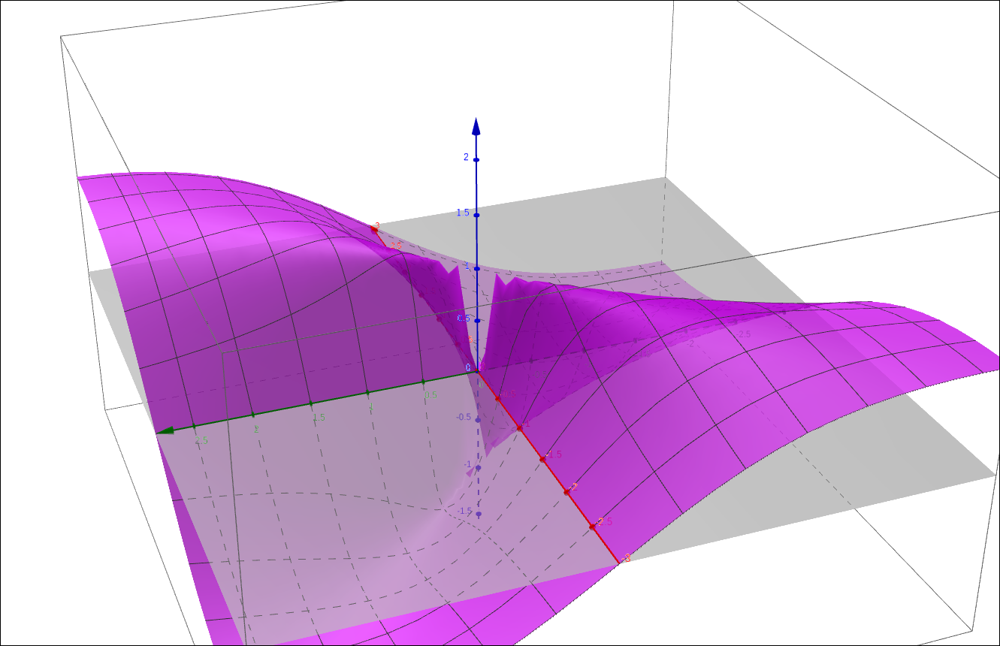
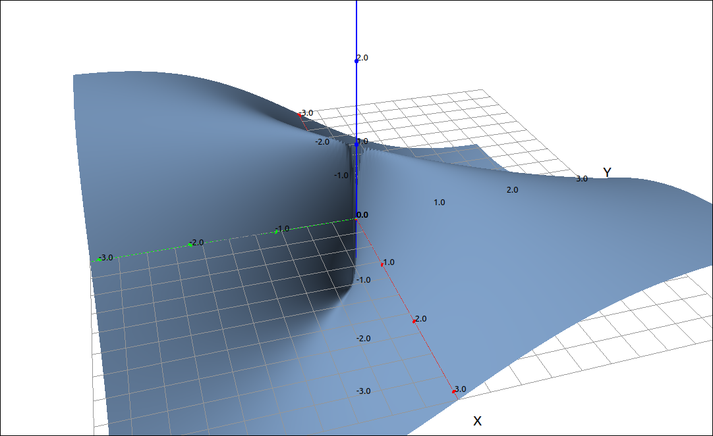
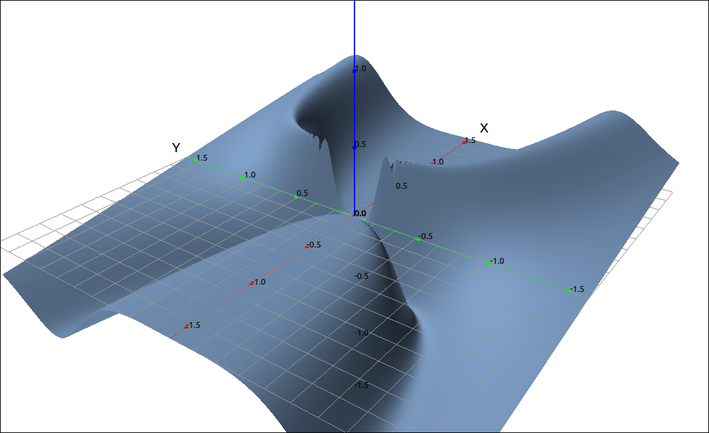
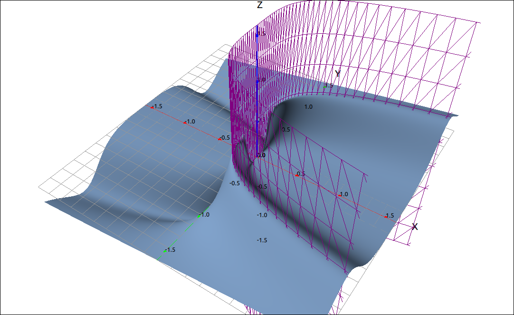

:index:`Limits and Continuity`
==============================

Limits
------

Limits for functions of two variables are a little more difficult to prove then their one variable counterparts. The big difference is that the domain of a function in two variables is a portion of the plane and not an interval of the real line.  With one variable functions we can only approach the limit point in two directions, from above or from below, and if these match we have a limit.  With a function of two variables there are an infinite number of pathways we can approach a point, so it is not possible to examine all of these possibilities individually. We can, however, prove that a limit of a function in two variables exists.  The method here is similar to the precise definition of a limit of a function of one variable, that is, the :math:`\delta \; \epsilon` definition of a limit.

.. admonition:: Definition: Limit of Functions of Two Variables

    Let :math:`f(x, y)` be a function of two variables whose domain *D* contains points close to the point :math:`(a, b).`  We say that the limit of :math:`f(x, y)` as :math:`(x, y)` approaches :math:`(a, b)` is *L* if for every :math:`\epsilon > 0` there exists a :math:`\delta > 0` such that if :math:`(x, y) \in D` and :math:`0 < \sqrt{(x-a)^2 + (y-b)^2} < \delta` then :math:`|f(x, y) - L| < \epsilon.`  In this case we write,

    .. math::
        \lim_{(x, y) \to (a, b)} f(x, y) = L

As with proving limits using the precise definition, proving that a limit exists using this definition can be algebraically complex.  The properties of limits for functions of two variables are similar to those for one variable.

.. admonition:: Theorem: Limit Properties

    Assume that *L* and *M* are real numbers, :math:`\displaystyle \lim_{(x, y) \to (a, b)} f(x, y) = L,` :math:`\displaystyle \lim_{(x, y) \to (a, b)} g(x, y) = M,` and *c* is a constant.  Then,

    1. :math:`\displaystyle \lim_{(x, y) \to (a, b)} c = c`
    2. :math:`\displaystyle \lim_{(x, y) \to (a, b)} x = a`
    3. :math:`\displaystyle \lim_{(x, y) \to (a, b)} y = b`
    4. :math:`\displaystyle \lim_{(x, y) \to (a, b)} f(x, y) + g(x, y) = L + M`
    5. :math:`\displaystyle \lim_{(x, y) \to (a, b)} f(x, y) - g(x, y) = L - M`
    6. :math:`\displaystyle \lim_{(x, y) \to (a, b)} c f(x, y) = c L`
    7. :math:`\displaystyle \lim_{(x, y) \to (a, b)} f(x, y) g(x, y) = L M`
    8. :math:`\displaystyle \lim_{(x, y) \to (a, b)} \frac{f(x, y)}{g(x, y)} = \frac{L}{M}` as long as :math:`M \neq 0`
    9. :math:`\displaystyle \lim_{(x, y) \to (a, b)} (f(x, y))^n = L^n` for any positive integer *n*.
    10. :math:`\displaystyle \lim_{(x, y) \to (a, b)} \sqrt[n]{f(x, y)} = \sqrt[n]{L}`  for all *L* if *n* is odd and positive, and for :math:`L \geq 0` if *n* is even and positive.

Although proving a limit exists is difficult, proving that a limit does not exist is almost the same as it is for one variable functions.  In the one variable case we look at the limits from the left and right and if they do not match we now that the limit does not exist.  In the two variable case we simply need two different pathways into the point :math:`(a, b)` that produce different results.  These are easy to calculate since once the path is substituted into the function it becomes a function of a single variable, and then the limit is usually easy to find.  The trick here is to find the paths.

Example: :math:`\lim_{(x, y) \to (0, 0)} \frac{2 x y}{x^{2} + y^{2}}`
^^^^^^^^^^^^^^^^^^^^^^^^^^^^^^^^^^^^^^^^^^^^^^^^^^^^^^^^^^^^^^^^^^^^^

In this example we will show that :math:`\displaystyle \lim_{(x, y) \to (0, 0)} \frac{2 x y}{x^{2} + y^{2}}` does not exist.

GeoGebra
""""""""

Input the function,

.. code-block:: console

    2 x y/(x^2 + y^2)

Yhe image looks like the following,

    :math:`\frac{2 x y}{x^{2} + y^{2}}`

Noticed that the surface is pinched at the origin. So if we approach the origin from the top of the ridge we will probably get 1 and if we approach the origin from the valley below we will probably get :math:`-1`.  We need to verify this, so we need to find the equations of these two pathways.  The ridge seems to be along the line :math:`y = x` and the valley seems to be along the line :math:`y = -x.`

We will start with :math:`y = x`, assuming that the surface was named ``a`` input ``a(x, x)``. you will notice that GeoGebra did not simplify the result, if we now input ``Simplify(f)`` we get the result of 1.  Hence the limit as *x* approaches 0 is also 1.  Doing the same with ``a(x, -x)`` produces :math:`-1`, and hence so is the limit.  We have found two different paths to the origin that produce different results, so the limit does not exist.

CLAE
""""

Input the function,

.. code-block:: console

    2*x*y/(x^2 + y^2)

Click and drag this over to the 3D graphics window, note that we did zoom in and increased the grid divisions.  Since the function is undefined at the origin there is a break there and increasing the number of grid divisions produces a better image.

    :math:`\frac{2 x y}{x^{2} + y^{2}}`

Noticed that the surface is pinched at the origin. So if we approach the origin from the top of the ridge we will probably get 1 and if we approach the origin from the valley below we will probably get :math:`-1`.  We need to verify this, so we need to find the equations of these two pathways.  The ridge seems to be along the line :math:`y = x` and the valley seems to be along the line :math:`y = -x.`

We will start with :math:`y = x`, select the function then select ``Algebra > Evaluate``, set the variable to ``y`` and the expression to ``x``, the result is 1.  Hence the limit as *x* approaches 0 is also 1.  Doing the same with :math:`y = -x` produces :math:`-1`, and hence so is the limit.  We have found two different paths to the origin that produce different results, so the limit does not exist.

Example: :math:`\lim_{(x, y) \to (0, 0)} \frac{x y^{4}}{x^{2} + y^{8}}`
^^^^^^^^^^^^^^^^^^^^^^^^^^^^^^^^^^^^^^^^^^^^^^^^^^^^^^^^^^^^^^^^^^^^^^^

In this example we will show that :math:`\displaystyle \lim_{(x, y) \to (0, 0)} \frac{x y^{4}}{x^{2} + y^{8}}`
does not exist.

CLAE
""""

Input the function,

.. code-block:: console

    x*y^4/(x^2 + y^8)

Click and drag this over to the 3D graphics window, note that we did zoom in and increased the grid divisions.  Since the function is undefined at the origin there is a break there and increasing the number of grid divisions produces a better image.

    :math:`\frac{x y^{4}}{x^{2} + y^{8}}`

Noticed that this surface is also pinched at the origin and that there is a ridge and a valley both approacing the origin. The trick is to find the equations of the ridge and the valley.  A little examination, and playing around, of this gives us the possibility that :math:`x = y^4` and :math:`x = -y^4.`  If we play around with the function sheets we see that :math:`x = y^4` gives us a sheet that follows the ridge.

    :math:`\frac{x y^{4}}{x^{2} + y^{8}}`

We will start with :math:`x = y^4`, select the function then select ``Algebra > Evaluate``, set the variable to ``x`` and the expression to ``y^4``, the result is 1/2.  Hence the limit as *y* approaches 0 is also 1/2.  Doing the same with :math:`x = -y^4` produces :math:`-1/2`, and hence so is the limit.  We have found two different paths to the origin that produce different results, so the limit does not exist.

Continuity
----------

Continuity has the same definition for functions of two variables as it does for one variable functions.  Of course, the big difference here is that the limit is significantly different.

.. admonition:: Definition: Continuity of Functions of Two Variables

    A function :math:`f(x, y)` is continuous at a point :math:`(a, b)` in its domain if the following conditions are satisfied.

    1. :math:`f(a, b)` exists.
    2. :math:`\displaystyle \lim_{(x, y) \to (a, b)} f(x, y)` exists.
    3. :math:`\displaystyle \lim_{(x, y) \to (a, b)} f(x, y) = f(a, b)`

Properties of continuity are also similar, although we need to be a little careful with composition.

.. admonition:: Theorem: Properties of Continuity

    - If :math:`f(x, y)` and  :math:`g(x, y)` are continuous at :math:`(a, b)` then both :math:`f(x, y) + g(x, y)` and :math:`f(x, y) - g(x, y)` are continuous at :math:`(a, b).`

    - If :math:`f(x, y)` is continuous at :math:`(a, b)`, :math:`f(a, b) = c`, :math:`g(x)` is continuous at *c*, then :math:`g(f(x, y))` is continuous at :math:`(a, b).`

Just as with functions of one variable we use the concept of continuity, along with knowing classes of continuous functions, to realize when we can use function evaluation to calculate a limit.  As with functions of one variable we know that polynomials, rational functions, trigonometric functions, hyperbolic functions, exponential functions, and logarithmic functions are continuous on their domains.  So for example, we know that the function :math:`\displaystyle \cos\left( \frac{x^2-y}{x^3-xy+1} \right)` is continuous on its domain and hence we can evaluate,

.. math::
    \lim_{(x, y) \to (2, 4)} \cos\left( \frac{x^2-y}{x^3-xy+1} \right) = \cos\left( \frac{2^2-4}{2^3-2\cdot4+1} \right) = \cos(0) = 1

