:index:`Maxima and Minima`
==========================

Local Maximum and Minimum Values
--------------------------------

The definitions of local maximums and minimums for functions of two variables are the same for those of a single variable.  In fact, the development of the theory and calculations for maximums and minimums for functions of two variables is very similar to the development done for functions of a single variable.

.. admonition:: Definition: Local Maximum and Minimum Values

    Let :math:`f(x, y)` be a function of two variables.  The function has a local maximum at the point :math:`(a, b)` if :math:`f(a, b) \geq f(x, y)` for all points :math:`(x, y)` near the point :math:`(a, b)` and the local maximum value is the value :math:`f(a, b).`  Similarly, The function has a local minimum at the point :math:`(a, b)` if :math:`f(a, b) \leq f(x, y)` for all points :math:`(x, y)` near the point :math:`(a, b)` and the local minimum value is the value :math:`f(a, b).`

In this definition we used a vague term "near".  By near we mean if we draw a circle (that is small enough) with center :math:`(a, b)` then :math:`f(a, b) \geq f(x, y)` for all points :math:`(x, y)` inside that circle.  The same is true for the minimum.  We could get more specific here and toss out a few more detailed mathematical terms but this should be sufficient for a technical understanding of the concept.

.. admonition:: Theorem: Fermat's Theorem for Functions of Two Variables

    If *f* has either a local maximum or minimum at the point :math:`(a, b)` and the first-order partial derivatives of *f* exist at :math:`(a, b)`, then :math:`f_x(a, b) = 0` and :math:`f_y(a, b) = 0.`  Note that this is equivalent to saying :math:`\nabla f(a, b) = \mathbf{0}.`

Now we need to turn this around, how do we find these local maximums and minimums given a function of two variables.  As with functions of a single variable we define a critical point as one where the derivatives are 0 or do not exist.  By Fermat's Theorem these points are the only possibilities for local extremes to occur.

.. admonition:: Definition: Critical Point

    A point :math:`(a, b)` is called a critical point of the function *f* if both :math:`f_x(a, b) = 0` and :math:`f_y(a, b) = 0` or if either one of these two partial derivatives do not exist.

Restating, Fermat's Theorem implies that if a function has a local maximum or minimum it must occur at a critical point.  Note that, as in the single variable case, not all critical points give rise to local maximums or local minimums.

Example: :math:`z = x^{2} + 3 x + y^{2} - y + 3`
^^^^^^^^^^^^^^^^^^^^^^^^^^^^^^^^^^^^^^^^^^^^^^^^

GeoGebra
""""""""

Input the function,

.. code-block:: console

    x^2 + 3x + y^2 - y + 3

Switch to the 3D perspective,

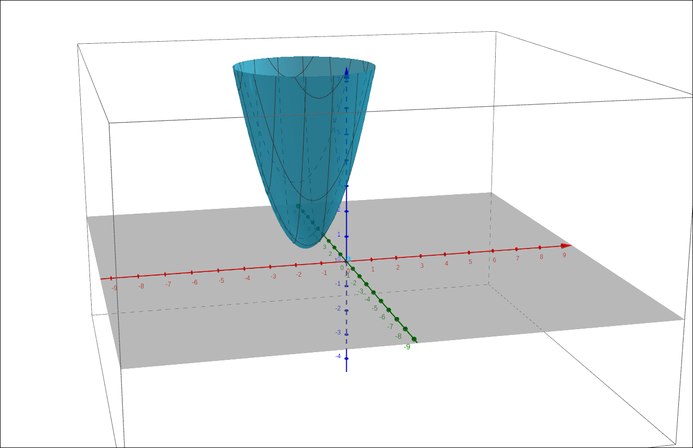

    :math:`z = x^{2} + 3 x + y^{2} - y + 3`

Although we have not verified this, it appears that this surface will have a single critical value and that there is a local minimum at that point.

CLAE
""""

Input the function,

.. code-block:: console

    x^2 + 3*x + y^2 - y + 3

Click and drag this over to the 3D graphics window.

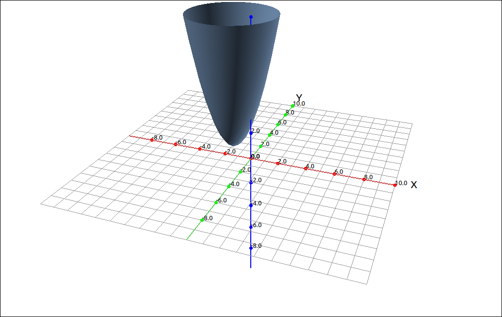

    :math:`z = x^2 + 3*x + y^2 - y + 3`

To find the critical points select the function then select ``Calculus > Vector Calculus > Gradiant``, the dialog will have ``[x, y]`` for the variables, keep these and click OK.  The result will be,

.. math::
    \left[\begin{array}{c}2 x + 3\\2 y - 1\end{array}\right]

Although we can solve this for the zero vector vector quite easily, selecting ``Algebra > Solve`` will return the result :math:`\left\{ x : - \frac{3}{2}, \  y : \frac{1}{2}\right\}` meaning the point :math:`\left( - \frac{3}{2}, \frac{1}{2}\right).`  Note that the output :math:`\left\{ x : - \frac{3}{2}, \  y : \frac{1}{2}\right\}` is a Python "dictionary".  These occur frequently with the solvers.  You can turn this into a point by selecting ``Edit > Other Conversions / Extractions > Convert Dictionary Values to List``, the result will be :math:`\left[ - \frac{3}{2}, \  \frac{1}{2}\right].`  Although we have not mathematically verified that there is a minimum at this critical point we can evaluate the function at this critical point to get the minimum of the function.  Assuming that the critical point :math:`\left[ - \frac{3}{2}, \  \frac{1}{2}\right]` is in ``R4``, select the function, select ``Algebra > Evaluate`` then input R4 into the expressions, the result is :math:`1/2.`

Example: :math:`z = x^2-y^2`
^^^^^^^^^^^^^^^^^^^^^^^^^^^^

GeoGebra
""""""""

Input the function,

.. code-block:: console

    x^2-y^2

Switch to the 3D perspective,

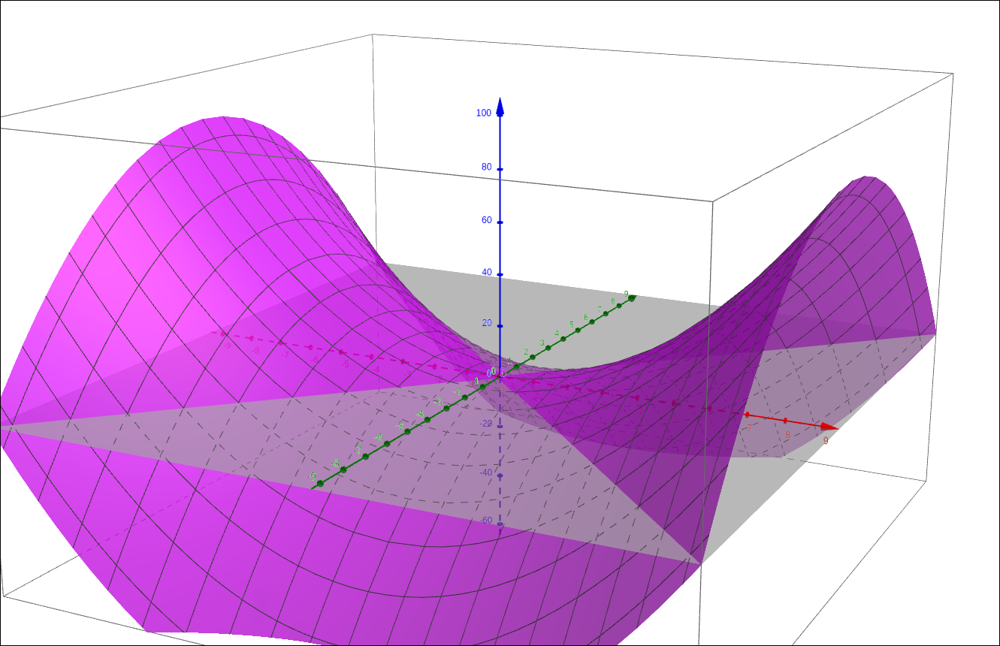

    :math:`z = x^2-y^2`

Although we have not verified this, it appears that there is a critical point at the origin.  This point does not appear to be a maximum or a minimum.  If you take any circle around the origin there will be points on that disk that are lower than the origin and there atr points that are higher then the origin.  This is called a saddle point.

CLAE
""""

Input the function,

.. code-block:: console

    x^2-y^2

Click and drag this over to the 3D graphics window.

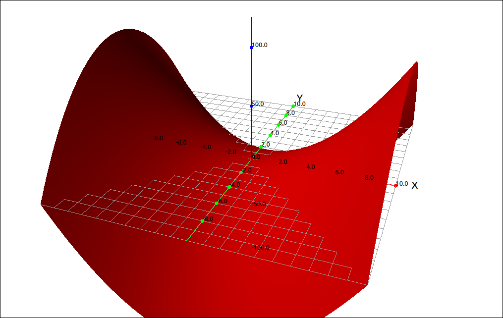

    :math:`z = x^2-y^2`

To find the critical points select the function then select ``Calculus > Vector Calculus > Gradiant``, the dialog will have ``[x, y]`` for the variables, keep these and click OK.  The result will be,

.. math::
    \left[\begin{array}{c}2 x\\- 2 y\end{array}\right]

So the critical point is at the origin.  This point does not appear to be a maximum or a minimum.  If you take any circle around the origin there will be points on that disk that are lower than the origin and there atr points that are higher then the origin.  This is called a saddle point.

In single variable Calculus we next defined the first and second derivative tests to test if a critical point represented a maximum, minimum, or neither.  With functions of two variables we do not have a counterpart for the first derivative test.  Intuitively this should not come as a surprise.  The first derivative test checked the derivative values to the left and to the right of the critical point.  In this case there were only two possible directions in which to approach the critical point.  With functions of two variables there are an infinite number of ways to approach the critical point so generalizing the first derivative test seems to be difficult if not impossible.  The second derivative test, on the other hand, simply checked the value of the second derivative at the critical point and used concavity to form a conclusion.  This seems like a good candidate for generalizing to functions of two variables, we only need second derivatives and to do an evaluation at the critical points.

.. admonition:: Theorem: Second Derivatives Test

    Let :math:`f(x, y)` be a function of two variables and assume that the second partials of *f* exist and are continuous. Further, let :math:`(a, b)` be a critical point such that :math:`f_x(a, b) = 0` and :math:`f_y(a, b) = 0.`  Define,

    .. math::
        D(a, b) = f_{xx}(a, b) f_{yy}(a, b) - \left( f_{xy}(a, b) \right)^2

    Then,

    1. If :math:`D(a, b) > 0` and :math:`f_{xx}(a, b) > 0`, then :math:`f(a, b)` is a local minimum.
    2. If :math:`D(a, b) > 0` and :math:`f_{xx}(a, b) < 0`, then :math:`f(a, b)` is a local maximum.
    3. If :math:`D(a, b) < 0` then :math:`(a, b)` is a saddle point of *f*.
    4. If :math:`D(a, b) = 0` then the test is inconclusive.  This means that in this case :math:`(a, b)` could be a place where there is a maximum, minimum, or saddle point, we cannot tell which one.

Example: :math:`z = x^{3} - 3 x^{2} - 9 x + y^{3} - 3 y^{2}`
^^^^^^^^^^^^^^^^^^^^^^^^^^^^^^^^^^^^^^^^^^^^^^^^^^^^^^^^^^^^

CLAE
""""

Input the function,

.. code-block:: console

    x^3 - 3*x^2 - 9*x + y^3 - 3*y^2

CLick and drag this over to the 3D graphics window.

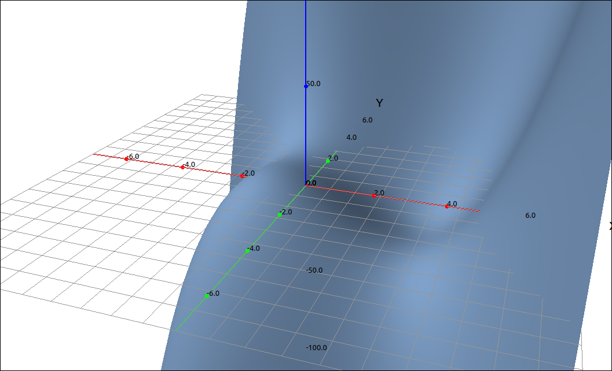

    :math:`z = x^{3} - 3 x^{2} - 9 x + y^{3} - 3 y^{2}`

Move the plot around to get a better look at different perspectives. Note that in the image above we scaled the *z*-axis. It looks like there might be a local maximum, a local minimum and a couple of saddle points.  To find the critical points select the function then select ``Calculus > Vector Calculus > Gradiant``, the dialog will have ``[x, y]`` for the variables, keep these and click OK.  The result will be,

.. math::
    \left[\begin{array}{c}3 x^{2} - 6 x - 9\\3 y^{2} - 6 y\end{array}\right]

Select ``Algebra > Solve``, again the default values should be fine, the result is,

.. math::
    \left[ \left( -1, \  0\right), \  \left( -1, \  2\right), \  \left( 3, \  0\right), \  \left( 3, \  2\right)\right]

So there are four critical points, as we expected from the graph of the surface.  Now we will construct the *D* function.  Select the function, now select ``Calculus > Derivative``, for the variables input ``[x, x]``, the result is :math:`6 x - 6`.  Now do the same with ``[y, y]`` and ``[x, y]`` the results are :math:`6 y - 6` and 0 respectively.  These should be in ``R4``, ``R5``, and ``R6`` respectively.  Now create the *D* function with,

.. code-block:: console

    D(x, y):= R4*R5 - R6^2

Note that ``R6`` is 0 so including it above is not needed, we kept it here since you would include it in general.  The result is,

.. math::
    \left(6 x - 6\right) \left(6 y - 6\right)

and it is defined as a function, note that you do not need to define it as a function, using the evaluate option will work just as well.  We will start with the critical point :math:`(-1, 0)`, input ``D(-1, 0)``, the result is 72, so there is either a maximum or a minimum here.  Select the :math:`f_{xx}` function and then ``Algebra > Evaluate``, input ``-1`` and the result is :math:`-12.` This implies that there is a local maximum at the point :math:`(-1, 0).`  You probably noted that we only input the *x* value of the point when evaluating :math:`f_{xx}`.  In general you will substitute both *x* and *y* values but here the function :math:`f_{xx}` has no *y* variable in it so we just needed the *x* value.  Now we do the same for the other three critical numbers. Input ``D(-1, 2)`` and the result is :math:`-72,` so there is a saddle point there.  Input ``D(3, 0)`` and the result is :math:`-72,` so there is a saddle point there as well. Finally input ``D(3, 2)`` the result is :math:`-72.` Evaluate  :math:`f_{xx}` at :math:`(3, 2)` and the result is 12, so there is a local minimum at this point.

Absolute Maximum and Minimum Values
-----------------------------------

The previous discussion centered around local maximums and minimums.  Recalling from one variable Calculus if we have a continuous function on a closed bounded interval then the function attains an absolute maximum and absolute minimum on that interval.  Our next step is to generalize this to functions of two variables.  Although it is fairly obvious, we will start with a definition of absolute maximums and minimums of a function of two variables.

.. admonition:: Definition: Absolute Maximum and Minimum

    Definition Let :math:`(a, b)` be a point in the domain *D* of a function *f* of two variables. Then :math:`f(a, b)` is the

    - Absolute Maximum value of *f* on *D* if :math:`f(a, b) \geq f(x, y)` for all :math:`(x, y)` in *D*.
    - Absolute Minimum value of *f* on *D* if :math:`f(a, b) \leq f(x, y)` for all :math:`(x, y)` in *D*.

Next we will generalize the concept of a closed bounded interval.  With functions of one variable the closed bounded interval was the domain of the function or a subset of the domain of the function.  The concept of a closed interval means that it contains the endpoints and being bounded mens that it is finite in length.  We now need to move all of this up one dimension.

The domain of a function of two variables is a subset (or region) of :math:`\mathbb{R}^2.`  For the set to be closed it must contain all of its boundary points and for the set to be bounded it must be able to be completely contained by a finite circle around the set.  Some examples of regions are below, note that do not need to be circles, they can be any subset of the plane.

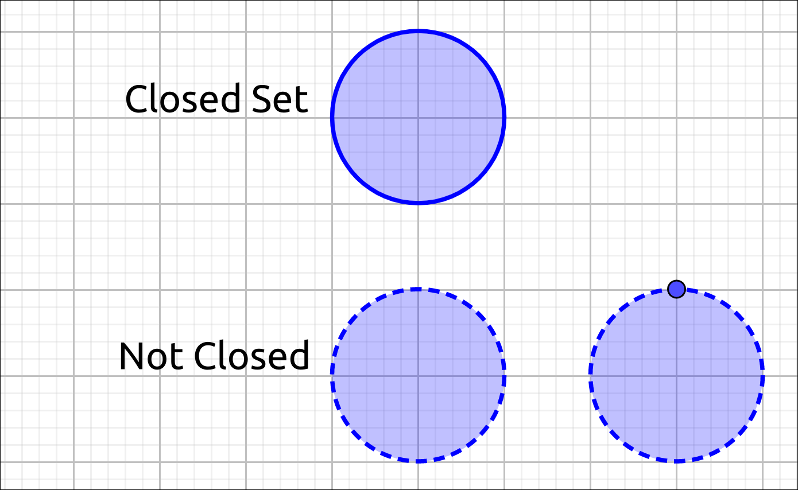

    Closed and Not Closed Sets

In the top region the set is closed because it contains all the points on the boundary.  The two sets on the bottom are not closed because they are missing some points on the boundary of the set.  Note that all three of these regions are bounded since each can be contained in a finite circle.  As with several of our previous definitions we can be more precise and if you continue your study of mathematics you will see these definitions.  We are fine here with a more intuitive understanding and not complicate things with more technical jargon.

.. admonition:: Theorem: Extreme Value Theorem for Functions of Two Variables

    If *f* is continuous on a closed, bounded set *D* in :math:`\mathbb{R}^2`, then *f* attains an absolute maximum value :math:`f(a,b)` and an absolute minimum value :math:`f(c, d)` at some points :math:`(a, b)` and :math:`(c, d)` in *D*.

Finding these extreme values is very similar to finding extreme values of functions of a single variable.  In the single variable case we found all of the local maximums and minimums on the interval, we then found the values at the endpoints of the interval, then we found the largest ans smallest of these values for our extremes.  The same is true for functions of two variables.

To find the absolute maximum and minimum values of a continuous function *f* on a closed, bounded set *D*, we do the following,

1. Find the values of *f* at the critical points of *f* in the domain *D*.
2. Find the extreme values of *f* on the boundary of *D*.
3. The largest and smallest of the values from the above points.

Note that this can be lengthy process, especially for step 2.  In the next section we will discuss Lagrange Multipliers which, in some cases, will make finding the extreme values on the boundary a little easier.

Example: :math:`z = x^2-2xy+4y^2-4x-2y+24` on :math:`[0, 4] \times [0, 2]`
^^^^^^^^^^^^^^^^^^^^^^^^^^^^^^^^^^^^^^^^^^^^^^^^^^^^^^^^^^^^^^^^^^^^^^^^^^

GeoGebra
""""""""

GeoGebra has some very nice visualizations for these types of situations.  It handles regions well and is particularly good at restricting a surface to a domain.  Input the function,

.. code-block:: console

    x^2-2xy+4y^2-4x-2y+24

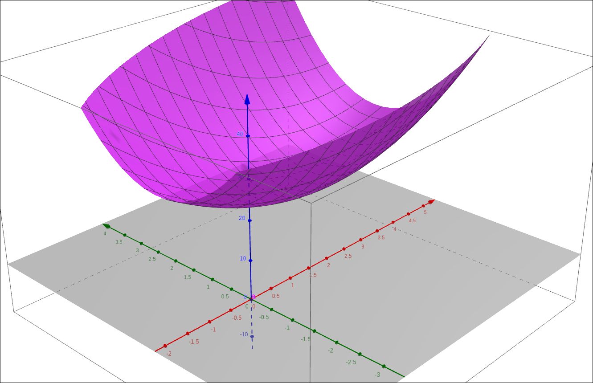

    :math:`z = x^2-2xy+4y^2-4x-2y+24`

Note that we did scale the axes in the above image.  Now we will input the domain we are interested in. It is a rectangle defined by the inequalities :math:`0 \leq x \leq 4` and :math:`0 \leq y \leq 2.`  To input this into GeoGebra we use,

.. code-block:: console

    (0 <= x <= 4) && (0 <= y <= 2)

Note that ``<=`` is for the less than or equal to and the ``&&`` is for "and".  Note that the "and" will be changed to its logical symbol.

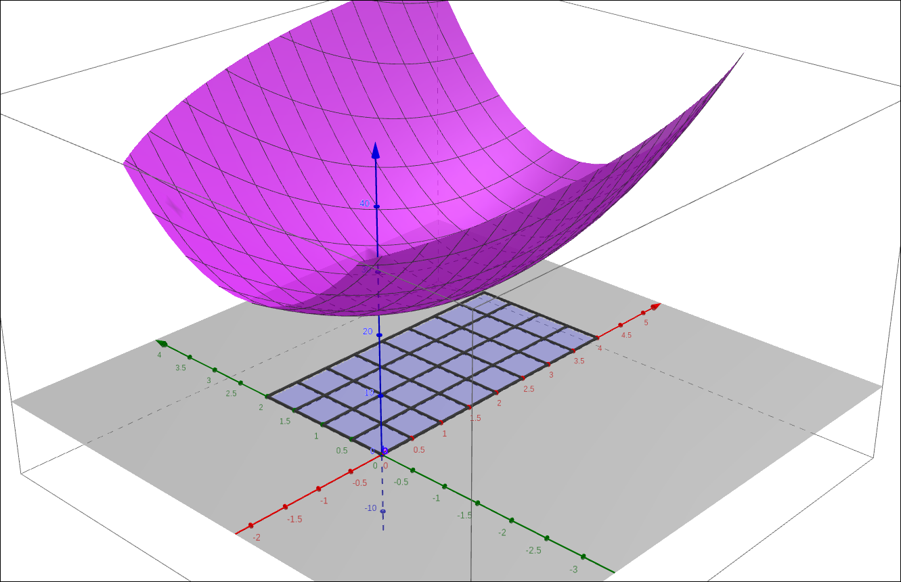

    :math:`z = x^2-2xy+4y^2-4x-2y+24` and :math:`[0, 4] \times [0, 2]`

Assuming that the surface was named ``a`` and the region was named ``b`` input, ``a, b`` into a new entry.  This will restrict the surface to the domain.  If you then hide the surface you should see,

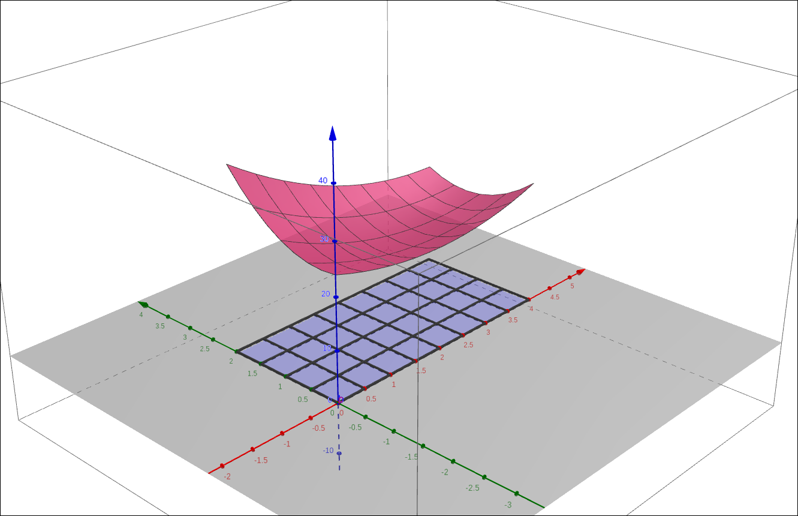

    :math:`z = x^2-2xy+4y^2-4x-2y+24` on :math:`[0, 4] \times [0, 2]`

Move the camera around to get a very nice visualization of the surface restricted to the domain and a feel for where the absolute maximums and minimums are.

CLAE
""""

In CLAE we can get a nice visualization as well, although there are a few more steps.  We will also be able to do the algebraic calculations. Input the function,

.. code-block:: console

    x^2 - 2*x*y - 4*x + 4*y^2 - 2*y + 24

Click and drag this over to the 3D graphics window.

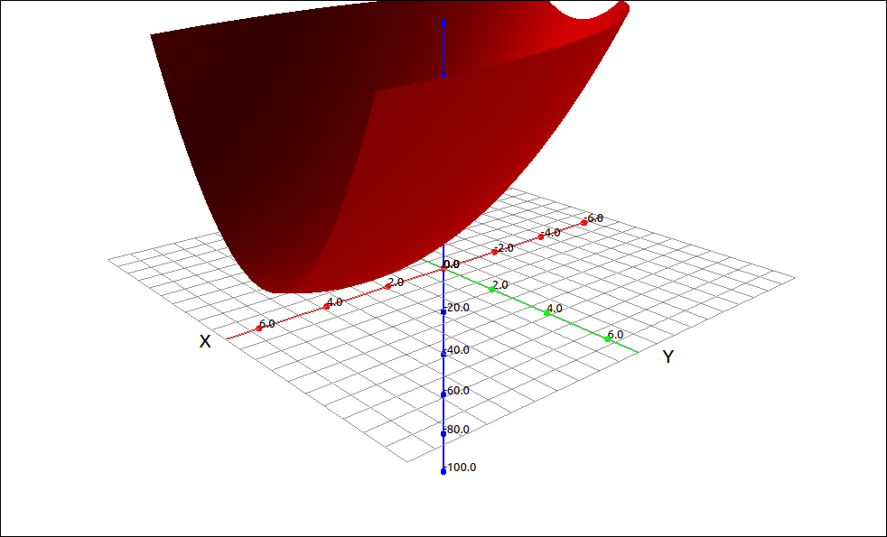

    :math:`z = x^2-2xy+4y^2-4x-2y+24`

Note that we scaled the axes for this image.  Since the domain is rectangular we can do a domain restriction of the surface by converting the function to a parametrically defined surface, this only takes 2 steps.  First select the function and then select ``Algebra > Evaluate``, keep the variables as ``[x, y]`` and input for the expressions ``[u, v]``.  In CLAE, parametrically defined surfaces must be in the variables *u* and *v*.  Now assuming the *u* and *v* expression is in ``R2`` input the following into the CAS ``[u, v, R2]`` the result should be,

.. math::
    \left[ u, \  v, \  u^{2} - 2 u v - 4 u + 4 v^{2} - 2 v + 24\right]

CLick and drag this over to the 3D graphics window, it should come in as a parametric surface.  Go into the properties and set the *u* bounds to 0 to 4 and the *v* bounds to 0 to 2.  Finally, hide the surface,

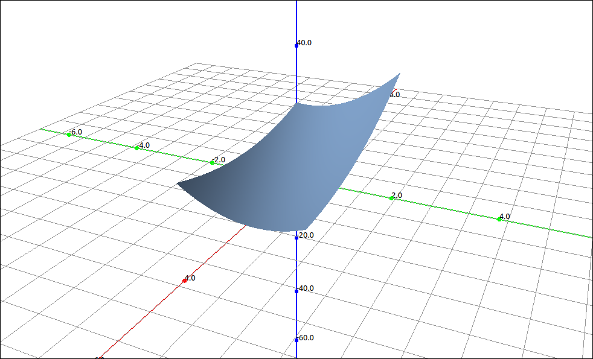

    :math:`z = x^2-2xy+4y^2-4x-2y+24` on :math:`[0, 4] \times [0, 2]`

Move the camera around to get a visualization of the surface restricted to the domain and a feel for where the absolute maximums and minimums are.

We will now go through the process for finding the absolute maximum and minimum.  First we will find the critical points in the region.  Select the function, then select ``Calculus > Vector Calculus > Gradiant``, the result should be,

.. math::
    \left[\begin{array}{c}2 x - 2 y - 4\\- 2 x + 8 y - 2\end{array}\right]

This is a system of equations that is easy enough to solve by hand but using the software we would select ``Algebra > Solve``, the dialog will automatically fill in the variables to solve for, leave these as is and click OK.  The result is :math:`\left\{ x : 3, \  y : 1\right\}` meaning the point :math:`(3, 1).` Evaluating the function at the point :math:`(3, 1)` gives us the value 17.  We will now attack the boundary. The region is the following rectangle that is bounded by the red and green lines.

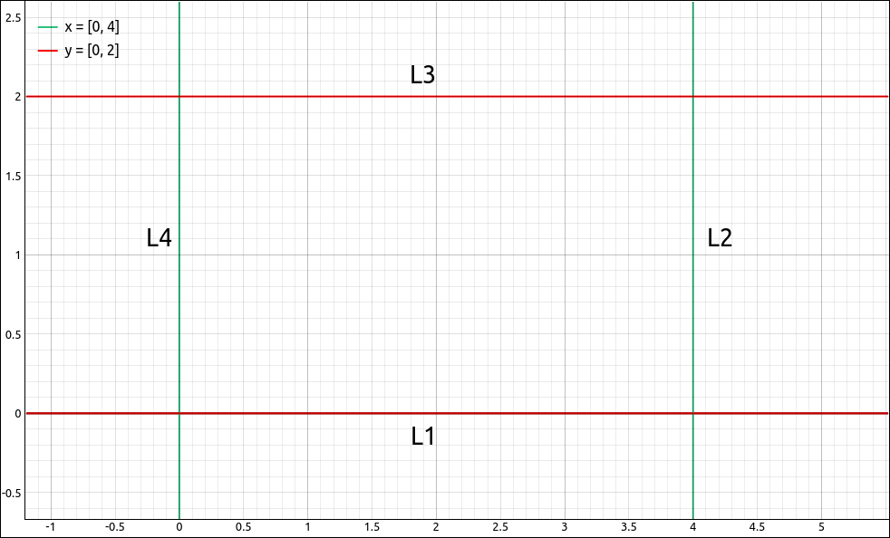

    :math:`[0, 4] \times [0, 2]`

On the segment ``L1`` the *y* value is 0 and the *x* value goes from 0 to 4.  Select the original expression, select ``Algebra > Evaluate``, leave the ``[x, y]`` as the variables and use ``[x, 0]`` as the expressions.  The result should be :math:`x^{2} - 4 x + 24.`  Click and drag this over to the 2D graphics window,

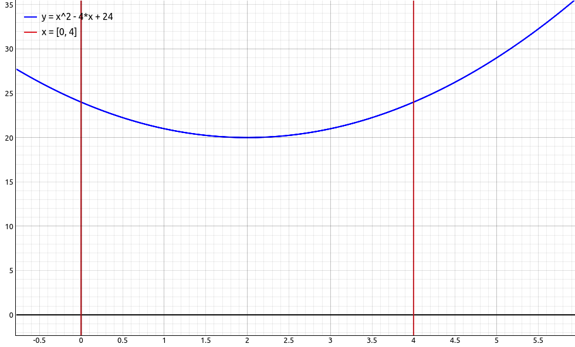

    :math:`f_1(x) = x^{2} - 4 x + 24`

To find the maximum and minimum of this on the interval :math:`[0, 4]` we find the critical points, finding the derivative gives us, :math:`2 x - 4` and a critical number of 2.  Evaluating :math:`f_1(x) = x^{2} - 4 x + 24` at 0, 2, and 4 gives us,

.. math::
    f_1(0) = 24 \qquad f_1(2) = 20 \qquad  f_1(4) = 24

On the segment ``L2`` the *x* value is 4 and the *y* value goes from 0 to 2.  Select the original expression, select ``Algebra > Evaluate``, leave the ``[x, y]`` as the variables and use ``[4, x]`` as the expressions.  The result should be :math:`4 x^{2} - 10 x + 24.`  CLear the 2D graphics window, click and drag this over to the 2D graphics window,

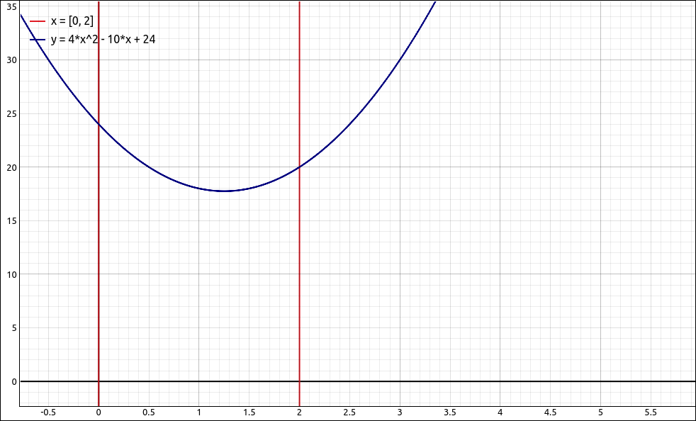

    :math:`f_2(x) = x^{2} - 4 x + 24`

To find the maximum and minimum of this on the interval :math:`[0, 2]` we find the critical points, finding the derivative gives us, :math:`8 x - 10` and a critical number of 5/4.  Evaluating :math:`f_2(x) = x^{2} - 4 x + 24` at 0, 5/4, and 2 gives us,

.. math::
    f_2(0) = 24 \qquad f_2(5/4) = \frac{71}{4} \approx 17.75 \qquad  f_2(2) = 20

On the segment ``L3`` the *y* value is 2 and the *x* value goes from 0 to 4.  Select the original expression, select ``Algebra > Evaluate``, leave the ``[x, y]`` as the variables and use ``[x, 2]`` as the expressions.  The result should be :math:`x^{2} - 8 x + 36.`  Clear the 2D graphics window and click and drag this over to the 2D graphics window,

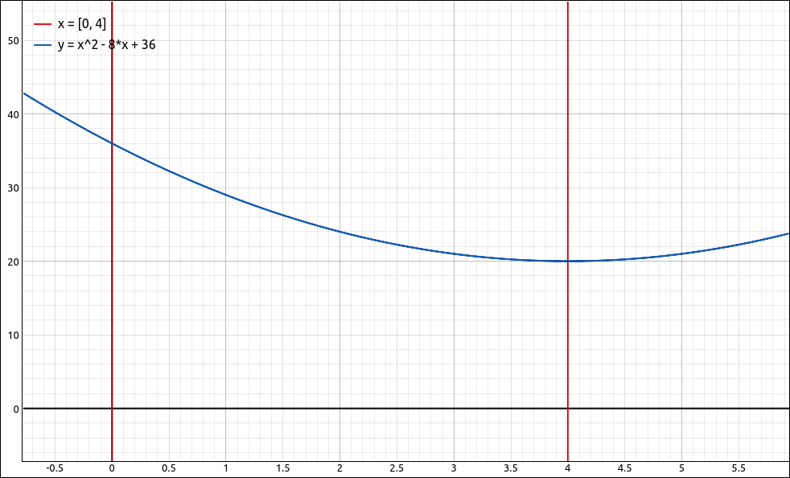

    :math:`f_3(x) = x^{2} - 8 x + 36`

To find the maximum and minimum of this on the interval :math:`[0, 4]` we find the critical points, finding the derivative gives us, :math:`2 x - 8` and a critical number of 4.  Evaluating :math:`f_3(x) = x^{2} - 8 x + 36` at 0 and 4 gives us,

.. math::
    f_3(0) = 36 \qquad  f_3(4) = 20

Finally for the last line segment ``L4`` the *x* value is 0 and the *y* value goes from 0 to 2.  Select the original expression, select ``Algebra > Evaluate``, leave the ``[x, y]`` as the variables and use ``[0, x]`` as the expressions.  The result should be :math:`4 x^{2} - 2 x + 24.`  CLear the 2D graphics window, click and drag this over to the 2D graphics window,

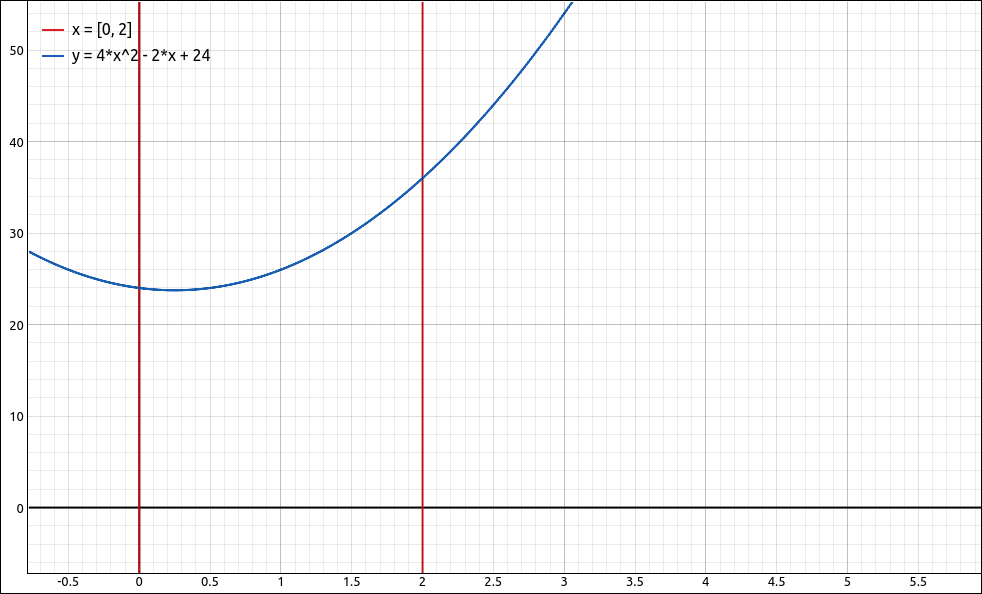

    :math:`f_4(x) = 4 x^{2} - 2 x + 24`

To find the maximum and minimum of this on the interval :math:`[0, 2]` we find the critical points, finding the derivative gives us, :math:`8 x - 2` and a critical number of 1/4.  Evaluating :math:`f_4(x) = 4 x^{2} - 2 x + 24` at 0, 1/4, and 2 gives us,

.. math::
    f_4(0) = 24 \qquad f_4(1/4) = \frac{95}{4} \approx 23.75 \qquad  f_4(2) = 36

Taking all of these values, we see the largest is 36 at the boundary point :math:`(0, 2)` and the smallest is 17 at the point :math:`(3, 1).`  So the absolute maximum of this function on this region is 36 at the point :math:`(0, 2)` and the absolute minimum is 17 at the point :math:`(3, 1).`

Example: :math:`z = x^{2} + 4 x + y^{2} - 6 y` on :math:`x^2+y^2 \leq 16`
^^^^^^^^^^^^^^^^^^^^^^^^^^^^^^^^^^^^^^^^^^^^^^^^^^^^^^^^^^^^^^^^^^^^^^^^^

GeoGebra
""""""""

We will get a nice visualization of this surface, using the same process as we did above.  Input the function,

.. code-block:: console

    x^2 + 4 x + y^2 - 6 y

The graph should look like the following, note that we scaled the *z*-axis.

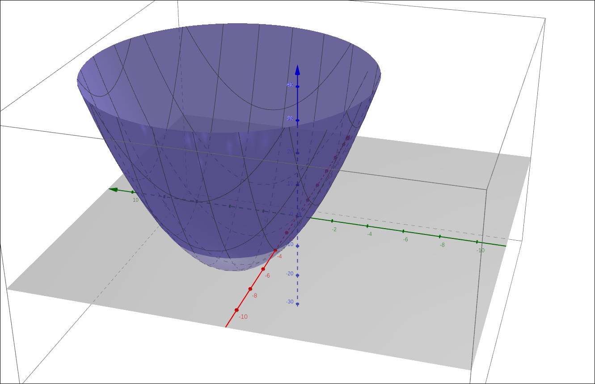

    :math:`z = x^2 + 4 x + y^2 - 6 y`

Input the region,

.. code-block:: console

    x^2 + y^2 <= 16

and then restrict the surface to the region with ``a, b``. The result should look like,

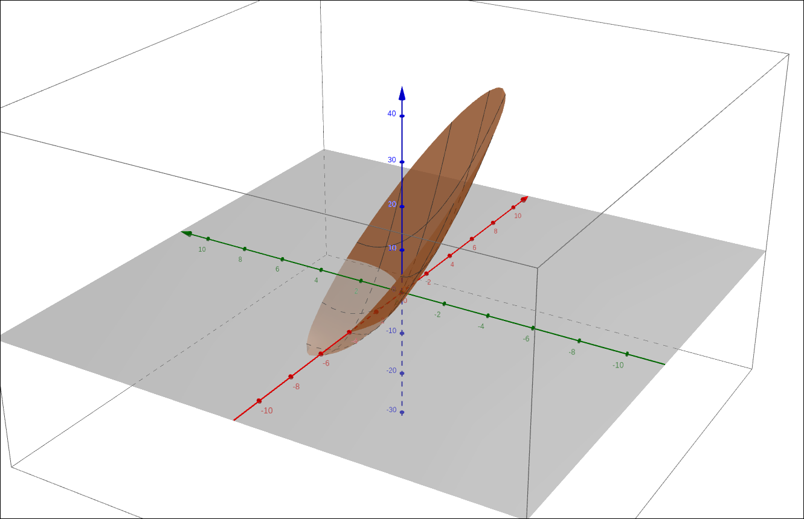

    :math:`z = x^2 + 4 x + y^2 - 6 y` on :math:`x^2+y^2 \leq 16`

CLAE
""""

Although CLAE does not have the domain restriction capability we can still get a good feel for the restricted surface with a little ingenuity.  In the last example we used the fact that the domain was a rectangle and shifted the surface to a parametric surface.  Here we can plot the boundary of the domain as an implicit surface and look at the intersection of the two surfaces. First plot the surface, input,

.. code-block:: console

    x^2 + 4*x + y^2 - 6*y

Click and drag this over to the 3D graphics window.

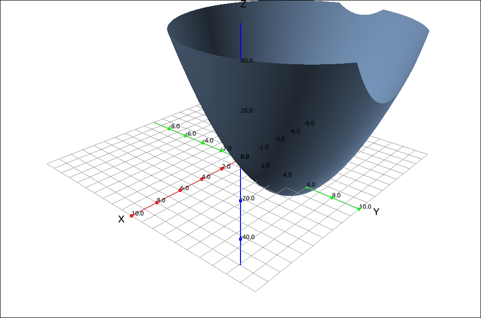

    :math:`z = x^2 + 4 x + y^2 - 6 y`

Now we will input the boundary of the region implicitly, as always, we formulate this with the expression equal to 0.

.. code-block:: console

    x^2 + y^2 - 16

Click and drag this over to the 3D graphics window.  It will probably come in as a function, change it to an Implicit Relationship.

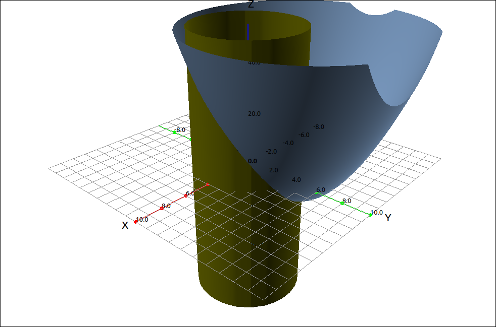

    :math:`z = x^2 + 4 x + y^2 - 6 y` and :math:`x^2 + y^2 = 16`

For a better view of the intersection go into the properties of the cylinder and change the surface to grid, then move the camera around a bit.

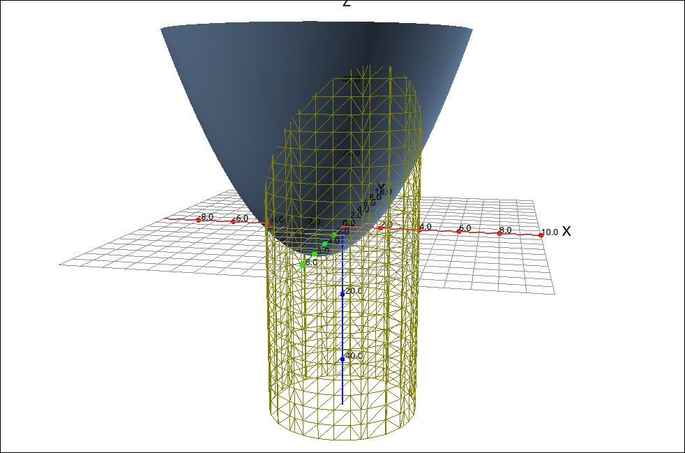

    :math:`z = x^2 + 4 x + y^2 - 6 y` and :math:`x^2 + y^2 = 16`

Now we attack the calculations.  Select the original function and tke its gradiant, ``Calculus > Vector Calculus > Gradiant``, the result is,

.. math::
    \left[\begin{array}{c}2 x + 4\\2 y - 6\end{array}\right]

This has only one solution :math:`(-2, 3)` which is inside the region since the length of this "vector" is :math:`\sqrt{13} \approx 3.6055512754639892931 < 4.`  Evaluating the function at :math:`(-2, 3)` gives a value of :math:`-13.`

As for the boundary, in this case the boundary is a circle centered at the origin with radius 4.  A good way to deal with this is to rewrite the boundary parametrically, substitute it into the surface expression, and get a single curve.  Parametric equations for circles are easy, in our case it is, :math:`(4 \cos(t), 4\sin(t)).`  Select the original expression, select ``Algebra > Evaluate``, leave the variables as ``[x, y]`` and input for the expressions ``[4*cos(t), 4*sin(t)]``.  The result should be,

.. math::
    16 \sin^{2}{\left(t \right)} - 24 \sin{\left(t \right)} + 16 \cos^{2}{\left(t \right)} + 16 \cos{\left(t \right)}

which simplifies to

.. math::
    - 24 \sin{\left(t \right)} + 16 \cos{\left(t \right)} + 16

We are, of course, only looking at this on the domain of :math:`[0, 2\pi].` If we graph this curve we get,

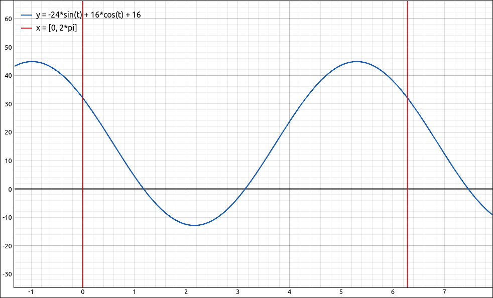

    :math:`y = - 24 \sin{\left(t \right)} + 16 \cos{\left(t \right)} + 16`

Finding the critical numbers, take the derivative, :math:`- 16 \sin{\left(t \right)} - 24 \cos{\left(t \right)},` solving this for 0 gives :math:`- \operatorname{atan}{\left(\frac{3}{2} \right)} \approx -0.98279372324732906799.`  This is not in our domain.  We can see that this is the first critical value to the left of 0.  The function is clearly periodic with period :math:`2\pi`, so our critical values are the one we got from solving plus  :math:`\pi` and the other is plus :math:`2\pi.`  Specifically, :math:`- \operatorname{atan}{\left(\frac{3}{2} \right)} + \pi` and :math:`- \operatorname{atan}{\left(\frac{3}{2} \right)} + 2\pi.` Input both of these into CLAE.  Now evaluate the function :math:`- 24 \sin{\left(t \right)} + 16 \cos{\left(t \right)} + 16` at both of these values, we get :math:`16 - 8 \sqrt{13} \approx -12.844410203711914345` and :math:`16 + 8 \sqrt{13} \approx 44.844410203711914345` respectively. So the absolute minimum is :math:`-13` at the point :math:`(-2, 3)` and the absolute maximum is :math:`16 + 8 \sqrt{13} \approx 44.844410203711914345` at the point :math:`\left[ \frac{8 \sqrt{13}}{13}, \  - \frac{12 \sqrt{13}}{13}\right].`
