:index:`Parametric Surfaces`
============================

Parametric Surfaces
-------------------

Parametric surfaces are defined in a similar manner as space curves except that we use two independent variables instead of one.

.. admonition:: Definition: Parametric Surface

    A Parametric Surface is defined as a vector valued function of two variables.

    .. math::
        \mathbf{r}(u, v) = x(u, v) \mathbf{i} + y(u, v) \mathbf{j} + z(u, v) \mathbf{k}

    where the functions :math:`x(u, v)`, :math:`y(u, v)`, and :math:`z(u, v)` are functions of two variables.  These are also written as,

    .. math::
        x = x(u, v) \qquad y = y(u, v) \qquad z = z(u, v)

    or as

    .. math::
        (x, y, z) = (x(u, v), y(u, v), z(u, v))

    The equations :math:`x = x(u, v), y = y(u, v), z = z(u, v)` are called the parametric equations for the surface.

Example: Parametric Surface
^^^^^^^^^^^^^^^^^^^^^^^^^^^

In this example we will graph the parametric surface,

.. math::
    \left[ \left(\sin{\left(v \right)} + 2\right) \cos{\left(u \right)}, \  \left(\sin{\left(v \right)} + 2\right) \sin{\left(u \right)}, \  u + \cos{\left(v \right)}\right]

CLAE
""""

Input the parametric equations,

.. code-block:: console

    [(sin(v) + 2)*cos(u),(sin(v) + 2)*sin(u),u + cos(v)]

Click and drag this over to the 3D graphics window, you should see something like,

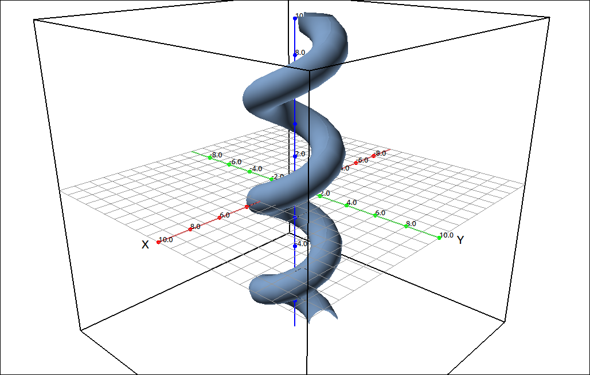

    :math:`\left[ \left(\sin{\left(v \right)} + 2\right) \cos{\left(u \right)}, \  \left(\sin{\left(v \right)} + 2\right) \sin{\left(u \right)}, \  u + \cos{\left(v \right)}\right]`

If you change the plot from surface to grid you can see the grid curves.

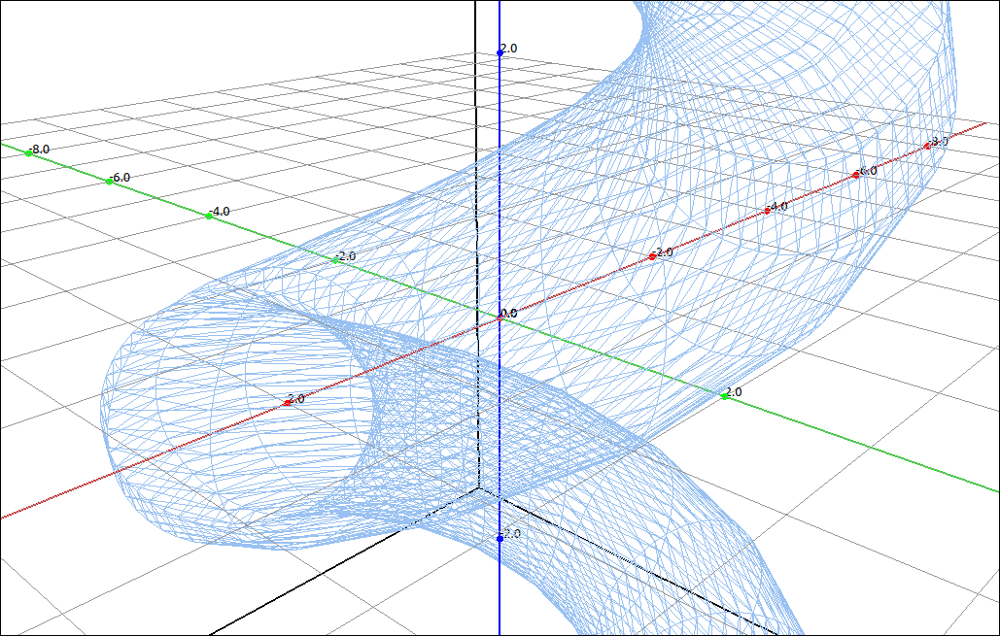

    :math:`\left[ \left(\sin{\left(v \right)} + 2\right) \cos{\left(u \right)}, \  \left(\sin{\left(v \right)} + 2\right) \sin{\left(u \right)}, \  u + \cos{\left(v \right)}\right]`

A better way to see the grid curves is select the parametric equations, then select ``Algebra > Evaluate`` the variables should be ``[u, v]`` input ``[a, t]`` for the expressions and the result is,

.. math::
    \left[ \left(\sin{\left(t \right)} + 2\right) \cos{\left(a \right)}, \  \left(\sin{\left(t \right)} + 2\right) \sin{\left(a \right)}, \  a + \cos{\left(t \right)}\right]

which are the parametric equations for the *v* grid curve at the *u* value of *a*.  Click and drag this over to the 3D graphics window.

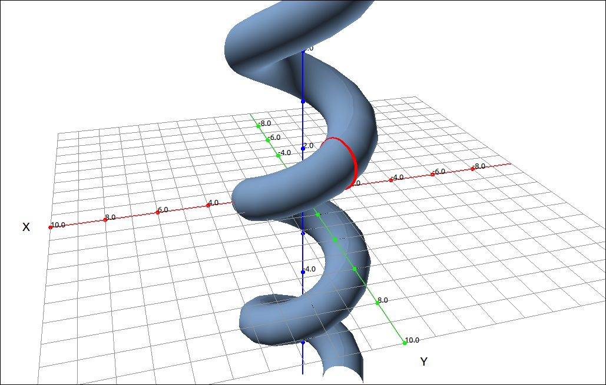

    Parametric Surface with *v* Grid Curve

You can move the *a* slider around to move the grid curve along the surface.  To see the *u* grid curves select the parametric equations, then select ``Algebra > Evaluate`` the variables should be ``[u, v]`` input ``[t, b]`` for the expressions and the result is,

.. math::
    \left[ \left(\sin{\left(b \right)} + 2\right) \cos{\left(t \right)}, \  \left(\sin{\left(b \right)} + 2\right) \sin{\left(t \right)}, \  t + \cos{\left(b \right)}\right]

which are the parametric equations for the *u* grid curve at the *v* value of *b*.  Click and drag this over to the 3D graphics window.

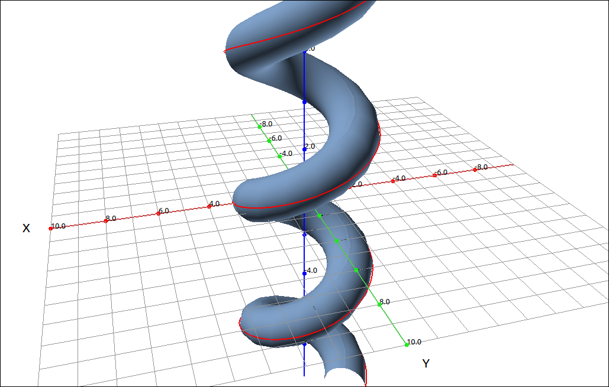

    Parametric Surface with *u* Grid Curve

You can move the *b* slider around to move the grid curve along the surface.

Example: A Sphere
^^^^^^^^^^^^^^^^^

In this example we will graph the parametric equations for a sphere of radius 1.

.. math::
    \left[ \sin{\left(u \right)} \cos{\left(v \right)}, \  \sin{\left(u \right)} \sin{\left(v \right)}, \  \cos{\left(u \right)}\right]

These should look familiar since they are the conversion formulas from spherical coordinates to rectangular coordinates (with :math:`\rho = 1`).

CLAE
""""

Input the parametric equations,

.. code-block:: console

    [sin(u)*cos(v),sin(u)*sin(v),cos(u)]

Click and drag this over to the 3D graphics window.  You should see a sphere.  Note that it might look a bit rough, this is probably due to the surface overwriting itself.  Go into the properties and change the bounds on *U* to ``0`` and ``pi`` and change the bounds on *V* to 0 and ``2*pi``.  That should smooth out the surface.

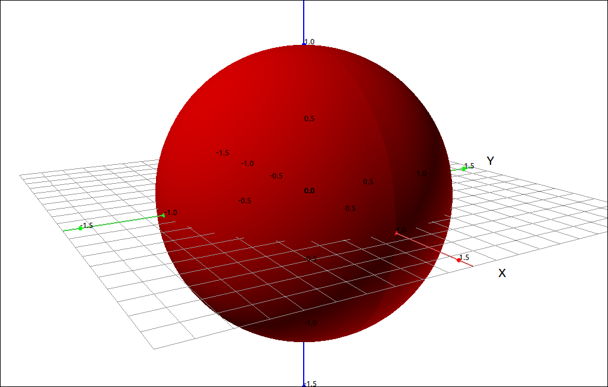

    Sphere

Surfaces of Revolution
----------------------

A surface of revolution is a special case of a general parametric surface.

.. admonition:: Definition: Surfaces of Revolution

    Given a function :math:`f(x)` for :math:`a \leq x \leq b` the surface of revolution defined by :math:`f(x)` is the parametric surface with parameters :math:`x` and :math:`\theta`,

    .. math::
        x = x \qquad y = f(x) \cos(\theta) \qquad z = f(x) \sin(\theta)

Example: :math:`y = x^2`
^^^^^^^^^^^^^^^^^^^^^^^^

CLAE
""""

In this example we will simply graph the surface of revolution created by the function :math:`f(x) = x^2.`  The parametric equations for this surface are,

.. math::
    x = x \qquad y = x^2 \cos(\theta) \qquad z = x^2 \sin(\theta)

Input the parametric equations,

.. code-block:: console

    [u,u^2*cos(v),u^2*sin(v)]

Note that we are using *u* for *x* and *v* for :math:`\theta.` CLAE expects the variables *u* and *v* for a parametric surface.  Click anf drag this over to the 3D graphics window.  If you zoom in a bit you should see,

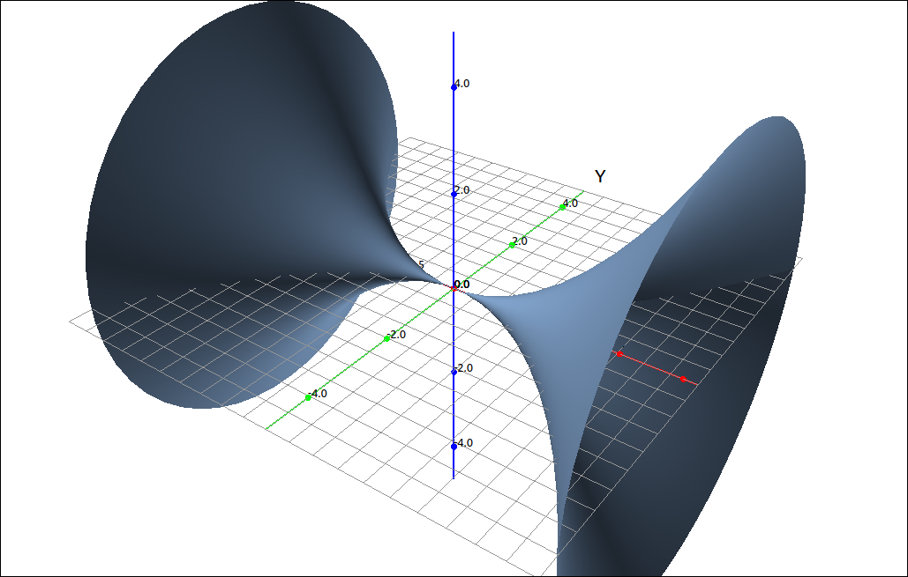

    Surfaces of Revolution

Tangent Planes
--------------

Finding a tangent plane to a parametric surface is fairly easy and intuitive.  Let

.. math::
    \mathbf{r}(u, v) = x(u, v) \mathbf{i} + y(u, v) \mathbf{j} + z(u, v) \mathbf{k}

be the parametric equations to the surface and let :math:`P_0 = (u_0, v_0)` be the point where we wish to construct the tangent plane. The vector :math:`\mathbf{r}_u(u_0, v_0)` is a tangent to the surface in the *u* direction and :math:`\mathbf{r}_v(u_0, v_0)` is a tangent to the surface in the *v* direction.  A tangent plane at :math:`P_0 = (u_0, v_0)` must contain :math:`\mathbf{r}_u(u_0, v_0)` and :math:`\mathbf{r}_v(u_0, v_0)` and as long as the cross product of :math:`\mathbf{r}_u` and :math:`\mathbf{r}_v` is not zero the cross produce :math:`\mathbf{r}_u \times \mathbf{r}_v` will be perpendicular to both :math:`\mathbf{r}_u` and :math:`\mathbf{r}_v` and hence be a normal vector for the tangent plane.

Example: Tangent Plane to the Surface of Revolution Created by :math:`y = x^2`
^^^^^^^^^^^^^^^^^^^^^^^^^^^^^^^^^^^^^^^^^^^^^^^^^^^^^^^^^^^^^^^^^^^^^^^^^^^^^^

CLAE
""""

In this example we will graph the surface of revolution created by the function :math:`f(x) = x^2` and then we will find a tangent plane to the surface.  The parametric equations for this surface are,

.. math::
    x = x \qquad y = x^2 \cos(\theta) \qquad z = x^2 \sin(\theta)

Input the parametric equations,

.. code-block:: console

    [u,u^2*cos(v),u^2*sin(v)]

Note that we are using *u* for *x* and *v* for :math:`\theta.` CLAE expects the variables *u* and *v* for a parametric surface.  Click anf drag this over to the 3D graphics window.  If you zoom in a bit you should see,

    Surfaces of Revolution

We will calculate the equation of the tangent plane to the surface at the coordinates :math:`(u, v) = (1, 0).`  To see the point on the surface select the parametric equations, then select ``Algebra > Evaluate``, leave the variables as the default ``[u, v]`` and input ``[1, 0]`` for the expressions.  The result should be, :math:`\left[ 1, \  1, \  0\right].`  CLick and drag this to the 3D graphics window,

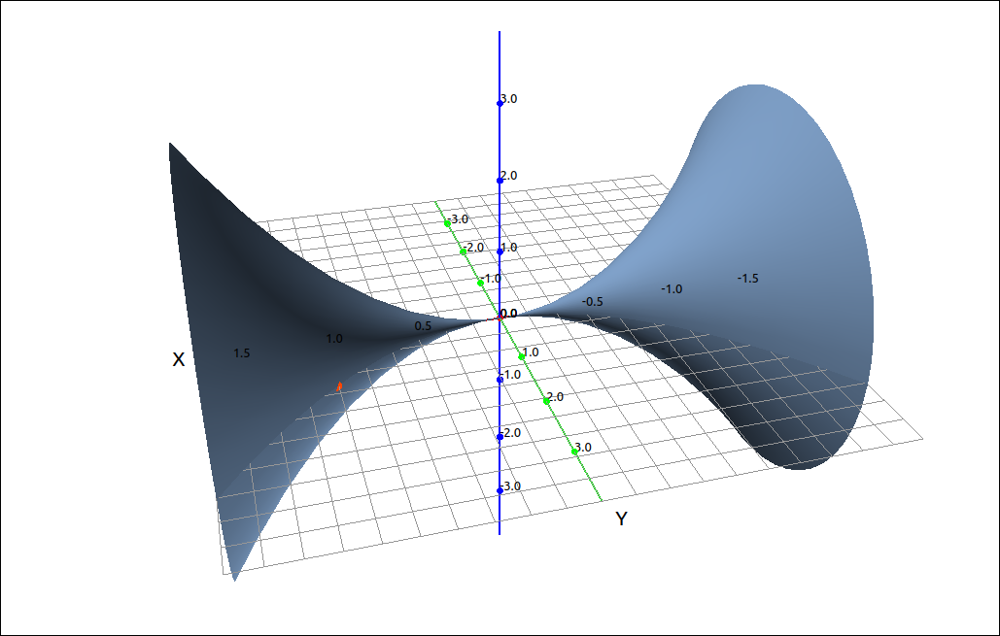

    Surface and Point of Tangency

To calculate the tangent plane we first find the two partials with respect to *u* and *v*.  Select the parametric equations, then select ``Calculus > Derivative`` input *u* for the variable, the result is,

.. math::
    \left[ 1, \  2 u \cos{\left(v \right)}, \  2 u \sin{\left(v \right)}\right]

Do the same with variable *v* and the result is,

.. math::
    \left[ 0, \  - u^{2} \sin{\left(v \right)}, \  u^{2} \cos{\left(v \right)}\right]

Evaluate both of these at :math:`(u, v) = (1, 0).`  The results are, :math:`\left[ 1, \  2, \  0\right]` and :math:`\left[ 0, \  0, \  1\right]` respectively.  Take the cross product of these by selecting the first, then select ``Vector > Cross Product`` then select the CAS designation in the list in the dialog box.  The result should be

.. math::
    \left[\begin{array}{c}2\\-1\\0\end{array}\right]

This is the normal vector to the tangent plane.  We can now create the implicit form of the equation with, ``2*(x-1)-1*(y-1)``.  Click and drag this to the 3D graphics window,

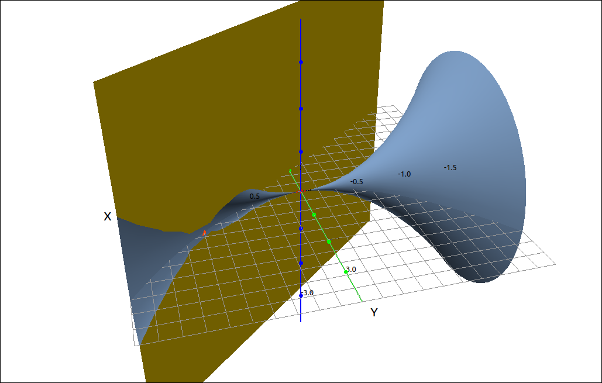

    Surface and Tangent Plane

Surface Area
------------

The calculation of the surface area of a parametrically defined surface is also straight forward.  If we do the usual approach of breaking the domain of the surface up into small segments :math:`D_{ij}`, the portion of the surface on these small segments, :math:`S_{ij}` is called a patch.

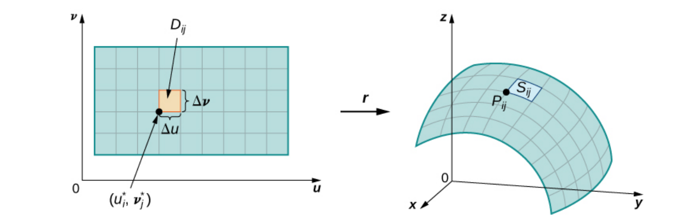

    Surface Area Derivation

If we look at a patch more closely, we see that the surface area of the patch is approximated by the tangent plane to the curve.  The portion of the tangent plane that approximates the patch is a parallelogram with edges :math:`\mathbf{r}_u` and :math:`\mathbf{r}_v` so the area of this parallelogram is the absolute value of the cross product of :math:`\mathbf{r}_u` and :math:`\mathbf{r}_v.`

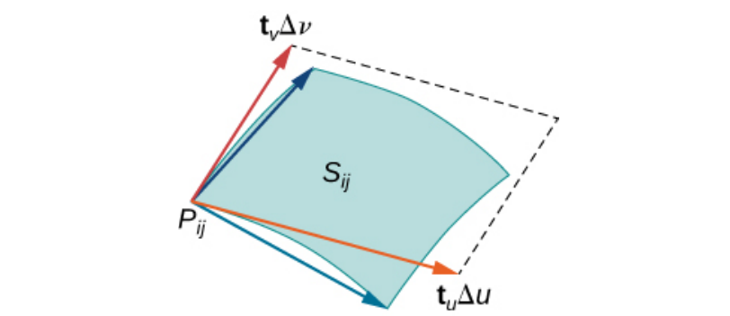

    Surface Area Derivation

.. admonition:: Definition: Surface Area

    Given that the surface *S* is smooth and defined by

    .. math::
        \mathbf{r}(u, v) = x(u, v) \mathbf{i} + y(u, v) \mathbf{j} + z(u, v) \mathbf{k}  \qquad (u, v) \in D

    and *S* is covered just once as :math:`(u, v)` ranges over the domain *D*, then the surface area of *S* is

    .. math::
        A(S) = \iint_D |\mathbf{r}_u \times \mathbf{r}_v| \; dA

Example: Surface Area
^^^^^^^^^^^^^^^^^^^^^

CLAE
""""

In this example we will find the surface area of the surface of revolution created by the function :math:`f(x) = x^2` for :math:`-1 \leq x \leq 1`.  The parametric equations for this surface are,

.. math::
    x = x \qquad y = x^2 \cos(\theta) \qquad z = x^2 \sin(\theta)

Input the parametric equations,

.. code-block:: console

    [u,u^2*cos(v),u^2*sin(v)]

Note that we are using *u* for *x* and *v* for :math:`\theta.` CLAE expects the variables *u* and *v* for a parametric surface.  Click anf drag this over to the 3D graphics window, change the bounds for x to :math:`-1 \leq x \leq 1`.  If you zoom in a bit you should see,

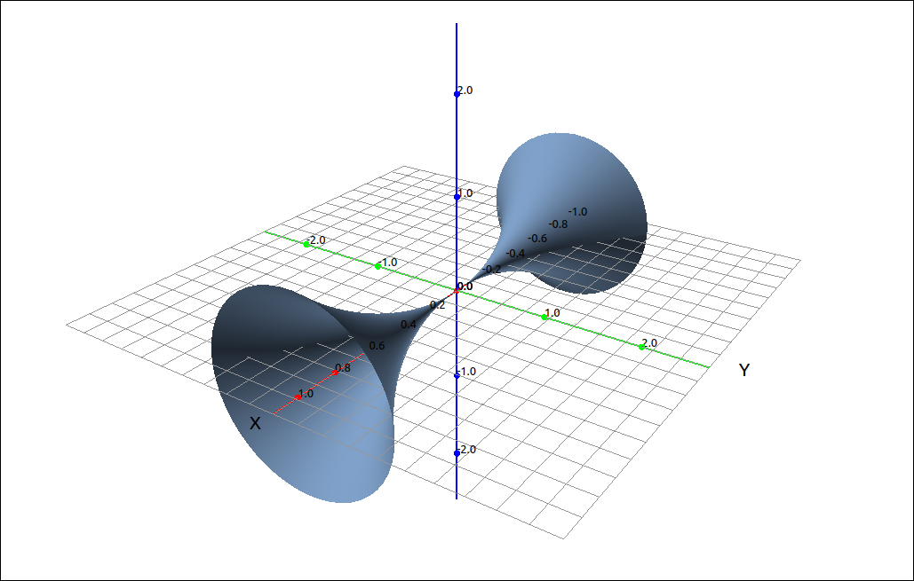

    Surface

First find the two partials with respect to *u* and *v*.  Select the parametric equations, then select ``Calculus > Derivative`` input *u* for the variable, the result is,

.. math::
    \left[ 1, \  2 u \cos{\left(v \right)}, \  2 u \sin{\left(v \right)}\right]

Do the same with variable *v* and the result is,

.. math::
    \left[ 0, \  - u^{2} \sin{\left(v \right)}, \  u^{2} \cos{\left(v \right)}\right]

Now we take the cross product of these two vectors, select the first, then select ``Vector > Cross Product`` then select the CAS designation of the second vector, the result should be,

.. math::
    \left[\begin{array}{c}2 u^{3} \sin^{2}{\left(v \right)} + 2 u^{3} \cos^{2}{\left(v \right)}\\- u^{2} \cos{\left(v \right)}\\- u^{2} \sin{\left(v \right)}\end{array}\right]

Now with this vector selected we will take its length with ``Vector > Length``, the result is,

.. math::
    \sqrt{u^{4} \sin^{2}{\left(v \right)} + u^{4} \cos^{2}{\left(v \right)} + \left(2 u^{3} \sin^{2}{\left(v \right)} + 2 u^{3} \cos^{2}{\left(v \right)}\right)^{2}}

Simplify this to

.. math::
    \sqrt{4 u^{6} + u^{4}}

Now we will take the double integral of this.  The surface domain in :math:`(u, v)` coordinates is :math:`-1 \leq u \leq 1` and :math:`0 \leq v \leq 2\pi.`  Select ``Calculus > Multiple Integrals > Double Integral``, first variable is *u* with bounds ``-1`` and ``1``, the second variable is *v* with bounds ``0`` and ``2*pi``.  The result is,

.. math::
    2 \pi \left(- \frac{\operatorname{asinh}{\left(2 \right)}}{32} + \frac{9 \sqrt{5}}{16}\right) \approx 7.6194594097156071376

Surface Area of the Graph of a Function
---------------------------------------

A special case of the surface area of a parametric surface is the surface area of a function of two variables.  Given a function of two variables, :math:`f(x, y)` we can parameterize the surface by

.. math::
    x = x \qquad y = y \qquad z = f(x, y)

If we do this then

.. math::
    |\mathbf{r}_u \times \mathbf{r}_v| = \sqrt{1 + \left( \frac{\partial f}{\partial x} \right)^2 + \left( \frac{\partial f}{\partial y} \right)^2}

and hence

.. math::
    A(S) = \iint_D \sqrt{1 + \left( \frac{\partial f}{\partial x} \right)^2 + \left( \frac{\partial f}{\partial y} \right)^2} \; dA

Example: :math:`z = x^2-y^2`
^^^^^^^^^^^^^^^^^^^^^^^^^^^^

CLAE
""""

In this example we will find the surface area of :math:`z = x^2-y^2` over the domain :math:`[-10, 10] \times [-10, 10].`  Input the function,

.. code-block:: console

    x^2 - y^2

Graph this,

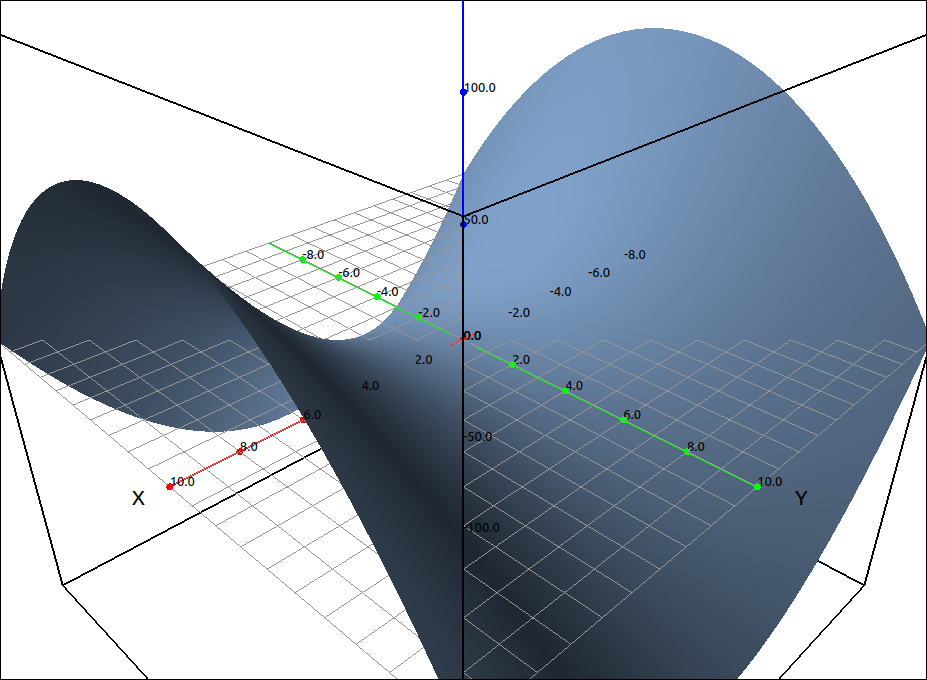

    :math:`z = x^2-y^2`

Take the partials with respect to *x* and *y*, these should be in ``R2`` and ``R3``.  Then input,

.. code-block:: console

    sqrt(1+R2^2+R3^2)

CLAE can find this double integral but the expression is extremely lengthy, so we will justn approximate this integral. Select the last entry, then select ``Calculus > Multiple Integrals > Double Integral Approximation``, first variable is *x* with bounds ``-10`` and ``10`` and the first variable is *y* with bounds ``-10`` and ``10``.  The result is, 6138.678440446963.

