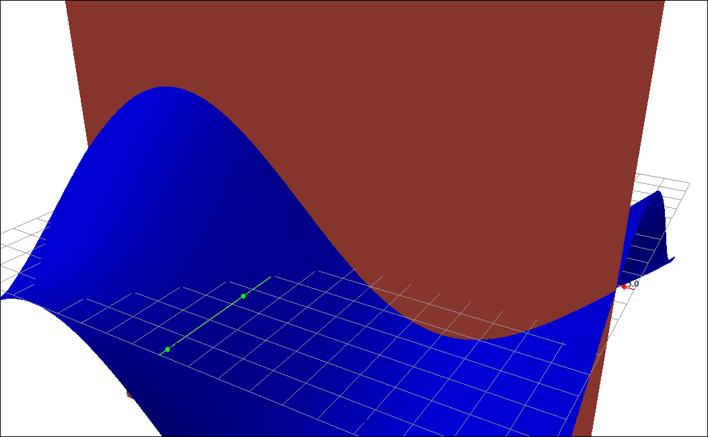
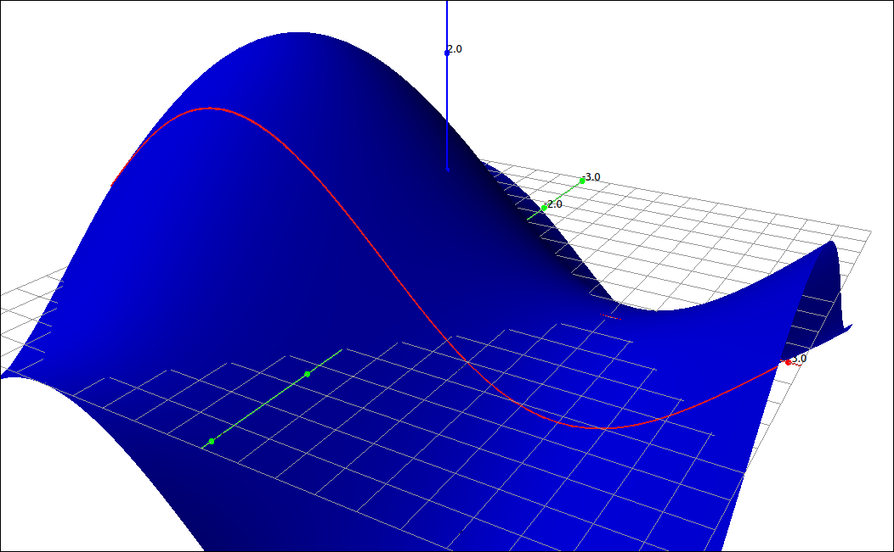
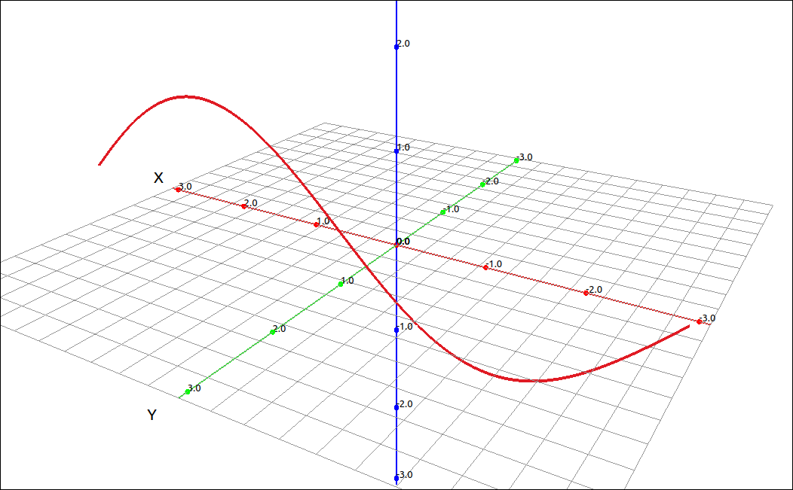
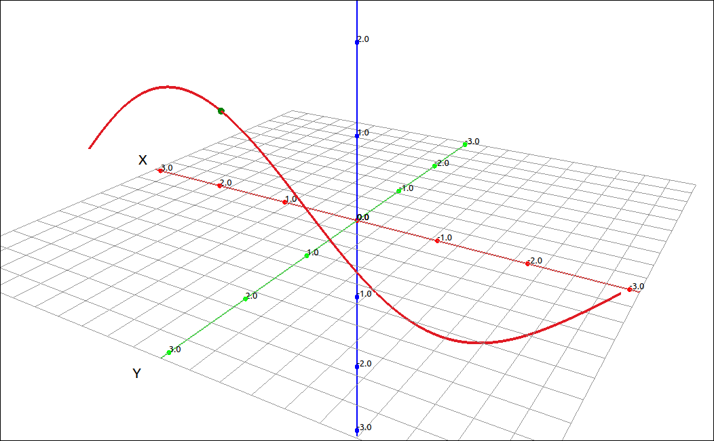
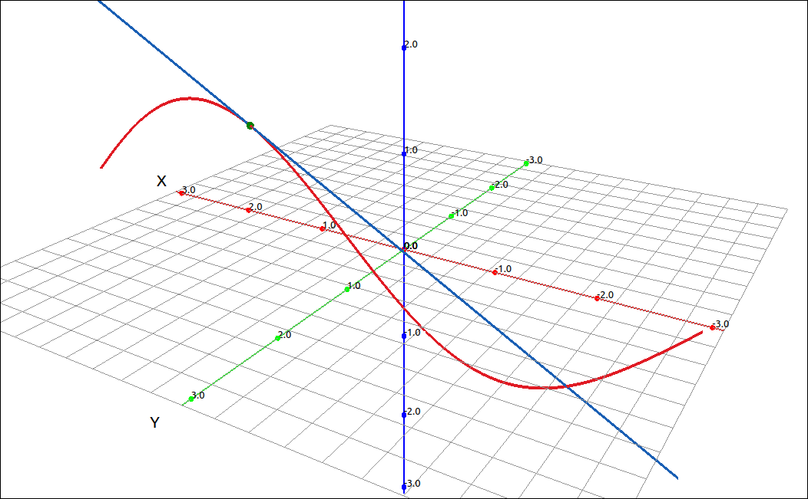
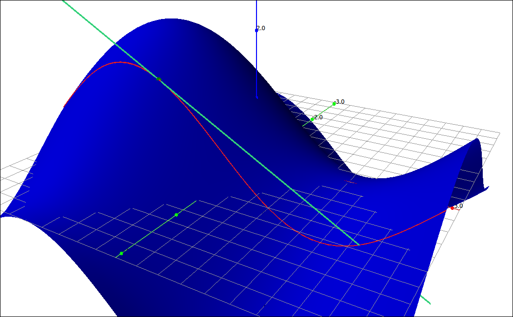

:index:`Partial Derivatives`
============================

Derivatives of a Function of Two Variables
------------------------------------------

When we have a function of two (or more) variables we can still take a derivative, called a partial derivative, by considering one variable to be the variable of interest (that we are deriving with respect to) and considering all the other variables to be constants.  Specifically,

.. admonition:: Definition: Partial Derivatives of Functions of Two Variables

    Let :math:`f(x, y)` be a function of two variables.  The partial derivative of :math:`f(x, y)` with respect to *x* is

    .. math::
        \frac{\partial f}{\partial x} = \lim_{h \to 0} \frac{f(x+h, y) - f(x, y)}{h}

    provided that this limit exists.

    The partial derivative of :math:`f(x, y)` with respect to *y* is

    .. math::
        \frac{\partial f}{\partial y} = \lim_{h \to 0} \frac{f(x, y+h) - f(x, y)}{h}

    provided that this limit exists.

.. admonition:: Notation: Notations for the Partial Derivative

    Partial derivatives have many notations.  Note that we no longer use the prime notation since it does not indicate the variable we are deriving with respect to.

    .. math::
        \frac{\partial f}{\partial x} = \frac{\partial}{\partial x} f(x, y) = f_x(x, y) = f_x = \frac{\partial z}{\partial x} = f_1 = D_1 f = D_x f

    .. math::
        \frac{\partial f}{\partial y} = \frac{\partial}{\partial y} f(x, y) = f_y(x, y) = f_y = \frac{\partial z}{\partial y} = f_2 = D_2 f = D_y f

Calculating partial derivatives is just as easy here as with functions of one variable.  All you need to remember is that if you are taking the partial with respect to *x* that you treat *y* as a constant and if you are taking the partial with respect to *y* then you consider *x* as a constant.  For example,

.. math::
    \frac{\partial}{\partial x} \left( x^{2} y^{3} - e^{x + y} + \sin{\left(x y \right)} \right) = 2 x y^{3} + y \cos{\left(x y \right)} - e^{x + y}

and

.. math::
    \frac{\partial}{\partial y} \left( x^{2} y^{3} - e^{x + y} + \sin{\left(x y \right)} \right) = 3 x^{2} y^{2} + x \cos{\left(x y \right)} - e^{x + y}

Interpretations of Partial Derivatives
--------------------------------------

When we were looking at derivatives of functions with one variable it represents a rate of change and the slope of a tangent line to the curve at a point.  So what about functions of two variables and partial derivatives.  Specifically what does :math:`f_x(a, b)` represent.  Say we have a surface defined by the function :math:`z = f(x, y),`

    Surface

Since our partial is with respect to *x* we are fixing *y* as the constant *b*, this is a vertical slice at :math:`y = b.`

    Surface and Slice

So the partial derivative is something that is happening on this line of intersection.

    Surface and Slice

    Slice

Since we are looking at :math:`f_x(a, b)` we are interested in the point on this curve at :math:`(a, b).`

    Slice and Point

At this point we are really back to the one variable case, everything is simply happening on the slice plane.  If we take the tangent line to the curve on the slice plane at the point of interest we get.

    Slice and Tangent Line

So as with single variable functions, :math:`f_x(a, b)` is the slope of this tangent line.

    Surface, Slice, Point, and Tangent Line

.. note::

    For functions that have more than two variables the situation is the same.  When taking the derivative you apply your derivative rules to the variable you are deriving with respect to and you consider all the other variables to be constants.

Example: Partial Derivatives
^^^^^^^^^^^^^^^^^^^^^^^^^^^^

Finding partial derivatives with software is usually just as easy as finding derivatives.  At most, you need to specify the variable you are deriving with respect to.  We will do the two partials we did in the above example.

.. math::
    \frac{\partial}{\partial x} \left( x^{2} y^{3} - e^{x + y} + \sin{\left(x y \right)} \right) = 2 x y^{3} + y \cos{\left(x y \right)} - e^{x + y}

and

.. math::
    \frac{\partial}{\partial y} \left( x^{2} y^{3} - e^{x + y} + \sin{\left(x y \right)} \right) = 3 x^{2} y^{2} + x \cos{\left(x y \right)} - e^{x + y}

GeoGebra
""""""""

Input the expression,

.. code-block:: console

    x^2 y^3 - exp(x + y) + sin(x y)

Assuming that this came in as *f* then the command ``Derivative(f, x)`` will find :math:`f_x(x, y)` and ``Derivative(f, y)`` will find :math:`f_y(x, y).`  Note that the outputs of these two commands match our above derivation.

CLAE
""""

Input the expression,

.. code-block:: console

    x^2*y^3 - exp(x + y) + sin(x*y)

To find the partials select ``Calculus > Derivative`` in the variable box input ``x`` and click OK.  The result is :math:`f_x(x, y).` Doing the same but inputting ``y`` gives you :math:`f_y(x, y).` Note that the outputs of these two commands match our above derivation.

Maxima
""""""

Input the expression,

.. code-block:: console

    f(x, y):=x^2*y^3 - exp(x + y) + sin(x*y);

The command ``diff(f(x, y), x);`` will find :math:`f_x(x, y)` and the command ``diff(f(x, y), y);`` will find :math:`f_y(x, y).` Note that the outputs of these two commands match our above derivation.

Higher-Order Partial Derivatives
--------------------------------

Just as with derivatives we can take partial derivatives of partial derivatives, these are simply higher-order partials.  For example, the second partials of a function of two variables are,

.. math::
    \frac{\partial^2 f}{\partial x^2} & = f_{xx} = \frac{\partial}{\partial x} \left( \frac{\partial f}{\partial x} \right) \\
    \frac{\partial^2 f}{\partial x \partial y} & = f_{yx} = \frac{\partial}{\partial x} \left( \frac{\partial f}{\partial y} \right) \\
    \frac{\partial^2 f}{\partial y \partial x} & = f_{xy} = \frac{\partial}{\partial y} \left( \frac{\partial f}{\partial x} \right) \\
    \frac{\partial^2 f}{\partial y^2} & = f_{yy} = \frac{\partial}{\partial y} \left( \frac{\partial f}{\partial y} \right) \\

Note that the partials :math:`f_{xy}` and :math:`f_{yx}` are called mixed partials.

For example,

.. math::
    \frac{\partial^2}{\partial x^2} \left( x^{2} y^{3} - e^{x + y} + \sin{\left(x y \right)} \right) & = 2 y^{3} - y^{2} \sin{\left(x y \right)} - e^{x + y} \\
    \frac{\partial^2}{\partial x \partial y} \left( x^{2} y^{3} - e^{x + y} + \sin{\left(x y \right)} \right) & = 6 x y^{2} - x y \sin{\left(x y \right)} - e^{x + y} + \cos{\left(x y \right)} \\
    \frac{\partial^2}{\partial y \partial x} \left( x^{2} y^{3} - e^{x + y} + \sin{\left(x y \right)} \right) & = 6 x y^{2} - x y \sin{\left(x y \right)} - e^{x + y} + \cos{\left(x y \right)} \\
    \frac{\partial^2}{\partial y^2} \left( x^{2} y^{3} - e^{x + y} + \sin{\left(x y \right)} \right) & = 6 x^{2} y - x^{2} \sin{\left(x y \right)} - e^{x + y}

You might notice that the mixed partials are equal, this is no coincidence.

.. admonition:: Theorem: Clairaut’s Theorem

    If the functions :math:`f_{xy}` and :math:`f_{yx}` are continuous, then,

    .. math::
        f_{xy} = f_{yx}

Example
^^^^^^^

As for using technology to find derivatives we can do higher-order partials by consecutively finding derivatives but CLAE and Maxima both have shortcuts for doing this.

CLAE
""""

In CLAE you can do higher-order partials by listing the variables with a comma between them. Going back to our example above, input the expression,

.. code-block:: console

    x^2*y^3 - exp(x + y) + sin(x*y)

Select ``Calculus > Derivative`` and input ``x, y`` for the variables and keep the order at 1.  The result is :math:`f_{xy}` which is

.. math::
    6 x y^{2} - x y \sin{\left(x y \right)} - e^{x + y} + \cos{\left(x y \right)}

In general, if we had input ``x, y, x`` the result would be :math:`f_{xyx}`, if we had input ``x, y, x, y, y`` the result would be :math:`f_{xyxyy}` and so on.  If we increase the order of the derivative we simply get copies, so an input of  ``x, y`` with an order of two would be :math:`f_{xyxy}` and an order of three would be :math:`f_{xyxyxy}` and so on.

Maxima
^^^^^^

In Maxima, we can do higher-order derivatives with the syntax ``diff(f(x,y), x, #, y, #)`` where the number is the number of times to derive with respect to the variable.  So ``diff(f(x,y), x, 1, y, 1)`` would be :math:`f_{xy}` and ``diff(f(x,y), x, 2, y, 3)`` would be :math:`f_{xxyyy}.`

