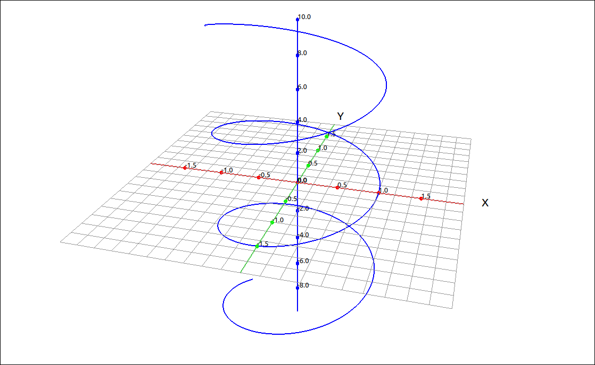
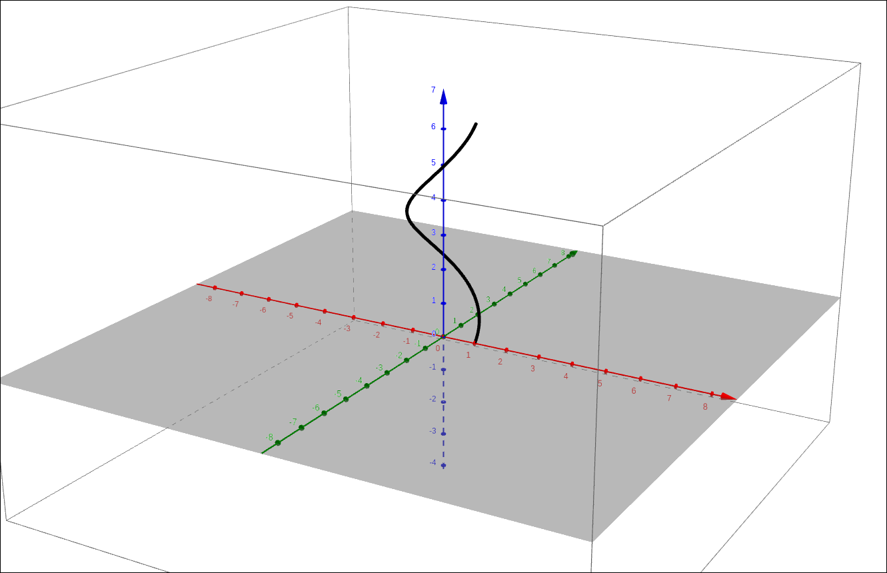
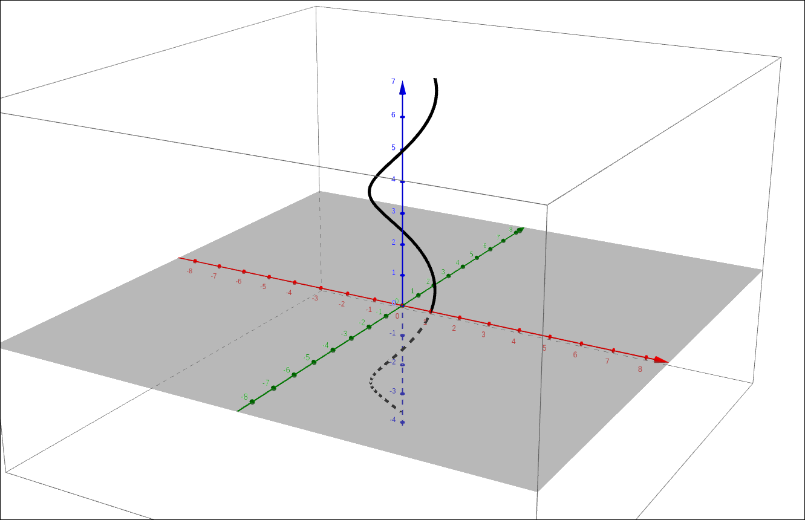
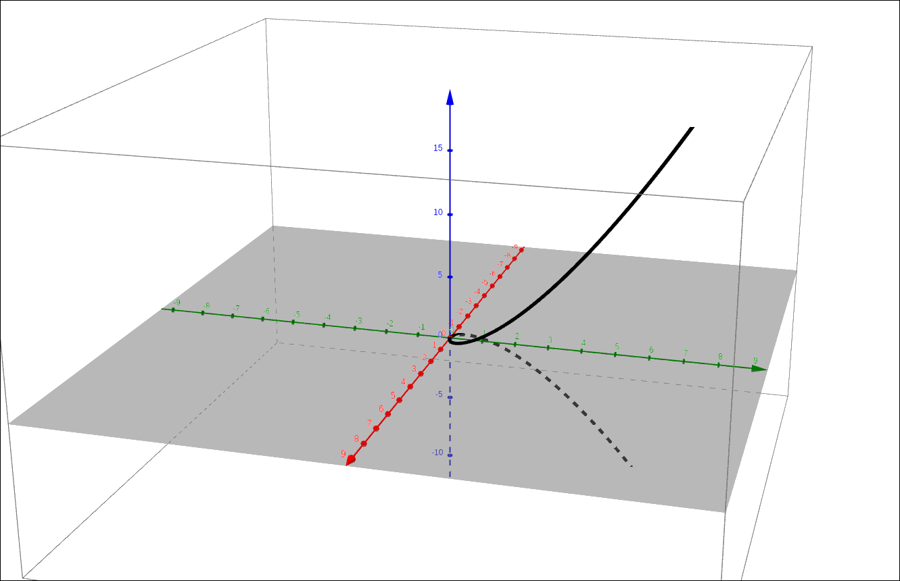
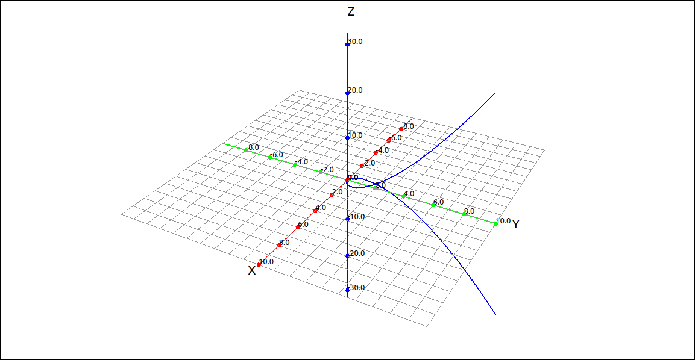

:index:`Vector-Valued Functions and Space Curves`
=================================================

Vector-Valued Functions
-----------------------

A vector-valued function is simply a function that takes as input a real number and produces a vector output.  In general, the output vector can be in any dimension but here we will consider only two and three dimensional vector outputs.

.. admonition:: Definition: Vector-Valued Function

    A **vector-valued function** is a function of the form

    .. math::
        \mathbf{r}(t) = (f(t), g(t)) \qquad {\rm or } \qquad \mathbf{r}(t) = (f(t), g(t), h(t))

    where the **component functions** *f*, *g*, and *h*, are real-valued functions of the parameter *t*.  Vector-valued functions are also written in the form

    .. math::
        \mathbf{r}(t) = f(t)\mathbf{i} + g(t)\mathbf{j} \qquad {\rm or } \qquad \mathbf{r}(t) = f(t)\mathbf{i} + g(t)\mathbf{j} + h(t)\mathbf{k}

Example: Helix
^^^^^^^^^^^^^^

The vector-valued function :math:`\mathbf{r}(t) = (\cos(t), \sin(t), t)` is very common in mathematics and the physical sciences, it is a helix.

    Helix

GeoGebra
""""""""

To input a vector-valued function simply input the component functions (in the parameter *t*) as an ordered triple (or pair in two-dimensions).

.. code-block:: console

    (cos(t),sin(t),t)

GeoGebra will automatically change this to a ``Curve`` command and produce the following image.

    Helix

When this is input, GeoGebra sees the trigonometric functions and automatically assumes that the parameter *t* should be in the range :math:`0 \leq t \leq 2 \pi.`  In some cases this may be correct but here we want a wider domain.  Go into the curve command and change the range to :math:`-10 \leq t \leq 10.`  We get a better image, below,

    Helix

Most likely the curve was given the name ``a``, we will assume it did.  If we want to find values of this function we can simply use function notation with ``a`` as the name of the function.  For example, ``a(pi/3)`` returns :math:`(0.5,0.86603,1.0472)`.  In addition, GeoGebra will graph the point.

CLAE
""""

To input a vector-valued function simply input the component functions (in the parameter *t*) as a list or as a vector.  So we could input the following into the CAS,

.. code-block:: console

    [cos(t),sin(t),t]

Or we could invoke the vector input tool and input the same expression into the input box for the vector input dialog.  This will produce,

.. math::
    \left[\begin{array}{c}\cos{\left(t \right)}\\\sin{\left(t \right)}\\t\end{array}\right]

Click and drag either of these to the 3D graphics window and you will see something like the following.

    Helix

The graphing type should have defaulted to Space Curve, if not, change the type to Space Curve.  The default domain for the space curve is :math:`-10 \leq t \leq 10` so this should not need to be changed.  If you do wish to change the domain, simply go into the properties of the curve and set the minimum and maximum *t* values.

To evaluate the curve at a given value of *t* you can either use ``Algebra > Evaluate`` or you can define this as a function and then use function notation.  With the first method select the vector-valued function in the CAS, select ``Algebra > Evaluate``, leave the variable as *t* and input ``pi/3`` for the expression.  The result is,

.. math::
    \left[ \frac{1}{2}, \  \frac{\sqrt{3}}{2}, \  \frac{\pi}{3}\right]  \qquad {\rm or } \qquad \left[\begin{array}{c}\frac{1}{2}\\\frac{\sqrt{3}}{2}\\\frac{\pi}{3}\end{array}\right]

depending on your input.  These approximate to :math:`\left[ 0.5, \  0.86602540378443864676, \  1.0471975511965977462\right].`

If you have several values you wish to evaluate it might be easier to define a function and then use the function notation. In this case the function needs to be in vector (matrix) form.

.. math::
    \left[\begin{array}{c}\cos{\left(t \right)}\\\sin{\left(t \right)}\\t\end{array}\right]

Assuming that this function is in ``R1`` we can input the following into the CAS to define a function ``f(t):=R1``.  This will define the function as *f*.  Now an input of ``f(pi/3)`` will produce,

.. math::
    \left[\begin{array}{c}\frac{1}{2}\\\frac{\sqrt{3}}{2}\\\frac{\pi}{3}\end{array}\right]

Space Curves
------------

A space curve is simply the graph of a vector-valued function in three-dimensions.  The graph of a vector-valued function in two dimensions is sometimes called a plane curve.  So we have seen an example of a space curve in the previous example.

Example: Twisted Cubic
^^^^^^^^^^^^^^^^^^^^^^

The twisted cubic is the space curve defined by the vector-valued function :math:`\left( t, \  t^{2}, \  t^{3}\right)`.

GeoGebra
""""""""

Input the space curve expression,

.. code-block:: console

    (t, t^2, t^3)

    Twisted Cubic

CLAE
""""

Input the space curve expression.  You can either input this directly into the CAS as a list or in the vector input dialog to get a matrix style vector.

.. code-block:: console

    [t, t^2, t^3]

    Twisted Cubic

