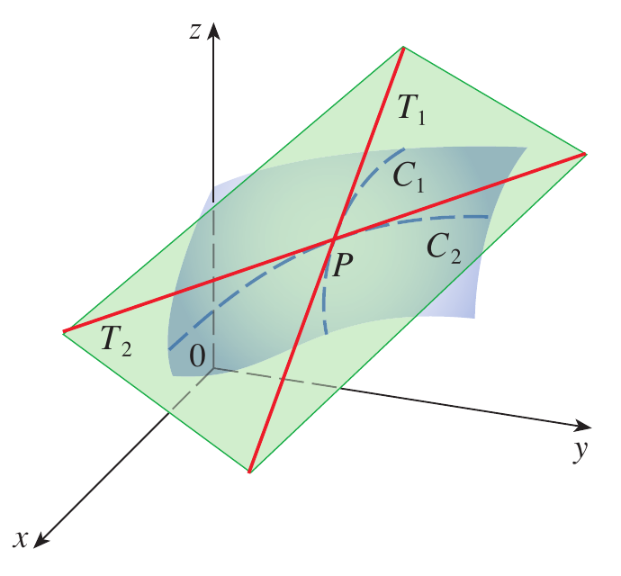
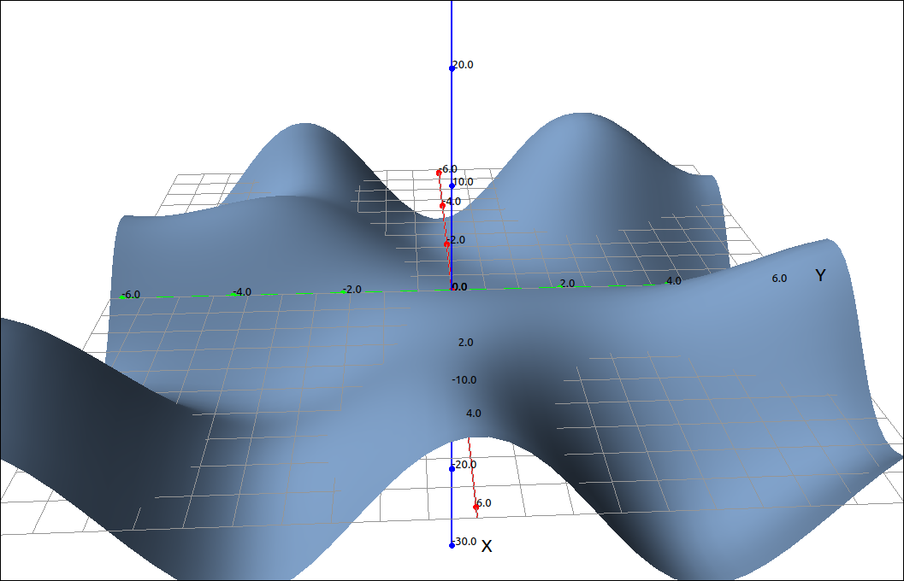
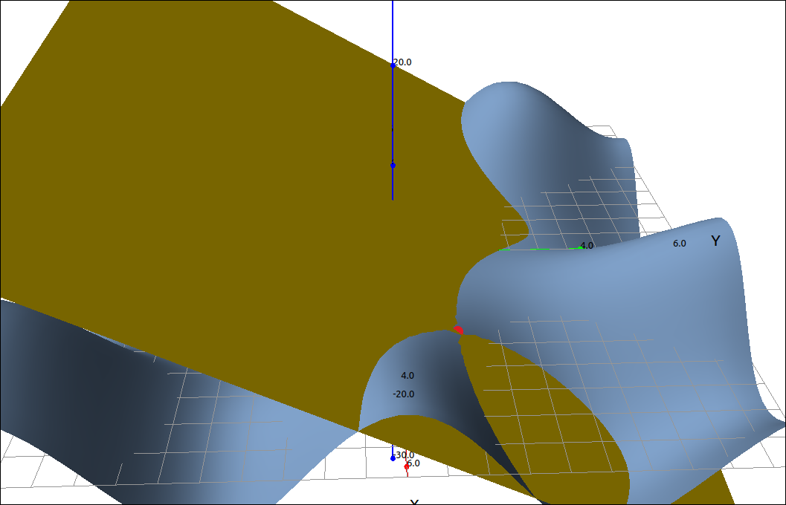

:index:`Tangent Planes and Linear Approximations`
=================================================

With functions of one variable we studied tangent lines and used these to establish linear approximations to a function.  We can, of course, move this up a dimension and consider tangent planes to a surface and use these to establish linear approximations to functions of two variables.

Tangent Planes
--------------

Before we get into the equations we will define a tangent plane geometrically.

.. admonition:: Definition: Tangent Plane to a Surface

    Let *P* be a point on a surface *S* and let *C* be any curve that passes through *P* and is on *S*.   If the tangent lines to all such curves *C* at *P* lie in the same plane, then this plane is called the tangent plane to *S* at *P*.

    Tangent Plane

.. admonition:: Definition: Tangent Plane to a Surface Defined by :math:`z = f(x, y)`

    Let *S* be a surface defined by a differentiable function :math:`z = f(x, y)`, and let :math:`P = (a, b)` be a point in the domain of *f*. Then, the equation of the tangent plane to *S* at *P* is given by

    .. math::
        z = f (a, b) + f_x(a, b)(x − a) + f_y(a, b)(y − b)

To be precise, the above definition is really a theorem.  Given our geometric definition above we can derive this formula by taking the cross product of tangent lines (really tangent vectors) to the surface at the point :math:`(a, b, f(a, b))` which can be found from the first partials.  We leave the details to the reader, or their textbook.

Example: Tangent Plane to :math:`z = x \cos{\left(y \right)} + y \sin{\left(x \right)}` at :math:`(\pi, \pi/3)`
^^^^^^^^^^^^^^^^^^^^^^^^^^^^^^^^^^^^^^^^^^^^^^^^^^^^^^^^^^^^^^^^^^^^^^^^^^^^^^^^^^^^^^^^^^^^^^^^^^^^^^^^^^^^^^^

CLAE
""""

Input the function,

.. code-block:: console

    x*cos(y) + y*sin(x)

Graphing this and zooming in a little,

    :math:`z = x \cos{\left(y \right)} + y \sin{\left(x \right)}`

Assume this is in ``R1``.  Find :math:`f_x` with ``Calculus > Derivative`` variable ``x``, the result is ``R2``,

.. math::
    y \cos{\left(x \right)} + \cos{\left(y \right)}

Find :math:`f_y` with ``Calculus > Derivative`` variable ``y``, the result is ``R3``,

.. math::
    - x \sin{\left(y \right)} + \sin{\left(x \right)}

Find :math:`f_x(\pi, \pi/3)` by selecting ``R2`` then ``Algebra > Evaluate`` expressions ``[pi, pi/3]``, the result is ``R4``,

.. math::
    \frac{1}{2} - \frac{\pi}{3}

Find :math:`f_y(\pi, \pi/3)` by selecting ``R3`` then ``Algebra > Evaluate`` expressions ``[pi, pi/3]``, the result is ``R5``,

.. math::
    - \frac{\sqrt{3} \pi}{2}

Find :math:`f(\pi, \pi/3)` by selecting ``R1`` then ``Algebra > Evaluate`` expressions ``[pi, pi/3]``, the result is ``R6``,

.. math::
    \frac{\pi}{2}

Create the tangent plane with, ``R6 + R4*(x-pi) + R5*(y-pi/3)``, the result is,

.. math::
    \left(\frac{1}{2} - \frac{\pi}{3}\right) \left(x - \pi\right) - \frac{\sqrt{3} \pi \left(y - \frac{\pi}{3}\right)}{2} + \frac{\pi}{2}

Which simplifies to,

.. math::
    \frac{\left(3 - 2 \pi\right) \left(x - \pi\right)}{6} - \frac{\sqrt{3} \pi \left(3 y - \pi\right)}{6} + \frac{\pi}{2}

Graphing the plane and the point of tangency ``[pi, pi/3, R6]`` gives us the following image.

    Tangent Plane

Linear Approximations
---------------------

If we revisit tangent lines and linear approximations we know that if we have a differentiable function (that is, smooth) then close to the point of tangency the functional value of the tangent line is close to the functional value of the curve.  This extends in a natural way to functions of two variables and their tangent planes.  If a surface is smooth at a point *P* then the tangent plane is close to the surface for points close to *P*.

.. admonition:: Definition: Linear Approximation

    Given a function :math:`z = f(x, y)` with continuous partial derivatives at :math:`(a, b),` the linear approximation of *f* at :math:`(a, b)` is the tangent plane,

    .. math::
        L(x, y) = f (a, b) + f_x(a, b)(x − a) + f_y(a, b)(y − b)

As with the one variable case, for points close to :math:`(a, b),` we have :math:`L(x, y) \approx f(x, y).`

Example
^^^^^^^

From our example above with :math:`f(x, y) = x \cos{\left(y \right)} + y \sin{\left(x \right)}` and the tangent plane at :math:`(\pi, \pi/3)` of :math:`L(x, y) = \frac{\left(3 - 2 \pi\right) \left(x - \pi\right)}{6} - \frac{\sqrt{3} \pi \left(3 y - \pi\right)}{6} + \frac{\pi}{2}.`  If we evaluate both at the point :math:`(3, 1)` we get 1.7620269256642863743 and 1.7766858126373610444 respectively.

Differentiability
-----------------

Differentiability for functions of two variables is a little more complicated then with one variable.  Here is a definition.

.. admonition:: Definition: Differentiability

    A function :math:`z = f(x, y)` is differentiable at a point :math:`(a, b)` if we can write

    .. math::
        \Delta z = f(x + \Delta x, y + \Delta y) - f(a, b) = f_x(a, b)\Delta x + f_y(a, b)\Delta y + \epsilon_1 \Delta x + \epsilon_2 \Delta y

    where :math:`\epsilon_1` is a function of :math:`\Delta x` and :math:`\epsilon_2` is a function of :math:`\Delta y` such that :math:`\epsilon_1 \to 0` and :math:`\epsilon_2 \to 0` as :math:`(\Delta x, \Delta y) \to (0, 0).`

This is yet another definition that has many theoretical uses but is not easy to apply in practice.  As one would expect, as in the one variable case, a differentiable function is continuous.

.. admonition:: Theorem: Differentiability Implies Continuity

    If :math:`f(x, y)` is differentiable at :math:`(a, b)` then it is continuous at :math:`(a, b).`

Fortunately, differentiability can be determined without resorting to the definition.

.. admonition:: Theorem: Differentiability

    A function :math:`z = f(x, y)` whose partial derivatives :math:`f_x` and :math:`f_y` exist near :math:`(a, b)` and are continuous at :math:`(a, b)` is differentiable at :math:`(a, b).`

Differentials
-------------

As in the one variable case, we can reformulate the concept of the linear approximation as differentials.

.. admonition:: Definition: The Total Differential

    Let :math:`z = f(x, y)` be a function of two variables and the point :math:`(a, b)` is in the domain of *f*.  Let :math:`\Delta x` and :math:`\Delta y` be such that the point :math:`(a + \Delta x, b + \Delta y)` is also in the domain of *f*.  If *f* is differentiable at :math:`(a, b)` then the differentials are :math:`dx = \Delta x` and :math:`dy = \Delta y`, and the **total differential** :math:`dz` is

    .. math::
        dz = f_x(a, b)dx + f_y(a, b)dy

As with the one variable case, for small :math:`dx` and :math:`dy` the value of :math:`dz \approx \Delta z.`

Example
^^^^^^^

Returning to our example we did above with :math:`f(x, y) = x \cos{\left(y \right)} + y \sin{\left(x \right)}`, the tangent plane at :math:`(\pi, \pi/3)`, and the point :math:`(3, 1).`

:math:`\Delta z = f(3, 1) - f(\pi, \pi/3) = \left(\sin{\left(3 \right)} + 3 \cos{\left(1 \right)}\right) - \left(\frac{\pi}{2}\right) = 0.19123059886938975507`

:math:`dz = f_x(a, b)dx + f_y(a, b)dy = \left(\frac{1}{2} - \frac{\pi}{3}\right) \left(3 - \pi \right) + \left(-1 - \frac{\sqrt{3}}{2}\right) \left(1 - \pi/3\right) = 0.16555098284103103994`
