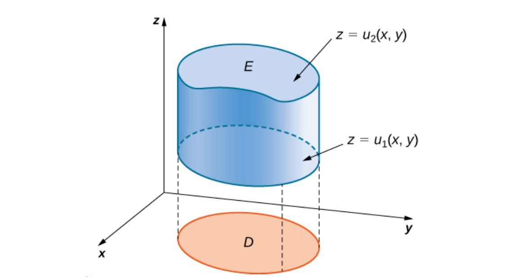
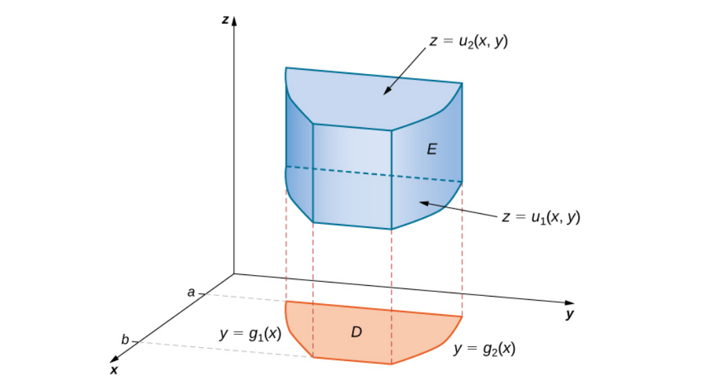
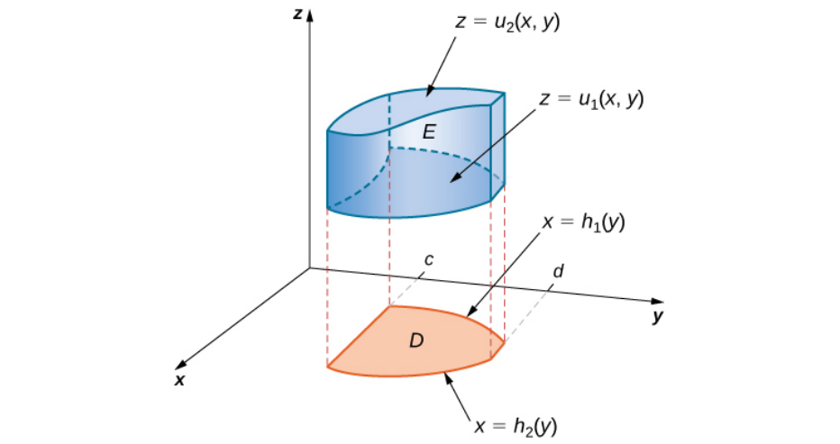
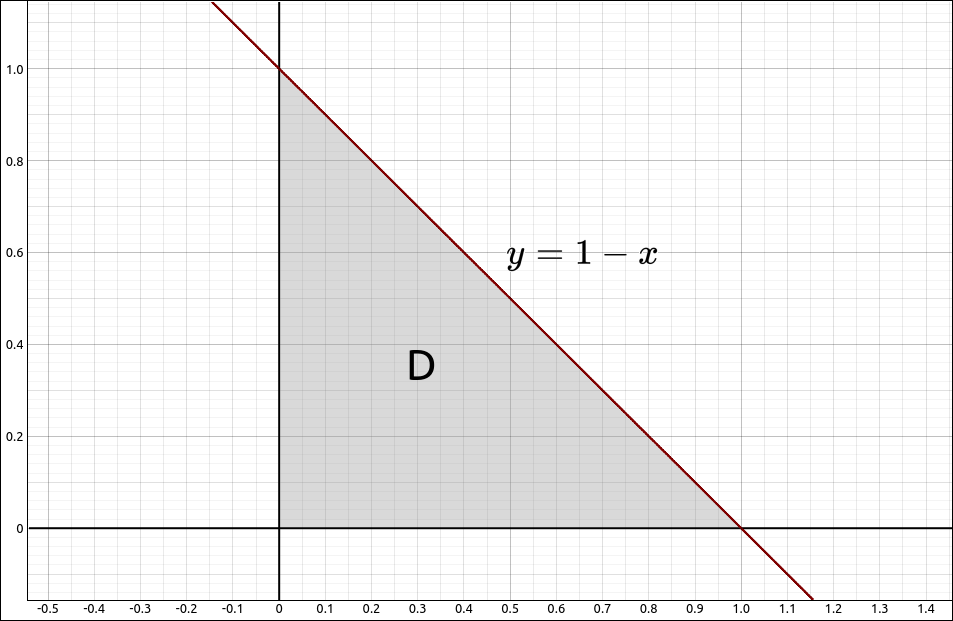

:index:`Triple Integrals`
=========================

Triple integrals are, of course, an extension of double integrals.  With a double integral we took a function of two variables :math:`f(x, y)` and a region *R* in the plane and calculated,

.. math::
    \iint_R f(x, y) \; dA

For triple integrals we take a function of three variables :math:`f(x, y, z)` and a region *E* in space (:math:`\mathbb{R}^3`) and calculate,

.. math::
    \iiint_E f(x, y, z) \; dV

As with our double integral approach we will first calculate triple integrals over easy regions, a rectangular box, and then look at more general regions.  In the next couple sections we will do change of variables with triple integrals much like the polar coordinates for double integrals.

Triple Integrals Over a Box
---------------------------

A box in three dimensions is simply a rectangular solid, like a shoebox, with interval bounds for *x*, *y*, and *z*.  Specifically,

.. math::
    B = \{ (x, y, z) \; | \; a \leq x \leq b, c \leq y \leq d, e \leq z \leq f  \} = [a, b] \times [c, d] \times [e, f]

Integrating a function :math:`f(x, y, z)` over a box is as you would probably expect, we can do three iterated integrals,

.. admonition:: Theorem: Fubini's Theorem for Triple Integrals Over a Box

    Let :math:`f(x, y, z)` be a function of three variables that is continuous over the box :math:`B = [a, b] \times [c, d] \times [e, f],` then

    .. math::
        \iiint_B f(x, y, z) \; dV = \int_e^f \int_c^d \int_a^b f(x, y, z) \; dx \; dy \; dz

    There are 5 other orders that this integral can be calculated, they all produce the same result.

Example: Triple Integral Over a Box
^^^^^^^^^^^^^^^^^^^^^^^^^^^^^^^^^^^

In this example we will find the triple integral of :math:`f(x, y, z) = x \sin(z) - y\cos(x)+z\sin(y)` over the box :math:`B = [0, \pi] \times [-\pi/4, \pi/4] \times [3, 5].`

From Fubini's Theorem it does not matter what order we integrate in, so we can use,

.. math::
    \iiint_B x \sin(z) - y\cos(x)+z\sin(y) \; dV = \int_3^5 \int_{-\pi/4}^{\pi/4} \int_0^{\pi} x \sin(z) - y\cos(x)+z\sin(y) \; dx \; dy \; dz

CLAE
""""

To do this integral in CLAE, input the function,

.. code-block:: console

    x*sin(z) - y*cos(x) + z*sin(y)

select this function and then select, ``Calculus > Multiple Integrals > Triple Integral``, the first variable is ``x`` with bounds ``0`` and ``pi``, the second variable is ``y`` with bounds ``-pi/4`` and ``pi/4``, the third variable is ``z`` with bounds ``3`` and ``5``.  The result is ,

.. math::
    \frac{\pi^{3} \cos{\left(3 \right)}}{4} - \frac{\pi^{3} \cos{\left(5 \right)}}{4} \approx -9.8728223668063765378

Maxima
""""""

In Maxima we can simply do three integrate commands,

.. code-block:: console

    integrate(integrate(integrate(x*sin(z) - y*cos(x) + z*sin(y), x, 0, %pi), y, -%pi/4, %pi/4), z, 3, 5);

.. math::
    \frac{{{{\pi} }^{3}} \left( \cos{(3)}-\cos{(5)}\right) }{4}\mbox{} \approx -9.872822366806375

Triple Integrals Over More General Regions
------------------------------------------

Now we will consider more general regions of integration.  With double integrals we defined Type I and Type II regions, with three dimensions there are three basic possibilities.

Say that our region *E* is of the form,

.. math::
    E = \{ (x, y, z) \; | \; (x, y) \in D, u_1(x, y) \leq z \leq u_2(x, y) \}

where *D* is the projection of *E* onto the *xy*-plane. As in the image below.

    General Region of Type I in :math:`\mathbb{R}^3`

This is a Type I region and in this case,

.. math::
    \iiint_E f(x, y, z) \; dV = \iint_D \left( \int_{u_1(x, y)}^{u_2(x, y)} f(x, y, z) \; dz \right) \; dA

In a similar fashion, if *D* is the projection of *E* onto the *yz*-plane we call this a Type II region, then,

.. math::
    \iiint_E f(x, y, z) \; dV = \iint_D \left( \int_{u_1(y, z)}^{u_2(y, z)} f(x, y, z) \; dx \right) \; dA

and if *D* is the projection of *E* onto the *xz*-plane we call this a Type III region, then,

.. math::
    \iiint_E f(x, y, z) \; dV = \iint_D \left( \int_{u_1(x, z)}^{u_2(x, z)} f(x, y, z) \; dy \right) \; dA

In any of these cases, we then attack the remaining double integral using the methods from the double integrals. If the region *D* is a type I or type II region we can break the double integral up as follows.  If the region *D* is one where polar coordinates are better to use we can convert the double to polar coordinates as we did in a previous section.

Say the region *D* is type I, graphically,

    *D* is Type I

Then the integral becomes,

.. math::
    \iiint_E f(x, y, z) \; dV = \int_a^b \int_{g_1(x)}^{g_2(x)} \int_{u_1(x, y)}^{u_2(x, y)} f(x, y, z) \; dz \; dy \; dx

Say the region *D* is type II, graphically,

    *D* is Type II

Then the integral becomes,

.. math::
    \iiint_E f(x, y, z) \; dV = \int_c^d \int_{h_1(y)}^{h_2(y)} \int_{u_1(x, y)}^{u_2(x, y)} f(x, y, z) \; dz \; dx \; dy

Of course, similar integrals can be constructed for the other coordinate plane projections.

Example: Triple Integral over a General Region
^^^^^^^^^^^^^^^^^^^^^^^^^^^^^^^^^^^^^^^^^^^^^^

In this example we will find the triple integral of :math:`f(x, y, z) = x \sin(z) - y\cos(x)+z\sin(y)` over the region bounded by the three coordinate planes and the plane :math:`x+y+z = 1.`  The plane :math:`x+y+z = 1` can be rewritten as :math:`z = 1 - x- y.`

So our integral can be calculated as,

.. math::
    \iiint_E x \sin(z) - y\cos(x)+z\sin(y) \; dV = \iint_D \left( \int_0^{1 - x- y} x \sin(z) - y\cos(x)+z\sin(y) \; dz \right) \; dA

The projection *D* is as follows,

    *D* is Type I and Type II

It is both Type I and Type II, we will treat it as a Type I region.  This gives us the integral,

.. math::
    \iiint_E x \sin(z) - y\cos(x)+z\sin(y) \; dV = \int_0^1 \int_0^{1-x} \int_0^{1 - x- y} x \sin(z) - y\cos(x)+z\sin(y) \; dz \; dy \; dx

CLAE
""""

To do this integral in CLAE, input the function,

.. code-block:: console

    x*sin(z) - y*cos(x) + z*sin(y)

select this function and then select, ``Calculus > Multiple Integrals > Triple Integral``, the first variable is ``z`` with bounds ``0`` and ``1-x-y``, the second variable is ``y`` with bounds ``0`` and ``1-x``, the third variable is ``x`` with bounds ``0`` and ``1``.  The result is ,

.. math::
    - \frac{7}{6} - \cos{\left(1 \right)} + 2 \sin{\left(1 \right)} \approx -0.024027002919013370763

Maxima
""""""

In Maxima we can simply do three integrate commands,

.. code-block:: console

    integrate(integrate(integrate(x*sin(z) - y*cos(x) + z*sin(y), z, 0, -x - y + 1), y, 0, 1 - x), x, 0, 1);

.. math::
    \frac{12 \sin{(1)}-6 \cos{(1)}-7}{6}\mbox{}

Changing the Order of Integration
---------------------------------

As with double integrals over general bounded regions, changing the order of the integration can simplify the computation significantly. The same is true with a triple integral over a general bounded region, choosing a different order of integration can simplify the computation and the change to polar coordinates can also be very advantageous.

