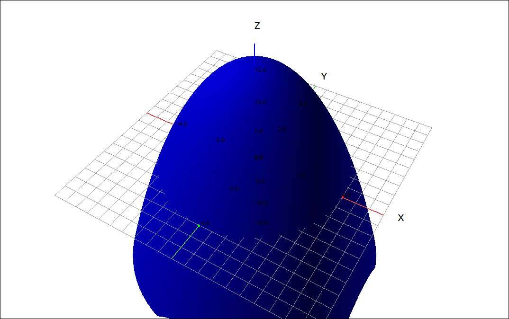
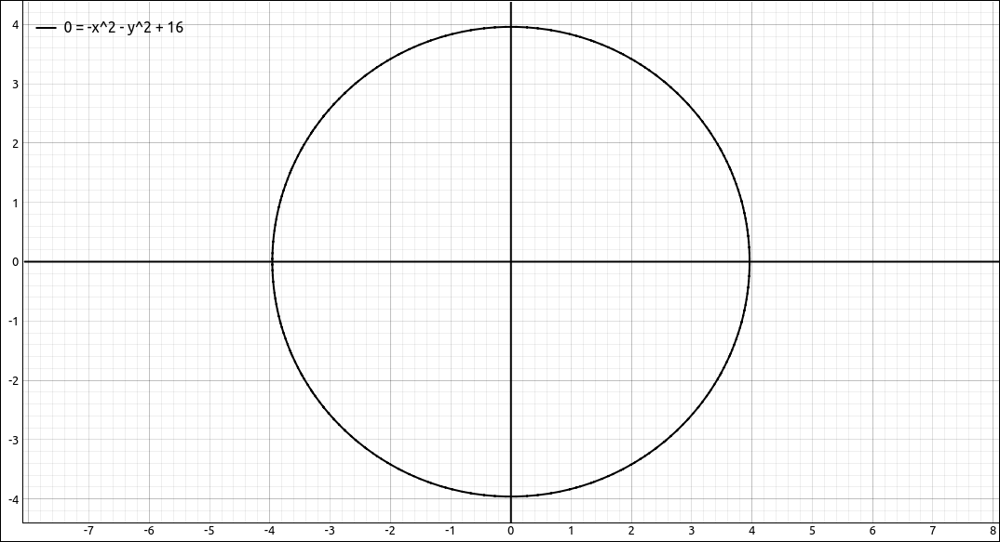

:index:`Triple Integrals in Cylindrical Coordinates`
====================================================

Quick Review of Cylindrical Coordinates
---------------------------------------

Cylindrical and spherical coordinates are simply another way to represent points in three dimensions, similar to the way we used polar coordinates to represent points in two dimensions.  These coordinate systems have many applications in mathematics and physics as well as other areas, such as. computer graphics.  In these tutorials, the main use will be to convert multiple integrals from a difficult computation to a much easier computation that gives the same result.

Cylindrical coordinates are when we write one of the three coordinate planes in polar coordinates (usually the *xy*-plane) and we let the third coordinate stay linear.  We will discuss the case where the *xy*-plane is converted to polar coordinates and the *z*-axis stays linear, the other two cases are similar.

.. admonition:: Definition: Cylindrical Coordinates

    In the cylindrical coordinate system, a point *P* in space is represented by the ordered triple :math:`(r, \theta, z)`, where

    - :math:`(r, \theta)` are the polar coordinates of the point's projection in the *xy*-plane.
    - *z* is the usual *z*-coordinate in the Cartesian coordinate system

.. figure:: Images/CylCoords/CylCoords001.png
    :alt: Cylindrical Coordinates

    Cylindrical Coordinates

Conversion between Cartesian coordinates and cylindrical coordinates is fairly straightforward since it is just converting Cartesian coordinates to polar coordinates for two variables and leaving the third variable alone.

.. admonition:: Theorem: Conversion between Cylindrical and Cartesian Coordinates

    Given a point *P* whose rectangular coordinates are :math:`(x, y, z)` and cylindrical coordinates are :math:`(r, \theta, z)` then the conversion between the two is as follows.

    .. math::
        x & = r \cos(\theta) \\
        y & = r \sin(\theta) \\
        z & = z

    and

    .. math::
        r^2 & = x^2 + y^2 \\
        \tan(\theta) & = \frac{y}{x} \\
        z & = z

Triple Integrals in Cylindrical Coordinates
-------------------------------------------

To derive the formula for a cylindrical coordinate triple integral is fairly straightforward.  Say we are integrating over a region *E* and that the projection of *E* to the *xy*-plane is a region *D* that is better described in polar coordinates.

.. math::
    E = \{ (x, y, z) \; | \; (x, y) \in D, u_1(x, y) \leq z \leq u_2(x, y) \}

and

.. math::
    D = \{ (x, y) = (r, \theta) \; | \; \alpha \leq \theta \leq \beta, h_1(\theta) \leq r \leq h_2(\theta) \}

.. figure:: Images/MultInt/TripleInt001.png
    :alt: Cylindrical Coordinate Region

    Cylindrical Coordinate Region

We first take care of the *z*-coordinate and then we convert the remaining double integral to polar coordinates as we did in a previous section.

.. math::
    \iiint_E f(x, y, z) \; dV & = \iint_D \left( \int_{u_1(x, y)}^{u_2(x, y)} f(x, y, z) \; dz \right) \; dA \\
    & = \int_{\alpha}^{\beta} \int_{h_1(\theta)}^{h_2(\theta)} \int_{u_1(r\cos(\theta), r\sin(\theta))}^{u_2(r\cos(\theta), r\sin(\theta))} f(r\cos(\theta), r\sin(\theta), z) \; r \; dz \; dr \; d\theta \\

Remember from the polar coordinate section that :math:`dA = r \; dr \; d\theta`, so do not forget the extra :math:`r`.

Example: Triple Integral in Cylindrical Coordinates
^^^^^^^^^^^^^^^^^^^^^^^^^^^^^^^^^^^^^^^^^^^^^^^^^^^

In this exercise we will find the triple integral,

.. math::
    \iiint_E x^2 + y^2 + z^2 \; dV

where *E* is the region under the surface :math:`z = 16-x^2-y^2` and above the *xy*-plane.

CLAE
""""

Input the function,

.. code-block:: console

    x^2 + y^2 + z^2

Also input the surface bound for *E*,

.. code-block:: console

    16-x^2-y^2

Click and drag the surface bound to the 3D graphics window.  This gives you an image or the region *E*, *E* is of course the portion above the *xy*-plane.

    The Region *E*

If we click and drag this over to the 2D graphics window we see the intersection of this surface with the *xy*-plane, which gives us an image of the projection region *D*.

    The Region *D*

The surface :math:`z = 16-x^2-y^2 = 16 - (x^2+y^2) = 16-r^2` and the region :math:`D = \{ (r, \theta) \; | \; 0 \leq \theta \leq 2\pi, 0 \leq r \leq 4 \}.` So our integral becomes,

.. math::
    \iiint_E x^2 + y^2 + z^2 \; dV = \int_{0}^{2\pi} \int_{0}^{4} \int_{0}^{16-r^2} \left( (r\cos(\theta))^2 + (r\sin(\theta))^2 + z^2 \right) \; r \; dz \; dr \; d\theta

Now we could type this integrand into the CAS but since we already have the function in the CAS, select the function and then select ``Algebra > Evaluate``, edit the variable list from ``[x, y, z]``  to ``[x, y]`` and input ``[r*cos(t), r*sin(t)]`` for the expressions.  Say this comes in as expression ``R3``, then input ``r*R3`` into the CAS and we have our integrand. If you prefer to input the integrand from scratch that is fine too.

Now to take the integral, select the substituted integrand, select ``Calculus > Multiple Integrals > Triple Integral``, the first variable is ``z`` with bounds ``0`` and ``16-r^2``, the second variable is ``r`` with bounds ``0`` and ``4``, the third variable is ``t`` with bounds ``0`` and ``2*pi``.  The result is, :math:`6144 \pi.`

Maxima
""""""

In Maxima, the command to find the integral of the substituted integrand is as follows.

.. code-block:: console

    integrate(integrate(integrate(r*(r**2*sin(t)**2 + r**2*cos(t)**2 + z**2), z, 0, 16 - r**2), r, 0, 4), t, 0, 2*%pi);

The result is, :math:`6144 \pi.`

