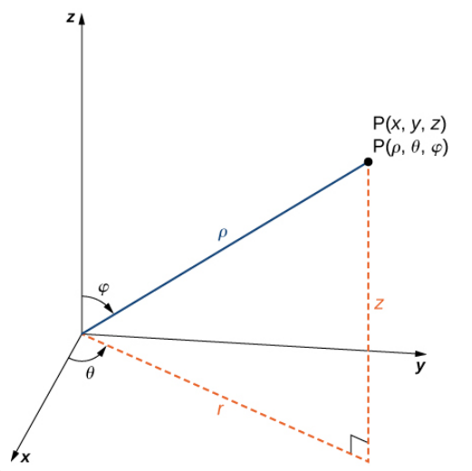
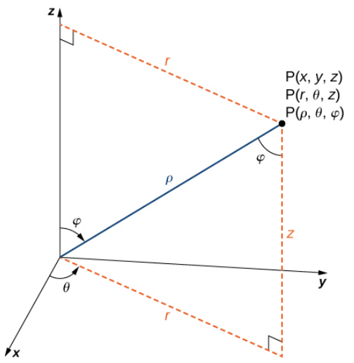
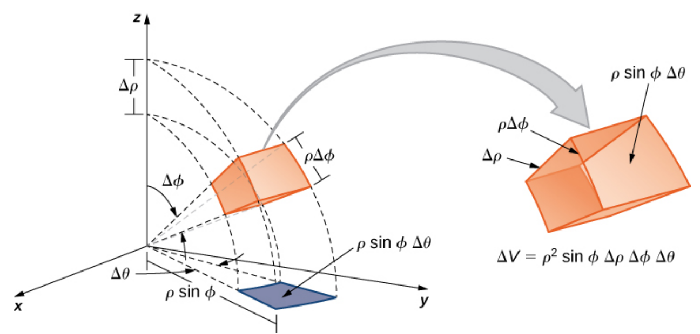

:index:`Triple Integrals in Spherical Coordinates`
==================================================

Quick Review of Spherical Coordinates
-------------------------------------

Cylindrical and spherical coordinates are simply another way to represent points in three dimensions, similar to the way we used polar coordinates to represent points in two dimensions.  These coordinate systems have many applications in mathematics and physics as well as other areas, such as. computer graphics.  In these tutorials, the main use will be to convert multiple integrals from a difficult computation to a much easier computation that gives the same result.

Cylindrical coordinates are when we write one of the three coordinate planes in polar coordinates (usually the *xy*-plane) and we let the third coordinate stay linear.  Spherical coordinates are when we represent a point by looking at its position on a sphere that is centered at the origin.

.. admonition:: Definition: Spherical Coordinates

    In the spherical coordinate system, a point *P* in space is represented by the ordered triple :math:`(\rho, \theta, \varphi)` where

    - :math:`\rho` is the distance from the point *P* to the origin *O*.
    - :math:`\theta` is the angle made with the positive *x*-axis and the projection of the line segment :math:`OP` to the *xy*-plane.
    - :math:`\varphi` is the angle made with the positive *z*-axis and the line segment :math:`OP`, we usually restrict :math:`0 \leq \varphi \leq \pi.`

    Spherical Coordinates

Conversion between spherical coordinates and Cartesian coordinates is not too difficult but it is not as straightforward as with cylindrical coordinates but the derivations are not too complex.

.. admonition:: Theorem: Conversion between Spherical and Cartesian Coordinates

    Given a point *P* whose rectangular coordinates are :math:`(x, y, z)` and spherical coordinates are :math:`(\rho, \theta, \varphi)` then the conversion between the two is as follows.

    .. math::
        x & = \rho \sin(\varphi) \cos(\theta) \\
        y & = \rho \sin(\varphi) \sin(\theta) \\
        z & = \rho \cos(\varphi)

    and

    .. math::
        \rho^2 & = x^2 + y^2 + z^2 \\
        \tan(\theta) & = \frac{y}{x} \\
        \varphi & = \cos^{-1}\left( \frac{z}{\sqrt{x^2 + y^2 + z^2}} \right)

We can continue our correspondences by examining the conversion between spherical and cylindrical coordinates.

.. admonition:: Theorem: Conversion between Spherical and Cylindrical Coordinates

    Given a point *P* whose cylindrical coordinates are :math:`(r, \theta, z)` and spherical coordinates are :math:`(\rho, \theta, \varphi)` then the conversion between the two is as follows.

    .. math::
        r & = \rho \sin(\varphi) \\
        \theta & = \theta \\
        z & = \rho \cos(\varphi)

    and

    .. math::
        \rho^2 & = r^2 + z^2 \\
        \theta & = \theta \\
        \varphi & = \cos^{-1}\left( \frac{z}{\sqrt{r^2 + z^2}} \right)

    Coordinate Systems

Triple Integrals in Spherical Coordinates
-----------------------------------------

When we change our coordinate system to cylindrical coordinates we found that the calculation of :math:`dV` gave us an "extra" factor of :math:`r`, that is, :math:`dV = r \; dz \; dr \; d\theta.`  The *r* was from the conversion to polar coordinates in the *xy*-plane.  When we change our coordinate system to spherical coordinates we would assume that something similar should happen.  In fact, since we are converting to polar coordinates in two directions the extra factors will probably be more complex.  Below is a picture of the calculation of :math:`\Delta V.`  We will let the reader work through the algebra but the result is that :math:`\Delta V = \rho^2 \sin(\varphi) \; \Delta \rho \; \Delta \varphi \; \Delta \theta` and hence :math:`dV = \rho^2 \sin(\varphi) \; d\rho \; d\varphi \; d\theta.`

    Calculation of :math:`dV`

.. admonition:: Theorem: Triple Integrals in Spherical Coordinates

    If *E* is a spherical wedge (spherical coordinate box) given by

    .. math::
        E = \{ (\rho, \theta, \varphi) \; | \; a \leq \rho \leq b, \alpha \leq \theta \leq \beta, c \leq \varphi \leq d \}

    and if :math:`f(x, y, z)` is a continuous function at all points in *E* then,

    .. math::
        \iiint_E f(x, y, z) \; dV = \int_c^d \int_{\alpha}^{\beta} \int_a^b f(\rho \sin(\varphi) \cos(\theta), \rho \sin(\varphi) \sin(\theta), \rho \cos(\varphi)) \rho^2 \sin(\varphi) \; d\rho \; d\theta \; d\varphi

Example: Triple Integral in Spherical Coordinates
^^^^^^^^^^^^^^^^^^^^^^^^^^^^^^^^^^^^^^^^^^^^^^^^^

In this example we will find the integral,

.. math::
    \iiint_B e^{\left(x^{2} + y^{2} + z^{2}\right)^{\frac{3}{2}}} \; dV

where *B* is the unit sphere, :math:`B = \{ (x, y, z) \; | \; x^2+y^2+z^2 \leq 1 \}.`  The region *B* can be written in spherical coordinates as :math:`B = \{ (\rho, \theta, \varphi) \; | \; 0 \leq \rho \leq 1, 0 \leq \theta \leq 2\pi, 0 \leq \varphi \leq \pi \}.`  Also converting the integrand to spherical coordinates becomes,

.. math::
    e^{\left(x^{2} + y^{2} + z^{2}\right)^{\frac{3}{2}}} = e^{\left(\rho^2\right)^{\frac{3}{2}}} = e^{\rho^3}

So,

.. math::
    \iiint_B e^{\left(x^{2} + y^{2} + z^{2}\right)^{\frac{3}{2}}} \; dV = \int_0^{\pi} \int_{0}^{2\pi} \int_0^1  e^{\rho^3} \rho^2 \sin(\varphi) \; d\rho \; d\theta \; d\varphi

CLAE
""""

This integral is easy enough to do by hand but using the machine we first input the function, we will use ``r``, ``t``, and ``p`` for the variables. Input,

.. code-block:: console

    r^2*exp(r^3)*sin(p)

Then select ``Calculus > Multiple Integrals > Triple Integral``, the first variable is ``r`` with bounds ``0`` to ``1``, the second variable is ``t`` with bounds ``0`` to ``2*pi``, the third variable is ``p`` with bounds ``0`` to ``pi``.  The result is,

.. math::
    - 2 \pi \left(\frac{1}{3} - \frac{e}{3}\right) + 2 \pi \left(- \frac{1}{3} + \frac{e}{3}\right) = \frac{4 \pi \left(-1 + e\right)}{3}

Maxima
""""""

In Maxima the command to calculate this integral is,

.. code-block:: console

    integrate(integrate(integrate(r**2*exp(r**3)*sin(p), r, 0, 1), t, 0, 2*%pi), p, 0, %pi);

The result is,

.. math::
    4 \left( \frac{\% e}{3}-\frac{1}{3}\right)  {\pi} \mbox{}
