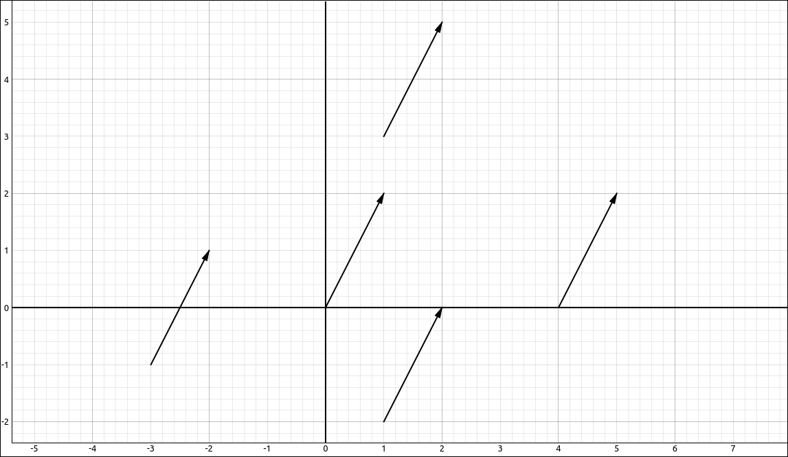
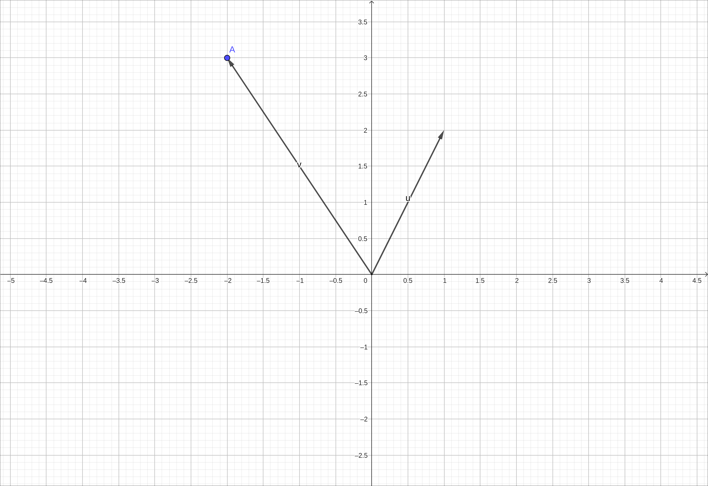
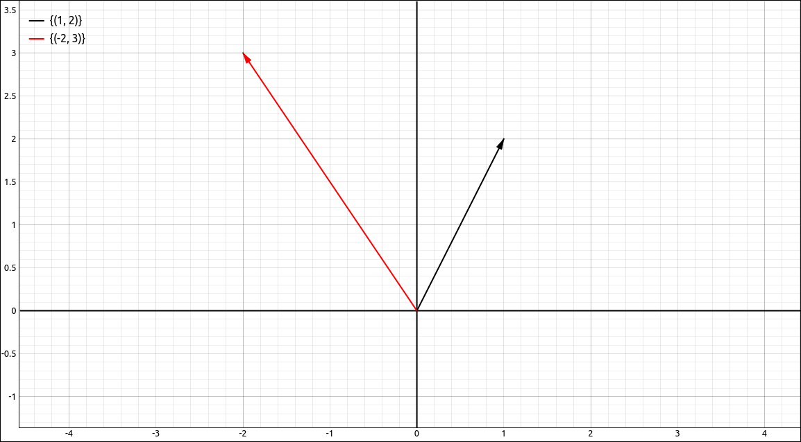

:index:`Vectors in Two and Three Dimensions`
============================================

Discussion & Definitions
------------------------

A vector in mathematics and the sciences is a quantity that has both magnitude and direction.  We tend to look at a vector in tow primary ways, graphically as an arrow tht starts at a point *A* (called the tail or initial point) and ends at a point *B* (called the head or terminal point), or algebraically as a set of coordinated in :math:`\mathbb{R}^2` or :math:`\mathbb{R}^3.`  We can consider vectors in higher dimensions but usually in a Calculus class we stick with :math:`\mathbb{R}^2` and :math:`\mathbb{R}^3.`  If you take a course in Linear Algebra you will communally work in higher dimensions.  Since Calculus takes more of an analytical approach, working with vectors algebraically tends to be easier.

Component Form of a Vector
--------------------------

.. admonition:: Definition: Component Form of a Vector

    The vector with initial point :math:`(0, 0)` and terminal point :math:`(x, y)` can be written in **component form** as

    .. math::
        \mathbf{v} = \left\langle x, y \right\rangle \qquad {\rm or } \qquad \mathbf{v} = \left\langle x, y, z \right\rangle

    The scalars *x*, *y*, and *z* are called the components of :math:`\mathbf{v}`.

Vectors that have their initial point at the origin are said to be in **standard position**.  So the vector :math:`\left\langle 1, 2 \right\rangle` can be represented as any of the following and the one that statrs at the origin is in standard position.

    Vector Example

If a vector is given as twp points, initial point of :math:`(x_0, y_0)` and a terminal point of :math:`(x_1, y_1)` then the standard position vector is :math:`\mathbf{v} = \left\langle x_1-x_0, y_1-y_0 \right\rangle.`  We say that two vectors are equal if they have the same magnitude (length) and the same direction.  So if two vectors are in standard position they are equal if and only if their corresponding components are all equal.

.. admonition:: Notation: Vector Notations

    The notations that textbooks use for vectors can vary widely.  Notations for vector names are usually written either in boldface or with a vector symbol above the name.  For example, :math:`\mathbf{v}` or :math:`\vec{v}.` The boldface notation is more common in typewritten presentations, such as textbooks, but the vector symbol above the name is far easier to write by hand. We will use the boldfaced version in these tutorials.

    Writing the vector in component form usually takes one of three forms, the same as a point :math:`(x, y)`, like a point but with angled parentheses :math:`\left\langle x, y \right\rangle` or as a column vector (matrix form)

    .. math::
        \left[\begin{array}{c}x\\y\end{array}\right]

    Most textbooks in Calculus will use either :math:`(x, y)` or :math:`\left\langle x, y \right\rangle`.  When using the point notation :math:`(x, y)` the context usually makes it clear when you are looking at a vector or a point.  In many cases these are equated anyway.  Other books will use the :math:`\left\langle x, y \right\rangle` notation to make it clear when you are considering it to be a vector.  Linear algebra textbooks will tend to use the column vector since it integrates better with matrices and the types of applications you see in linear algebra.

    In these tutorials we will primarily use the point notation :math:`(x, y).`

Vector Operations
-----------------

In this section we will look at some common operations that we need to preform on vectors.

.. admonition:: Definition: Magnitude or Length of a Vector

    The **magnitude** or **length** of a vector is denoted as :math:`|\mathbf{v}|` or  :math:`\|\mathbf{v}\|`. In two dimensions if :math:`\mathbf{v} = (x, y)` then

    .. math::
        |\mathbf{v}| = \sqrt{x^2+y^2}

    and in three dimensions if :math:`\mathbf{v} = (x, y, z)` then

    .. math::
        |\mathbf{v}| = \sqrt{x^2+y^2+z^2}

In many applications we need to work with vectors that are length 1, we call these unit vectors. In addition, we can take any nonzero vector and create a unit vector that is in the same direction as the given vector, this process is called normalization.

.. admonition:: Definition: Unit Vectors and Normalization

    A **unit vector** is simply a vector of length 1. We can create a unit vector in the same direction as any nonzero vector by **normalizing** the vector. Specifically if we have any nonzero vector :math:`\mathbf{v}` the unit vector in the same direction as :math:`\mathbf{v}` is

    .. math::
        \mathbf{u} = \frac{\mathbf{v}}{|\mathbf{v}|} = \frac{1}{|\mathbf{v}|} \mathbf{v}

Two (or three) unit vectors we will use extensively are the unit vectors on the coordinate axes, the set of these vectors is called the standard basis.  The term basis has a specific meaning that you will study if you take a course in linear algebra.

.. admonition:: Definition: Standard Basis

    In two dimensions, the **standard basis** is the set of vectors,

    .. math::
        \mathbf{i} = (1, 0) \qquad \mathbf{j} = (0, 1)

    and in three dimensions the **standard basis** is the set of vectors,

    .. math::
        \mathbf{i} = (1, 0, 0) \qquad \mathbf{j} = (0, 1, 0) \qquad \mathbf{k} = (0, 0, 1)

Vector arithmetic can be defined geometrically but in Calculus we take a more analytic approach, so we define the arithmetic operations in component form.  There are only three arithmetic operations that we do on vectors, really two, these are addition, subtraction, and scalar multiplication.  We noted two since subtraction is just the combination of addition and scalar multiplication.  These operations are simply applied componentwise through the vector.

.. admonition:: Definition: Vector Arithmetic

    Arithmetically, we can add two vectors, subtract two vectors, and multiply a vector by a scalar.  In two dimensions, if :math:`\mathbf{a} = (a_1, a_2)` and :math:`\mathbf{b} = (b_1, b_2)` and :math:`c` is a scalar then,

    .. math::
        \mathbf{a} + \mathbf{b} = (a_1+b_1, a_2+b_2) \qquad \mathbf{a} - \mathbf{b} = (a_1-b_1, a_2-b_2) \qquad c\mathbf{a} = (c a_1, c a_2)

    Similarly in three dimensions , if :math:`\mathbf{a} = (a_1, a_2, a_3)` and :math:`\mathbf{b} = (b_1, b_2, b_3)` and :math:`c` is a scalar then,

    .. math::
        \mathbf{a} + \mathbf{b} = (a_1+b_1, a_2+b_2, a_3+b_3) \qquad \mathbf{a} - \mathbf{b} = (a_1-b_1, a_2-b_2, a_3-b_3) \qquad c\mathbf{a} = (c a_1, c a_2, c a_3)

Since the arithmetic operations are preformed componentwise, vectors share many of the same properties as real numbers.

.. admonition:: Properties of Vector Arithmetic

    If :math:`\mathbf{a}`, :math:`\mathbf{b}`, and :math:`\mathbf{c}` are vectors and :math:`c` and :math:`d` are scalars, then

    1. :math:`\mathbf{a}+ \mathbf{b} = \mathbf{b} + \mathbf{a}`
    2. :math:`\mathbf{a}+ (\mathbf{b}+ \mathbf{c}) = (\mathbf{a} + \mathbf{b})+ \mathbf{c}`
    3. :math:`\mathbf{a}+ \mathbf{0} = \mathbf{a}`
    4. :math:`\mathbf{a}+ (-\mathbf{a}) = \mathbf{0}`
    5. :math:`c(\mathbf{a}+ \mathbf{b}) = c\mathbf{a} + c\mathbf{b}`
    6. :math:`(c + d) \mathbf{a} = c\mathbf{a} + d\mathbf{a}`
    7. :math:`(c d) \mathbf{a} = c(d\mathbf{a})`
    8. :math:`1 \mathbf{a} = \mathbf{a}`

Example: Vectors and Vector Arithmetic
--------------------------------------

GeoGebra
^^^^^^^^

Inputting a Vector
""""""""""""""""""

GeoGebra makes a distinction between points and vectors.  There are two main ways to input a vector in GeoGebra.

1. Input the command ``Vector((a, b))`` where ``(a, b)`` is the endpoint of the vector.  This will create a vector from the origin to the endpoint ``(a, b)``.
2. First input the point ``(a, b)`` and then (assuming this point is named A) input the command ``Vector(A)``.

For example if input ``Vector(1, 2)``, then the point ``(-2, 3)``, and then ``Vector(A)`` we get 2 vectors and a point in the workspace, and an image of,

    Vector Example

.. note::

    - The vectors are written as columns, specifically column vectors which are matrices.  If you take a course in linear algebra this is a standard way to write vectors as it integrates well with the operations done in that area of mathematics.
    - Although the above example was with two-dimensional vectors the same can be done in three-dimensions.
    - You can also specify a starting point and ending point for a vector, we will use this option later on in the tutorials.

Length and Normalization
""""""""""""""""""""""""

We will assume that the vectors from the above example are input into GeoGebra, as *u* and *v* respectively.  You can find the length of the vector in two primary ways,

1. Use the command ``Length(u)``.
2. Use the command ``|u|``.

In either case you will get the length of *u* as 2.23607 and the length of *v* as 3.60555.

To normalize a vector we simply divide a vector by its (scalar) length, so in GeoGebra this can be done with, ``u/|u|``.  The normalization of *u* gives us

.. math::
    \left[\begin{array}{c}0.44721\\0.89443\end{array}\right]

and the normalization of *v* gives us

.. math::
    \left[\begin{array}{c}-0.5547\\0.83205\end{array}\right]

Arithmetic
""""""""""

To do arithmetic with vectors in GeoGebra simply use the vector names in the expression for the vectors that are already input into the system.  For example, the expression ``3 u + 4 v`` results in,

.. math::
    \left[\begin{array}{c}-5\\18\end{array}\right]

CLAE
^^^^

Inputting a Vector
""""""""""""""""""

In CLAE there are three main ways to input a vector,

1. Probably the easiest method is to select ``Edit > Input Vector`` or click the corresponding toolbar button.  A dialog box will appear with a single input field.  Input the vector components as a list separated by commas.  For example, ``a, b`` or ``[a, b]`` will input the vector,

.. math::
    \left[\begin{array}{c}a\\b\end{array}\right]

.. note::

    If the CAS has a list as one of the entries, for example ``[a, b]`` and we will assume that this is in R1, then the input of ``R1`` into the input field of this dialog will produce the same vector.

2. You can also use the matrix editor, this gives you more options but requires more steps.  The matrix editor is designed to input general sized matrices for linear algebra which is why we created a vector input option for faster and easier input.  To use the matrix editor

    a. Open the matrix editor with ``Edit > Input Matrix/Vector`` or click the corresponding toolbar button.
    b. Set the number of rows to the dimension of the vector (probably 2 or 3 for this course).
    c. Set the number of columns to 1.
    d. Input the vector as a column in the grid.
    e. When finished, click OK.

3. If the vector is in the CAS as a list or you input it as a list you can convert it to a vector by ``Edit > COnvert List > Convert List of Lists to Matrix by Row``.

For example if we input the vectors,

.. math::
    \left[\begin{array}{c}1\\2\end{array}\right] \qquad {\rm and } \qquad \left[\begin{array}{c}-2\\3\end{array}\right]

Click and drag these over to the 2-D Graphics window, and change their type from point sets to vector sets.  You should see the following.

    Vector Example

.. note::

    - The vectors are written as columns, specifically column vectors which are matrices.  If you take a course in linear algebra this is a standard way to write vectors as it integrates well with the operations done in that area of mathematics.
    - Although the above example was with two-dimensional vectors the same can be done in three-dimensions.

Length and Normalization
""""""""""""""""""""""""

To find the length of a vector simply input the vector into the CAS, select it, then select ``Vector > Length``.  The lengths of the two vectors from the previous example are, :math:`\sqrt{5}` and :math:`\sqrt{13}` respectively.  To normalize a vector, select ``Vector > Normalize``.  If we apply this to our two vector examples we get,

.. math::
    \left[\begin{array}{c}\frac{\sqrt{5}}{5}\\\frac{2 \sqrt{5}}{5}\end{array}\right] \qquad {\rm and } \qquad \left[\begin{array}{c}- \frac{2 \sqrt{13}}{13}\\\frac{3 \sqrt{13}}{13}\end{array}\right]

If you prefer to use approximations, you can approximate all of the entries in a vector with ``Algebra > Approximate``.

Arithmetic
""""""""""

To do arithmetic with vectors use the CAS designations in the expression for the vectors that are already input into the system.  For example, the expression ``3*R1 + 4*R2`` results in,

.. math::
    \left[\begin{array}{c}-5\\18\end{array}\right]
